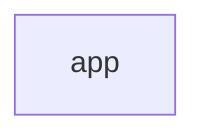
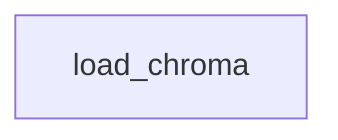

# 📘 INCIDENTTROUBLESHOOTER: Technical Architecture & Logic Reference
## An exhaustive guide to every file, connection, and code block.

---
## 📄 File: `app.py`
### 📉 Dependency Graph

*This module is a dependency for **0** other parts of the system.*

### 🛠️ Code Logic Breakdown
#### 🔹 Function: `None`
The `None` Function serves as a core logic block within this module.

---

## 📄 File: `generate_incidents.py`
### 📉 Dependency Graph

*This module is a dependency for **0** other parts of the system.*

### 🛠️ Code Logic Breakdown
#### 🔹 Function: `generate_incident_text`
The `generate_incident_text` Function serves as a core logic block within this module.

#### 🔹 Function: `add_incident_to_doc`
The `add_incident_to_doc` Function serves as a core logic block within this module.

---

## 📄 File: `load_chroma.py`
### 📉 Dependency Graph

*This module is a dependency for **0** other parts of the system.*

### 🛠️ Code Logic Breakdown
#### 🔹 Function: `None`
The `None` Function serves as a core logic block within this module.

---

