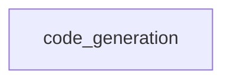
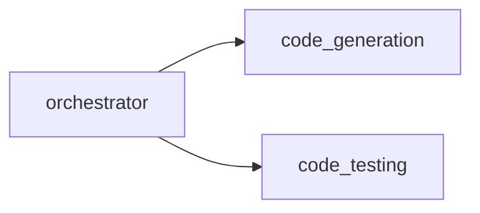
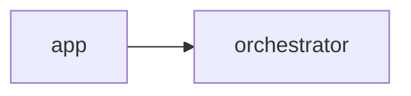

# 📘 PWAI: Technical Architecture & Logic Reference
## An exhaustive guide to every file, connection, and code block.

---
## 📄 File: `code_generation.py`
### 📉 Dependency Graph

*This module is a dependency for **1** other parts of the system.*

### 🛠️ Code Logic Breakdown
#### 🔹 Function: `generate_project_plan`
The `generate_project_plan` function creates a structured blueprint for a multi-file project, producing a strict JSON array that outlines the full relative file paths of the project's components. Its purpose is to automate the organization and setup of complex projects, ensuring consistency and accuracy in the project's architecture. By generating this structured plan, the function facilitates efficient project development and maintenance.

---

## 📄 File: `orchestrator.py`
### 📉 Dependency Graph

*This module is a dependency for **1** other parts of the system.*

### 🛠️ Code Logic Breakdown
#### 🔹 Function: `get_framework_blueprint`
The 'get_framework_blueprint' function detects the required language, framework, and architectural constraints to create a tailored blueprint for a project. It exists to provide a standardized way of identifying the necessary components and constraints for a project, allowing for more efficient and accurate setup. By doing so, it enables the system to adapt to diverse project requirements and ensure consistency across different frameworks and languages.

#### 🔹 Function: `orchestrate_multi_file`
The `orchestrate_multi_file` Function serves as a core logic block within this module.

---

## 📄 File: `app.py`
### 📉 Dependency Graph

*This module is a dependency for **0** other parts of the system.*

### 🛠️ Code Logic Breakdown
#### 🔹 Function: `main`
The `main` Function serves as a core logic block within this module.

---

