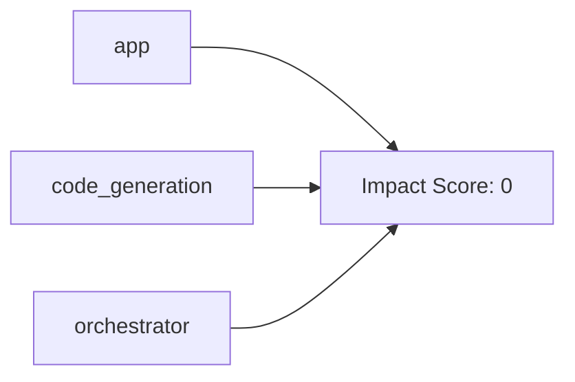

# 📖 PWAI: Technical Reference

## 📊 Project at a Glance
- **Core Modules:** 3
- **Documented Classes:** 0
- **Key Functions:** 7

## 📑 Table of Contents
- [Ch 4: Supporting Infrastructure](#ch-4-supporting-infrastructure)

## Ch 4: Supporting Infrastructure
### 📉 Chapter Architecture

### 📄 Module: `app.py`
#### ⚙️ Logic
- **`main`**: _No description available._

---
### 📄 Module: `code_generation.py`
#### ⚙️ Logic
- **`generate_project_plan`**: Generates a structured plan and code for a multi-file project. The output MUST be a strict JSON array with full relative file paths.

---
### 📄 Module: `orchestrator.py`
#### ⚙️ Logic
- **`get_framework_blueprint`**: Detects the required language, framework, and architectural constraints.
- **`orchestrate_multi_file`**: _No description available._

---
