# 📘 REQUESTS: Technical Architecture & Logic Reference
## An exhaustive guide to every file, connection, and code block.

---
## 📄 File: `setup.py`
### 📉 Dependency Graph

*This module is a dependency for **0** other parts of the system.*

### 🛠️ Code Logic Breakdown
#### 🔹 Function: `None`
The `None` Function serves as a core logic block within this module.

---

## 📄 File: `docs/conf.py`
### 📉 Dependency Graph
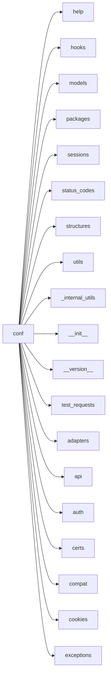
*This module is a dependency for **0** other parts of the system.*

### 🛠️ Code Logic Breakdown
#### 🔹 Function: `None`
The `None` Function serves as a core logic block within this module.

---

## 📄 File: `docs/_themes/flask_theme_support.py`
### 📉 Dependency Graph

*This module is a dependency for **0** other parts of the system.*

### 🛠️ Code Logic Breakdown
#### 🔹 Class: `FlaskyStyle`
The `FlaskyStyle` Class serves as a core logic block within this module.

---

## 📄 File: `src/requests/compat.py`
### 📉 Dependency Graph
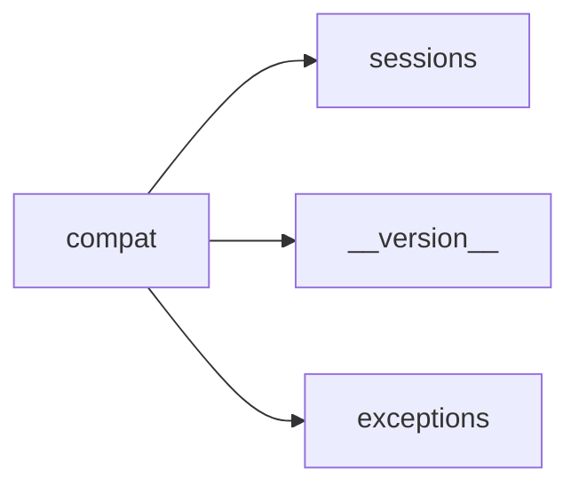
*This module is a dependency for **18** other parts of the system.*

### 🛠️ Code Logic Breakdown
#### 🔹 Function: `_resolve_char_detection`
The `_resolve_char_detection` function searches for and identifies character detection libraries that are supported by the system. Its purpose is to determine which libraries are available and can be utilized for character detection tasks, ensuring compatibility and functionality. By resolving the available libraries, the system can then proceed to use the most suitable one for its character detection needs.

---

## 📄 File: `src/requests/exceptions.py`
### 📉 Dependency Graph

*This module is a dependency for **16** other parts of the system.*

### 🛠️ Code Logic Breakdown
#### 🔹 Class: `UnrewindableBodyError`
The UnrewindableBodyError represents an exception that occurs when the Requests library fails to rewind or seek back to the beginning of a request body, which is necessary for certain operations such as retrying a request. It exists to provide a clear indication of this specific error, allowing developers to handle it differently than other types of errors. By raising this error, the system can notify the caller that the request body cannot be rewound, enabling more informed error handling and recovery.

#### 🔹 Class: `RequestsWarning`
The RequestsWarning serves as a base warning category for the Requests library, allowing developers to catch and handle specific warnings related to HTTP requests. It exists to provide a centralized warning mechanism, enabling users to filter and manage warnings that occur during the request-response cycle. By subclassing this warning, specific warning types can be created to handle different scenarios, promoting more fine-grained error handling and debugging.

#### 🔹 Class: `FileModeWarning`
The FileModeWarning alerts when a file is opened in text mode but its binary length is detected by Requests, indicating a potential mismatch between the file's contents and the mode it was opened in. It exists to notify developers of this discrepancy, which could lead to encoding issues or data corruption. By raising a warning, it helps ensure that files are handled correctly and consistently throughout the system.

#### 🔹 Class: `RequestsDependencyWarning`
The RequestsDependencyWarning alerts users when an imported dependency's version does not match the expected range, potentially causing compatibility issues or unexpected behavior. It exists to inform developers of potential problems that may arise from version mismatches, allowing them to take corrective action and ensure the stability of their application. By raising a warning, it encourages developers to review and update their dependencies to maintain compatibility.

#### 🔹 Class: `RequestException`
The RequestException captures and represents ambiguous errors that occur during request handling, providing a standardized way to handle and communicate unexpected issues. It exists to encapsulate and convey error information in a structured manner, allowing for more effective error handling and debugging. By using this exception, the system can gracefully handle and report ambiguous errors, improving overall robustness and reliability.

#### 🔹 Class: `InvalidJSONError`
The InvalidJSONError exception is raised when a JSON-related error occurs, indicating that the JSON data being processed is malformed or cannot be parsed. It exists to provide a specific and meaningful error message, allowing developers to identify and handle JSON-related issues more effectively. By using a custom exception, the system can differentiate JSON errors from other types of errors and provide more targeted error handling.

#### 🔹 Class: `JSONDecodeError`
The JSONDecodeError exception is raised when the system fails to parse a string into a JSON object, indicating that the input string is not a valid JSON format. It exists to handle and notify the system of such errors, allowing for proper error handling and debugging. By catching this exception, developers can provide meaningful error messages and prevent system crashes due to malformed JSON inputs.

#### 🔹 Class: `HTTPError`
The HTTPError exception captures and represents HTTP errors that occur during network requests, providing a standardized way to handle and propagate error information. It exists to enable robust error handling and debugging in the system, allowing developers to catch and respond to specific HTTP errors in a structured manner. By doing so, it helps maintain the reliability and fault tolerance of the system.

#### 🔹 Class: `Timeout`
The Timeout class represents a request timing out error, serving as a catch-all for both connection and read timeouts. It exists to simplify error handling by allowing developers to catch a single exception type instead of two separate ones, making it easier to manage timeout-related errors in the system. By catching Timeout, developers can handle both ConnectTimeout and ReadTimeout errors in a unified way.

#### 🔹 Class: `ConnectTimeout`
The ConnectTimeout error occurs when a request fails to establish a connection with a remote server within a specified time limit. It exists to notify the system that the failed request is safe to retry, allowing for a potential recovery from the timeout error. By differentiating this error from others, the system can implement targeted retry logic to handle transient connection issues.

#### 🔹 Class: `ReadTimeout`
The ReadTimeout exception is raised when a server fails to send data within a predetermined time frame, indicating a potential issue with the server's response time or the connection itself. It exists to notify the system that a read operation has timed out, allowing the system to handle the situation and potentially retry the operation or terminate the connection. By detecting such timeouts, the system can prevent indefinite waits and improve overall responsiveness.

#### 🔹 Class: `URLRequired`
The URLRequired class enforces the necessity of a valid URL before making a request, ensuring that the system can successfully establish a connection with the intended endpoint. By validating the URL, it prevents potential errors and exceptions that may arise from malformed or missing URLs. Its existence in the system serves as a safeguard to maintain the integrity and reliability of network requests.

#### 🔹 Class: `TooManyRedirects`
The TooManyRedirects exception is raised when a request exceeds the maximum allowed number of redirects, preventing an infinite loop of redirects. It exists to detect and prevent such loops, which can cause a request to continue indefinitely, wasting system resources and potentially leading to a denial-of-service. By raising this exception, the system can terminate the request and notify the user or developer of the issue.

#### 🔹 Class: `MissingSchema`
The MissingSchema exception is raised when a URL is provided without a scheme, such as "www.example.com" instead of "http://www.example.com". It exists to alert the system that the provided URL is incomplete and cannot be properly parsed or used for network requests. By detecting and reporting this error, the system can prevent unexpected behavior and ensure that URLs are properly formatted before attempting to access them.

#### 🔹 Class: `InvalidSchema`
The InvalidSchema exception is raised when a URL scheme is encountered that is either malformed or not supported by the system. It serves as a mechanism to notify the application of an invalid or unsupported URL scheme, allowing it to handle the error and prevent further processing. By doing so, it ensures the application's stability and prevents potential security vulnerabilities that may arise from handling malformed URLs.

#### 🔹 Class: `InvalidURL`
Explanation timeout.

#### 🔹 Class: `InvalidHeader`
The InvalidHeader exception is raised when a provided header value fails validation, indicating that it is malformed, incomplete, or otherwise incorrect. It exists to notify the system that an error has occurred while processing a header, allowing for error handling and recovery mechanisms to be triggered. By isolating this specific error condition, the system can provide more informative error messages and better handle invalid input.

#### 🔹 Class: `InvalidProxyURL`
The InvalidProxyURL exception is raised when a malformed or incorrect proxy URL is provided, preventing the system from establishing a connection. It exists to handle and notify the user of such errors, allowing for proper error handling and debugging. By isolating this specific error case, the system can provide more informative and targeted error messages.

#### 🔹 Class: `ChunkedEncodingError`
The ChunkedEncodingError exception is raised when a server claims to be using chunked encoding but fails to provide a valid chunk, indicating a protocol error. It exists to notify the client that the server's response is malformed and cannot be processed, allowing the client to handle the error and potentially recover. By raising this specific exception, the system can differentiate between general connection errors and those specifically related to chunked encoding.

#### 🔹 Class: `ContentDecodingError`
The ContentDecodingError exception is raised when the system fails to decode the response content, indicating an issue with processing or interpreting the received data. It exists to provide a clear and specific error message, allowing developers to identify and handle decoding errors more effectively. By isolating this error type, the system can better manage and recover from decoding failures, ensuring more robust and reliable data processing.

#### 🔹 Class: `StreamConsumedError`
The StreamConsumedError is raised when an attempt is made to access content that has already been consumed from a stream. Its purpose is to prevent unexpected behavior or data corruption by alerting the system that the requested content is no longer available. By raising this error, the system can handle and recover from attempts to reuse consumed streams, ensuring data integrity and consistency.

#### 🔹 Class: `RetryError`
The RetryError logic handles situations where custom retries have failed, indicating that a task or operation cannot be completed despite repeated attempts. It serves as a last resort to acknowledge and report the failure, allowing the system to move forward and potentially trigger alternative actions or error handling mechanisms. By existing in the system, it provides a standardized way to recognize and respond to retry failures, promoting robust error handling and fault tolerance.

#### 🔹 Class: `ConnectionError`
The ConnectionError exception is raised when a connection-related issue occurs, such as a failed network connection or a refused connection attempt. It exists to provide a specific error type that can be caught and handled by the application, allowing for more robust error handling and recovery mechanisms. By using a dedicated exception class, the system can differentiate connection errors from other types of errors and respond accordingly.

#### 🔹 Class: `ProxyError`
The ProxyError exception is raised when an issue occurs while interacting with a proxy, indicating that the system was unable to successfully communicate through the proxy. It exists to provide a clear and specific error message, allowing developers to quickly identify and handle proxy-related issues. By isolating proxy errors, the system can better manage and recover from these specific failures.

#### 🔹 Class: `SSLError`
The SSLError exception is raised when a problem occurs during an SSL connection, such as a certificate verification failure or a mismatch in the SSL protocol version. It exists to provide a specific error handling mechanism for SSL-related issues, allowing developers to catch and handle these errors differently than other types of exceptions. By providing a distinct error type, SSLError enables more targeted and informative error handling in applications that rely on secure connections.

---

## 📄 File: `src/requests/structures.py`
### 📉 Dependency Graph

*This module is a dependency for **15** other parts of the system.*

### 🛠️ Code Logic Breakdown
#### 🔹 Class: `CaseInsensitiveDict`
The CaseInsensitiveDict object allows for case-insensitive key lookups and comparisons, while preserving the original case of the keys. It exists to handle situations where keys are expected to be strings and their case may vary, such as HTTP headers, where 'Content-Type' and 'content-type' should be treated as the same key. By providing case-insensitive behavior, it simplifies the handling of such data and reduces the risk of errors due to case mismatches.

#### 🔹 Class: `LookupDict`
The LookupDict object enables efficient dictionary lookups, allowing for quick retrieval of values associated with specific keys. It exists in the system to provide a standardized way of accessing data stored in dictionaries, promoting code readability and maintainability. By encapsulating dictionary lookup logic, it simplifies data access and reduces the risk of errors.

---

## 📄 File: `src/requests/sessions.py`
### 📉 Dependency Graph
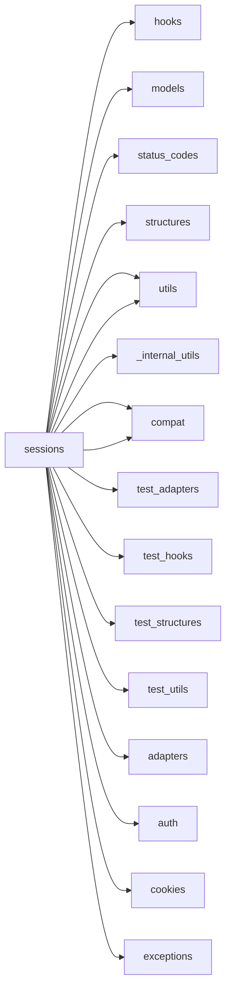
*This module is a dependency for **14** other parts of the system.*

### 🛠️ Code Logic Breakdown
#### 🔹 Function: `merge_setting`
The `merge_setting` function determines the final setting for a request by combining the explicit setting on the request with the setting in the session. It merges dictionary settings using a specified dictionary class, allowing for a hierarchical override of settings. This function exists to ensure that requests have the correct settings applied, taking into account both explicit and session-level configurations.

#### 🔹 Function: `merge_hooks`
The 'merge_hooks' function combines request and session hooks while handling a specific edge case where empty request hooks would otherwise override and break session hooks. It ensures that session hooks remain intact even when request hooks are empty, allowing for seamless integration of hooks from both sources. By doing so, it prevents unintended override of session hooks and maintains the integrity of the system's hook management.

#### 🔹 Class: `SessionRedirectMixin`
The `SessionRedirectMixin` Class serves as a core logic block within this module.

#### 🔹 Class: `Session`
Explanation timeout.

#### 🔹 Function: `session`
The 'session' function returns an instance of Session for context-management, allowing users to persist certain parameters across requests. It exists in the system to provide backwards compatibility for older code that relies on this method, despite being deprecated since version 1.0.0. Its purpose is to maintain consistency with legacy code, but new implementations should use the requests.sessions.Session class instead.

---

## 📄 File: `src/requests/_internal_utils.py`
### 📉 Dependency Graph
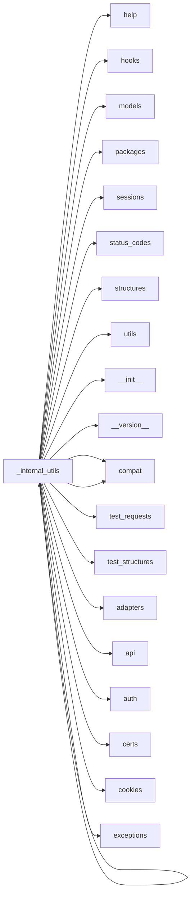
*This module is a dependency for **14** other parts of the system.*

### 🛠️ Code Logic Breakdown
#### 🔹 Function: `to_native_string`
The 'to_native_string' function converts any given string object into the native string type of the system, handling encoding and decoding as needed, with a default assumption of ASCII encoding. Its purpose is to ensure seamless interaction between different string types and encodings, preventing potential errors or inconsistencies. By providing a standardized way to convert strings, it enables reliable string manipulation and processing across the system.

#### 🔹 Function: `unicode_is_ascii`
The `unicode_is_ascii` function checks if a given unicode string consists only of ASCII characters, ensuring compatibility with systems or processes that can only handle ASCII encoding. It exists to prevent encoding errors or data corruption when working with unicode strings that may contain non-ASCII characters. By verifying the string's contents, the function helps maintain data integrity and prevents potential issues downstream.

---

## 📄 File: `src/requests/__version__.py`
### 📉 Dependency Graph

*This module is a dependency for **14** other parts of the system.*

### 🛠️ Code Logic Breakdown
#### 🔹 Function: `None`
The `None` Function serves as a core logic block within this module.

---

## 📄 File: `src/requests/auth.py`
### 📉 Dependency Graph
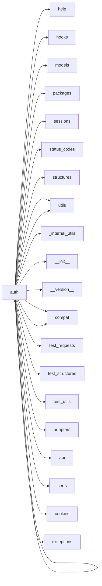
*This module is a dependency for **13** other parts of the system.*

### 🛠️ Code Logic Breakdown
#### 🔹 Function: `_basic_auth_str`
The `_basic_auth_str` function generates a string in the format required for Basic Authentication, typically used in HTTP requests. It exists to provide a standardized way of encoding credentials, such as a username and password, into a single string that can be included in the Authorization header of an HTTP request. By doing so, it enables secure authentication between a client and a server.

#### 🔹 Class: `AuthBase`
The AuthBase class provides a foundation for various authentication implementations, standardizing the interface and ensuring consistency across different auth methods. It exists to define a common set of methods and properties that all auth implementations must adhere to, facilitating polymorphism and modularity in the system. By deriving from AuthBase, specific auth implementations can focus on their unique logic while inheriting a shared structure.

#### 🔹 Class: `HTTPBasicAuth`
HTTP Basic Authentication is attached to a Request object to authenticate it with a server, allowing access to protected resources. By adding a username and password to the request headers, the request is verified as coming from a trusted source, enabling secure communication. The purpose of HTTPBasicAuth is to facilitate this authentication process, ensuring that only authorized requests are processed by the server.

#### 🔹 Class: `HTTPProxyAuth`
HTTPProxyAuth attaches HTTP proxy authentication credentials to a request object, allowing it to pass through a proxy server that requires authentication. The purpose is to facilitate access to external resources through a proxy server, which is a common setup in many networks for security and caching reasons. By attaching the authentication credentials, the request can successfully navigate the proxy server and reach its intended destination.

#### 🔹 Class: `HTTPDigestAuth`
HTTP Digest Authentication is attached to a Request object to securely authenticate a user's identity without transmitting passwords in plain text. It exists to prevent eavesdropping and replay attacks by using a challenge-response mechanism, where the client responds with a hashed value that the server can verify without knowing the client's actual password. By doing so, it ensures the integrity and confidentiality of the authentication process.

---

## 📄 File: `src/requests/cookies.py`
### 📉 Dependency Graph
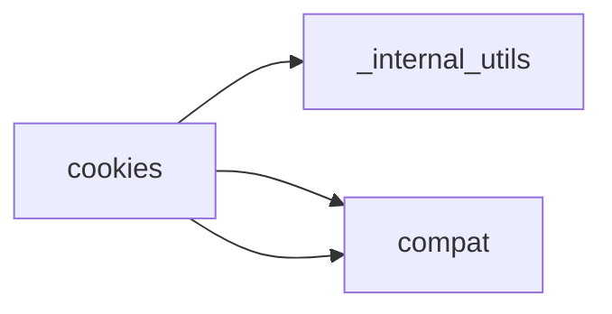
*This module is a dependency for **13** other parts of the system.*

### 🛠️ Code Logic Breakdown
#### 🔹 Class: `MockRequest`
The MockRequest wraps a requests.Request object to mimic the interface of urllib2.Request, allowing it to work with http.cookiejar.CookieJar for managing cookie policies. It exists to bridge the compatibility gap between the requests library and the cookie management functionality of http.cookiejar. By providing a compatible interface, MockRequest enables the CookieJar to correctly determine whether a cookie can be set based on domain policies.

#### 🔹 Class: `MockResponse`
The MockResponse wraps a server response to mimic a specific interface, allowing the headers to be parsed and exposed in a format expected by the http.cookiejar module. By doing so, it enables cookie management for custom or non-standard HTTP requests. Essentially, it acts as an adapter to bridge the gap between different HTTP response formats.

#### 🔹 Function: `extract_cookies_to_jar`
Explanation timeout.

#### 🔹 Function: `get_cookie_header`
The `get_cookie_header` function generates a Cookie header string that can be included in an HTTP request, allowing the client to send stored cookie data to the server. It exists to facilitate session management and authentication, enabling the server to recognize and personalize interactions with the client. By producing a valid Cookie header, the function ensures that the client can maintain a consistent and authenticated connection with the server.

#### 🔹 Function: `remove_cookie_by_name`
The 'remove_cookie_by_name' function unsets a specific cookie by its name across all domains and paths by default. It exists to provide a targeted way to remove cookies, which is useful for managing user sessions, clearing outdated or invalid data, and maintaining security and privacy. By wrapping the CookieJar.clear() method, it offers a more precise alternative to clearing all cookies at once.

#### 🔹 Class: `CookieConflictError`
The CookieConflictError is raised when multiple cookies in the cookie jar match the specified criteria, indicating ambiguity in the cookie retrieval process. It serves as a notification to the developer to use more specific parameters, such as domain and path, with the .get and .set methods to uniquely identify the desired cookie. By doing so, it helps prevent unexpected behavior and ensures accurate cookie management.

#### 🔹 Class: `RequestsCookieJar`
The RequestsCookieJar provides a dictionary-like interface to a CookieJar, allowing clients to access and manipulate cookies using familiar dictionary operations. It exists to maintain compatibility with external client code that expects response.cookies and session.cookies to behave like dictionaries, even though Requests itself doesn't rely on this interface internally. By exposing a dict interface, it enables seamless integration with existing code while still supporting standard CookieJar functionality.

#### 🔹 Function: `_copy_cookie_jar`
The `_copy_cookie_jar` Function serves as a core logic block within this module.

#### 🔹 Function: `create_cookie`
The `create_cookie` function generates a cookie with minimal parameters, setting a name-value pair that can be sent with every request to a domain. By default, it creates a "supercookie" that is not limited to a specific domain, allowing it to be shared across multiple sites. The purpose of this function is to provide a simple way to create a cookie with broad applicability, likely for testing, debugging, or development purposes where a more specific cookie configuration is not required.

#### 🔹 Function: `morsel_to_cookie`
The 'morsel_to_cookie' function takes a Morsel object as input and converts it into a Cookie object containing a single key-value pair. It exists to bridge the gap between the Morsel data structure, which stores cookie-related data, and the Cookie object, which is the actual representation of a cookie in the system. By doing so, it enables the system to utilize the data stored in the Morsel object as a valid cookie.

#### 🔹 Function: `cookiejar_from_dict`
The `cookiejar_from_dict` function creates a CookieJar object from a dictionary of key-value pairs representing cookies, allowing for the optional addition to an existing CookieJar and control over whether existing cookies are overwritten. It exists to simplify the process of creating or updating a CookieJar from a dictionary, which is a common data structure used to represent cookies. By providing this functionality, the function enables easier management of cookies in a system, particularly when working with web requests or sessions.

#### 🔹 Function: `merge_cookies`
The 'merge_cookies' function combines existing cookies in a CookieJar with new cookies from a dictionary or another CookieJar, creating a unified CookieJar object. It exists to manage and update cookies in a system, ensuring that all relevant cookies are stored in one place, which is essential for tasks like web scraping, API interactions, or simulating browser behavior. By merging cookies, the function helps maintain a consistent and up-to-date cookie state.

---

## 📄 File: `src/requests/models.py`
### 📉 Dependency Graph
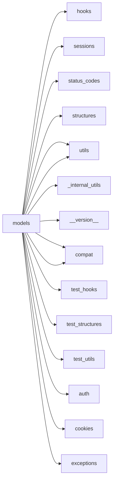
*This module is a dependency for **13** other parts of the system.*

### 🛠️ Code Logic Breakdown
#### 🔹 Class: `RequestEncodingMixin`
The `RequestEncodingMixin` Class serves as a core logic block within this module.

#### 🔹 Class: `RequestHooksMixin`
The `RequestHooksMixin` Class serves as a core logic block within this module.

#### 🔹 Class: `Request`
The Request object prepares data for an HTTP request by encapsulating parameters such as method, URL, headers, files, and data, allowing for flexible and customizable request construction. It exists to provide a structured way to build and modify requests before sending them to the server, ensuring consistency and reliability in the request-sending process. By separating request preparation from the actual sending process, it enables better control and reusability of request configurations.

#### 🔹 Class: `PreparedRequest`
The PreparedRequest object represents the final, mutable form of an HTTP request, containing the exact bytes to be sent to the server. It is generated from a Request object to allow for any necessary modifications before sending the request, such as adding headers or query parameters. By separating request preparation from sending, PreparedRequest enables more control and flexibility over the request lifecycle.

#### 🔹 Class: `Response`
Explanation timeout.

---

## 📄 File: `src/requests/status_codes.py`
### 📉 Dependency Graph
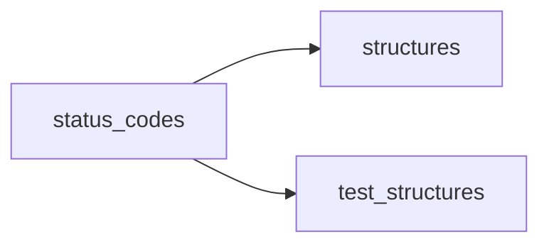
*This module is a dependency for **13** other parts of the system.*

### 🛠️ Code Logic Breakdown
#### 🔹 Function: `_init`
The `_init` Function serves as a core logic block within this module.

---

## 📄 File: `src/requests/utils.py`
### 📉 Dependency Graph
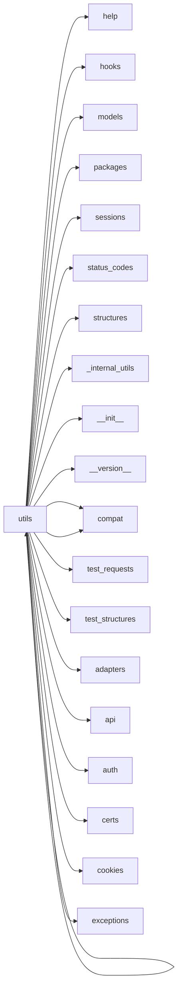
*This module is a dependency for **13** other parts of the system.*

### 🛠️ Code Logic Breakdown
#### 🔹 Function: `dict_to_sequence`
The `dict_to_sequence` function takes a dictionary as input and returns a reformatted sequence that can be used for internal updates. It exists to bridge the gap between external data representations, often in dictionary format, and the system's internal sequence-based data structure, enabling seamless data exchange and processing. By doing so, it facilitates data consistency and compatibility across the system.

#### 🔹 Function: `super_len`
The `super_len` Function serves as a core logic block within this module.

#### 🔹 Function: `get_netrc_auth`
The `get_netrc_auth` function retrieves authentication credentials from a .netrc file for a given URL and returns them as a tuple in the format expected by the Requests library. The purpose of this function is to enable automatic authentication for HTTP requests by leveraging the existing .netrc configuration, which stores login credentials for various hosts. By using this function, the system can seamlessly authenticate requests without requiring explicit credential specification.

#### 🔹 Function: `guess_filename`
The `guess_filename` function attempts to determine the filename of a given object, likely when the filename is not explicitly provided. It exists to handle situations where the filename is unknown or missing, allowing the system to continue processing the object without interruption. By guessing the filename, the function enables the system to maintain functionality and avoid errors that would occur if a filename is required but not available.

#### 🔹 Function: `extract_zipped_paths`
The `extract_zipped_paths` function takes a file path as input and checks if it refers to a member of a zip archive. If the path is a zip archive member, it extracts the target file to a new location and returns the path to the extracted file; otherwise, it returns the original path unchanged. The purpose of this function is to ensure that file paths are accessible and usable, even if they are compressed within a zip archive, thereby simplifying file handling and processing in the system.

#### 🔹 Function: `atomic_open`
The `atomic_open` function ensures that writing to a file is an all-or-nothing operation, preventing data corruption or partial writes in case of interruptions or failures. It achieves this by writing to a temporary file and then renaming it to the final destination, guaranteeing that either the entire file is written or nothing is. This approach maintains data integrity and prevents inconsistencies in the system.

#### 🔹 Function: `from_key_val_list`
The `from_key_val_list` function takes an object as input and attempts to convert it into an OrderedDict, a dictionary-like object that preserves the order of its items. It exists to provide a standardized way of converting various data structures, such as lists of key-value pairs or existing dictionaries, into a consistent and ordered format. By doing so, it enables the system to work with different data sources in a unified manner, while also ensuring that the data can be properly encoded and processed.

#### 🔹 Function: `to_key_val_list`
The `to_key_val_list` function checks if an object can be represented as a dictionary and, if so, converts it into a list of key-value tuples. It exists to provide a standardized way of handling different data formats, allowing the system to work with various input types, such as dictionaries, lists of tuples, or other iterable objects. By doing so, it enables the system to process and encode data consistently, regardless of its original format.

#### 🔹 Function: `parse_list_header`
The 'parse_list_header' function breaks down a comma-separated string into individual elements, handling quoted strings that may contain commas and non-quoted strings with quotes in the middle. It exists to correctly interpret lists in HTTP headers, as defined by RFC 2068 Section 2, and returns a standard list of parsed elements with quotes removed. This function is necessary to accurately process header lists that may contain complex and varied formatting.

#### 🔹 Function: `parse_dict_header`
The `parse_dict_header` function takes a string of comma-separated key-value pairs as input, parses them according to the format specified in RFC 2068 Section 2, and returns a Python dictionary. It exists to enable the conversion of HTTP header values into a more usable and accessible format within a Python application, allowing for easy access and manipulation of the header data. By doing so, it facilitates the processing and handling of HTTP requests and responses.

#### 🔹 Function: `unquote_header_value`
The `unquote_header_value` function reverses the quoting process applied to header values, restoring them to their original form. It exists to handle header values that were previously quoted using a non-standard method commonly employed by browsers, rather than the standard quoting mechanism. By unquoting these values, the function ensures that the original data can be accurately retrieved and used within the system.

#### 🔹 Function: `dict_from_cookiejar`
The `dict_from_cookiejar` function extracts cookies from a CookieJar object and returns them as a dictionary, allowing for easy access and manipulation of the cookies. It exists to bridge the gap between the CookieJar object, which is used to store and manage cookies, and other parts of the system that require a more straightforward key-value representation of the cookies. By converting the CookieJar to a dictionary, it enables simpler cookie handling and processing in various applications.

#### 🔹 Function: `add_dict_to_cookiejar`
The 'add_dict_to_cookiejar' function takes a dictionary of key-value pairs representing cookies and inserts them into a CookieJar object, returning the updated CookieJar. It exists to simplify the process of populating a CookieJar with cookies from a dictionary, allowing for easier management of cookies in a program. By providing a straightforward way to convert a dictionary into a CookieJar, it enables seamless interaction with libraries or modules that require a CookieJar object.

#### 🔹 Function: `get_encodings_from_content`
The `get_encodings_from_content` function analyzes a given bytestring to identify and extract encoding information, such as character encoding schemes. It exists to enable the system to properly interpret and process content from diverse sources, which may use different encoding standards. By detecting the encoding, the system can accurately decode and utilize the content.

#### 🔹 Function: `_parse_content_type_header`
The `_parse_content_type_header` function breaks down a content type header into its primary type and associated parameters, returning them as a tuple. It exists to enable the system to accurately interpret and handle different types of content, such as images or text, and their respective attributes, like character encoding or compression. By parsing the header, the system can make informed decisions about how to process and display the content.

#### 🔹 Function: `get_encoding_from_headers`
The `get_encoding_from_headers` function extracts the encoding information from a given HTTP header dictionary. It exists to determine the character encoding used in an HTTP response, which is crucial for correctly interpreting the response content, especially when dealing with text data in various languages. By retrieving the encoding from the headers, the system can ensure accurate decoding and processing of the received data.

#### 🔹 Function: `stream_decode_response_unicode`
The `stream_decode_response_unicode` function takes an iterator of encoded data and decodes it into Unicode on the fly, allowing for efficient processing of large datasets without having to load the entire dataset into memory. It exists to handle responses from APIs or other data sources that return encoded data, ensuring that the data can be properly interpreted and processed by the system. By decoding the data in a streaming fashion, it helps prevent memory issues and improves overall system performance.

#### 🔹 Function: `iter_slices`
The 'iter_slices' function generates substrings of a specified length from a given string, allowing for efficient iteration over the string in chunks. It exists to facilitate processing of large strings by breaking them down into manageable pieces, thereby reducing memory usage and improving performance. By doing so, it enables efficient handling of long strings in various applications, such as text processing and data parsing.

#### 🔹 Function: `get_unicode_from_response`
The 'get_unicode_from_response' function takes a response object as input and attempts to extract its content in unicode format. It first tries to determine the charset from the response's content-type header, and if that fails, it falls back to replacing all unicode characters to ensure the content can still be processed. The purpose of this function is to handle responses with varying or unknown encoding schemes, ensuring that the system can still interpret and utilize the content.

#### 🔹 Function: `unquote_unreserved`
The 'unquote_unreserved' function decodes percent-escape sequences in a URI that represent unreserved characters, such as letters, digits, and certain special characters, while leaving reserved, illegal, and non-ASCII bytes encoded. It exists to ensure that URIs are properly decoded and normalized, making it easier to compare and process them. By only unquoting unreserved characters, the function helps prevent potential security vulnerabilities that could arise from decoding reserved or special characters.

#### 🔹 Function: `requote_uri`
The `requote_uri` function re-quotes a given URI by first unquoting it and then quoting it again, ensuring that the URI is consistently and fully quoted. This process helps to standardize the URI's formatting, which is essential for preventing errors that may arise from inconsistent or partial quoting. By re-quoting the URI, the function ensures that special characters are properly encoded, making the URI safe for use in various applications.

#### 🔹 Function: `address_in_network`
The `address_in_network` function checks whether a given IP address belongs to a specific network subnet by comparing the IP address with the subnet's address and mask. It exists to validate IP addresses against predefined network subnets, ensuring that an IP address is within the expected range for a particular network, which is crucial for network security, routing, and access control. By doing so, it helps prevent unauthorized access and ensures that network traffic is properly routed.

#### 🔹 Function: `dotted_netmask`
The `dotted_netmask` function converts a subnet mask from its abbreviated CIDR notation (e.g., /24) to a dotted decimal notation (e.g., 255.255.255.0). It exists to provide a human-readable representation of the subnet mask, making it easier to understand and work with IP network configurations. By converting the mask to a dotted decimal format, the function facilitates tasks such as configuring network devices, troubleshooting connectivity issues, and visualizing network topology.

#### 🔹 Function: `is_ipv4_address`
The 'is_ipv4_address' function checks if a given input string conforms to the standard IPv4 address format, verifying that it consists of four decimal numbers separated by dots and that each number falls within the valid range of 0 to 255. Its purpose is to validate user input or data to ensure it represents a legitimate IPv4 address, preventing potential errors or security vulnerabilities. By confirming the address format, the function helps maintain data integrity and prevents malformed addresses from being processed.

#### 🔹 Function: `is_valid_cidr`
The 'is_valid_cidr' function checks if a given string is in a valid CIDR (Classless Inter-Domain Routing) format, typically used to specify IP address ranges in networking. It exists to validate the 'no_proxy' variable, ensuring it contains properly formatted CIDR values that can be correctly interpreted and applied to proxy settings. By doing so, it helps prevent errors and security issues that could arise from misconfigured proxy settings.

#### 🔹 Function: `set_environ`
Explanation timeout.

#### 🔹 Function: `should_bypass_proxies`
The `should_bypass_proxies` function determines whether to circumvent proxy servers while making network requests. It exists to allow the system to dynamically decide when to use direct connections, potentially improving performance or avoiding proxy-related issues. By returning a boolean value, the function provides a simple way to toggle proxy bypassing on or off based on specific conditions or requirements.

#### 🔹 Function: `get_environ_proxies`
The `get_environ_proxies` function retrieves and returns a dictionary of proxy settings from the environment variables. It exists to provide a standardized way of accessing these settings, which are often used to configure network connections, especially when working behind a proxy server. By encapsulating this logic in a single function, it simplifies the process of obtaining proxy settings and makes the code more maintainable and reusable.

#### 🔹 Function: `select_proxy`
The `select_proxy` function determines whether a proxy server should be used for a given URL and returns the corresponding proxy URL if applicable. It takes into account the scheme and host of the URL and matches it against a dictionary of predefined proxy configurations. The purpose of this function is to enable the system to route certain requests through proxy servers, which can be useful for bypassing network restrictions, anonymizing traffic, or improving performance.

#### 🔹 Function: `resolve_proxies`
The `resolve_proxies` function takes in request and configuration inputs to determine the target proxy mappings, considering settings such as NO_PROXY to strip proxy configurations. It exists to ensure that proxy settings are properly applied and overridden based on the request, configuration, and environment settings. By doing so, it allows for flexible and secure management of proxy configurations in the system.

#### 🔹 Function: `default_user_agent`
The `default_user_agent` function returns a string that represents the default user agent, which is a piece of information sent with HTTP requests to identify the client making the request. It exists to provide a standard identifier for requests made by the system when no custom user agent is specified, allowing servers to track and analyze incoming requests. By providing a default user agent, the system can ensure that all requests include this identifying information, even if a custom agent is not provided.

#### 🔹 Function: `default_headers`
The `default_headers` function generates a dictionary of default HTTP headers that will be included in every request made by the system. These headers are likely used to identify the client, specify the data format, or provide other metadata that should be sent with every request. By setting default headers, the system ensures consistency across all requests and avoids having to manually specify the same headers every time a request is made.

#### 🔹 Function: `parse_header_links`
The `parse_header_links` function takes a Link header string as input, breaks it down into individual links, and extracts relevant information such as the URL, relationship, and media type. It returns a list of parsed link headers, allowing the system to easily access and utilize the information contained in the Link headers. The purpose of this function is to standardize and simplify the processing of Link headers, which are commonly used in HTTP responses to provide additional metadata about a resource.

#### 🔹 Function: `guess_json_utf`
The `guess_json_utf` function attempts to detect the UTF encoding of a JSON string, likely to ensure proper decoding and parsing of the JSON data. It exists in the system to handle cases where the encoding of the JSON data is unknown or not explicitly specified, allowing the system to adapt and process the data correctly. By guessing the UTF encoding, the function enables the system to handle JSON data from various sources with different encoding schemes.

#### 🔹 Function: `prepend_scheme_if_needed`
The 'prepend_scheme_if_needed' function ensures that a given URL has a scheme (such as 'http' or 'https') by prepending the specified scheme if one is not already present. It exists to prevent errors that can occur when working with URLs that do not have an explicit scheme, such as when making HTTP requests or parsing URLs. By adding a scheme only when necessary, it avoids overwriting existing schemes, preserving the original URL's intent.

#### 🔹 Function: `get_auth_from_url`
The 'get_auth_from_url' function extracts authentication credentials from a given URL, breaking them down into a tuple containing the username and password. It exists to facilitate the processing of URLs that embed authentication information, allowing the system to handle such URLs seamlessly. By doing so, it enables the system to authenticate and connect to protected resources without requiring manual credential input.

#### 🔹 Function: `check_header_validity`
The 'check_header_validity' function verifies the integrity of HTTP header components by ensuring they do not contain leading whitespace, reserved characters, or return characters. It exists to prevent potential security vulnerabilities, such as header injection attacks, by validating the format of header name-value pairs. By checking for these conditions, the function helps maintain the security and reliability of the system's HTTP interactions.

#### 🔹 Function: `_validate_header_part`
The `_validate_header_part` Function serves as a core logic block within this module.

#### 🔹 Function: `urldefragauth`
Explanation timeout.

#### 🔹 Function: `rewind_body`
The `rewind_body` function resets the file pointer to its initial position, allowing the contents to be re-read. It serves as a reset mechanism to re-access the data from the beginning, particularly useful in scenarios where data needs to be redirected or re-processed. By rewinding the file pointer, the system can re-read the data without having to reload or re-fetch it.

---

## 📄 File: `src/requests/hooks.py`
### 📉 Dependency Graph

*This module is a dependency for **12** other parts of the system.*

### 🛠️ Code Logic Breakdown
#### 🔹 Function: `default_hooks`
The `default_hooks` Function serves as a core logic block within this module.

#### 🔹 Function: `dispatch_hook`
The `dispatch_hook` function applies a set of predefined actions, specified in a hook dictionary, to a given piece of data, allowing for flexible and modular processing of the data. By dispatching these hooks, the function enables the system to perform various operations, such as validation, transformation, or notification, on the data without having to hardcode these actions into the main processing flow. This decouples the core logic from specific business rules or side effects, making the system more extensible and maintainable.

---

## 📄 File: `src/requests/adapters.py`
### 📉 Dependency Graph
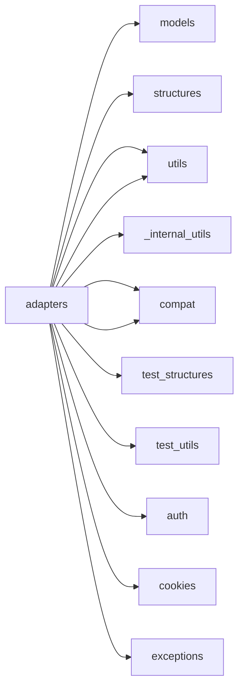
*This module is a dependency for **12** other parts of the system.*

### 🛠️ Code Logic Breakdown
#### 🔹 Function: `_urllib3_request_context`
The `_urllib3_request_context` Function serves as a core logic block within this module.

#### 🔹 Class: `BaseAdapter`
The BaseAdapter provides a foundation for creating transport adapters, enabling standardized communication between the system and various external services or protocols. It defines a common interface and base functionality that can be extended by specific adapters, ensuring consistency and modularity in the system's transport layer. By abstracting away low-level transport details, the BaseAdapter facilitates the addition of new adapters and simplifies maintenance of existing ones.

#### 🔹 Class: `HTTPAdapter`
The HTTPAdapter provides a standardized interface for Requests sessions to interact with HTTP and HTTPS URLs, enabling connection pooling, retry mechanisms, and other low-level network settings. It exists to abstract away the complexities of handling HTTP connections, allowing developers to focus on higher-level logic while still providing control over connection behavior. By managing connection pools and retries, the HTTPAdapter helps optimize network performance and improve the reliability of HTTP requests.

---

## 📄 File: `src/requests/api.py`
### 📉 Dependency Graph
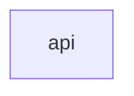
*This module is a dependency for **11** other parts of the system.*

### 🛠️ Code Logic Breakdown
#### 🔹 Function: `request`
The 'request' function constructs and sends an HTTP request to a specified URL, allowing users to customize the request method, headers, data, and other parameters. It exists to provide a flexible and unified way to make HTTP requests in a system, abstracting away the underlying complexities of HTTP communication. By providing a wide range of optional parameters, it caters to various use cases, such as authentication, file uploads, and SSL verification.

#### 🔹 Function: `get`
The 'get' function sends an HTTP GET request to a specified URL, allowing optional query string parameters to be included. Its purpose is to retrieve data from a server without modifying it, and it returns a Response object containing the server's response. This function exists to provide a simple and convenient way to make GET requests, a fundamental operation in web communication, allowing developers to easily fetch data from servers.

#### 🔹 Function: `options`
The 'options' function sends an OPTIONS request to a specified URL, allowing the client to determine the HTTP methods supported by the server for that URL. It exists to provide a way to query the server about its capabilities and requirements, such as supported HTTP methods, without actually performing an action. This function is useful for checking server configuration, testing APIs, and ensuring compatibility before making actual requests.

#### 🔹 Function: `head`
The 'head' function sends a HEAD request to a specified URL, allowing optional arguments to be passed, and returns a Response object. It exists to enable checking the existence, status, and headers of a resource without retrieving its full content, thus saving bandwidth and improving efficiency. By default, it disables redirects to ensure the response is from the original URL.

#### 🔹 Function: `post`
The 'post' function sends a POST request to a specified URL, allowing data to be sent in the request body in various formats, such as a dictionary, JSON object, or file. Its purpose is to enable the creation of new resources on a server, update existing resources, or trigger server-side actions. By providing a flexible way to send data to a server, the 'post' function facilitates communication between clients and servers in web-based systems.

#### 🔹 Function: `put`
The 'put' function sends a PUT request to a specified URL, allowing data to be updated or replaced on a server. It exists to provide a standardized way to modify existing resources on a server, such as updating a user's profile information or replacing a file. By supporting various data formats, including JSON and binary data, the 'put' function enables flexible and efficient data updates.

#### 🔹 Function: `patch`
The 'patch' function sends a PATCH request to a specified URL, allowing for partial updates to existing resources. It exists in the system to provide a way to modify specific parts of a resource without having to send the entire resource, reducing data transfer and improving efficiency. By supporting various data formats, including JSON, it offers flexibility in how updates are sent to the server.

#### 🔹 Function: `delete`
The 'delete' function sends a DELETE request to a specified URL, allowing the system to remove or delete resources from a server. It exists to provide a simple and standardized way to make DELETE requests, which is a fundamental operation in many web applications and APIs. By encapsulating this functionality, the system can easily interact with external resources and manage data in a consistent manner.

---

## 📄 File: `src/requests/help.py`
### 📉 Dependency Graph

*This module is a dependency for **11** other parts of the system.*

### 🛠️ Code Logic Breakdown
#### 🔹 Function: `_implementation`
Explanation timeout.

#### 🔹 Function: `info`
The 'info' function generates a comprehensive set of data to be included in a bug report, likely containing system details, error messages, and other relevant information. Its purpose is to streamline the bug reporting process by automatically collecting and formatting necessary information, making it easier for developers to diagnose and resolve issues. By providing a standardized set of data, the function helps ensure that bug reports are thorough and consistent, facilitating more efficient troubleshooting and debugging.

#### 🔹 Function: `main`
The 'main' function is designed to format and display bug information in a visually appealing JSON format. It takes the collected bug data and structures it in a way that is easy to read and understand, making it simpler for users to analyze and diagnose issues. By presenting the information in a clear and organized manner, the function facilitates more efficient debugging and problem-solving processes.

---

## 📄 File: `src/requests/packages.py`
### 📉 Dependency Graph

*This module is a dependency for **10** other parts of the system.*

### 🛠️ Code Logic Breakdown
#### 🔹 Function: `None`
The `None` Function serves as a core logic block within this module.

---

## 📄 File: `src/requests/certs.py`
### 📉 Dependency Graph

*This module is a dependency for **10** other parts of the system.*

### 🛠️ Code Logic Breakdown
#### 🔹 Function: `None`
The `None` Function serves as a core logic block within this module.

---

