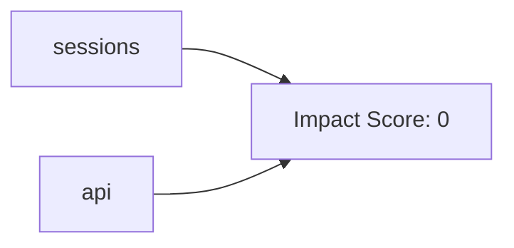
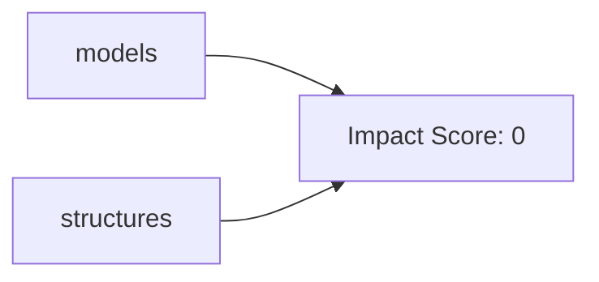
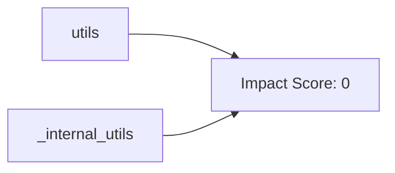
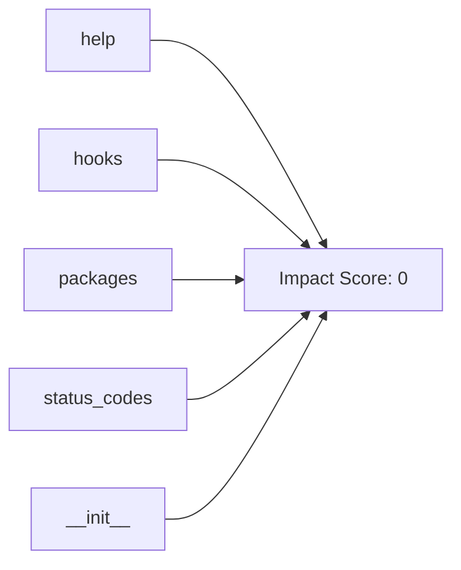

# 📖 REQUESTS: Technical Reference

## 📊 Project at a Glance
- **Core Modules:** 21
- **Documented Classes:** 70
- **Key Functions:** 81

## 📑 Table of Contents
- [Ch 1: The Gateway (API & Core)](#ch-1-the-gateway-api-&-core)
- [Ch 2: The Skeleton (Data Models)](#ch-2-the-skeleton-data-models)
- [Ch 3: The Toolbelt (Utilities)](#ch-3-the-toolbelt-utilities)
- [Ch 4: Supporting Infrastructure](#ch-4-supporting-infrastructure)

## Ch 1: The Gateway (API & Core)
### 📉 Chapter Architecture

### 📄 Module: `src/requests/sessions.py`
#### 🏛️ Classes
- **`SessionRedirectMixin`**: _No description available._
- **`Session`**: A Requests session. Provides cookie persistence, connection-pooling, and configuration. Basic Usage: >>> import requests >>> s = requests.Session() >>> s.get('https://httpbin.org/get') <Response [200]> Or as a context manager: >>> with requests.Session() as s: ... s.get('https://httpbin.org/get') <R...

#### ⚙️ Logic
- **`merge_setting`**: Determines appropriate setting for a given request, taking into account the explicit setting on that request, and the setting in the session. If a setting is a dictionary, they will be merged together using `dict_class`
- **`merge_hooks`**: Properly merges both requests and session hooks. This is necessary because when request_hooks == {'response': []}, the merge breaks Session hooks entirely.
- **`session`**: Returns a **Session** for context-management. .. deprecated: 1.0.0 This method has been deprecated since version 1.0.0 and is only kept for backwards compatibility. New code should use **requests.sessions.Session** to create a session. This may be removed at a future date. :rtype: Session

---
### 📄 Module: `src/requests/api.py`
#### ⚙️ Logic
- **`request`**: Constructs and sends a **Request**. method for the new **Request** object: ``GET``, ``OPTIONS``, ``HEAD``, ``POST``, ``PUT``, ``PATCH``, or ``DELETE``. URL for the new **Request** object. (optional) Dictionary, list of tuples or bytes to send in the query string for the **Request**. (optional) Dicti...
- **`get`**: Sends a GET request. URL for the new **Request** object. (optional) Dictionary, list of tuples or bytes to send in the query string for the **Request**. Optional arguments that ``request`` takes. :return: **Response** object :rtype: requests.Response
- **`options`**: Sends an OPTIONS request. URL for the new **Request** object. Optional arguments that ``request`` takes. :return: **Response** object :rtype: requests.Response

*Includes:* `head`, `post`, `put`, `patch`, `delete`...

---

## Ch 2: The Skeleton (Data Models)
### 📉 Chapter Architecture

### 📄 Module: `src/requests/models.py`
#### 🏛️ Classes
- **`RequestEncodingMixin`**: _No description available._
- **`RequestHooksMixin`**: _No description available._
- **`Request`**: A user-created **Request** object. Used to prepare a **PreparedRequest**, which is sent to the server. HTTP method to use. URL to send. dictionary of headers to send. dictionary of {filename: fileobject} files to multipart upload. the body to attach to the request. If a dictionary or list of tuples ...
- **`PreparedRequest`**: The fully mutable **PreparedRequest** object, containing the exact bytes that will be sent to the server. Instances are generated from a **Request** object, and should not be instantiated manually; doing so may produce undesirable effects. Usage: >>> import requests >>> req = requests.Request('GET',...
- **`Response`**: The **Response** object, which contains a server's response to an HTTP request.

---
### 📄 Module: `src/requests/structures.py`
#### 🏛️ Classes
- **`CaseInsensitiveDict`**: A case-insensitive ``dict``-like object. Implements all methods and operations of ``MutableMapping`` as well as dict's ``copy``. Also provides ``lower_items``. All keys are expected to be strings. The structure remembers the case of the last key to be set, and ``iter(instance)``, ``keys()``, ``items...
- **`LookupDict`**: Dictionary lookup object.

---

## Ch 3: The Toolbelt (Utilities)
### 📉 Chapter Architecture

### 📄 Module: `src/requests/utils.py`
#### ⚙️ Logic
- **`dict_to_sequence`**: Returns an internal sequence dictionary update.
- **`super_len`**: _No description available._
- **`get_netrc_auth`**: Returns the Requests tuple auth for a given url from netrc.

*Includes:* `guess_filename`, `extract_zipped_paths`, `atomic_open`, `from_key_val_list`, `to_key_val_list`, `parse_list_header`, `parse_dict_header`, `unquote_header_value`, `dict_from_cookiejar`...

---
### 📄 Module: `src/requests/_internal_utils.py`
#### ⚙️ Logic
- **`to_native_string`**: Given a string object, regardless of type, returns a representation of that string in the native string type, encoding and decoding where necessary. This assumes ASCII unless told otherwise.
- **`unicode_is_ascii`**: Determine if unicode string only contains ASCII characters. unicode string to check. Must be unicode and not Python 2 `str`. :rtype: bool

---

## Ch 4: Supporting Infrastructure
### 📉 Chapter Architecture

### 📄 Module: `src/requests/help.py`
#### ⚙️ Logic
- **`_implementation`**: Return a dict with the Python implementation and version. Provide both the name and the version of the Python implementation currently running. For example, on CPython 3.10.3 it will return {'name': 'CPython', 'version': '3.10.3'}. This function works best on CPython and PyPy: in particular, it prob...
- **`info`**: Generate information for a bug report.
- **`main`**: Pretty-print the bug information as JSON.

---
### 📄 Module: `src/requests/hooks.py`
#### ⚙️ Logic
- **`default_hooks`**: _No description available._
- **`dispatch_hook`**: Dispatches a hook dictionary on a given piece of data.

---
### 📄 Module: `src/requests/packages.py`

---
### 📄 Module: `src/requests/status_codes.py`
#### ⚙️ Logic
- **`_init`**: _No description available._

---
### 📄 Module: `src/requests/__init__.py`
#### ⚙️ Logic
- **`check_compatibility`**: _No description available._
- **`_check_cryptography`**: _No description available._

---
### 📄 Module: `src/requests/__version__.py`

---
### 📄 Module: `setup.py`

---
### 📄 Module: `docs/conf.py`

---
### 📄 Module: `docs/_themes/flask_theme_support.py`
#### 🏛️ Classes
- **`FlaskyStyle`**: _No description available._

---
### 📄 Module: `src/requests/adapters.py`
#### 🏛️ Classes
- **`BaseAdapter`**: The Base Transport Adapter
- **`HTTPAdapter`**: The built-in HTTP Adapter for urllib3. Provides a general-case interface for Requests sessions to contact HTTP and HTTPS urls by implementing the Transport Adapter interface. This class will usually be created by the **Session** class under the covers. The number of urllib3 connection pools to cache...

#### ⚙️ Logic
- **`_urllib3_request_context`**: _No description available._

---
### 📄 Module: `src/requests/auth.py`
#### 🏛️ Classes
- **`AuthBase`**: Base class that all auth implementations derive from
- **`HTTPBasicAuth`**: Attaches HTTP Basic Authentication to the given Request object.
- **`HTTPProxyAuth`**: Attaches HTTP Proxy Authentication to a given Request object.
- **`HTTPDigestAuth`**: Attaches HTTP Digest Authentication to the given Request object.

#### ⚙️ Logic
- **`_basic_auth_str`**: Returns a Basic Auth string.

---
### 📄 Module: `src/requests/certs.py`

---
### 📄 Module: `src/requests/compat.py`
#### ⚙️ Logic
- **`_resolve_char_detection`**: Find supported character detection libraries.

---
### 📄 Module: `src/requests/cookies.py`
#### 🏛️ Classes
- **`MockRequest`**: Wraps a `requests.Request` to mimic a `urllib2.Request`. The code in `http.cookiejar.CookieJar` expects this interface in order to correctly manage cookie policies, i.e., determine whether a cookie can be set, given the domains of the request and the cookie. The original request object is read-only....
- **`MockResponse`**: Wraps a `httplib.HTTPMessage` to mimic a `urllib.addinfourl`. ...what? Basically, expose the parsed HTTP headers from the server response the way `http.cookiejar` expects to see them.
- **`CookieConflictError`**: There are two cookies that meet the criteria specified in the cookie jar. Use .get and .set and include domain and path args in order to be more specific.
- **`RequestsCookieJar`**: Compatibility class; is a http.cookiejar.CookieJar, but exposes a dict interface. This is the CookieJar we create by default for requests and sessions that don't specify one, since some clients may expect response.cookies and session.cookies to support dict operations. Requests does not use the dict...

#### ⚙️ Logic
- **`extract_cookies_to_jar`**: Extract the cookies from the response into a CookieJar. http.cookiejar.CookieJar (not necessarily a RequestsCookieJar) our own requests.Request object urllib3.HTTPResponse object
- **`get_cookie_header`**: Produce an appropriate Cookie header string to be sent with `request`, or None. :rtype: str
- **`remove_cookie_by_name`**: Unsets a cookie by name, by default over all domains and paths. Wraps CookieJar.clear(), is O(n).

*Includes:* `_copy_cookie_jar`, `create_cookie`, `morsel_to_cookie`, `cookiejar_from_dict`, `merge_cookies`...

---
### 📄 Module: `src/requests/exceptions.py`
#### 🏛️ Classes
- **`UnrewindableBodyError`**: Requests encountered an error when trying to rewind a body.
- **`RequestsWarning`**: Base warning for Requests.
- **`FileModeWarning`**: A file was opened in text mode, but Requests determined its binary length.
- **`RequestsDependencyWarning`**: An imported dependency doesn't match the expected version range.
- **`RequestException`**: There was an ambiguous exception that occurred while handling your request.

---
