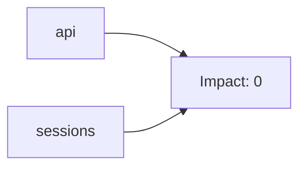
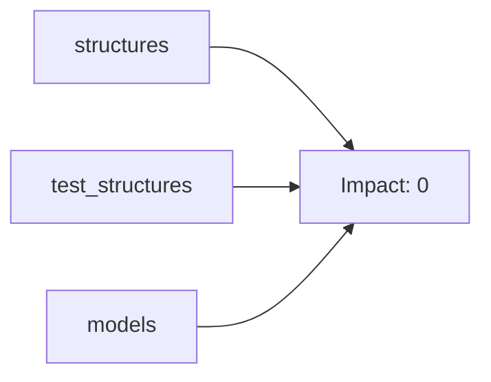
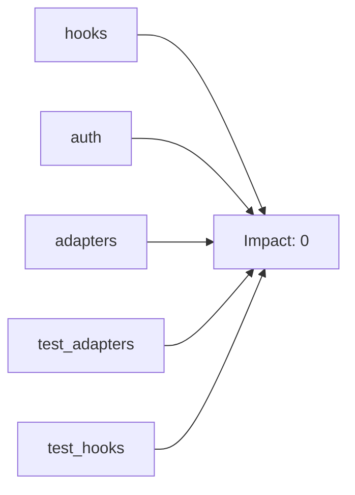
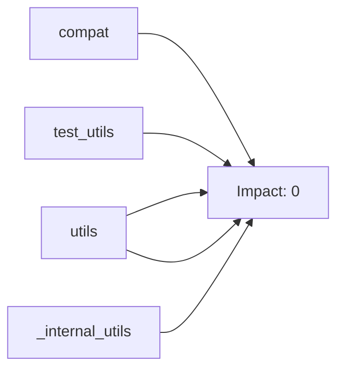
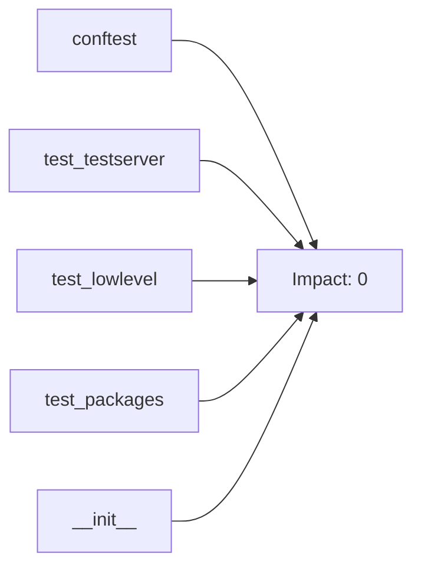
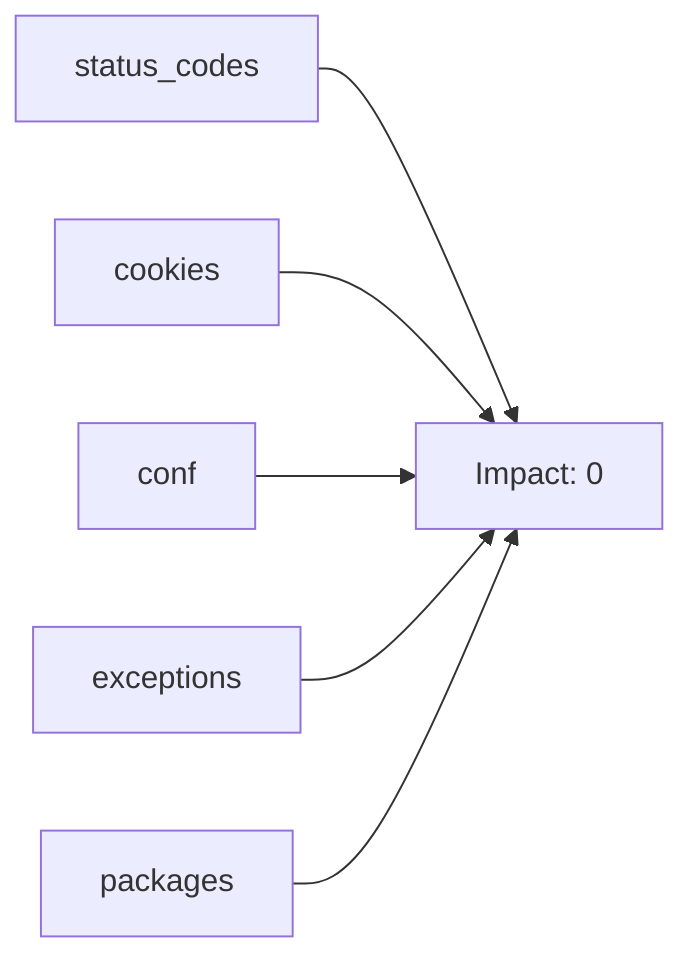

# 📖 REQUESTS: The Complete Reference

## 📊 Project at a Glance
- **Total Modules:** 36
- **Total Classes:** 70
- **Total Functions:** 136

## 📑 Table of Contents
- [Ch 1: The Gateway (API & Sessions)](#ch-1-the-gateway-api-&-sessions)
- [Ch 2: The Skeleton (Data Models)](#ch-2-the-skeleton-data-models)
- [Ch 3: The Pulse (Transport & Auth)](#ch-3-the-pulse-transport-&-auth)
- [Ch 4: The Toolbelt (Utilities)](#ch-4-the-toolbelt-utilities)
- [Ch 5: The Shield (Testing Suite)](#ch-5-the-shield-testing-suite)
- [Ch 6: Supporting Infrastructure](#ch-6-supporting-infrastructure)

## Ch 1: The Gateway (API & Sessions)
### 📉 Chapter Dependency Map

### 📄 Module: `src/requests/api.py`
> Architecture Role: The Gateway (API & Sessions)

#### 🏛️ Classes
- **`FlaskyStyle`**: _No description available._
- **`BaseAdapter`**: The Base Transport Adapter
- **`HTTPAdapter`**: The built-in HTTP Adapter for urllib3. Provides a general-case interface for Requests sessions to contact HTTP and HTTPS urls by implementing the Transport Adapter interface. This class will usually be created by the **Session** class under the covers. The number of urllib3 connection pools to cache. The maximum number of connections to save in the pool. The maximum number of retries each connection should attempt. Note, this applies only to failed DNS lookups, socket connections and connection timeouts, never to requests where data has made it to the server. By default, Requests does not retry failed connections. If you need granular control over the conditions under which we retry a request, import urllib3's ``Retry`` class and pass that instead. Whether the connection pool should block for connections. Usage: >>> import requests >>> s = requests.Session() >>> a = requests.adapters.HTTPAdapter(max_retries=3) >>> s.mount('http://', a)
- **`AuthBase`**: Base class that all auth implementations derive from
- **`HTTPBasicAuth`**: Attaches HTTP Basic Authentication to the given Request object.
- **`HTTPProxyAuth`**: Attaches HTTP Proxy Authentication to a given Request object.
- **`HTTPDigestAuth`**: Attaches HTTP Digest Authentication to the given Request object.
- **`MockRequest`**: Wraps a `requests.Request` to mimic a `urllib2.Request`. The code in `http.cookiejar.CookieJar` expects this interface in order to correctly manage cookie policies, i.e., determine whether a cookie can be set, given the domains of the request and the cookie. The original request object is read-only. The client is responsible for collecting the new headers via `get_new_headers()` and interpreting them appropriately. You probably want `get_cookie_header`, defined below.
- **`MockResponse`**: Wraps a `httplib.HTTPMessage` to mimic a `urllib.addinfourl`. ...what? Basically, expose the parsed HTTP headers from the server response the way `http.cookiejar` expects to see them.
- **`CookieConflictError`**: There are two cookies that meet the criteria specified in the cookie jar. Use .get and .set and include domain and path args in order to be more specific.
- **`RequestsCookieJar`**: Compatibility class; is a http.cookiejar.CookieJar, but exposes a dict interface. This is the CookieJar we create by default for requests and sessions that don't specify one, since some clients may expect response.cookies and session.cookies to support dict operations. Requests does not use the dict interface internally; it's just for compatibility with external client code. All requests code should work out of the box with externally provided instances of ``CookieJar``, e.g. ``LWPCookieJar`` and ``FileCookieJar``. Unlike a regular CookieJar, this class is pickleable. .. warning: dictionary operations that are normally O(1) may be O(n).
- **`RequestException`**: There was an ambiguous exception that occurred while handling your request.
- **`InvalidJSONError`**: A JSON error occurred.
- **`JSONDecodeError`**: Couldn't decode the text into json
- **`HTTPError`**: An HTTP error occurred.
- **`ConnectionError`**: A Connection error occurred.
- **`ProxyError`**: A proxy error occurred.
- **`SSLError`**: An SSL error occurred.
- **`Timeout`**: The request timed out. Catching this error will catch both **requests.exceptions.ConnectTimeout** and **requests.exceptions.ReadTimeout** errors.
- **`ConnectTimeout`**: The request timed out while trying to connect to the remote server. Requests that produced this error are safe to retry.
- **`ReadTimeout`**: The server did not send any data in the allotted amount of time.
- **`URLRequired`**: A valid URL is required to make a request.
- **`TooManyRedirects`**: Too many redirects.
- **`MissingSchema`**: The URL scheme (e.g. http or https) is missing.
- **`InvalidSchema`**: The URL scheme provided is either invalid or unsupported.
- **`InvalidURL`**: The URL provided was somehow invalid.
- **`InvalidHeader`**: The header value provided was somehow invalid.
- **`InvalidProxyURL`**: The proxy URL provided is invalid.
- **`ChunkedEncodingError`**: The server declared chunked encoding but sent an invalid chunk.
- **`ContentDecodingError`**: Failed to decode response content.
- **`StreamConsumedError`**: The content for this response was already consumed.
- **`RetryError`**: Custom retries logic failed
- **`UnrewindableBodyError`**: Requests encountered an error when trying to rewind a body.
- **`RequestsWarning`**: Base warning for Requests.
- **`FileModeWarning`**: A file was opened in text mode, but Requests determined its binary length.
- **`RequestsDependencyWarning`**: An imported dependency doesn't match the expected version range.
- **`RequestEncodingMixin`**: _No description available._
- **`RequestHooksMixin`**: _No description available._
- **`Request`**: A user-created **Request** object. Used to prepare a **PreparedRequest**, which is sent to the server. HTTP method to use. URL to send. dictionary of headers to send. dictionary of {filename: fileobject} files to multipart upload. the body to attach to the request. If a dictionary or list of tuples ``[(key, value)]`` is provided, form-encoding will take place. json for the body to attach to the request (if files or data is not specified). URL parameters to append to the URL. If a dictionary or list of tuples ``[(key, value)]`` is provided, form-encoding will take place. Auth handler or (user, pass) tuple. dictionary or CookieJar of cookies to attach to this request. dictionary of callback hooks, for internal usage. Usage: >>> import requests >>> req = requests.Request('GET', 'https://httpbin.org/get') >>> req.prepare() <PreparedRequest [GET]>
- **`PreparedRequest`**: The fully mutable **PreparedRequest** object, containing the exact bytes that will be sent to the server. Instances are generated from a **Request** object, and should not be instantiated manually; doing so may produce undesirable effects. Usage: >>> import requests >>> req = requests.Request('GET', 'https://httpbin.org/get') >>> r = req.prepare() >>> r <PreparedRequest [GET]> >>> s = requests.Session() >>> s.send(r) <Response [200]>
- **`Response`**: The **Response** object, which contains a server's response to an HTTP request.
- **`SessionRedirectMixin`**: _No description available._
- **`Session`**: A Requests session. Provides cookie persistence, connection-pooling, and configuration. Basic Usage: >>> import requests >>> s = requests.Session() >>> s.get('https://httpbin.org/get') <Response [200]> Or as a context manager: >>> with requests.Session() as s: ... s.get('https://httpbin.org/get') <Response [200]>
- **`CaseInsensitiveDict`**: A case-insensitive ``dict``-like object. Implements all methods and operations of ``MutableMapping`` as well as dict's ``copy``. Also provides ``lower_items``. All keys are expected to be strings. The structure remembers the case of the last key to be set, and ``iter(instance)``, ``keys()``, ``items()``, ``iterkeys()``, and ``iteritems()`` will contain case-sensitive keys. However, querying and contains testing is case insensitive: cid = CaseInsensitiveDict() cid['Accept'] = 'application/json' cid['aCCEPT'] == 'application/json' # True list(cid) == ['Accept'] # True For example, ``headers['content-encoding']`` will return the value of a ``'Content-Encoding'`` response header, regardless of how the header name was originally stored. If the constructor, ``.update``, or equality comparison operations are given keys that have equal ``.lower()``s, the behavior is undefined.
- **`LookupDict`**: Dictionary lookup object.
- **`VersionedPackage`**: _No description available._
- **`TestRequests`**: _No description available._
- **`TestCaseInsensitiveDict`**: _No description available._
- **`TestMorselToCookieExpires`**: Tests for morsel_to_cookie when morsel contains expires.
- **`TestMorselToCookieMaxAge`**: Tests for morsel_to_cookie when morsel contains max-age.
- **`TestTimeout`**: _No description available._
- **`RedirectSession`**: _No description available._
- **`TestPreparingURLs`**: _No description available._
- **`TestCaseInsensitiveDict`**: _No description available._
- **`TestLookupDict`**: _No description available._
- **`TestTestServer`**: _No description available._
- **`TestSuperLen`**: _No description available._
- **`TestGetNetrcAuth`**: _No description available._
- **`TestToKeyValList`**: _No description available._
- **`TestUnquoteHeaderValue`**: _No description available._
- **`TestGetEnvironProxies`**: Ensures that IP addresses are correctly matches with ranges in no_proxy variable.
- **`TestIsIPv4Address`**: _No description available._
- **`TestIsValidCIDR`**: _No description available._
- **`TestAddressInNetwork`**: _No description available._
- **`TestGuessFilename`**: _No description available._
- **`TestExtractZippedPaths`**: _No description available._
- **`TestContentEncodingDetection`**: _No description available._
- **`TestGuessJSONUTF`**: _No description available._
- **`Server`**: Dummy server using for unit testing
- **`TLSServer`**: _No description available._

#### ⚙️ Logic & Functions
- **`request`**: Constructs and sends a **Request**. method for the new **Request** object: ``GET``, ``OPTIONS``, ``HEAD``, ``POST``, ``PUT``, ``PATCH``, or ``DELETE``. URL for the new **Request** object. (optional) Dictionary, list of tuples or bytes to send in the query string for the **Request**. (optional) Dictionary, list of tuples, bytes, or file-like object to send in the body of the **Request**. (optional) A JSON serializable Python object to send in the body of the **Request**. (optional) Dictionary of HTTP Headers to send with the **Request**. (optional) Dict or CookieJar object to send with the **Request**. (optional) Dictionary of ``'name': file-like-objects`` (or ``{'name': file-tuple}``) for multipart encoding upload. ``file-tuple`` can be a 2-tuple ``('filename', fileobj)``, 3-tuple ``('filename', fileobj, 'content_type')`` or a 4-tuple ``('filename', fileobj, 'content_type', custom_headers)``, where ``'content_type'`` is a string defining the content type of the given file and ``custom_headers`` a dict-like object containing additional headers to add for the file. (optional) Auth tuple to enable Basic/Digest/Custom HTTP Auth. (optional) How many seconds to wait for the server to send data before giving up, as a float, or a **(connect timeout, read timeout)** tuple. float or tuple (optional) Boolean. Enable/disable GET/OPTIONS/POST/PUT/PATCH/DELETE/HEAD redirection. Defaults to ``True``. bool (optional) Dictionary mapping protocol to the URL of the proxy. (optional) Either a boolean, in which case it controls whether we verify the server's TLS certificate, or a string, in which case it must be a path to a CA bundle to use. Defaults to ``True``. (optional) if ``False``, the response content will be immediately downloaded. (optional) if String, path to ssl client cert file (.pem). If Tuple, ('cert', 'key') pair. :return: **Response** object :rtype: requests.Response Usage: >>> import requests >>> req = requests.request('GET', 'https://httpbin.org/get') >>> req <Response [200]>
- **`get`**: Sends a GET request. URL for the new **Request** object. (optional) Dictionary, list of tuples or bytes to send in the query string for the **Request**. Optional arguments that ``request`` takes. :return: **Response** object :rtype: requests.Response
- **`options`**: Sends an OPTIONS request. URL for the new **Request** object. Optional arguments that ``request`` takes. :return: **Response** object :rtype: requests.Response
- **`head`**: Sends a HEAD request. URL for the new **Request** object. Optional arguments that ``request`` takes. If `allow_redirects` is not provided, it will be set to `False` (as opposed to the default **request** behavior). :return: **Response** object :rtype: requests.Response
- **`post`**: Sends a POST request. URL for the new **Request** object. (optional) Dictionary, list of tuples, bytes, or file-like object to send in the body of the **Request**. (optional) A JSON serializable Python object to send in the body of the **Request**. Optional arguments that ``request`` takes. :return: **Response** object :rtype: requests.Response

*Additional Logic:* `put`, `patch`, `delete`...

---
### 📄 Module: `src/requests/sessions.py`
> Architecture Role: The Gateway (API & Sessions)

#### 🏛️ Classes
- **`FlaskyStyle`**: _No description available._
- **`BaseAdapter`**: The Base Transport Adapter
- **`HTTPAdapter`**: The built-in HTTP Adapter for urllib3. Provides a general-case interface for Requests sessions to contact HTTP and HTTPS urls by implementing the Transport Adapter interface. This class will usually be created by the **Session** class under the covers. The number of urllib3 connection pools to cache. The maximum number of connections to save in the pool. The maximum number of retries each connection should attempt. Note, this applies only to failed DNS lookups, socket connections and connection timeouts, never to requests where data has made it to the server. By default, Requests does not retry failed connections. If you need granular control over the conditions under which we retry a request, import urllib3's ``Retry`` class and pass that instead. Whether the connection pool should block for connections. Usage: >>> import requests >>> s = requests.Session() >>> a = requests.adapters.HTTPAdapter(max_retries=3) >>> s.mount('http://', a)
- **`AuthBase`**: Base class that all auth implementations derive from
- **`HTTPBasicAuth`**: Attaches HTTP Basic Authentication to the given Request object.
- **`HTTPProxyAuth`**: Attaches HTTP Proxy Authentication to a given Request object.
- **`HTTPDigestAuth`**: Attaches HTTP Digest Authentication to the given Request object.
- **`MockRequest`**: Wraps a `requests.Request` to mimic a `urllib2.Request`. The code in `http.cookiejar.CookieJar` expects this interface in order to correctly manage cookie policies, i.e., determine whether a cookie can be set, given the domains of the request and the cookie. The original request object is read-only. The client is responsible for collecting the new headers via `get_new_headers()` and interpreting them appropriately. You probably want `get_cookie_header`, defined below.
- **`MockResponse`**: Wraps a `httplib.HTTPMessage` to mimic a `urllib.addinfourl`. ...what? Basically, expose the parsed HTTP headers from the server response the way `http.cookiejar` expects to see them.
- **`CookieConflictError`**: There are two cookies that meet the criteria specified in the cookie jar. Use .get and .set and include domain and path args in order to be more specific.
- **`RequestsCookieJar`**: Compatibility class; is a http.cookiejar.CookieJar, but exposes a dict interface. This is the CookieJar we create by default for requests and sessions that don't specify one, since some clients may expect response.cookies and session.cookies to support dict operations. Requests does not use the dict interface internally; it's just for compatibility with external client code. All requests code should work out of the box with externally provided instances of ``CookieJar``, e.g. ``LWPCookieJar`` and ``FileCookieJar``. Unlike a regular CookieJar, this class is pickleable. .. warning: dictionary operations that are normally O(1) may be O(n).
- **`RequestException`**: There was an ambiguous exception that occurred while handling your request.
- **`InvalidJSONError`**: A JSON error occurred.
- **`JSONDecodeError`**: Couldn't decode the text into json
- **`HTTPError`**: An HTTP error occurred.
- **`ConnectionError`**: A Connection error occurred.
- **`ProxyError`**: A proxy error occurred.
- **`SSLError`**: An SSL error occurred.
- **`Timeout`**: The request timed out. Catching this error will catch both **requests.exceptions.ConnectTimeout** and **requests.exceptions.ReadTimeout** errors.
- **`ConnectTimeout`**: The request timed out while trying to connect to the remote server. Requests that produced this error are safe to retry.
- **`ReadTimeout`**: The server did not send any data in the allotted amount of time.
- **`URLRequired`**: A valid URL is required to make a request.
- **`TooManyRedirects`**: Too many redirects.
- **`MissingSchema`**: The URL scheme (e.g. http or https) is missing.
- **`InvalidSchema`**: The URL scheme provided is either invalid or unsupported.
- **`InvalidURL`**: The URL provided was somehow invalid.
- **`InvalidHeader`**: The header value provided was somehow invalid.
- **`InvalidProxyURL`**: The proxy URL provided is invalid.
- **`ChunkedEncodingError`**: The server declared chunked encoding but sent an invalid chunk.
- **`ContentDecodingError`**: Failed to decode response content.
- **`StreamConsumedError`**: The content for this response was already consumed.
- **`RetryError`**: Custom retries logic failed
- **`UnrewindableBodyError`**: Requests encountered an error when trying to rewind a body.
- **`RequestsWarning`**: Base warning for Requests.
- **`FileModeWarning`**: A file was opened in text mode, but Requests determined its binary length.
- **`RequestsDependencyWarning`**: An imported dependency doesn't match the expected version range.
- **`RequestEncodingMixin`**: _No description available._
- **`RequestHooksMixin`**: _No description available._
- **`Request`**: A user-created **Request** object. Used to prepare a **PreparedRequest**, which is sent to the server. HTTP method to use. URL to send. dictionary of headers to send. dictionary of {filename: fileobject} files to multipart upload. the body to attach to the request. If a dictionary or list of tuples ``[(key, value)]`` is provided, form-encoding will take place. json for the body to attach to the request (if files or data is not specified). URL parameters to append to the URL. If a dictionary or list of tuples ``[(key, value)]`` is provided, form-encoding will take place. Auth handler or (user, pass) tuple. dictionary or CookieJar of cookies to attach to this request. dictionary of callback hooks, for internal usage. Usage: >>> import requests >>> req = requests.Request('GET', 'https://httpbin.org/get') >>> req.prepare() <PreparedRequest [GET]>
- **`PreparedRequest`**: The fully mutable **PreparedRequest** object, containing the exact bytes that will be sent to the server. Instances are generated from a **Request** object, and should not be instantiated manually; doing so may produce undesirable effects. Usage: >>> import requests >>> req = requests.Request('GET', 'https://httpbin.org/get') >>> r = req.prepare() >>> r <PreparedRequest [GET]> >>> s = requests.Session() >>> s.send(r) <Response [200]>
- **`Response`**: The **Response** object, which contains a server's response to an HTTP request.
- **`SessionRedirectMixin`**: _No description available._
- **`Session`**: A Requests session. Provides cookie persistence, connection-pooling, and configuration. Basic Usage: >>> import requests >>> s = requests.Session() >>> s.get('https://httpbin.org/get') <Response [200]> Or as a context manager: >>> with requests.Session() as s: ... s.get('https://httpbin.org/get') <Response [200]>
- **`CaseInsensitiveDict`**: A case-insensitive ``dict``-like object. Implements all methods and operations of ``MutableMapping`` as well as dict's ``copy``. Also provides ``lower_items``. All keys are expected to be strings. The structure remembers the case of the last key to be set, and ``iter(instance)``, ``keys()``, ``items()``, ``iterkeys()``, and ``iteritems()`` will contain case-sensitive keys. However, querying and contains testing is case insensitive: cid = CaseInsensitiveDict() cid['Accept'] = 'application/json' cid['aCCEPT'] == 'application/json' # True list(cid) == ['Accept'] # True For example, ``headers['content-encoding']`` will return the value of a ``'Content-Encoding'`` response header, regardless of how the header name was originally stored. If the constructor, ``.update``, or equality comparison operations are given keys that have equal ``.lower()``s, the behavior is undefined.
- **`LookupDict`**: Dictionary lookup object.
- **`VersionedPackage`**: _No description available._
- **`TestRequests`**: _No description available._
- **`TestCaseInsensitiveDict`**: _No description available._
- **`TestMorselToCookieExpires`**: Tests for morsel_to_cookie when morsel contains expires.
- **`TestMorselToCookieMaxAge`**: Tests for morsel_to_cookie when morsel contains max-age.
- **`TestTimeout`**: _No description available._
- **`RedirectSession`**: _No description available._
- **`TestPreparingURLs`**: _No description available._
- **`TestCaseInsensitiveDict`**: _No description available._
- **`TestLookupDict`**: _No description available._
- **`TestTestServer`**: _No description available._
- **`TestSuperLen`**: _No description available._
- **`TestGetNetrcAuth`**: _No description available._
- **`TestToKeyValList`**: _No description available._
- **`TestUnquoteHeaderValue`**: _No description available._
- **`TestGetEnvironProxies`**: Ensures that IP addresses are correctly matches with ranges in no_proxy variable.
- **`TestIsIPv4Address`**: _No description available._
- **`TestIsValidCIDR`**: _No description available._
- **`TestAddressInNetwork`**: _No description available._
- **`TestGuessFilename`**: _No description available._
- **`TestExtractZippedPaths`**: _No description available._
- **`TestContentEncodingDetection`**: _No description available._
- **`TestGuessJSONUTF`**: _No description available._
- **`Server`**: Dummy server using for unit testing
- **`TLSServer`**: _No description available._

#### ⚙️ Logic & Functions
- **`merge_setting`**: Determines appropriate setting for a given request, taking into account the explicit setting on that request, and the setting in the session. If a setting is a dictionary, they will be merged together using `dict_class`
- **`merge_hooks`**: Properly merges both requests and session hooks. This is necessary because when request_hooks == {'response': []}, the merge breaks Session hooks entirely.
- **`session`**: Returns a **Session** for context-management. .. deprecated: 1.0.0 This method has been deprecated since version 1.0.0 and is only kept for backwards compatibility. New code should use **requests.sessions.Session** to create a session. This may be removed at a future date. :rtype: Session

---

## Ch 2: The Skeleton (Data Models)
### 📉 Chapter Dependency Map

### 📄 Module: `src/requests/structures.py`
> Architecture Role: The Skeleton (Data Models)

#### 🏛️ Classes
- **`FlaskyStyle`**: _No description available._
- **`BaseAdapter`**: The Base Transport Adapter
- **`HTTPAdapter`**: The built-in HTTP Adapter for urllib3. Provides a general-case interface for Requests sessions to contact HTTP and HTTPS urls by implementing the Transport Adapter interface. This class will usually be created by the **Session** class under the covers. The number of urllib3 connection pools to cache. The maximum number of connections to save in the pool. The maximum number of retries each connection should attempt. Note, this applies only to failed DNS lookups, socket connections and connection timeouts, never to requests where data has made it to the server. By default, Requests does not retry failed connections. If you need granular control over the conditions under which we retry a request, import urllib3's ``Retry`` class and pass that instead. Whether the connection pool should block for connections. Usage: >>> import requests >>> s = requests.Session() >>> a = requests.adapters.HTTPAdapter(max_retries=3) >>> s.mount('http://', a)
- **`AuthBase`**: Base class that all auth implementations derive from
- **`HTTPBasicAuth`**: Attaches HTTP Basic Authentication to the given Request object.
- **`HTTPProxyAuth`**: Attaches HTTP Proxy Authentication to a given Request object.
- **`HTTPDigestAuth`**: Attaches HTTP Digest Authentication to the given Request object.
- **`MockRequest`**: Wraps a `requests.Request` to mimic a `urllib2.Request`. The code in `http.cookiejar.CookieJar` expects this interface in order to correctly manage cookie policies, i.e., determine whether a cookie can be set, given the domains of the request and the cookie. The original request object is read-only. The client is responsible for collecting the new headers via `get_new_headers()` and interpreting them appropriately. You probably want `get_cookie_header`, defined below.
- **`MockResponse`**: Wraps a `httplib.HTTPMessage` to mimic a `urllib.addinfourl`. ...what? Basically, expose the parsed HTTP headers from the server response the way `http.cookiejar` expects to see them.
- **`CookieConflictError`**: There are two cookies that meet the criteria specified in the cookie jar. Use .get and .set and include domain and path args in order to be more specific.
- **`RequestsCookieJar`**: Compatibility class; is a http.cookiejar.CookieJar, but exposes a dict interface. This is the CookieJar we create by default for requests and sessions that don't specify one, since some clients may expect response.cookies and session.cookies to support dict operations. Requests does not use the dict interface internally; it's just for compatibility with external client code. All requests code should work out of the box with externally provided instances of ``CookieJar``, e.g. ``LWPCookieJar`` and ``FileCookieJar``. Unlike a regular CookieJar, this class is pickleable. .. warning: dictionary operations that are normally O(1) may be O(n).
- **`RequestException`**: There was an ambiguous exception that occurred while handling your request.
- **`InvalidJSONError`**: A JSON error occurred.
- **`JSONDecodeError`**: Couldn't decode the text into json
- **`HTTPError`**: An HTTP error occurred.
- **`ConnectionError`**: A Connection error occurred.
- **`ProxyError`**: A proxy error occurred.
- **`SSLError`**: An SSL error occurred.
- **`Timeout`**: The request timed out. Catching this error will catch both **requests.exceptions.ConnectTimeout** and **requests.exceptions.ReadTimeout** errors.
- **`ConnectTimeout`**: The request timed out while trying to connect to the remote server. Requests that produced this error are safe to retry.
- **`ReadTimeout`**: The server did not send any data in the allotted amount of time.
- **`URLRequired`**: A valid URL is required to make a request.
- **`TooManyRedirects`**: Too many redirects.
- **`MissingSchema`**: The URL scheme (e.g. http or https) is missing.
- **`InvalidSchema`**: The URL scheme provided is either invalid or unsupported.
- **`InvalidURL`**: The URL provided was somehow invalid.
- **`InvalidHeader`**: The header value provided was somehow invalid.
- **`InvalidProxyURL`**: The proxy URL provided is invalid.
- **`ChunkedEncodingError`**: The server declared chunked encoding but sent an invalid chunk.
- **`ContentDecodingError`**: Failed to decode response content.
- **`StreamConsumedError`**: The content for this response was already consumed.
- **`RetryError`**: Custom retries logic failed
- **`UnrewindableBodyError`**: Requests encountered an error when trying to rewind a body.
- **`RequestsWarning`**: Base warning for Requests.
- **`FileModeWarning`**: A file was opened in text mode, but Requests determined its binary length.
- **`RequestsDependencyWarning`**: An imported dependency doesn't match the expected version range.
- **`RequestEncodingMixin`**: _No description available._
- **`RequestHooksMixin`**: _No description available._
- **`Request`**: A user-created **Request** object. Used to prepare a **PreparedRequest**, which is sent to the server. HTTP method to use. URL to send. dictionary of headers to send. dictionary of {filename: fileobject} files to multipart upload. the body to attach to the request. If a dictionary or list of tuples ``[(key, value)]`` is provided, form-encoding will take place. json for the body to attach to the request (if files or data is not specified). URL parameters to append to the URL. If a dictionary or list of tuples ``[(key, value)]`` is provided, form-encoding will take place. Auth handler or (user, pass) tuple. dictionary or CookieJar of cookies to attach to this request. dictionary of callback hooks, for internal usage. Usage: >>> import requests >>> req = requests.Request('GET', 'https://httpbin.org/get') >>> req.prepare() <PreparedRequest [GET]>
- **`PreparedRequest`**: The fully mutable **PreparedRequest** object, containing the exact bytes that will be sent to the server. Instances are generated from a **Request** object, and should not be instantiated manually; doing so may produce undesirable effects. Usage: >>> import requests >>> req = requests.Request('GET', 'https://httpbin.org/get') >>> r = req.prepare() >>> r <PreparedRequest [GET]> >>> s = requests.Session() >>> s.send(r) <Response [200]>
- **`Response`**: The **Response** object, which contains a server's response to an HTTP request.
- **`SessionRedirectMixin`**: _No description available._
- **`Session`**: A Requests session. Provides cookie persistence, connection-pooling, and configuration. Basic Usage: >>> import requests >>> s = requests.Session() >>> s.get('https://httpbin.org/get') <Response [200]> Or as a context manager: >>> with requests.Session() as s: ... s.get('https://httpbin.org/get') <Response [200]>
- **`CaseInsensitiveDict`**: A case-insensitive ``dict``-like object. Implements all methods and operations of ``MutableMapping`` as well as dict's ``copy``. Also provides ``lower_items``. All keys are expected to be strings. The structure remembers the case of the last key to be set, and ``iter(instance)``, ``keys()``, ``items()``, ``iterkeys()``, and ``iteritems()`` will contain case-sensitive keys. However, querying and contains testing is case insensitive: cid = CaseInsensitiveDict() cid['Accept'] = 'application/json' cid['aCCEPT'] == 'application/json' # True list(cid) == ['Accept'] # True For example, ``headers['content-encoding']`` will return the value of a ``'Content-Encoding'`` response header, regardless of how the header name was originally stored. If the constructor, ``.update``, or equality comparison operations are given keys that have equal ``.lower()``s, the behavior is undefined.
- **`LookupDict`**: Dictionary lookup object.
- **`VersionedPackage`**: _No description available._
- **`TestRequests`**: _No description available._
- **`TestCaseInsensitiveDict`**: _No description available._
- **`TestMorselToCookieExpires`**: Tests for morsel_to_cookie when morsel contains expires.
- **`TestMorselToCookieMaxAge`**: Tests for morsel_to_cookie when morsel contains max-age.
- **`TestTimeout`**: _No description available._
- **`RedirectSession`**: _No description available._
- **`TestPreparingURLs`**: _No description available._
- **`TestCaseInsensitiveDict`**: _No description available._
- **`TestLookupDict`**: _No description available._
- **`TestTestServer`**: _No description available._
- **`TestSuperLen`**: _No description available._
- **`TestGetNetrcAuth`**: _No description available._
- **`TestToKeyValList`**: _No description available._
- **`TestUnquoteHeaderValue`**: _No description available._
- **`TestGetEnvironProxies`**: Ensures that IP addresses are correctly matches with ranges in no_proxy variable.
- **`TestIsIPv4Address`**: _No description available._
- **`TestIsValidCIDR`**: _No description available._
- **`TestAddressInNetwork`**: _No description available._
- **`TestGuessFilename`**: _No description available._
- **`TestExtractZippedPaths`**: _No description available._
- **`TestContentEncodingDetection`**: _No description available._
- **`TestGuessJSONUTF`**: _No description available._
- **`Server`**: Dummy server using for unit testing
- **`TLSServer`**: _No description available._

---
### 📄 Module: `tests/test_structures.py`
> Architecture Role: The Skeleton (Data Models)

#### 🏛️ Classes
- **`FlaskyStyle`**: _No description available._
- **`BaseAdapter`**: The Base Transport Adapter
- **`HTTPAdapter`**: The built-in HTTP Adapter for urllib3. Provides a general-case interface for Requests sessions to contact HTTP and HTTPS urls by implementing the Transport Adapter interface. This class will usually be created by the **Session** class under the covers. The number of urllib3 connection pools to cache. The maximum number of connections to save in the pool. The maximum number of retries each connection should attempt. Note, this applies only to failed DNS lookups, socket connections and connection timeouts, never to requests where data has made it to the server. By default, Requests does not retry failed connections. If you need granular control over the conditions under which we retry a request, import urllib3's ``Retry`` class and pass that instead. Whether the connection pool should block for connections. Usage: >>> import requests >>> s = requests.Session() >>> a = requests.adapters.HTTPAdapter(max_retries=3) >>> s.mount('http://', a)
- **`AuthBase`**: Base class that all auth implementations derive from
- **`HTTPBasicAuth`**: Attaches HTTP Basic Authentication to the given Request object.
- **`HTTPProxyAuth`**: Attaches HTTP Proxy Authentication to a given Request object.
- **`HTTPDigestAuth`**: Attaches HTTP Digest Authentication to the given Request object.
- **`MockRequest`**: Wraps a `requests.Request` to mimic a `urllib2.Request`. The code in `http.cookiejar.CookieJar` expects this interface in order to correctly manage cookie policies, i.e., determine whether a cookie can be set, given the domains of the request and the cookie. The original request object is read-only. The client is responsible for collecting the new headers via `get_new_headers()` and interpreting them appropriately. You probably want `get_cookie_header`, defined below.
- **`MockResponse`**: Wraps a `httplib.HTTPMessage` to mimic a `urllib.addinfourl`. ...what? Basically, expose the parsed HTTP headers from the server response the way `http.cookiejar` expects to see them.
- **`CookieConflictError`**: There are two cookies that meet the criteria specified in the cookie jar. Use .get and .set and include domain and path args in order to be more specific.
- **`RequestsCookieJar`**: Compatibility class; is a http.cookiejar.CookieJar, but exposes a dict interface. This is the CookieJar we create by default for requests and sessions that don't specify one, since some clients may expect response.cookies and session.cookies to support dict operations. Requests does not use the dict interface internally; it's just for compatibility with external client code. All requests code should work out of the box with externally provided instances of ``CookieJar``, e.g. ``LWPCookieJar`` and ``FileCookieJar``. Unlike a regular CookieJar, this class is pickleable. .. warning: dictionary operations that are normally O(1) may be O(n).
- **`RequestException`**: There was an ambiguous exception that occurred while handling your request.
- **`InvalidJSONError`**: A JSON error occurred.
- **`JSONDecodeError`**: Couldn't decode the text into json
- **`HTTPError`**: An HTTP error occurred.
- **`ConnectionError`**: A Connection error occurred.
- **`ProxyError`**: A proxy error occurred.
- **`SSLError`**: An SSL error occurred.
- **`Timeout`**: The request timed out. Catching this error will catch both **requests.exceptions.ConnectTimeout** and **requests.exceptions.ReadTimeout** errors.
- **`ConnectTimeout`**: The request timed out while trying to connect to the remote server. Requests that produced this error are safe to retry.
- **`ReadTimeout`**: The server did not send any data in the allotted amount of time.
- **`URLRequired`**: A valid URL is required to make a request.
- **`TooManyRedirects`**: Too many redirects.
- **`MissingSchema`**: The URL scheme (e.g. http or https) is missing.
- **`InvalidSchema`**: The URL scheme provided is either invalid or unsupported.
- **`InvalidURL`**: The URL provided was somehow invalid.
- **`InvalidHeader`**: The header value provided was somehow invalid.
- **`InvalidProxyURL`**: The proxy URL provided is invalid.
- **`ChunkedEncodingError`**: The server declared chunked encoding but sent an invalid chunk.
- **`ContentDecodingError`**: Failed to decode response content.
- **`StreamConsumedError`**: The content for this response was already consumed.
- **`RetryError`**: Custom retries logic failed
- **`UnrewindableBodyError`**: Requests encountered an error when trying to rewind a body.
- **`RequestsWarning`**: Base warning for Requests.
- **`FileModeWarning`**: A file was opened in text mode, but Requests determined its binary length.
- **`RequestsDependencyWarning`**: An imported dependency doesn't match the expected version range.
- **`RequestEncodingMixin`**: _No description available._
- **`RequestHooksMixin`**: _No description available._
- **`Request`**: A user-created **Request** object. Used to prepare a **PreparedRequest**, which is sent to the server. HTTP method to use. URL to send. dictionary of headers to send. dictionary of {filename: fileobject} files to multipart upload. the body to attach to the request. If a dictionary or list of tuples ``[(key, value)]`` is provided, form-encoding will take place. json for the body to attach to the request (if files or data is not specified). URL parameters to append to the URL. If a dictionary or list of tuples ``[(key, value)]`` is provided, form-encoding will take place. Auth handler or (user, pass) tuple. dictionary or CookieJar of cookies to attach to this request. dictionary of callback hooks, for internal usage. Usage: >>> import requests >>> req = requests.Request('GET', 'https://httpbin.org/get') >>> req.prepare() <PreparedRequest [GET]>
- **`PreparedRequest`**: The fully mutable **PreparedRequest** object, containing the exact bytes that will be sent to the server. Instances are generated from a **Request** object, and should not be instantiated manually; doing so may produce undesirable effects. Usage: >>> import requests >>> req = requests.Request('GET', 'https://httpbin.org/get') >>> r = req.prepare() >>> r <PreparedRequest [GET]> >>> s = requests.Session() >>> s.send(r) <Response [200]>
- **`Response`**: The **Response** object, which contains a server's response to an HTTP request.
- **`SessionRedirectMixin`**: _No description available._
- **`Session`**: A Requests session. Provides cookie persistence, connection-pooling, and configuration. Basic Usage: >>> import requests >>> s = requests.Session() >>> s.get('https://httpbin.org/get') <Response [200]> Or as a context manager: >>> with requests.Session() as s: ... s.get('https://httpbin.org/get') <Response [200]>
- **`CaseInsensitiveDict`**: A case-insensitive ``dict``-like object. Implements all methods and operations of ``MutableMapping`` as well as dict's ``copy``. Also provides ``lower_items``. All keys are expected to be strings. The structure remembers the case of the last key to be set, and ``iter(instance)``, ``keys()``, ``items()``, ``iterkeys()``, and ``iteritems()`` will contain case-sensitive keys. However, querying and contains testing is case insensitive: cid = CaseInsensitiveDict() cid['Accept'] = 'application/json' cid['aCCEPT'] == 'application/json' # True list(cid) == ['Accept'] # True For example, ``headers['content-encoding']`` will return the value of a ``'Content-Encoding'`` response header, regardless of how the header name was originally stored. If the constructor, ``.update``, or equality comparison operations are given keys that have equal ``.lower()``s, the behavior is undefined.
- **`LookupDict`**: Dictionary lookup object.
- **`VersionedPackage`**: _No description available._
- **`TestRequests`**: _No description available._
- **`TestCaseInsensitiveDict`**: _No description available._
- **`TestMorselToCookieExpires`**: Tests for morsel_to_cookie when morsel contains expires.
- **`TestMorselToCookieMaxAge`**: Tests for morsel_to_cookie when morsel contains max-age.
- **`TestTimeout`**: _No description available._
- **`RedirectSession`**: _No description available._
- **`TestPreparingURLs`**: _No description available._
- **`TestCaseInsensitiveDict`**: _No description available._
- **`TestLookupDict`**: _No description available._
- **`TestTestServer`**: _No description available._
- **`TestSuperLen`**: _No description available._
- **`TestGetNetrcAuth`**: _No description available._
- **`TestToKeyValList`**: _No description available._
- **`TestUnquoteHeaderValue`**: _No description available._
- **`TestGetEnvironProxies`**: Ensures that IP addresses are correctly matches with ranges in no_proxy variable.
- **`TestIsIPv4Address`**: _No description available._
- **`TestIsValidCIDR`**: _No description available._
- **`TestAddressInNetwork`**: _No description available._
- **`TestGuessFilename`**: _No description available._
- **`TestExtractZippedPaths`**: _No description available._
- **`TestContentEncodingDetection`**: _No description available._
- **`TestGuessJSONUTF`**: _No description available._
- **`Server`**: Dummy server using for unit testing
- **`TLSServer`**: _No description available._

---
### 📄 Module: `src/requests/models.py`
> Architecture Role: The Skeleton (Data Models)

#### 🏛️ Classes
- **`FlaskyStyle`**: _No description available._
- **`BaseAdapter`**: The Base Transport Adapter
- **`HTTPAdapter`**: The built-in HTTP Adapter for urllib3. Provides a general-case interface for Requests sessions to contact HTTP and HTTPS urls by implementing the Transport Adapter interface. This class will usually be created by the **Session** class under the covers. The number of urllib3 connection pools to cache. The maximum number of connections to save in the pool. The maximum number of retries each connection should attempt. Note, this applies only to failed DNS lookups, socket connections and connection timeouts, never to requests where data has made it to the server. By default, Requests does not retry failed connections. If you need granular control over the conditions under which we retry a request, import urllib3's ``Retry`` class and pass that instead. Whether the connection pool should block for connections. Usage: >>> import requests >>> s = requests.Session() >>> a = requests.adapters.HTTPAdapter(max_retries=3) >>> s.mount('http://', a)
- **`AuthBase`**: Base class that all auth implementations derive from
- **`HTTPBasicAuth`**: Attaches HTTP Basic Authentication to the given Request object.
- **`HTTPProxyAuth`**: Attaches HTTP Proxy Authentication to a given Request object.
- **`HTTPDigestAuth`**: Attaches HTTP Digest Authentication to the given Request object.
- **`MockRequest`**: Wraps a `requests.Request` to mimic a `urllib2.Request`. The code in `http.cookiejar.CookieJar` expects this interface in order to correctly manage cookie policies, i.e., determine whether a cookie can be set, given the domains of the request and the cookie. The original request object is read-only. The client is responsible for collecting the new headers via `get_new_headers()` and interpreting them appropriately. You probably want `get_cookie_header`, defined below.
- **`MockResponse`**: Wraps a `httplib.HTTPMessage` to mimic a `urllib.addinfourl`. ...what? Basically, expose the parsed HTTP headers from the server response the way `http.cookiejar` expects to see them.
- **`CookieConflictError`**: There are two cookies that meet the criteria specified in the cookie jar. Use .get and .set and include domain and path args in order to be more specific.
- **`RequestsCookieJar`**: Compatibility class; is a http.cookiejar.CookieJar, but exposes a dict interface. This is the CookieJar we create by default for requests and sessions that don't specify one, since some clients may expect response.cookies and session.cookies to support dict operations. Requests does not use the dict interface internally; it's just for compatibility with external client code. All requests code should work out of the box with externally provided instances of ``CookieJar``, e.g. ``LWPCookieJar`` and ``FileCookieJar``. Unlike a regular CookieJar, this class is pickleable. .. warning: dictionary operations that are normally O(1) may be O(n).
- **`RequestException`**: There was an ambiguous exception that occurred while handling your request.
- **`InvalidJSONError`**: A JSON error occurred.
- **`JSONDecodeError`**: Couldn't decode the text into json
- **`HTTPError`**: An HTTP error occurred.
- **`ConnectionError`**: A Connection error occurred.
- **`ProxyError`**: A proxy error occurred.
- **`SSLError`**: An SSL error occurred.
- **`Timeout`**: The request timed out. Catching this error will catch both **requests.exceptions.ConnectTimeout** and **requests.exceptions.ReadTimeout** errors.
- **`ConnectTimeout`**: The request timed out while trying to connect to the remote server. Requests that produced this error are safe to retry.
- **`ReadTimeout`**: The server did not send any data in the allotted amount of time.
- **`URLRequired`**: A valid URL is required to make a request.
- **`TooManyRedirects`**: Too many redirects.
- **`MissingSchema`**: The URL scheme (e.g. http or https) is missing.
- **`InvalidSchema`**: The URL scheme provided is either invalid or unsupported.
- **`InvalidURL`**: The URL provided was somehow invalid.
- **`InvalidHeader`**: The header value provided was somehow invalid.
- **`InvalidProxyURL`**: The proxy URL provided is invalid.
- **`ChunkedEncodingError`**: The server declared chunked encoding but sent an invalid chunk.
- **`ContentDecodingError`**: Failed to decode response content.
- **`StreamConsumedError`**: The content for this response was already consumed.
- **`RetryError`**: Custom retries logic failed
- **`UnrewindableBodyError`**: Requests encountered an error when trying to rewind a body.
- **`RequestsWarning`**: Base warning for Requests.
- **`FileModeWarning`**: A file was opened in text mode, but Requests determined its binary length.
- **`RequestsDependencyWarning`**: An imported dependency doesn't match the expected version range.
- **`RequestEncodingMixin`**: _No description available._
- **`RequestHooksMixin`**: _No description available._
- **`Request`**: A user-created **Request** object. Used to prepare a **PreparedRequest**, which is sent to the server. HTTP method to use. URL to send. dictionary of headers to send. dictionary of {filename: fileobject} files to multipart upload. the body to attach to the request. If a dictionary or list of tuples ``[(key, value)]`` is provided, form-encoding will take place. json for the body to attach to the request (if files or data is not specified). URL parameters to append to the URL. If a dictionary or list of tuples ``[(key, value)]`` is provided, form-encoding will take place. Auth handler or (user, pass) tuple. dictionary or CookieJar of cookies to attach to this request. dictionary of callback hooks, for internal usage. Usage: >>> import requests >>> req = requests.Request('GET', 'https://httpbin.org/get') >>> req.prepare() <PreparedRequest [GET]>
- **`PreparedRequest`**: The fully mutable **PreparedRequest** object, containing the exact bytes that will be sent to the server. Instances are generated from a **Request** object, and should not be instantiated manually; doing so may produce undesirable effects. Usage: >>> import requests >>> req = requests.Request('GET', 'https://httpbin.org/get') >>> r = req.prepare() >>> r <PreparedRequest [GET]> >>> s = requests.Session() >>> s.send(r) <Response [200]>
- **`Response`**: The **Response** object, which contains a server's response to an HTTP request.
- **`SessionRedirectMixin`**: _No description available._
- **`Session`**: A Requests session. Provides cookie persistence, connection-pooling, and configuration. Basic Usage: >>> import requests >>> s = requests.Session() >>> s.get('https://httpbin.org/get') <Response [200]> Or as a context manager: >>> with requests.Session() as s: ... s.get('https://httpbin.org/get') <Response [200]>
- **`CaseInsensitiveDict`**: A case-insensitive ``dict``-like object. Implements all methods and operations of ``MutableMapping`` as well as dict's ``copy``. Also provides ``lower_items``. All keys are expected to be strings. The structure remembers the case of the last key to be set, and ``iter(instance)``, ``keys()``, ``items()``, ``iterkeys()``, and ``iteritems()`` will contain case-sensitive keys. However, querying and contains testing is case insensitive: cid = CaseInsensitiveDict() cid['Accept'] = 'application/json' cid['aCCEPT'] == 'application/json' # True list(cid) == ['Accept'] # True For example, ``headers['content-encoding']`` will return the value of a ``'Content-Encoding'`` response header, regardless of how the header name was originally stored. If the constructor, ``.update``, or equality comparison operations are given keys that have equal ``.lower()``s, the behavior is undefined.
- **`LookupDict`**: Dictionary lookup object.
- **`VersionedPackage`**: _No description available._
- **`TestRequests`**: _No description available._
- **`TestCaseInsensitiveDict`**: _No description available._
- **`TestMorselToCookieExpires`**: Tests for morsel_to_cookie when morsel contains expires.
- **`TestMorselToCookieMaxAge`**: Tests for morsel_to_cookie when morsel contains max-age.
- **`TestTimeout`**: _No description available._
- **`RedirectSession`**: _No description available._
- **`TestPreparingURLs`**: _No description available._
- **`TestCaseInsensitiveDict`**: _No description available._
- **`TestLookupDict`**: _No description available._
- **`TestTestServer`**: _No description available._
- **`TestSuperLen`**: _No description available._
- **`TestGetNetrcAuth`**: _No description available._
- **`TestToKeyValList`**: _No description available._
- **`TestUnquoteHeaderValue`**: _No description available._
- **`TestGetEnvironProxies`**: Ensures that IP addresses are correctly matches with ranges in no_proxy variable.
- **`TestIsIPv4Address`**: _No description available._
- **`TestIsValidCIDR`**: _No description available._
- **`TestAddressInNetwork`**: _No description available._
- **`TestGuessFilename`**: _No description available._
- **`TestExtractZippedPaths`**: _No description available._
- **`TestContentEncodingDetection`**: _No description available._
- **`TestGuessJSONUTF`**: _No description available._
- **`Server`**: Dummy server using for unit testing
- **`TLSServer`**: _No description available._

---

## Ch 3: The Pulse (Transport & Auth)
### 📉 Chapter Dependency Map

### 📄 Module: `src/requests/hooks.py`
> Architecture Role: The Pulse (Transport & Auth)

#### 🏛️ Classes
- **`FlaskyStyle`**: _No description available._
- **`BaseAdapter`**: The Base Transport Adapter
- **`HTTPAdapter`**: The built-in HTTP Adapter for urllib3. Provides a general-case interface for Requests sessions to contact HTTP and HTTPS urls by implementing the Transport Adapter interface. This class will usually be created by the **Session** class under the covers. The number of urllib3 connection pools to cache. The maximum number of connections to save in the pool. The maximum number of retries each connection should attempt. Note, this applies only to failed DNS lookups, socket connections and connection timeouts, never to requests where data has made it to the server. By default, Requests does not retry failed connections. If you need granular control over the conditions under which we retry a request, import urllib3's ``Retry`` class and pass that instead. Whether the connection pool should block for connections. Usage: >>> import requests >>> s = requests.Session() >>> a = requests.adapters.HTTPAdapter(max_retries=3) >>> s.mount('http://', a)
- **`AuthBase`**: Base class that all auth implementations derive from
- **`HTTPBasicAuth`**: Attaches HTTP Basic Authentication to the given Request object.
- **`HTTPProxyAuth`**: Attaches HTTP Proxy Authentication to a given Request object.
- **`HTTPDigestAuth`**: Attaches HTTP Digest Authentication to the given Request object.
- **`MockRequest`**: Wraps a `requests.Request` to mimic a `urllib2.Request`. The code in `http.cookiejar.CookieJar` expects this interface in order to correctly manage cookie policies, i.e., determine whether a cookie can be set, given the domains of the request and the cookie. The original request object is read-only. The client is responsible for collecting the new headers via `get_new_headers()` and interpreting them appropriately. You probably want `get_cookie_header`, defined below.
- **`MockResponse`**: Wraps a `httplib.HTTPMessage` to mimic a `urllib.addinfourl`. ...what? Basically, expose the parsed HTTP headers from the server response the way `http.cookiejar` expects to see them.
- **`CookieConflictError`**: There are two cookies that meet the criteria specified in the cookie jar. Use .get and .set and include domain and path args in order to be more specific.
- **`RequestsCookieJar`**: Compatibility class; is a http.cookiejar.CookieJar, but exposes a dict interface. This is the CookieJar we create by default for requests and sessions that don't specify one, since some clients may expect response.cookies and session.cookies to support dict operations. Requests does not use the dict interface internally; it's just for compatibility with external client code. All requests code should work out of the box with externally provided instances of ``CookieJar``, e.g. ``LWPCookieJar`` and ``FileCookieJar``. Unlike a regular CookieJar, this class is pickleable. .. warning: dictionary operations that are normally O(1) may be O(n).
- **`RequestException`**: There was an ambiguous exception that occurred while handling your request.
- **`InvalidJSONError`**: A JSON error occurred.
- **`JSONDecodeError`**: Couldn't decode the text into json
- **`HTTPError`**: An HTTP error occurred.
- **`ConnectionError`**: A Connection error occurred.
- **`ProxyError`**: A proxy error occurred.
- **`SSLError`**: An SSL error occurred.
- **`Timeout`**: The request timed out. Catching this error will catch both **requests.exceptions.ConnectTimeout** and **requests.exceptions.ReadTimeout** errors.
- **`ConnectTimeout`**: The request timed out while trying to connect to the remote server. Requests that produced this error are safe to retry.
- **`ReadTimeout`**: The server did not send any data in the allotted amount of time.
- **`URLRequired`**: A valid URL is required to make a request.
- **`TooManyRedirects`**: Too many redirects.
- **`MissingSchema`**: The URL scheme (e.g. http or https) is missing.
- **`InvalidSchema`**: The URL scheme provided is either invalid or unsupported.
- **`InvalidURL`**: The URL provided was somehow invalid.
- **`InvalidHeader`**: The header value provided was somehow invalid.
- **`InvalidProxyURL`**: The proxy URL provided is invalid.
- **`ChunkedEncodingError`**: The server declared chunked encoding but sent an invalid chunk.
- **`ContentDecodingError`**: Failed to decode response content.
- **`StreamConsumedError`**: The content for this response was already consumed.
- **`RetryError`**: Custom retries logic failed
- **`UnrewindableBodyError`**: Requests encountered an error when trying to rewind a body.
- **`RequestsWarning`**: Base warning for Requests.
- **`FileModeWarning`**: A file was opened in text mode, but Requests determined its binary length.
- **`RequestsDependencyWarning`**: An imported dependency doesn't match the expected version range.
- **`RequestEncodingMixin`**: _No description available._
- **`RequestHooksMixin`**: _No description available._
- **`Request`**: A user-created **Request** object. Used to prepare a **PreparedRequest**, which is sent to the server. HTTP method to use. URL to send. dictionary of headers to send. dictionary of {filename: fileobject} files to multipart upload. the body to attach to the request. If a dictionary or list of tuples ``[(key, value)]`` is provided, form-encoding will take place. json for the body to attach to the request (if files or data is not specified). URL parameters to append to the URL. If a dictionary or list of tuples ``[(key, value)]`` is provided, form-encoding will take place. Auth handler or (user, pass) tuple. dictionary or CookieJar of cookies to attach to this request. dictionary of callback hooks, for internal usage. Usage: >>> import requests >>> req = requests.Request('GET', 'https://httpbin.org/get') >>> req.prepare() <PreparedRequest [GET]>
- **`PreparedRequest`**: The fully mutable **PreparedRequest** object, containing the exact bytes that will be sent to the server. Instances are generated from a **Request** object, and should not be instantiated manually; doing so may produce undesirable effects. Usage: >>> import requests >>> req = requests.Request('GET', 'https://httpbin.org/get') >>> r = req.prepare() >>> r <PreparedRequest [GET]> >>> s = requests.Session() >>> s.send(r) <Response [200]>
- **`Response`**: The **Response** object, which contains a server's response to an HTTP request.
- **`SessionRedirectMixin`**: _No description available._
- **`Session`**: A Requests session. Provides cookie persistence, connection-pooling, and configuration. Basic Usage: >>> import requests >>> s = requests.Session() >>> s.get('https://httpbin.org/get') <Response [200]> Or as a context manager: >>> with requests.Session() as s: ... s.get('https://httpbin.org/get') <Response [200]>
- **`CaseInsensitiveDict`**: A case-insensitive ``dict``-like object. Implements all methods and operations of ``MutableMapping`` as well as dict's ``copy``. Also provides ``lower_items``. All keys are expected to be strings. The structure remembers the case of the last key to be set, and ``iter(instance)``, ``keys()``, ``items()``, ``iterkeys()``, and ``iteritems()`` will contain case-sensitive keys. However, querying and contains testing is case insensitive: cid = CaseInsensitiveDict() cid['Accept'] = 'application/json' cid['aCCEPT'] == 'application/json' # True list(cid) == ['Accept'] # True For example, ``headers['content-encoding']`` will return the value of a ``'Content-Encoding'`` response header, regardless of how the header name was originally stored. If the constructor, ``.update``, or equality comparison operations are given keys that have equal ``.lower()``s, the behavior is undefined.
- **`LookupDict`**: Dictionary lookup object.
- **`VersionedPackage`**: _No description available._
- **`TestRequests`**: _No description available._
- **`TestCaseInsensitiveDict`**: _No description available._
- **`TestMorselToCookieExpires`**: Tests for morsel_to_cookie when morsel contains expires.
- **`TestMorselToCookieMaxAge`**: Tests for morsel_to_cookie when morsel contains max-age.
- **`TestTimeout`**: _No description available._
- **`RedirectSession`**: _No description available._
- **`TestPreparingURLs`**: _No description available._
- **`TestCaseInsensitiveDict`**: _No description available._
- **`TestLookupDict`**: _No description available._
- **`TestTestServer`**: _No description available._
- **`TestSuperLen`**: _No description available._
- **`TestGetNetrcAuth`**: _No description available._
- **`TestToKeyValList`**: _No description available._
- **`TestUnquoteHeaderValue`**: _No description available._
- **`TestGetEnvironProxies`**: Ensures that IP addresses are correctly matches with ranges in no_proxy variable.
- **`TestIsIPv4Address`**: _No description available._
- **`TestIsValidCIDR`**: _No description available._
- **`TestAddressInNetwork`**: _No description available._
- **`TestGuessFilename`**: _No description available._
- **`TestExtractZippedPaths`**: _No description available._
- **`TestContentEncodingDetection`**: _No description available._
- **`TestGuessJSONUTF`**: _No description available._
- **`Server`**: Dummy server using for unit testing
- **`TLSServer`**: _No description available._

#### ⚙️ Logic & Functions
- **`default_hooks`**: _No description available._
- **`dispatch_hook`**: Dispatches a hook dictionary on a given piece of data.

---
### 📄 Module: `src/requests/auth.py`
> Architecture Role: The Pulse (Transport & Auth)

#### 🏛️ Classes
- **`FlaskyStyle`**: _No description available._
- **`BaseAdapter`**: The Base Transport Adapter
- **`HTTPAdapter`**: The built-in HTTP Adapter for urllib3. Provides a general-case interface for Requests sessions to contact HTTP and HTTPS urls by implementing the Transport Adapter interface. This class will usually be created by the **Session** class under the covers. The number of urllib3 connection pools to cache. The maximum number of connections to save in the pool. The maximum number of retries each connection should attempt. Note, this applies only to failed DNS lookups, socket connections and connection timeouts, never to requests where data has made it to the server. By default, Requests does not retry failed connections. If you need granular control over the conditions under which we retry a request, import urllib3's ``Retry`` class and pass that instead. Whether the connection pool should block for connections. Usage: >>> import requests >>> s = requests.Session() >>> a = requests.adapters.HTTPAdapter(max_retries=3) >>> s.mount('http://', a)
- **`AuthBase`**: Base class that all auth implementations derive from
- **`HTTPBasicAuth`**: Attaches HTTP Basic Authentication to the given Request object.
- **`HTTPProxyAuth`**: Attaches HTTP Proxy Authentication to a given Request object.
- **`HTTPDigestAuth`**: Attaches HTTP Digest Authentication to the given Request object.
- **`MockRequest`**: Wraps a `requests.Request` to mimic a `urllib2.Request`. The code in `http.cookiejar.CookieJar` expects this interface in order to correctly manage cookie policies, i.e., determine whether a cookie can be set, given the domains of the request and the cookie. The original request object is read-only. The client is responsible for collecting the new headers via `get_new_headers()` and interpreting them appropriately. You probably want `get_cookie_header`, defined below.
- **`MockResponse`**: Wraps a `httplib.HTTPMessage` to mimic a `urllib.addinfourl`. ...what? Basically, expose the parsed HTTP headers from the server response the way `http.cookiejar` expects to see them.
- **`CookieConflictError`**: There are two cookies that meet the criteria specified in the cookie jar. Use .get and .set and include domain and path args in order to be more specific.
- **`RequestsCookieJar`**: Compatibility class; is a http.cookiejar.CookieJar, but exposes a dict interface. This is the CookieJar we create by default for requests and sessions that don't specify one, since some clients may expect response.cookies and session.cookies to support dict operations. Requests does not use the dict interface internally; it's just for compatibility with external client code. All requests code should work out of the box with externally provided instances of ``CookieJar``, e.g. ``LWPCookieJar`` and ``FileCookieJar``. Unlike a regular CookieJar, this class is pickleable. .. warning: dictionary operations that are normally O(1) may be O(n).
- **`RequestException`**: There was an ambiguous exception that occurred while handling your request.
- **`InvalidJSONError`**: A JSON error occurred.
- **`JSONDecodeError`**: Couldn't decode the text into json
- **`HTTPError`**: An HTTP error occurred.
- **`ConnectionError`**: A Connection error occurred.
- **`ProxyError`**: A proxy error occurred.
- **`SSLError`**: An SSL error occurred.
- **`Timeout`**: The request timed out. Catching this error will catch both **requests.exceptions.ConnectTimeout** and **requests.exceptions.ReadTimeout** errors.
- **`ConnectTimeout`**: The request timed out while trying to connect to the remote server. Requests that produced this error are safe to retry.
- **`ReadTimeout`**: The server did not send any data in the allotted amount of time.
- **`URLRequired`**: A valid URL is required to make a request.
- **`TooManyRedirects`**: Too many redirects.
- **`MissingSchema`**: The URL scheme (e.g. http or https) is missing.
- **`InvalidSchema`**: The URL scheme provided is either invalid or unsupported.
- **`InvalidURL`**: The URL provided was somehow invalid.
- **`InvalidHeader`**: The header value provided was somehow invalid.
- **`InvalidProxyURL`**: The proxy URL provided is invalid.
- **`ChunkedEncodingError`**: The server declared chunked encoding but sent an invalid chunk.
- **`ContentDecodingError`**: Failed to decode response content.
- **`StreamConsumedError`**: The content for this response was already consumed.
- **`RetryError`**: Custom retries logic failed
- **`UnrewindableBodyError`**: Requests encountered an error when trying to rewind a body.
- **`RequestsWarning`**: Base warning for Requests.
- **`FileModeWarning`**: A file was opened in text mode, but Requests determined its binary length.
- **`RequestsDependencyWarning`**: An imported dependency doesn't match the expected version range.
- **`RequestEncodingMixin`**: _No description available._
- **`RequestHooksMixin`**: _No description available._
- **`Request`**: A user-created **Request** object. Used to prepare a **PreparedRequest**, which is sent to the server. HTTP method to use. URL to send. dictionary of headers to send. dictionary of {filename: fileobject} files to multipart upload. the body to attach to the request. If a dictionary or list of tuples ``[(key, value)]`` is provided, form-encoding will take place. json for the body to attach to the request (if files or data is not specified). URL parameters to append to the URL. If a dictionary or list of tuples ``[(key, value)]`` is provided, form-encoding will take place. Auth handler or (user, pass) tuple. dictionary or CookieJar of cookies to attach to this request. dictionary of callback hooks, for internal usage. Usage: >>> import requests >>> req = requests.Request('GET', 'https://httpbin.org/get') >>> req.prepare() <PreparedRequest [GET]>
- **`PreparedRequest`**: The fully mutable **PreparedRequest** object, containing the exact bytes that will be sent to the server. Instances are generated from a **Request** object, and should not be instantiated manually; doing so may produce undesirable effects. Usage: >>> import requests >>> req = requests.Request('GET', 'https://httpbin.org/get') >>> r = req.prepare() >>> r <PreparedRequest [GET]> >>> s = requests.Session() >>> s.send(r) <Response [200]>
- **`Response`**: The **Response** object, which contains a server's response to an HTTP request.
- **`SessionRedirectMixin`**: _No description available._
- **`Session`**: A Requests session. Provides cookie persistence, connection-pooling, and configuration. Basic Usage: >>> import requests >>> s = requests.Session() >>> s.get('https://httpbin.org/get') <Response [200]> Or as a context manager: >>> with requests.Session() as s: ... s.get('https://httpbin.org/get') <Response [200]>
- **`CaseInsensitiveDict`**: A case-insensitive ``dict``-like object. Implements all methods and operations of ``MutableMapping`` as well as dict's ``copy``. Also provides ``lower_items``. All keys are expected to be strings. The structure remembers the case of the last key to be set, and ``iter(instance)``, ``keys()``, ``items()``, ``iterkeys()``, and ``iteritems()`` will contain case-sensitive keys. However, querying and contains testing is case insensitive: cid = CaseInsensitiveDict() cid['Accept'] = 'application/json' cid['aCCEPT'] == 'application/json' # True list(cid) == ['Accept'] # True For example, ``headers['content-encoding']`` will return the value of a ``'Content-Encoding'`` response header, regardless of how the header name was originally stored. If the constructor, ``.update``, or equality comparison operations are given keys that have equal ``.lower()``s, the behavior is undefined.
- **`LookupDict`**: Dictionary lookup object.
- **`VersionedPackage`**: _No description available._
- **`TestRequests`**: _No description available._
- **`TestCaseInsensitiveDict`**: _No description available._
- **`TestMorselToCookieExpires`**: Tests for morsel_to_cookie when morsel contains expires.
- **`TestMorselToCookieMaxAge`**: Tests for morsel_to_cookie when morsel contains max-age.
- **`TestTimeout`**: _No description available._
- **`RedirectSession`**: _No description available._
- **`TestPreparingURLs`**: _No description available._
- **`TestCaseInsensitiveDict`**: _No description available._
- **`TestLookupDict`**: _No description available._
- **`TestTestServer`**: _No description available._
- **`TestSuperLen`**: _No description available._
- **`TestGetNetrcAuth`**: _No description available._
- **`TestToKeyValList`**: _No description available._
- **`TestUnquoteHeaderValue`**: _No description available._
- **`TestGetEnvironProxies`**: Ensures that IP addresses are correctly matches with ranges in no_proxy variable.
- **`TestIsIPv4Address`**: _No description available._
- **`TestIsValidCIDR`**: _No description available._
- **`TestAddressInNetwork`**: _No description available._
- **`TestGuessFilename`**: _No description available._
- **`TestExtractZippedPaths`**: _No description available._
- **`TestContentEncodingDetection`**: _No description available._
- **`TestGuessJSONUTF`**: _No description available._
- **`Server`**: Dummy server using for unit testing
- **`TLSServer`**: _No description available._

#### ⚙️ Logic & Functions
- **`_basic_auth_str`**: Returns a Basic Auth string.

---
### 📄 Module: `src/requests/adapters.py`
> Architecture Role: The Pulse (Transport & Auth)

#### 🏛️ Classes
- **`FlaskyStyle`**: _No description available._
- **`BaseAdapter`**: The Base Transport Adapter
- **`HTTPAdapter`**: The built-in HTTP Adapter for urllib3. Provides a general-case interface for Requests sessions to contact HTTP and HTTPS urls by implementing the Transport Adapter interface. This class will usually be created by the **Session** class under the covers. The number of urllib3 connection pools to cache. The maximum number of connections to save in the pool. The maximum number of retries each connection should attempt. Note, this applies only to failed DNS lookups, socket connections and connection timeouts, never to requests where data has made it to the server. By default, Requests does not retry failed connections. If you need granular control over the conditions under which we retry a request, import urllib3's ``Retry`` class and pass that instead. Whether the connection pool should block for connections. Usage: >>> import requests >>> s = requests.Session() >>> a = requests.adapters.HTTPAdapter(max_retries=3) >>> s.mount('http://', a)
- **`AuthBase`**: Base class that all auth implementations derive from
- **`HTTPBasicAuth`**: Attaches HTTP Basic Authentication to the given Request object.
- **`HTTPProxyAuth`**: Attaches HTTP Proxy Authentication to a given Request object.
- **`HTTPDigestAuth`**: Attaches HTTP Digest Authentication to the given Request object.
- **`MockRequest`**: Wraps a `requests.Request` to mimic a `urllib2.Request`. The code in `http.cookiejar.CookieJar` expects this interface in order to correctly manage cookie policies, i.e., determine whether a cookie can be set, given the domains of the request and the cookie. The original request object is read-only. The client is responsible for collecting the new headers via `get_new_headers()` and interpreting them appropriately. You probably want `get_cookie_header`, defined below.
- **`MockResponse`**: Wraps a `httplib.HTTPMessage` to mimic a `urllib.addinfourl`. ...what? Basically, expose the parsed HTTP headers from the server response the way `http.cookiejar` expects to see them.
- **`CookieConflictError`**: There are two cookies that meet the criteria specified in the cookie jar. Use .get and .set and include domain and path args in order to be more specific.
- **`RequestsCookieJar`**: Compatibility class; is a http.cookiejar.CookieJar, but exposes a dict interface. This is the CookieJar we create by default for requests and sessions that don't specify one, since some clients may expect response.cookies and session.cookies to support dict operations. Requests does not use the dict interface internally; it's just for compatibility with external client code. All requests code should work out of the box with externally provided instances of ``CookieJar``, e.g. ``LWPCookieJar`` and ``FileCookieJar``. Unlike a regular CookieJar, this class is pickleable. .. warning: dictionary operations that are normally O(1) may be O(n).
- **`RequestException`**: There was an ambiguous exception that occurred while handling your request.
- **`InvalidJSONError`**: A JSON error occurred.
- **`JSONDecodeError`**: Couldn't decode the text into json
- **`HTTPError`**: An HTTP error occurred.
- **`ConnectionError`**: A Connection error occurred.
- **`ProxyError`**: A proxy error occurred.
- **`SSLError`**: An SSL error occurred.
- **`Timeout`**: The request timed out. Catching this error will catch both **requests.exceptions.ConnectTimeout** and **requests.exceptions.ReadTimeout** errors.
- **`ConnectTimeout`**: The request timed out while trying to connect to the remote server. Requests that produced this error are safe to retry.
- **`ReadTimeout`**: The server did not send any data in the allotted amount of time.
- **`URLRequired`**: A valid URL is required to make a request.
- **`TooManyRedirects`**: Too many redirects.
- **`MissingSchema`**: The URL scheme (e.g. http or https) is missing.
- **`InvalidSchema`**: The URL scheme provided is either invalid or unsupported.
- **`InvalidURL`**: The URL provided was somehow invalid.
- **`InvalidHeader`**: The header value provided was somehow invalid.
- **`InvalidProxyURL`**: The proxy URL provided is invalid.
- **`ChunkedEncodingError`**: The server declared chunked encoding but sent an invalid chunk.
- **`ContentDecodingError`**: Failed to decode response content.
- **`StreamConsumedError`**: The content for this response was already consumed.
- **`RetryError`**: Custom retries logic failed
- **`UnrewindableBodyError`**: Requests encountered an error when trying to rewind a body.
- **`RequestsWarning`**: Base warning for Requests.
- **`FileModeWarning`**: A file was opened in text mode, but Requests determined its binary length.
- **`RequestsDependencyWarning`**: An imported dependency doesn't match the expected version range.
- **`RequestEncodingMixin`**: _No description available._
- **`RequestHooksMixin`**: _No description available._
- **`Request`**: A user-created **Request** object. Used to prepare a **PreparedRequest**, which is sent to the server. HTTP method to use. URL to send. dictionary of headers to send. dictionary of {filename: fileobject} files to multipart upload. the body to attach to the request. If a dictionary or list of tuples ``[(key, value)]`` is provided, form-encoding will take place. json for the body to attach to the request (if files or data is not specified). URL parameters to append to the URL. If a dictionary or list of tuples ``[(key, value)]`` is provided, form-encoding will take place. Auth handler or (user, pass) tuple. dictionary or CookieJar of cookies to attach to this request. dictionary of callback hooks, for internal usage. Usage: >>> import requests >>> req = requests.Request('GET', 'https://httpbin.org/get') >>> req.prepare() <PreparedRequest [GET]>
- **`PreparedRequest`**: The fully mutable **PreparedRequest** object, containing the exact bytes that will be sent to the server. Instances are generated from a **Request** object, and should not be instantiated manually; doing so may produce undesirable effects. Usage: >>> import requests >>> req = requests.Request('GET', 'https://httpbin.org/get') >>> r = req.prepare() >>> r <PreparedRequest [GET]> >>> s = requests.Session() >>> s.send(r) <Response [200]>
- **`Response`**: The **Response** object, which contains a server's response to an HTTP request.
- **`SessionRedirectMixin`**: _No description available._
- **`Session`**: A Requests session. Provides cookie persistence, connection-pooling, and configuration. Basic Usage: >>> import requests >>> s = requests.Session() >>> s.get('https://httpbin.org/get') <Response [200]> Or as a context manager: >>> with requests.Session() as s: ... s.get('https://httpbin.org/get') <Response [200]>
- **`CaseInsensitiveDict`**: A case-insensitive ``dict``-like object. Implements all methods and operations of ``MutableMapping`` as well as dict's ``copy``. Also provides ``lower_items``. All keys are expected to be strings. The structure remembers the case of the last key to be set, and ``iter(instance)``, ``keys()``, ``items()``, ``iterkeys()``, and ``iteritems()`` will contain case-sensitive keys. However, querying and contains testing is case insensitive: cid = CaseInsensitiveDict() cid['Accept'] = 'application/json' cid['aCCEPT'] == 'application/json' # True list(cid) == ['Accept'] # True For example, ``headers['content-encoding']`` will return the value of a ``'Content-Encoding'`` response header, regardless of how the header name was originally stored. If the constructor, ``.update``, or equality comparison operations are given keys that have equal ``.lower()``s, the behavior is undefined.
- **`LookupDict`**: Dictionary lookup object.
- **`VersionedPackage`**: _No description available._
- **`TestRequests`**: _No description available._
- **`TestCaseInsensitiveDict`**: _No description available._
- **`TestMorselToCookieExpires`**: Tests for morsel_to_cookie when morsel contains expires.
- **`TestMorselToCookieMaxAge`**: Tests for morsel_to_cookie when morsel contains max-age.
- **`TestTimeout`**: _No description available._
- **`RedirectSession`**: _No description available._
- **`TestPreparingURLs`**: _No description available._
- **`TestCaseInsensitiveDict`**: _No description available._
- **`TestLookupDict`**: _No description available._
- **`TestTestServer`**: _No description available._
- **`TestSuperLen`**: _No description available._
- **`TestGetNetrcAuth`**: _No description available._
- **`TestToKeyValList`**: _No description available._
- **`TestUnquoteHeaderValue`**: _No description available._
- **`TestGetEnvironProxies`**: Ensures that IP addresses are correctly matches with ranges in no_proxy variable.
- **`TestIsIPv4Address`**: _No description available._
- **`TestIsValidCIDR`**: _No description available._
- **`TestAddressInNetwork`**: _No description available._
- **`TestGuessFilename`**: _No description available._
- **`TestExtractZippedPaths`**: _No description available._
- **`TestContentEncodingDetection`**: _No description available._
- **`TestGuessJSONUTF`**: _No description available._
- **`Server`**: Dummy server using for unit testing
- **`TLSServer`**: _No description available._

#### ⚙️ Logic & Functions
- **`_urllib3_request_context`**: _No description available._

---
### 📄 Module: `tests/test_adapters.py`
> Architecture Role: The Pulse (Transport & Auth)

#### 🏛️ Classes
- **`FlaskyStyle`**: _No description available._
- **`BaseAdapter`**: The Base Transport Adapter
- **`HTTPAdapter`**: The built-in HTTP Adapter for urllib3. Provides a general-case interface for Requests sessions to contact HTTP and HTTPS urls by implementing the Transport Adapter interface. This class will usually be created by the **Session** class under the covers. The number of urllib3 connection pools to cache. The maximum number of connections to save in the pool. The maximum number of retries each connection should attempt. Note, this applies only to failed DNS lookups, socket connections and connection timeouts, never to requests where data has made it to the server. By default, Requests does not retry failed connections. If you need granular control over the conditions under which we retry a request, import urllib3's ``Retry`` class and pass that instead. Whether the connection pool should block for connections. Usage: >>> import requests >>> s = requests.Session() >>> a = requests.adapters.HTTPAdapter(max_retries=3) >>> s.mount('http://', a)
- **`AuthBase`**: Base class that all auth implementations derive from
- **`HTTPBasicAuth`**: Attaches HTTP Basic Authentication to the given Request object.
- **`HTTPProxyAuth`**: Attaches HTTP Proxy Authentication to a given Request object.
- **`HTTPDigestAuth`**: Attaches HTTP Digest Authentication to the given Request object.
- **`MockRequest`**: Wraps a `requests.Request` to mimic a `urllib2.Request`. The code in `http.cookiejar.CookieJar` expects this interface in order to correctly manage cookie policies, i.e., determine whether a cookie can be set, given the domains of the request and the cookie. The original request object is read-only. The client is responsible for collecting the new headers via `get_new_headers()` and interpreting them appropriately. You probably want `get_cookie_header`, defined below.
- **`MockResponse`**: Wraps a `httplib.HTTPMessage` to mimic a `urllib.addinfourl`. ...what? Basically, expose the parsed HTTP headers from the server response the way `http.cookiejar` expects to see them.
- **`CookieConflictError`**: There are two cookies that meet the criteria specified in the cookie jar. Use .get and .set and include domain and path args in order to be more specific.
- **`RequestsCookieJar`**: Compatibility class; is a http.cookiejar.CookieJar, but exposes a dict interface. This is the CookieJar we create by default for requests and sessions that don't specify one, since some clients may expect response.cookies and session.cookies to support dict operations. Requests does not use the dict interface internally; it's just for compatibility with external client code. All requests code should work out of the box with externally provided instances of ``CookieJar``, e.g. ``LWPCookieJar`` and ``FileCookieJar``. Unlike a regular CookieJar, this class is pickleable. .. warning: dictionary operations that are normally O(1) may be O(n).
- **`RequestException`**: There was an ambiguous exception that occurred while handling your request.
- **`InvalidJSONError`**: A JSON error occurred.
- **`JSONDecodeError`**: Couldn't decode the text into json
- **`HTTPError`**: An HTTP error occurred.
- **`ConnectionError`**: A Connection error occurred.
- **`ProxyError`**: A proxy error occurred.
- **`SSLError`**: An SSL error occurred.
- **`Timeout`**: The request timed out. Catching this error will catch both **requests.exceptions.ConnectTimeout** and **requests.exceptions.ReadTimeout** errors.
- **`ConnectTimeout`**: The request timed out while trying to connect to the remote server. Requests that produced this error are safe to retry.
- **`ReadTimeout`**: The server did not send any data in the allotted amount of time.
- **`URLRequired`**: A valid URL is required to make a request.
- **`TooManyRedirects`**: Too many redirects.
- **`MissingSchema`**: The URL scheme (e.g. http or https) is missing.
- **`InvalidSchema`**: The URL scheme provided is either invalid or unsupported.
- **`InvalidURL`**: The URL provided was somehow invalid.
- **`InvalidHeader`**: The header value provided was somehow invalid.
- **`InvalidProxyURL`**: The proxy URL provided is invalid.
- **`ChunkedEncodingError`**: The server declared chunked encoding but sent an invalid chunk.
- **`ContentDecodingError`**: Failed to decode response content.
- **`StreamConsumedError`**: The content for this response was already consumed.
- **`RetryError`**: Custom retries logic failed
- **`UnrewindableBodyError`**: Requests encountered an error when trying to rewind a body.
- **`RequestsWarning`**: Base warning for Requests.
- **`FileModeWarning`**: A file was opened in text mode, but Requests determined its binary length.
- **`RequestsDependencyWarning`**: An imported dependency doesn't match the expected version range.
- **`RequestEncodingMixin`**: _No description available._
- **`RequestHooksMixin`**: _No description available._
- **`Request`**: A user-created **Request** object. Used to prepare a **PreparedRequest**, which is sent to the server. HTTP method to use. URL to send. dictionary of headers to send. dictionary of {filename: fileobject} files to multipart upload. the body to attach to the request. If a dictionary or list of tuples ``[(key, value)]`` is provided, form-encoding will take place. json for the body to attach to the request (if files or data is not specified). URL parameters to append to the URL. If a dictionary or list of tuples ``[(key, value)]`` is provided, form-encoding will take place. Auth handler or (user, pass) tuple. dictionary or CookieJar of cookies to attach to this request. dictionary of callback hooks, for internal usage. Usage: >>> import requests >>> req = requests.Request('GET', 'https://httpbin.org/get') >>> req.prepare() <PreparedRequest [GET]>
- **`PreparedRequest`**: The fully mutable **PreparedRequest** object, containing the exact bytes that will be sent to the server. Instances are generated from a **Request** object, and should not be instantiated manually; doing so may produce undesirable effects. Usage: >>> import requests >>> req = requests.Request('GET', 'https://httpbin.org/get') >>> r = req.prepare() >>> r <PreparedRequest [GET]> >>> s = requests.Session() >>> s.send(r) <Response [200]>
- **`Response`**: The **Response** object, which contains a server's response to an HTTP request.
- **`SessionRedirectMixin`**: _No description available._
- **`Session`**: A Requests session. Provides cookie persistence, connection-pooling, and configuration. Basic Usage: >>> import requests >>> s = requests.Session() >>> s.get('https://httpbin.org/get') <Response [200]> Or as a context manager: >>> with requests.Session() as s: ... s.get('https://httpbin.org/get') <Response [200]>
- **`CaseInsensitiveDict`**: A case-insensitive ``dict``-like object. Implements all methods and operations of ``MutableMapping`` as well as dict's ``copy``. Also provides ``lower_items``. All keys are expected to be strings. The structure remembers the case of the last key to be set, and ``iter(instance)``, ``keys()``, ``items()``, ``iterkeys()``, and ``iteritems()`` will contain case-sensitive keys. However, querying and contains testing is case insensitive: cid = CaseInsensitiveDict() cid['Accept'] = 'application/json' cid['aCCEPT'] == 'application/json' # True list(cid) == ['Accept'] # True For example, ``headers['content-encoding']`` will return the value of a ``'Content-Encoding'`` response header, regardless of how the header name was originally stored. If the constructor, ``.update``, or equality comparison operations are given keys that have equal ``.lower()``s, the behavior is undefined.
- **`LookupDict`**: Dictionary lookup object.
- **`VersionedPackage`**: _No description available._
- **`TestRequests`**: _No description available._
- **`TestCaseInsensitiveDict`**: _No description available._
- **`TestMorselToCookieExpires`**: Tests for morsel_to_cookie when morsel contains expires.
- **`TestMorselToCookieMaxAge`**: Tests for morsel_to_cookie when morsel contains max-age.
- **`TestTimeout`**: _No description available._
- **`RedirectSession`**: _No description available._
- **`TestPreparingURLs`**: _No description available._
- **`TestCaseInsensitiveDict`**: _No description available._
- **`TestLookupDict`**: _No description available._
- **`TestTestServer`**: _No description available._
- **`TestSuperLen`**: _No description available._
- **`TestGetNetrcAuth`**: _No description available._
- **`TestToKeyValList`**: _No description available._
- **`TestUnquoteHeaderValue`**: _No description available._
- **`TestGetEnvironProxies`**: Ensures that IP addresses are correctly matches with ranges in no_proxy variable.
- **`TestIsIPv4Address`**: _No description available._
- **`TestIsValidCIDR`**: _No description available._
- **`TestAddressInNetwork`**: _No description available._
- **`TestGuessFilename`**: _No description available._
- **`TestExtractZippedPaths`**: _No description available._
- **`TestContentEncodingDetection`**: _No description available._
- **`TestGuessJSONUTF`**: _No description available._
- **`Server`**: Dummy server using for unit testing
- **`TLSServer`**: _No description available._

#### ⚙️ Logic & Functions
- **`test_request_url_trims_leading_path_separators`**: See also https://github.com/psf/requests/issues/6643.

---
### 📄 Module: `tests/test_hooks.py`
> Architecture Role: The Pulse (Transport & Auth)

#### 🏛️ Classes
- **`FlaskyStyle`**: _No description available._
- **`BaseAdapter`**: The Base Transport Adapter
- **`HTTPAdapter`**: The built-in HTTP Adapter for urllib3. Provides a general-case interface for Requests sessions to contact HTTP and HTTPS urls by implementing the Transport Adapter interface. This class will usually be created by the **Session** class under the covers. The number of urllib3 connection pools to cache. The maximum number of connections to save in the pool. The maximum number of retries each connection should attempt. Note, this applies only to failed DNS lookups, socket connections and connection timeouts, never to requests where data has made it to the server. By default, Requests does not retry failed connections. If you need granular control over the conditions under which we retry a request, import urllib3's ``Retry`` class and pass that instead. Whether the connection pool should block for connections. Usage: >>> import requests >>> s = requests.Session() >>> a = requests.adapters.HTTPAdapter(max_retries=3) >>> s.mount('http://', a)
- **`AuthBase`**: Base class that all auth implementations derive from
- **`HTTPBasicAuth`**: Attaches HTTP Basic Authentication to the given Request object.
- **`HTTPProxyAuth`**: Attaches HTTP Proxy Authentication to a given Request object.
- **`HTTPDigestAuth`**: Attaches HTTP Digest Authentication to the given Request object.
- **`MockRequest`**: Wraps a `requests.Request` to mimic a `urllib2.Request`. The code in `http.cookiejar.CookieJar` expects this interface in order to correctly manage cookie policies, i.e., determine whether a cookie can be set, given the domains of the request and the cookie. The original request object is read-only. The client is responsible for collecting the new headers via `get_new_headers()` and interpreting them appropriately. You probably want `get_cookie_header`, defined below.
- **`MockResponse`**: Wraps a `httplib.HTTPMessage` to mimic a `urllib.addinfourl`. ...what? Basically, expose the parsed HTTP headers from the server response the way `http.cookiejar` expects to see them.
- **`CookieConflictError`**: There are two cookies that meet the criteria specified in the cookie jar. Use .get and .set and include domain and path args in order to be more specific.
- **`RequestsCookieJar`**: Compatibility class; is a http.cookiejar.CookieJar, but exposes a dict interface. This is the CookieJar we create by default for requests and sessions that don't specify one, since some clients may expect response.cookies and session.cookies to support dict operations. Requests does not use the dict interface internally; it's just for compatibility with external client code. All requests code should work out of the box with externally provided instances of ``CookieJar``, e.g. ``LWPCookieJar`` and ``FileCookieJar``. Unlike a regular CookieJar, this class is pickleable. .. warning: dictionary operations that are normally O(1) may be O(n).
- **`RequestException`**: There was an ambiguous exception that occurred while handling your request.
- **`InvalidJSONError`**: A JSON error occurred.
- **`JSONDecodeError`**: Couldn't decode the text into json
- **`HTTPError`**: An HTTP error occurred.
- **`ConnectionError`**: A Connection error occurred.
- **`ProxyError`**: A proxy error occurred.
- **`SSLError`**: An SSL error occurred.
- **`Timeout`**: The request timed out. Catching this error will catch both **requests.exceptions.ConnectTimeout** and **requests.exceptions.ReadTimeout** errors.
- **`ConnectTimeout`**: The request timed out while trying to connect to the remote server. Requests that produced this error are safe to retry.
- **`ReadTimeout`**: The server did not send any data in the allotted amount of time.
- **`URLRequired`**: A valid URL is required to make a request.
- **`TooManyRedirects`**: Too many redirects.
- **`MissingSchema`**: The URL scheme (e.g. http or https) is missing.
- **`InvalidSchema`**: The URL scheme provided is either invalid or unsupported.
- **`InvalidURL`**: The URL provided was somehow invalid.
- **`InvalidHeader`**: The header value provided was somehow invalid.
- **`InvalidProxyURL`**: The proxy URL provided is invalid.
- **`ChunkedEncodingError`**: The server declared chunked encoding but sent an invalid chunk.
- **`ContentDecodingError`**: Failed to decode response content.
- **`StreamConsumedError`**: The content for this response was already consumed.
- **`RetryError`**: Custom retries logic failed
- **`UnrewindableBodyError`**: Requests encountered an error when trying to rewind a body.
- **`RequestsWarning`**: Base warning for Requests.
- **`FileModeWarning`**: A file was opened in text mode, but Requests determined its binary length.
- **`RequestsDependencyWarning`**: An imported dependency doesn't match the expected version range.
- **`RequestEncodingMixin`**: _No description available._
- **`RequestHooksMixin`**: _No description available._
- **`Request`**: A user-created **Request** object. Used to prepare a **PreparedRequest**, which is sent to the server. HTTP method to use. URL to send. dictionary of headers to send. dictionary of {filename: fileobject} files to multipart upload. the body to attach to the request. If a dictionary or list of tuples ``[(key, value)]`` is provided, form-encoding will take place. json for the body to attach to the request (if files or data is not specified). URL parameters to append to the URL. If a dictionary or list of tuples ``[(key, value)]`` is provided, form-encoding will take place. Auth handler or (user, pass) tuple. dictionary or CookieJar of cookies to attach to this request. dictionary of callback hooks, for internal usage. Usage: >>> import requests >>> req = requests.Request('GET', 'https://httpbin.org/get') >>> req.prepare() <PreparedRequest [GET]>
- **`PreparedRequest`**: The fully mutable **PreparedRequest** object, containing the exact bytes that will be sent to the server. Instances are generated from a **Request** object, and should not be instantiated manually; doing so may produce undesirable effects. Usage: >>> import requests >>> req = requests.Request('GET', 'https://httpbin.org/get') >>> r = req.prepare() >>> r <PreparedRequest [GET]> >>> s = requests.Session() >>> s.send(r) <Response [200]>
- **`Response`**: The **Response** object, which contains a server's response to an HTTP request.
- **`SessionRedirectMixin`**: _No description available._
- **`Session`**: A Requests session. Provides cookie persistence, connection-pooling, and configuration. Basic Usage: >>> import requests >>> s = requests.Session() >>> s.get('https://httpbin.org/get') <Response [200]> Or as a context manager: >>> with requests.Session() as s: ... s.get('https://httpbin.org/get') <Response [200]>
- **`CaseInsensitiveDict`**: A case-insensitive ``dict``-like object. Implements all methods and operations of ``MutableMapping`` as well as dict's ``copy``. Also provides ``lower_items``. All keys are expected to be strings. The structure remembers the case of the last key to be set, and ``iter(instance)``, ``keys()``, ``items()``, ``iterkeys()``, and ``iteritems()`` will contain case-sensitive keys. However, querying and contains testing is case insensitive: cid = CaseInsensitiveDict() cid['Accept'] = 'application/json' cid['aCCEPT'] == 'application/json' # True list(cid) == ['Accept'] # True For example, ``headers['content-encoding']`` will return the value of a ``'Content-Encoding'`` response header, regardless of how the header name was originally stored. If the constructor, ``.update``, or equality comparison operations are given keys that have equal ``.lower()``s, the behavior is undefined.
- **`LookupDict`**: Dictionary lookup object.
- **`VersionedPackage`**: _No description available._
- **`TestRequests`**: _No description available._
- **`TestCaseInsensitiveDict`**: _No description available._
- **`TestMorselToCookieExpires`**: Tests for morsel_to_cookie when morsel contains expires.
- **`TestMorselToCookieMaxAge`**: Tests for morsel_to_cookie when morsel contains max-age.
- **`TestTimeout`**: _No description available._
- **`RedirectSession`**: _No description available._
- **`TestPreparingURLs`**: _No description available._
- **`TestCaseInsensitiveDict`**: _No description available._
- **`TestLookupDict`**: _No description available._
- **`TestTestServer`**: _No description available._
- **`TestSuperLen`**: _No description available._
- **`TestGetNetrcAuth`**: _No description available._
- **`TestToKeyValList`**: _No description available._
- **`TestUnquoteHeaderValue`**: _No description available._
- **`TestGetEnvironProxies`**: Ensures that IP addresses are correctly matches with ranges in no_proxy variable.
- **`TestIsIPv4Address`**: _No description available._
- **`TestIsValidCIDR`**: _No description available._
- **`TestAddressInNetwork`**: _No description available._
- **`TestGuessFilename`**: _No description available._
- **`TestExtractZippedPaths`**: _No description available._
- **`TestContentEncodingDetection`**: _No description available._
- **`TestGuessJSONUTF`**: _No description available._
- **`Server`**: Dummy server using for unit testing
- **`TLSServer`**: _No description available._

#### ⚙️ Logic & Functions
- **`hook`**: _No description available._
- **`test_hooks`**: _No description available._
- **`test_default_hooks`**: _No description available._

---

## Ch 4: The Toolbelt (Utilities)
### 📉 Chapter Dependency Map

### 📄 Module: `src/requests/compat.py`
> Architecture Role: The Toolbelt (Utilities)

#### 🏛️ Classes
- **`FlaskyStyle`**: _No description available._
- **`BaseAdapter`**: The Base Transport Adapter
- **`HTTPAdapter`**: The built-in HTTP Adapter for urllib3. Provides a general-case interface for Requests sessions to contact HTTP and HTTPS urls by implementing the Transport Adapter interface. This class will usually be created by the **Session** class under the covers. The number of urllib3 connection pools to cache. The maximum number of connections to save in the pool. The maximum number of retries each connection should attempt. Note, this applies only to failed DNS lookups, socket connections and connection timeouts, never to requests where data has made it to the server. By default, Requests does not retry failed connections. If you need granular control over the conditions under which we retry a request, import urllib3's ``Retry`` class and pass that instead. Whether the connection pool should block for connections. Usage: >>> import requests >>> s = requests.Session() >>> a = requests.adapters.HTTPAdapter(max_retries=3) >>> s.mount('http://', a)
- **`AuthBase`**: Base class that all auth implementations derive from
- **`HTTPBasicAuth`**: Attaches HTTP Basic Authentication to the given Request object.
- **`HTTPProxyAuth`**: Attaches HTTP Proxy Authentication to a given Request object.
- **`HTTPDigestAuth`**: Attaches HTTP Digest Authentication to the given Request object.
- **`MockRequest`**: Wraps a `requests.Request` to mimic a `urllib2.Request`. The code in `http.cookiejar.CookieJar` expects this interface in order to correctly manage cookie policies, i.e., determine whether a cookie can be set, given the domains of the request and the cookie. The original request object is read-only. The client is responsible for collecting the new headers via `get_new_headers()` and interpreting them appropriately. You probably want `get_cookie_header`, defined below.
- **`MockResponse`**: Wraps a `httplib.HTTPMessage` to mimic a `urllib.addinfourl`. ...what? Basically, expose the parsed HTTP headers from the server response the way `http.cookiejar` expects to see them.
- **`CookieConflictError`**: There are two cookies that meet the criteria specified in the cookie jar. Use .get and .set and include domain and path args in order to be more specific.
- **`RequestsCookieJar`**: Compatibility class; is a http.cookiejar.CookieJar, but exposes a dict interface. This is the CookieJar we create by default for requests and sessions that don't specify one, since some clients may expect response.cookies and session.cookies to support dict operations. Requests does not use the dict interface internally; it's just for compatibility with external client code. All requests code should work out of the box with externally provided instances of ``CookieJar``, e.g. ``LWPCookieJar`` and ``FileCookieJar``. Unlike a regular CookieJar, this class is pickleable. .. warning: dictionary operations that are normally O(1) may be O(n).
- **`RequestException`**: There was an ambiguous exception that occurred while handling your request.
- **`InvalidJSONError`**: A JSON error occurred.
- **`JSONDecodeError`**: Couldn't decode the text into json
- **`HTTPError`**: An HTTP error occurred.
- **`ConnectionError`**: A Connection error occurred.
- **`ProxyError`**: A proxy error occurred.
- **`SSLError`**: An SSL error occurred.
- **`Timeout`**: The request timed out. Catching this error will catch both **requests.exceptions.ConnectTimeout** and **requests.exceptions.ReadTimeout** errors.
- **`ConnectTimeout`**: The request timed out while trying to connect to the remote server. Requests that produced this error are safe to retry.
- **`ReadTimeout`**: The server did not send any data in the allotted amount of time.
- **`URLRequired`**: A valid URL is required to make a request.
- **`TooManyRedirects`**: Too many redirects.
- **`MissingSchema`**: The URL scheme (e.g. http or https) is missing.
- **`InvalidSchema`**: The URL scheme provided is either invalid or unsupported.
- **`InvalidURL`**: The URL provided was somehow invalid.
- **`InvalidHeader`**: The header value provided was somehow invalid.
- **`InvalidProxyURL`**: The proxy URL provided is invalid.
- **`ChunkedEncodingError`**: The server declared chunked encoding but sent an invalid chunk.
- **`ContentDecodingError`**: Failed to decode response content.
- **`StreamConsumedError`**: The content for this response was already consumed.
- **`RetryError`**: Custom retries logic failed
- **`UnrewindableBodyError`**: Requests encountered an error when trying to rewind a body.
- **`RequestsWarning`**: Base warning for Requests.
- **`FileModeWarning`**: A file was opened in text mode, but Requests determined its binary length.
- **`RequestsDependencyWarning`**: An imported dependency doesn't match the expected version range.
- **`RequestEncodingMixin`**: _No description available._
- **`RequestHooksMixin`**: _No description available._
- **`Request`**: A user-created **Request** object. Used to prepare a **PreparedRequest**, which is sent to the server. HTTP method to use. URL to send. dictionary of headers to send. dictionary of {filename: fileobject} files to multipart upload. the body to attach to the request. If a dictionary or list of tuples ``[(key, value)]`` is provided, form-encoding will take place. json for the body to attach to the request (if files or data is not specified). URL parameters to append to the URL. If a dictionary or list of tuples ``[(key, value)]`` is provided, form-encoding will take place. Auth handler or (user, pass) tuple. dictionary or CookieJar of cookies to attach to this request. dictionary of callback hooks, for internal usage. Usage: >>> import requests >>> req = requests.Request('GET', 'https://httpbin.org/get') >>> req.prepare() <PreparedRequest [GET]>
- **`PreparedRequest`**: The fully mutable **PreparedRequest** object, containing the exact bytes that will be sent to the server. Instances are generated from a **Request** object, and should not be instantiated manually; doing so may produce undesirable effects. Usage: >>> import requests >>> req = requests.Request('GET', 'https://httpbin.org/get') >>> r = req.prepare() >>> r <PreparedRequest [GET]> >>> s = requests.Session() >>> s.send(r) <Response [200]>
- **`Response`**: The **Response** object, which contains a server's response to an HTTP request.
- **`SessionRedirectMixin`**: _No description available._
- **`Session`**: A Requests session. Provides cookie persistence, connection-pooling, and configuration. Basic Usage: >>> import requests >>> s = requests.Session() >>> s.get('https://httpbin.org/get') <Response [200]> Or as a context manager: >>> with requests.Session() as s: ... s.get('https://httpbin.org/get') <Response [200]>
- **`CaseInsensitiveDict`**: A case-insensitive ``dict``-like object. Implements all methods and operations of ``MutableMapping`` as well as dict's ``copy``. Also provides ``lower_items``. All keys are expected to be strings. The structure remembers the case of the last key to be set, and ``iter(instance)``, ``keys()``, ``items()``, ``iterkeys()``, and ``iteritems()`` will contain case-sensitive keys. However, querying and contains testing is case insensitive: cid = CaseInsensitiveDict() cid['Accept'] = 'application/json' cid['aCCEPT'] == 'application/json' # True list(cid) == ['Accept'] # True For example, ``headers['content-encoding']`` will return the value of a ``'Content-Encoding'`` response header, regardless of how the header name was originally stored. If the constructor, ``.update``, or equality comparison operations are given keys that have equal ``.lower()``s, the behavior is undefined.
- **`LookupDict`**: Dictionary lookup object.
- **`VersionedPackage`**: _No description available._
- **`TestRequests`**: _No description available._
- **`TestCaseInsensitiveDict`**: _No description available._
- **`TestMorselToCookieExpires`**: Tests for morsel_to_cookie when morsel contains expires.
- **`TestMorselToCookieMaxAge`**: Tests for morsel_to_cookie when morsel contains max-age.
- **`TestTimeout`**: _No description available._
- **`RedirectSession`**: _No description available._
- **`TestPreparingURLs`**: _No description available._
- **`TestCaseInsensitiveDict`**: _No description available._
- **`TestLookupDict`**: _No description available._
- **`TestTestServer`**: _No description available._
- **`TestSuperLen`**: _No description available._
- **`TestGetNetrcAuth`**: _No description available._
- **`TestToKeyValList`**: _No description available._
- **`TestUnquoteHeaderValue`**: _No description available._
- **`TestGetEnvironProxies`**: Ensures that IP addresses are correctly matches with ranges in no_proxy variable.
- **`TestIsIPv4Address`**: _No description available._
- **`TestIsValidCIDR`**: _No description available._
- **`TestAddressInNetwork`**: _No description available._
- **`TestGuessFilename`**: _No description available._
- **`TestExtractZippedPaths`**: _No description available._
- **`TestContentEncodingDetection`**: _No description available._
- **`TestGuessJSONUTF`**: _No description available._
- **`Server`**: Dummy server using for unit testing
- **`TLSServer`**: _No description available._

#### ⚙️ Logic & Functions
- **`_resolve_char_detection`**: Find supported character detection libraries.

---
### 📄 Module: `tests/test_utils.py`
> Architecture Role: The Toolbelt (Utilities)

#### 🏛️ Classes
- **`FlaskyStyle`**: _No description available._
- **`BaseAdapter`**: The Base Transport Adapter
- **`HTTPAdapter`**: The built-in HTTP Adapter for urllib3. Provides a general-case interface for Requests sessions to contact HTTP and HTTPS urls by implementing the Transport Adapter interface. This class will usually be created by the **Session** class under the covers. The number of urllib3 connection pools to cache. The maximum number of connections to save in the pool. The maximum number of retries each connection should attempt. Note, this applies only to failed DNS lookups, socket connections and connection timeouts, never to requests where data has made it to the server. By default, Requests does not retry failed connections. If you need granular control over the conditions under which we retry a request, import urllib3's ``Retry`` class and pass that instead. Whether the connection pool should block for connections. Usage: >>> import requests >>> s = requests.Session() >>> a = requests.adapters.HTTPAdapter(max_retries=3) >>> s.mount('http://', a)
- **`AuthBase`**: Base class that all auth implementations derive from
- **`HTTPBasicAuth`**: Attaches HTTP Basic Authentication to the given Request object.
- **`HTTPProxyAuth`**: Attaches HTTP Proxy Authentication to a given Request object.
- **`HTTPDigestAuth`**: Attaches HTTP Digest Authentication to the given Request object.
- **`MockRequest`**: Wraps a `requests.Request` to mimic a `urllib2.Request`. The code in `http.cookiejar.CookieJar` expects this interface in order to correctly manage cookie policies, i.e., determine whether a cookie can be set, given the domains of the request and the cookie. The original request object is read-only. The client is responsible for collecting the new headers via `get_new_headers()` and interpreting them appropriately. You probably want `get_cookie_header`, defined below.
- **`MockResponse`**: Wraps a `httplib.HTTPMessage` to mimic a `urllib.addinfourl`. ...what? Basically, expose the parsed HTTP headers from the server response the way `http.cookiejar` expects to see them.
- **`CookieConflictError`**: There are two cookies that meet the criteria specified in the cookie jar. Use .get and .set and include domain and path args in order to be more specific.
- **`RequestsCookieJar`**: Compatibility class; is a http.cookiejar.CookieJar, but exposes a dict interface. This is the CookieJar we create by default for requests and sessions that don't specify one, since some clients may expect response.cookies and session.cookies to support dict operations. Requests does not use the dict interface internally; it's just for compatibility with external client code. All requests code should work out of the box with externally provided instances of ``CookieJar``, e.g. ``LWPCookieJar`` and ``FileCookieJar``. Unlike a regular CookieJar, this class is pickleable. .. warning: dictionary operations that are normally O(1) may be O(n).
- **`RequestException`**: There was an ambiguous exception that occurred while handling your request.
- **`InvalidJSONError`**: A JSON error occurred.
- **`JSONDecodeError`**: Couldn't decode the text into json
- **`HTTPError`**: An HTTP error occurred.
- **`ConnectionError`**: A Connection error occurred.
- **`ProxyError`**: A proxy error occurred.
- **`SSLError`**: An SSL error occurred.
- **`Timeout`**: The request timed out. Catching this error will catch both **requests.exceptions.ConnectTimeout** and **requests.exceptions.ReadTimeout** errors.
- **`ConnectTimeout`**: The request timed out while trying to connect to the remote server. Requests that produced this error are safe to retry.
- **`ReadTimeout`**: The server did not send any data in the allotted amount of time.
- **`URLRequired`**: A valid URL is required to make a request.
- **`TooManyRedirects`**: Too many redirects.
- **`MissingSchema`**: The URL scheme (e.g. http or https) is missing.
- **`InvalidSchema`**: The URL scheme provided is either invalid or unsupported.
- **`InvalidURL`**: The URL provided was somehow invalid.
- **`InvalidHeader`**: The header value provided was somehow invalid.
- **`InvalidProxyURL`**: The proxy URL provided is invalid.
- **`ChunkedEncodingError`**: The server declared chunked encoding but sent an invalid chunk.
- **`ContentDecodingError`**: Failed to decode response content.
- **`StreamConsumedError`**: The content for this response was already consumed.
- **`RetryError`**: Custom retries logic failed
- **`UnrewindableBodyError`**: Requests encountered an error when trying to rewind a body.
- **`RequestsWarning`**: Base warning for Requests.
- **`FileModeWarning`**: A file was opened in text mode, but Requests determined its binary length.
- **`RequestsDependencyWarning`**: An imported dependency doesn't match the expected version range.
- **`RequestEncodingMixin`**: _No description available._
- **`RequestHooksMixin`**: _No description available._
- **`Request`**: A user-created **Request** object. Used to prepare a **PreparedRequest**, which is sent to the server. HTTP method to use. URL to send. dictionary of headers to send. dictionary of {filename: fileobject} files to multipart upload. the body to attach to the request. If a dictionary or list of tuples ``[(key, value)]`` is provided, form-encoding will take place. json for the body to attach to the request (if files or data is not specified). URL parameters to append to the URL. If a dictionary or list of tuples ``[(key, value)]`` is provided, form-encoding will take place. Auth handler or (user, pass) tuple. dictionary or CookieJar of cookies to attach to this request. dictionary of callback hooks, for internal usage. Usage: >>> import requests >>> req = requests.Request('GET', 'https://httpbin.org/get') >>> req.prepare() <PreparedRequest [GET]>
- **`PreparedRequest`**: The fully mutable **PreparedRequest** object, containing the exact bytes that will be sent to the server. Instances are generated from a **Request** object, and should not be instantiated manually; doing so may produce undesirable effects. Usage: >>> import requests >>> req = requests.Request('GET', 'https://httpbin.org/get') >>> r = req.prepare() >>> r <PreparedRequest [GET]> >>> s = requests.Session() >>> s.send(r) <Response [200]>
- **`Response`**: The **Response** object, which contains a server's response to an HTTP request.
- **`SessionRedirectMixin`**: _No description available._
- **`Session`**: A Requests session. Provides cookie persistence, connection-pooling, and configuration. Basic Usage: >>> import requests >>> s = requests.Session() >>> s.get('https://httpbin.org/get') <Response [200]> Or as a context manager: >>> with requests.Session() as s: ... s.get('https://httpbin.org/get') <Response [200]>
- **`CaseInsensitiveDict`**: A case-insensitive ``dict``-like object. Implements all methods and operations of ``MutableMapping`` as well as dict's ``copy``. Also provides ``lower_items``. All keys are expected to be strings. The structure remembers the case of the last key to be set, and ``iter(instance)``, ``keys()``, ``items()``, ``iterkeys()``, and ``iteritems()`` will contain case-sensitive keys. However, querying and contains testing is case insensitive: cid = CaseInsensitiveDict() cid['Accept'] = 'application/json' cid['aCCEPT'] == 'application/json' # True list(cid) == ['Accept'] # True For example, ``headers['content-encoding']`` will return the value of a ``'Content-Encoding'`` response header, regardless of how the header name was originally stored. If the constructor, ``.update``, or equality comparison operations are given keys that have equal ``.lower()``s, the behavior is undefined.
- **`LookupDict`**: Dictionary lookup object.
- **`VersionedPackage`**: _No description available._
- **`TestRequests`**: _No description available._
- **`TestCaseInsensitiveDict`**: _No description available._
- **`TestMorselToCookieExpires`**: Tests for morsel_to_cookie when morsel contains expires.
- **`TestMorselToCookieMaxAge`**: Tests for morsel_to_cookie when morsel contains max-age.
- **`TestTimeout`**: _No description available._
- **`RedirectSession`**: _No description available._
- **`TestPreparingURLs`**: _No description available._
- **`TestCaseInsensitiveDict`**: _No description available._
- **`TestLookupDict`**: _No description available._
- **`TestTestServer`**: _No description available._
- **`TestSuperLen`**: _No description available._
- **`TestGetNetrcAuth`**: _No description available._
- **`TestToKeyValList`**: _No description available._
- **`TestUnquoteHeaderValue`**: _No description available._
- **`TestGetEnvironProxies`**: Ensures that IP addresses are correctly matches with ranges in no_proxy variable.
- **`TestIsIPv4Address`**: _No description available._
- **`TestIsValidCIDR`**: _No description available._
- **`TestAddressInNetwork`**: _No description available._
- **`TestGuessFilename`**: _No description available._
- **`TestExtractZippedPaths`**: _No description available._
- **`TestContentEncodingDetection`**: _No description available._
- **`TestGuessJSONUTF`**: _No description available._
- **`Server`**: Dummy server using for unit testing
- **`TLSServer`**: _No description available._

#### ⚙️ Logic & Functions
- **`test_get_auth_from_url`**: _No description available._
- **`test_requote_uri_with_unquoted_percents`**: See: https://github.com/psf/requests/issues/2356
- **`test_unquote_unreserved`**: _No description available._
- **`test_dotted_netmask`**: _No description available._
- **`test_select_proxies`**: Make sure we can select per-host proxies correctly.

*Additional Logic:* `test_parse_dict_header`, `test__parse_content_type_header`, `test_get_encoding_from_headers`, `test_iter_slices`, `test_parse_header_links`, `test_prepend_scheme_if_needed`, `test_to_native_string`, `test_urldefragauth`, `test_should_bypass_proxies`, `test_should_bypass_proxies_pass_only_hostname`, `test_add_dict_to_cookiejar`, `test_unicode_is_ascii`, `test_should_bypass_proxies_no_proxy`, `test_should_bypass_proxies_win_registry`, `test_should_bypass_proxies_win_registry_bad_values`...

---
### 📄 Module: `tests/utils.py`
> Architecture Role: The Toolbelt (Utilities)

#### 🏛️ Classes
- **`FlaskyStyle`**: _No description available._
- **`BaseAdapter`**: The Base Transport Adapter
- **`HTTPAdapter`**: The built-in HTTP Adapter for urllib3. Provides a general-case interface for Requests sessions to contact HTTP and HTTPS urls by implementing the Transport Adapter interface. This class will usually be created by the **Session** class under the covers. The number of urllib3 connection pools to cache. The maximum number of connections to save in the pool. The maximum number of retries each connection should attempt. Note, this applies only to failed DNS lookups, socket connections and connection timeouts, never to requests where data has made it to the server. By default, Requests does not retry failed connections. If you need granular control over the conditions under which we retry a request, import urllib3's ``Retry`` class and pass that instead. Whether the connection pool should block for connections. Usage: >>> import requests >>> s = requests.Session() >>> a = requests.adapters.HTTPAdapter(max_retries=3) >>> s.mount('http://', a)
- **`AuthBase`**: Base class that all auth implementations derive from
- **`HTTPBasicAuth`**: Attaches HTTP Basic Authentication to the given Request object.
- **`HTTPProxyAuth`**: Attaches HTTP Proxy Authentication to a given Request object.
- **`HTTPDigestAuth`**: Attaches HTTP Digest Authentication to the given Request object.
- **`MockRequest`**: Wraps a `requests.Request` to mimic a `urllib2.Request`. The code in `http.cookiejar.CookieJar` expects this interface in order to correctly manage cookie policies, i.e., determine whether a cookie can be set, given the domains of the request and the cookie. The original request object is read-only. The client is responsible for collecting the new headers via `get_new_headers()` and interpreting them appropriately. You probably want `get_cookie_header`, defined below.
- **`MockResponse`**: Wraps a `httplib.HTTPMessage` to mimic a `urllib.addinfourl`. ...what? Basically, expose the parsed HTTP headers from the server response the way `http.cookiejar` expects to see them.
- **`CookieConflictError`**: There are two cookies that meet the criteria specified in the cookie jar. Use .get and .set and include domain and path args in order to be more specific.
- **`RequestsCookieJar`**: Compatibility class; is a http.cookiejar.CookieJar, but exposes a dict interface. This is the CookieJar we create by default for requests and sessions that don't specify one, since some clients may expect response.cookies and session.cookies to support dict operations. Requests does not use the dict interface internally; it's just for compatibility with external client code. All requests code should work out of the box with externally provided instances of ``CookieJar``, e.g. ``LWPCookieJar`` and ``FileCookieJar``. Unlike a regular CookieJar, this class is pickleable. .. warning: dictionary operations that are normally O(1) may be O(n).
- **`RequestException`**: There was an ambiguous exception that occurred while handling your request.
- **`InvalidJSONError`**: A JSON error occurred.
- **`JSONDecodeError`**: Couldn't decode the text into json
- **`HTTPError`**: An HTTP error occurred.
- **`ConnectionError`**: A Connection error occurred.
- **`ProxyError`**: A proxy error occurred.
- **`SSLError`**: An SSL error occurred.
- **`Timeout`**: The request timed out. Catching this error will catch both **requests.exceptions.ConnectTimeout** and **requests.exceptions.ReadTimeout** errors.
- **`ConnectTimeout`**: The request timed out while trying to connect to the remote server. Requests that produced this error are safe to retry.
- **`ReadTimeout`**: The server did not send any data in the allotted amount of time.
- **`URLRequired`**: A valid URL is required to make a request.
- **`TooManyRedirects`**: Too many redirects.
- **`MissingSchema`**: The URL scheme (e.g. http or https) is missing.
- **`InvalidSchema`**: The URL scheme provided is either invalid or unsupported.
- **`InvalidURL`**: The URL provided was somehow invalid.
- **`InvalidHeader`**: The header value provided was somehow invalid.
- **`InvalidProxyURL`**: The proxy URL provided is invalid.
- **`ChunkedEncodingError`**: The server declared chunked encoding but sent an invalid chunk.
- **`ContentDecodingError`**: Failed to decode response content.
- **`StreamConsumedError`**: The content for this response was already consumed.
- **`RetryError`**: Custom retries logic failed
- **`UnrewindableBodyError`**: Requests encountered an error when trying to rewind a body.
- **`RequestsWarning`**: Base warning for Requests.
- **`FileModeWarning`**: A file was opened in text mode, but Requests determined its binary length.
- **`RequestsDependencyWarning`**: An imported dependency doesn't match the expected version range.
- **`RequestEncodingMixin`**: _No description available._
- **`RequestHooksMixin`**: _No description available._
- **`Request`**: A user-created **Request** object. Used to prepare a **PreparedRequest**, which is sent to the server. HTTP method to use. URL to send. dictionary of headers to send. dictionary of {filename: fileobject} files to multipart upload. the body to attach to the request. If a dictionary or list of tuples ``[(key, value)]`` is provided, form-encoding will take place. json for the body to attach to the request (if files or data is not specified). URL parameters to append to the URL. If a dictionary or list of tuples ``[(key, value)]`` is provided, form-encoding will take place. Auth handler or (user, pass) tuple. dictionary or CookieJar of cookies to attach to this request. dictionary of callback hooks, for internal usage. Usage: >>> import requests >>> req = requests.Request('GET', 'https://httpbin.org/get') >>> req.prepare() <PreparedRequest [GET]>
- **`PreparedRequest`**: The fully mutable **PreparedRequest** object, containing the exact bytes that will be sent to the server. Instances are generated from a **Request** object, and should not be instantiated manually; doing so may produce undesirable effects. Usage: >>> import requests >>> req = requests.Request('GET', 'https://httpbin.org/get') >>> r = req.prepare() >>> r <PreparedRequest [GET]> >>> s = requests.Session() >>> s.send(r) <Response [200]>
- **`Response`**: The **Response** object, which contains a server's response to an HTTP request.
- **`SessionRedirectMixin`**: _No description available._
- **`Session`**: A Requests session. Provides cookie persistence, connection-pooling, and configuration. Basic Usage: >>> import requests >>> s = requests.Session() >>> s.get('https://httpbin.org/get') <Response [200]> Or as a context manager: >>> with requests.Session() as s: ... s.get('https://httpbin.org/get') <Response [200]>
- **`CaseInsensitiveDict`**: A case-insensitive ``dict``-like object. Implements all methods and operations of ``MutableMapping`` as well as dict's ``copy``. Also provides ``lower_items``. All keys are expected to be strings. The structure remembers the case of the last key to be set, and ``iter(instance)``, ``keys()``, ``items()``, ``iterkeys()``, and ``iteritems()`` will contain case-sensitive keys. However, querying and contains testing is case insensitive: cid = CaseInsensitiveDict() cid['Accept'] = 'application/json' cid['aCCEPT'] == 'application/json' # True list(cid) == ['Accept'] # True For example, ``headers['content-encoding']`` will return the value of a ``'Content-Encoding'`` response header, regardless of how the header name was originally stored. If the constructor, ``.update``, or equality comparison operations are given keys that have equal ``.lower()``s, the behavior is undefined.
- **`LookupDict`**: Dictionary lookup object.
- **`VersionedPackage`**: _No description available._
- **`TestRequests`**: _No description available._
- **`TestCaseInsensitiveDict`**: _No description available._
- **`TestMorselToCookieExpires`**: Tests for morsel_to_cookie when morsel contains expires.
- **`TestMorselToCookieMaxAge`**: Tests for morsel_to_cookie when morsel contains max-age.
- **`TestTimeout`**: _No description available._
- **`RedirectSession`**: _No description available._
- **`TestPreparingURLs`**: _No description available._
- **`TestCaseInsensitiveDict`**: _No description available._
- **`TestLookupDict`**: _No description available._
- **`TestTestServer`**: _No description available._
- **`TestSuperLen`**: _No description available._
- **`TestGetNetrcAuth`**: _No description available._
- **`TestToKeyValList`**: _No description available._
- **`TestUnquoteHeaderValue`**: _No description available._
- **`TestGetEnvironProxies`**: Ensures that IP addresses are correctly matches with ranges in no_proxy variable.
- **`TestIsIPv4Address`**: _No description available._
- **`TestIsValidCIDR`**: _No description available._
- **`TestAddressInNetwork`**: _No description available._
- **`TestGuessFilename`**: _No description available._
- **`TestExtractZippedPaths`**: _No description available._
- **`TestContentEncodingDetection`**: _No description available._
- **`TestGuessJSONUTF`**: _No description available._
- **`Server`**: Dummy server using for unit testing
- **`TLSServer`**: _No description available._

#### ⚙️ Logic & Functions
- **`override_environ`**: _No description available._

---
### 📄 Module: `src/requests/utils.py`
> Architecture Role: The Toolbelt (Utilities)

#### 🏛️ Classes
- **`FlaskyStyle`**: _No description available._
- **`BaseAdapter`**: The Base Transport Adapter
- **`HTTPAdapter`**: The built-in HTTP Adapter for urllib3. Provides a general-case interface for Requests sessions to contact HTTP and HTTPS urls by implementing the Transport Adapter interface. This class will usually be created by the **Session** class under the covers. The number of urllib3 connection pools to cache. The maximum number of connections to save in the pool. The maximum number of retries each connection should attempt. Note, this applies only to failed DNS lookups, socket connections and connection timeouts, never to requests where data has made it to the server. By default, Requests does not retry failed connections. If you need granular control over the conditions under which we retry a request, import urllib3's ``Retry`` class and pass that instead. Whether the connection pool should block for connections. Usage: >>> import requests >>> s = requests.Session() >>> a = requests.adapters.HTTPAdapter(max_retries=3) >>> s.mount('http://', a)
- **`AuthBase`**: Base class that all auth implementations derive from
- **`HTTPBasicAuth`**: Attaches HTTP Basic Authentication to the given Request object.
- **`HTTPProxyAuth`**: Attaches HTTP Proxy Authentication to a given Request object.
- **`HTTPDigestAuth`**: Attaches HTTP Digest Authentication to the given Request object.
- **`MockRequest`**: Wraps a `requests.Request` to mimic a `urllib2.Request`. The code in `http.cookiejar.CookieJar` expects this interface in order to correctly manage cookie policies, i.e., determine whether a cookie can be set, given the domains of the request and the cookie. The original request object is read-only. The client is responsible for collecting the new headers via `get_new_headers()` and interpreting them appropriately. You probably want `get_cookie_header`, defined below.
- **`MockResponse`**: Wraps a `httplib.HTTPMessage` to mimic a `urllib.addinfourl`. ...what? Basically, expose the parsed HTTP headers from the server response the way `http.cookiejar` expects to see them.
- **`CookieConflictError`**: There are two cookies that meet the criteria specified in the cookie jar. Use .get and .set and include domain and path args in order to be more specific.
- **`RequestsCookieJar`**: Compatibility class; is a http.cookiejar.CookieJar, but exposes a dict interface. This is the CookieJar we create by default for requests and sessions that don't specify one, since some clients may expect response.cookies and session.cookies to support dict operations. Requests does not use the dict interface internally; it's just for compatibility with external client code. All requests code should work out of the box with externally provided instances of ``CookieJar``, e.g. ``LWPCookieJar`` and ``FileCookieJar``. Unlike a regular CookieJar, this class is pickleable. .. warning: dictionary operations that are normally O(1) may be O(n).
- **`RequestException`**: There was an ambiguous exception that occurred while handling your request.
- **`InvalidJSONError`**: A JSON error occurred.
- **`JSONDecodeError`**: Couldn't decode the text into json
- **`HTTPError`**: An HTTP error occurred.
- **`ConnectionError`**: A Connection error occurred.
- **`ProxyError`**: A proxy error occurred.
- **`SSLError`**: An SSL error occurred.
- **`Timeout`**: The request timed out. Catching this error will catch both **requests.exceptions.ConnectTimeout** and **requests.exceptions.ReadTimeout** errors.
- **`ConnectTimeout`**: The request timed out while trying to connect to the remote server. Requests that produced this error are safe to retry.
- **`ReadTimeout`**: The server did not send any data in the allotted amount of time.
- **`URLRequired`**: A valid URL is required to make a request.
- **`TooManyRedirects`**: Too many redirects.
- **`MissingSchema`**: The URL scheme (e.g. http or https) is missing.
- **`InvalidSchema`**: The URL scheme provided is either invalid or unsupported.
- **`InvalidURL`**: The URL provided was somehow invalid.
- **`InvalidHeader`**: The header value provided was somehow invalid.
- **`InvalidProxyURL`**: The proxy URL provided is invalid.
- **`ChunkedEncodingError`**: The server declared chunked encoding but sent an invalid chunk.
- **`ContentDecodingError`**: Failed to decode response content.
- **`StreamConsumedError`**: The content for this response was already consumed.
- **`RetryError`**: Custom retries logic failed
- **`UnrewindableBodyError`**: Requests encountered an error when trying to rewind a body.
- **`RequestsWarning`**: Base warning for Requests.
- **`FileModeWarning`**: A file was opened in text mode, but Requests determined its binary length.
- **`RequestsDependencyWarning`**: An imported dependency doesn't match the expected version range.
- **`RequestEncodingMixin`**: _No description available._
- **`RequestHooksMixin`**: _No description available._
- **`Request`**: A user-created **Request** object. Used to prepare a **PreparedRequest**, which is sent to the server. HTTP method to use. URL to send. dictionary of headers to send. dictionary of {filename: fileobject} files to multipart upload. the body to attach to the request. If a dictionary or list of tuples ``[(key, value)]`` is provided, form-encoding will take place. json for the body to attach to the request (if files or data is not specified). URL parameters to append to the URL. If a dictionary or list of tuples ``[(key, value)]`` is provided, form-encoding will take place. Auth handler or (user, pass) tuple. dictionary or CookieJar of cookies to attach to this request. dictionary of callback hooks, for internal usage. Usage: >>> import requests >>> req = requests.Request('GET', 'https://httpbin.org/get') >>> req.prepare() <PreparedRequest [GET]>
- **`PreparedRequest`**: The fully mutable **PreparedRequest** object, containing the exact bytes that will be sent to the server. Instances are generated from a **Request** object, and should not be instantiated manually; doing so may produce undesirable effects. Usage: >>> import requests >>> req = requests.Request('GET', 'https://httpbin.org/get') >>> r = req.prepare() >>> r <PreparedRequest [GET]> >>> s = requests.Session() >>> s.send(r) <Response [200]>
- **`Response`**: The **Response** object, which contains a server's response to an HTTP request.
- **`SessionRedirectMixin`**: _No description available._
- **`Session`**: A Requests session. Provides cookie persistence, connection-pooling, and configuration. Basic Usage: >>> import requests >>> s = requests.Session() >>> s.get('https://httpbin.org/get') <Response [200]> Or as a context manager: >>> with requests.Session() as s: ... s.get('https://httpbin.org/get') <Response [200]>
- **`CaseInsensitiveDict`**: A case-insensitive ``dict``-like object. Implements all methods and operations of ``MutableMapping`` as well as dict's ``copy``. Also provides ``lower_items``. All keys are expected to be strings. The structure remembers the case of the last key to be set, and ``iter(instance)``, ``keys()``, ``items()``, ``iterkeys()``, and ``iteritems()`` will contain case-sensitive keys. However, querying and contains testing is case insensitive: cid = CaseInsensitiveDict() cid['Accept'] = 'application/json' cid['aCCEPT'] == 'application/json' # True list(cid) == ['Accept'] # True For example, ``headers['content-encoding']`` will return the value of a ``'Content-Encoding'`` response header, regardless of how the header name was originally stored. If the constructor, ``.update``, or equality comparison operations are given keys that have equal ``.lower()``s, the behavior is undefined.
- **`LookupDict`**: Dictionary lookup object.
- **`VersionedPackage`**: _No description available._
- **`TestRequests`**: _No description available._
- **`TestCaseInsensitiveDict`**: _No description available._
- **`TestMorselToCookieExpires`**: Tests for morsel_to_cookie when morsel contains expires.
- **`TestMorselToCookieMaxAge`**: Tests for morsel_to_cookie when morsel contains max-age.
- **`TestTimeout`**: _No description available._
- **`RedirectSession`**: _No description available._
- **`TestPreparingURLs`**: _No description available._
- **`TestCaseInsensitiveDict`**: _No description available._
- **`TestLookupDict`**: _No description available._
- **`TestTestServer`**: _No description available._
- **`TestSuperLen`**: _No description available._
- **`TestGetNetrcAuth`**: _No description available._
- **`TestToKeyValList`**: _No description available._
- **`TestUnquoteHeaderValue`**: _No description available._
- **`TestGetEnvironProxies`**: Ensures that IP addresses are correctly matches with ranges in no_proxy variable.
- **`TestIsIPv4Address`**: _No description available._
- **`TestIsValidCIDR`**: _No description available._
- **`TestAddressInNetwork`**: _No description available._
- **`TestGuessFilename`**: _No description available._
- **`TestExtractZippedPaths`**: _No description available._
- **`TestContentEncodingDetection`**: _No description available._
- **`TestGuessJSONUTF`**: _No description available._
- **`Server`**: Dummy server using for unit testing
- **`TLSServer`**: _No description available._

#### ⚙️ Logic & Functions
- **`dict_to_sequence`**: Returns an internal sequence dictionary update.
- **`super_len`**: _No description available._
- **`get_netrc_auth`**: Returns the Requests tuple auth for a given url from netrc.
- **`guess_filename`**: Tries to guess the filename of the given object.
- **`extract_zipped_paths`**: Replace nonexistent paths that look like they refer to a member of a zip archive with the location of an extracted copy of the target, or else just return the provided path unchanged.

*Additional Logic:* `atomic_open`, `from_key_val_list`, `to_key_val_list`, `parse_list_header`, `parse_dict_header`, `unquote_header_value`, `dict_from_cookiejar`, `add_dict_to_cookiejar`, `get_encodings_from_content`, `_parse_content_type_header`, `get_encoding_from_headers`, `stream_decode_response_unicode`, `iter_slices`, `get_unicode_from_response`, `unquote_unreserved`...

---
### 📄 Module: `src/requests/_internal_utils.py`
> Architecture Role: The Toolbelt (Utilities)

#### 🏛️ Classes
- **`FlaskyStyle`**: _No description available._
- **`BaseAdapter`**: The Base Transport Adapter
- **`HTTPAdapter`**: The built-in HTTP Adapter for urllib3. Provides a general-case interface for Requests sessions to contact HTTP and HTTPS urls by implementing the Transport Adapter interface. This class will usually be created by the **Session** class under the covers. The number of urllib3 connection pools to cache. The maximum number of connections to save in the pool. The maximum number of retries each connection should attempt. Note, this applies only to failed DNS lookups, socket connections and connection timeouts, never to requests where data has made it to the server. By default, Requests does not retry failed connections. If you need granular control over the conditions under which we retry a request, import urllib3's ``Retry`` class and pass that instead. Whether the connection pool should block for connections. Usage: >>> import requests >>> s = requests.Session() >>> a = requests.adapters.HTTPAdapter(max_retries=3) >>> s.mount('http://', a)
- **`AuthBase`**: Base class that all auth implementations derive from
- **`HTTPBasicAuth`**: Attaches HTTP Basic Authentication to the given Request object.
- **`HTTPProxyAuth`**: Attaches HTTP Proxy Authentication to a given Request object.
- **`HTTPDigestAuth`**: Attaches HTTP Digest Authentication to the given Request object.
- **`MockRequest`**: Wraps a `requests.Request` to mimic a `urllib2.Request`. The code in `http.cookiejar.CookieJar` expects this interface in order to correctly manage cookie policies, i.e., determine whether a cookie can be set, given the domains of the request and the cookie. The original request object is read-only. The client is responsible for collecting the new headers via `get_new_headers()` and interpreting them appropriately. You probably want `get_cookie_header`, defined below.
- **`MockResponse`**: Wraps a `httplib.HTTPMessage` to mimic a `urllib.addinfourl`. ...what? Basically, expose the parsed HTTP headers from the server response the way `http.cookiejar` expects to see them.
- **`CookieConflictError`**: There are two cookies that meet the criteria specified in the cookie jar. Use .get and .set and include domain and path args in order to be more specific.
- **`RequestsCookieJar`**: Compatibility class; is a http.cookiejar.CookieJar, but exposes a dict interface. This is the CookieJar we create by default for requests and sessions that don't specify one, since some clients may expect response.cookies and session.cookies to support dict operations. Requests does not use the dict interface internally; it's just for compatibility with external client code. All requests code should work out of the box with externally provided instances of ``CookieJar``, e.g. ``LWPCookieJar`` and ``FileCookieJar``. Unlike a regular CookieJar, this class is pickleable. .. warning: dictionary operations that are normally O(1) may be O(n).
- **`RequestException`**: There was an ambiguous exception that occurred while handling your request.
- **`InvalidJSONError`**: A JSON error occurred.
- **`JSONDecodeError`**: Couldn't decode the text into json
- **`HTTPError`**: An HTTP error occurred.
- **`ConnectionError`**: A Connection error occurred.
- **`ProxyError`**: A proxy error occurred.
- **`SSLError`**: An SSL error occurred.
- **`Timeout`**: The request timed out. Catching this error will catch both **requests.exceptions.ConnectTimeout** and **requests.exceptions.ReadTimeout** errors.
- **`ConnectTimeout`**: The request timed out while trying to connect to the remote server. Requests that produced this error are safe to retry.
- **`ReadTimeout`**: The server did not send any data in the allotted amount of time.
- **`URLRequired`**: A valid URL is required to make a request.
- **`TooManyRedirects`**: Too many redirects.
- **`MissingSchema`**: The URL scheme (e.g. http or https) is missing.
- **`InvalidSchema`**: The URL scheme provided is either invalid or unsupported.
- **`InvalidURL`**: The URL provided was somehow invalid.
- **`InvalidHeader`**: The header value provided was somehow invalid.
- **`InvalidProxyURL`**: The proxy URL provided is invalid.
- **`ChunkedEncodingError`**: The server declared chunked encoding but sent an invalid chunk.
- **`ContentDecodingError`**: Failed to decode response content.
- **`StreamConsumedError`**: The content for this response was already consumed.
- **`RetryError`**: Custom retries logic failed
- **`UnrewindableBodyError`**: Requests encountered an error when trying to rewind a body.
- **`RequestsWarning`**: Base warning for Requests.
- **`FileModeWarning`**: A file was opened in text mode, but Requests determined its binary length.
- **`RequestsDependencyWarning`**: An imported dependency doesn't match the expected version range.
- **`RequestEncodingMixin`**: _No description available._
- **`RequestHooksMixin`**: _No description available._
- **`Request`**: A user-created **Request** object. Used to prepare a **PreparedRequest**, which is sent to the server. HTTP method to use. URL to send. dictionary of headers to send. dictionary of {filename: fileobject} files to multipart upload. the body to attach to the request. If a dictionary or list of tuples ``[(key, value)]`` is provided, form-encoding will take place. json for the body to attach to the request (if files or data is not specified). URL parameters to append to the URL. If a dictionary or list of tuples ``[(key, value)]`` is provided, form-encoding will take place. Auth handler or (user, pass) tuple. dictionary or CookieJar of cookies to attach to this request. dictionary of callback hooks, for internal usage. Usage: >>> import requests >>> req = requests.Request('GET', 'https://httpbin.org/get') >>> req.prepare() <PreparedRequest [GET]>
- **`PreparedRequest`**: The fully mutable **PreparedRequest** object, containing the exact bytes that will be sent to the server. Instances are generated from a **Request** object, and should not be instantiated manually; doing so may produce undesirable effects. Usage: >>> import requests >>> req = requests.Request('GET', 'https://httpbin.org/get') >>> r = req.prepare() >>> r <PreparedRequest [GET]> >>> s = requests.Session() >>> s.send(r) <Response [200]>
- **`Response`**: The **Response** object, which contains a server's response to an HTTP request.
- **`SessionRedirectMixin`**: _No description available._
- **`Session`**: A Requests session. Provides cookie persistence, connection-pooling, and configuration. Basic Usage: >>> import requests >>> s = requests.Session() >>> s.get('https://httpbin.org/get') <Response [200]> Or as a context manager: >>> with requests.Session() as s: ... s.get('https://httpbin.org/get') <Response [200]>
- **`CaseInsensitiveDict`**: A case-insensitive ``dict``-like object. Implements all methods and operations of ``MutableMapping`` as well as dict's ``copy``. Also provides ``lower_items``. All keys are expected to be strings. The structure remembers the case of the last key to be set, and ``iter(instance)``, ``keys()``, ``items()``, ``iterkeys()``, and ``iteritems()`` will contain case-sensitive keys. However, querying and contains testing is case insensitive: cid = CaseInsensitiveDict() cid['Accept'] = 'application/json' cid['aCCEPT'] == 'application/json' # True list(cid) == ['Accept'] # True For example, ``headers['content-encoding']`` will return the value of a ``'Content-Encoding'`` response header, regardless of how the header name was originally stored. If the constructor, ``.update``, or equality comparison operations are given keys that have equal ``.lower()``s, the behavior is undefined.
- **`LookupDict`**: Dictionary lookup object.
- **`VersionedPackage`**: _No description available._
- **`TestRequests`**: _No description available._
- **`TestCaseInsensitiveDict`**: _No description available._
- **`TestMorselToCookieExpires`**: Tests for morsel_to_cookie when morsel contains expires.
- **`TestMorselToCookieMaxAge`**: Tests for morsel_to_cookie when morsel contains max-age.
- **`TestTimeout`**: _No description available._
- **`RedirectSession`**: _No description available._
- **`TestPreparingURLs`**: _No description available._
- **`TestCaseInsensitiveDict`**: _No description available._
- **`TestLookupDict`**: _No description available._
- **`TestTestServer`**: _No description available._
- **`TestSuperLen`**: _No description available._
- **`TestGetNetrcAuth`**: _No description available._
- **`TestToKeyValList`**: _No description available._
- **`TestUnquoteHeaderValue`**: _No description available._
- **`TestGetEnvironProxies`**: Ensures that IP addresses are correctly matches with ranges in no_proxy variable.
- **`TestIsIPv4Address`**: _No description available._
- **`TestIsValidCIDR`**: _No description available._
- **`TestAddressInNetwork`**: _No description available._
- **`TestGuessFilename`**: _No description available._
- **`TestExtractZippedPaths`**: _No description available._
- **`TestContentEncodingDetection`**: _No description available._
- **`TestGuessJSONUTF`**: _No description available._
- **`Server`**: Dummy server using for unit testing
- **`TLSServer`**: _No description available._

#### ⚙️ Logic & Functions
- **`to_native_string`**: Given a string object, regardless of type, returns a representation of that string in the native string type, encoding and decoding where necessary. This assumes ASCII unless told otherwise.
- **`unicode_is_ascii`**: Determine if unicode string only contains ASCII characters. unicode string to check. Must be unicode and not Python 2 `str`. :rtype: bool

---
### 📄 Module: `tests/test_help.py`
> Architecture Role: The Toolbelt (Utilities)

#### 🏛️ Classes
- **`FlaskyStyle`**: _No description available._
- **`BaseAdapter`**: The Base Transport Adapter
- **`HTTPAdapter`**: The built-in HTTP Adapter for urllib3. Provides a general-case interface for Requests sessions to contact HTTP and HTTPS urls by implementing the Transport Adapter interface. This class will usually be created by the **Session** class under the covers. The number of urllib3 connection pools to cache. The maximum number of connections to save in the pool. The maximum number of retries each connection should attempt. Note, this applies only to failed DNS lookups, socket connections and connection timeouts, never to requests where data has made it to the server. By default, Requests does not retry failed connections. If you need granular control over the conditions under which we retry a request, import urllib3's ``Retry`` class and pass that instead. Whether the connection pool should block for connections. Usage: >>> import requests >>> s = requests.Session() >>> a = requests.adapters.HTTPAdapter(max_retries=3) >>> s.mount('http://', a)
- **`AuthBase`**: Base class that all auth implementations derive from
- **`HTTPBasicAuth`**: Attaches HTTP Basic Authentication to the given Request object.
- **`HTTPProxyAuth`**: Attaches HTTP Proxy Authentication to a given Request object.
- **`HTTPDigestAuth`**: Attaches HTTP Digest Authentication to the given Request object.
- **`MockRequest`**: Wraps a `requests.Request` to mimic a `urllib2.Request`. The code in `http.cookiejar.CookieJar` expects this interface in order to correctly manage cookie policies, i.e., determine whether a cookie can be set, given the domains of the request and the cookie. The original request object is read-only. The client is responsible for collecting the new headers via `get_new_headers()` and interpreting them appropriately. You probably want `get_cookie_header`, defined below.
- **`MockResponse`**: Wraps a `httplib.HTTPMessage` to mimic a `urllib.addinfourl`. ...what? Basically, expose the parsed HTTP headers from the server response the way `http.cookiejar` expects to see them.
- **`CookieConflictError`**: There are two cookies that meet the criteria specified in the cookie jar. Use .get and .set and include domain and path args in order to be more specific.
- **`RequestsCookieJar`**: Compatibility class; is a http.cookiejar.CookieJar, but exposes a dict interface. This is the CookieJar we create by default for requests and sessions that don't specify one, since some clients may expect response.cookies and session.cookies to support dict operations. Requests does not use the dict interface internally; it's just for compatibility with external client code. All requests code should work out of the box with externally provided instances of ``CookieJar``, e.g. ``LWPCookieJar`` and ``FileCookieJar``. Unlike a regular CookieJar, this class is pickleable. .. warning: dictionary operations that are normally O(1) may be O(n).
- **`RequestException`**: There was an ambiguous exception that occurred while handling your request.
- **`InvalidJSONError`**: A JSON error occurred.
- **`JSONDecodeError`**: Couldn't decode the text into json
- **`HTTPError`**: An HTTP error occurred.
- **`ConnectionError`**: A Connection error occurred.
- **`ProxyError`**: A proxy error occurred.
- **`SSLError`**: An SSL error occurred.
- **`Timeout`**: The request timed out. Catching this error will catch both **requests.exceptions.ConnectTimeout** and **requests.exceptions.ReadTimeout** errors.
- **`ConnectTimeout`**: The request timed out while trying to connect to the remote server. Requests that produced this error are safe to retry.
- **`ReadTimeout`**: The server did not send any data in the allotted amount of time.
- **`URLRequired`**: A valid URL is required to make a request.
- **`TooManyRedirects`**: Too many redirects.
- **`MissingSchema`**: The URL scheme (e.g. http or https) is missing.
- **`InvalidSchema`**: The URL scheme provided is either invalid or unsupported.
- **`InvalidURL`**: The URL provided was somehow invalid.
- **`InvalidHeader`**: The header value provided was somehow invalid.
- **`InvalidProxyURL`**: The proxy URL provided is invalid.
- **`ChunkedEncodingError`**: The server declared chunked encoding but sent an invalid chunk.
- **`ContentDecodingError`**: Failed to decode response content.
- **`StreamConsumedError`**: The content for this response was already consumed.
- **`RetryError`**: Custom retries logic failed
- **`UnrewindableBodyError`**: Requests encountered an error when trying to rewind a body.
- **`RequestsWarning`**: Base warning for Requests.
- **`FileModeWarning`**: A file was opened in text mode, but Requests determined its binary length.
- **`RequestsDependencyWarning`**: An imported dependency doesn't match the expected version range.
- **`RequestEncodingMixin`**: _No description available._
- **`RequestHooksMixin`**: _No description available._
- **`Request`**: A user-created **Request** object. Used to prepare a **PreparedRequest**, which is sent to the server. HTTP method to use. URL to send. dictionary of headers to send. dictionary of {filename: fileobject} files to multipart upload. the body to attach to the request. If a dictionary or list of tuples ``[(key, value)]`` is provided, form-encoding will take place. json for the body to attach to the request (if files or data is not specified). URL parameters to append to the URL. If a dictionary or list of tuples ``[(key, value)]`` is provided, form-encoding will take place. Auth handler or (user, pass) tuple. dictionary or CookieJar of cookies to attach to this request. dictionary of callback hooks, for internal usage. Usage: >>> import requests >>> req = requests.Request('GET', 'https://httpbin.org/get') >>> req.prepare() <PreparedRequest [GET]>
- **`PreparedRequest`**: The fully mutable **PreparedRequest** object, containing the exact bytes that will be sent to the server. Instances are generated from a **Request** object, and should not be instantiated manually; doing so may produce undesirable effects. Usage: >>> import requests >>> req = requests.Request('GET', 'https://httpbin.org/get') >>> r = req.prepare() >>> r <PreparedRequest [GET]> >>> s = requests.Session() >>> s.send(r) <Response [200]>
- **`Response`**: The **Response** object, which contains a server's response to an HTTP request.
- **`SessionRedirectMixin`**: _No description available._
- **`Session`**: A Requests session. Provides cookie persistence, connection-pooling, and configuration. Basic Usage: >>> import requests >>> s = requests.Session() >>> s.get('https://httpbin.org/get') <Response [200]> Or as a context manager: >>> with requests.Session() as s: ... s.get('https://httpbin.org/get') <Response [200]>
- **`CaseInsensitiveDict`**: A case-insensitive ``dict``-like object. Implements all methods and operations of ``MutableMapping`` as well as dict's ``copy``. Also provides ``lower_items``. All keys are expected to be strings. The structure remembers the case of the last key to be set, and ``iter(instance)``, ``keys()``, ``items()``, ``iterkeys()``, and ``iteritems()`` will contain case-sensitive keys. However, querying and contains testing is case insensitive: cid = CaseInsensitiveDict() cid['Accept'] = 'application/json' cid['aCCEPT'] == 'application/json' # True list(cid) == ['Accept'] # True For example, ``headers['content-encoding']`` will return the value of a ``'Content-Encoding'`` response header, regardless of how the header name was originally stored. If the constructor, ``.update``, or equality comparison operations are given keys that have equal ``.lower()``s, the behavior is undefined.
- **`LookupDict`**: Dictionary lookup object.
- **`VersionedPackage`**: _No description available._
- **`TestRequests`**: _No description available._
- **`TestCaseInsensitiveDict`**: _No description available._
- **`TestMorselToCookieExpires`**: Tests for morsel_to_cookie when morsel contains expires.
- **`TestMorselToCookieMaxAge`**: Tests for morsel_to_cookie when morsel contains max-age.
- **`TestTimeout`**: _No description available._
- **`RedirectSession`**: _No description available._
- **`TestPreparingURLs`**: _No description available._
- **`TestCaseInsensitiveDict`**: _No description available._
- **`TestLookupDict`**: _No description available._
- **`TestTestServer`**: _No description available._
- **`TestSuperLen`**: _No description available._
- **`TestGetNetrcAuth`**: _No description available._
- **`TestToKeyValList`**: _No description available._
- **`TestUnquoteHeaderValue`**: _No description available._
- **`TestGetEnvironProxies`**: Ensures that IP addresses are correctly matches with ranges in no_proxy variable.
- **`TestIsIPv4Address`**: _No description available._
- **`TestIsValidCIDR`**: _No description available._
- **`TestAddressInNetwork`**: _No description available._
- **`TestGuessFilename`**: _No description available._
- **`TestExtractZippedPaths`**: _No description available._
- **`TestContentEncodingDetection`**: _No description available._
- **`TestGuessJSONUTF`**: _No description available._
- **`Server`**: Dummy server using for unit testing
- **`TLSServer`**: _No description available._

#### ⚙️ Logic & Functions
- **`test_system_ssl`**: Verify we're actually setting system_ssl when it should be available.
- **`test_idna_without_version_attribute`**: Older versions of IDNA don't provide a __version__ attribute, verify that if we have such a package, we don't blow up.
- **`test_idna_with_version_attribute`**: Verify we're actually setting idna version when it should be available.

---
### 📄 Module: `src/requests/help.py`
> Architecture Role: The Toolbelt (Utilities)

#### 🏛️ Classes
- **`FlaskyStyle`**: _No description available._
- **`BaseAdapter`**: The Base Transport Adapter
- **`HTTPAdapter`**: The built-in HTTP Adapter for urllib3. Provides a general-case interface for Requests sessions to contact HTTP and HTTPS urls by implementing the Transport Adapter interface. This class will usually be created by the **Session** class under the covers. The number of urllib3 connection pools to cache. The maximum number of connections to save in the pool. The maximum number of retries each connection should attempt. Note, this applies only to failed DNS lookups, socket connections and connection timeouts, never to requests where data has made it to the server. By default, Requests does not retry failed connections. If you need granular control over the conditions under which we retry a request, import urllib3's ``Retry`` class and pass that instead. Whether the connection pool should block for connections. Usage: >>> import requests >>> s = requests.Session() >>> a = requests.adapters.HTTPAdapter(max_retries=3) >>> s.mount('http://', a)
- **`AuthBase`**: Base class that all auth implementations derive from
- **`HTTPBasicAuth`**: Attaches HTTP Basic Authentication to the given Request object.
- **`HTTPProxyAuth`**: Attaches HTTP Proxy Authentication to a given Request object.
- **`HTTPDigestAuth`**: Attaches HTTP Digest Authentication to the given Request object.
- **`MockRequest`**: Wraps a `requests.Request` to mimic a `urllib2.Request`. The code in `http.cookiejar.CookieJar` expects this interface in order to correctly manage cookie policies, i.e., determine whether a cookie can be set, given the domains of the request and the cookie. The original request object is read-only. The client is responsible for collecting the new headers via `get_new_headers()` and interpreting them appropriately. You probably want `get_cookie_header`, defined below.
- **`MockResponse`**: Wraps a `httplib.HTTPMessage` to mimic a `urllib.addinfourl`. ...what? Basically, expose the parsed HTTP headers from the server response the way `http.cookiejar` expects to see them.
- **`CookieConflictError`**: There are two cookies that meet the criteria specified in the cookie jar. Use .get and .set and include domain and path args in order to be more specific.
- **`RequestsCookieJar`**: Compatibility class; is a http.cookiejar.CookieJar, but exposes a dict interface. This is the CookieJar we create by default for requests and sessions that don't specify one, since some clients may expect response.cookies and session.cookies to support dict operations. Requests does not use the dict interface internally; it's just for compatibility with external client code. All requests code should work out of the box with externally provided instances of ``CookieJar``, e.g. ``LWPCookieJar`` and ``FileCookieJar``. Unlike a regular CookieJar, this class is pickleable. .. warning: dictionary operations that are normally O(1) may be O(n).
- **`RequestException`**: There was an ambiguous exception that occurred while handling your request.
- **`InvalidJSONError`**: A JSON error occurred.
- **`JSONDecodeError`**: Couldn't decode the text into json
- **`HTTPError`**: An HTTP error occurred.
- **`ConnectionError`**: A Connection error occurred.
- **`ProxyError`**: A proxy error occurred.
- **`SSLError`**: An SSL error occurred.
- **`Timeout`**: The request timed out. Catching this error will catch both **requests.exceptions.ConnectTimeout** and **requests.exceptions.ReadTimeout** errors.
- **`ConnectTimeout`**: The request timed out while trying to connect to the remote server. Requests that produced this error are safe to retry.
- **`ReadTimeout`**: The server did not send any data in the allotted amount of time.
- **`URLRequired`**: A valid URL is required to make a request.
- **`TooManyRedirects`**: Too many redirects.
- **`MissingSchema`**: The URL scheme (e.g. http or https) is missing.
- **`InvalidSchema`**: The URL scheme provided is either invalid or unsupported.
- **`InvalidURL`**: The URL provided was somehow invalid.
- **`InvalidHeader`**: The header value provided was somehow invalid.
- **`InvalidProxyURL`**: The proxy URL provided is invalid.
- **`ChunkedEncodingError`**: The server declared chunked encoding but sent an invalid chunk.
- **`ContentDecodingError`**: Failed to decode response content.
- **`StreamConsumedError`**: The content for this response was already consumed.
- **`RetryError`**: Custom retries logic failed
- **`UnrewindableBodyError`**: Requests encountered an error when trying to rewind a body.
- **`RequestsWarning`**: Base warning for Requests.
- **`FileModeWarning`**: A file was opened in text mode, but Requests determined its binary length.
- **`RequestsDependencyWarning`**: An imported dependency doesn't match the expected version range.
- **`RequestEncodingMixin`**: _No description available._
- **`RequestHooksMixin`**: _No description available._
- **`Request`**: A user-created **Request** object. Used to prepare a **PreparedRequest**, which is sent to the server. HTTP method to use. URL to send. dictionary of headers to send. dictionary of {filename: fileobject} files to multipart upload. the body to attach to the request. If a dictionary or list of tuples ``[(key, value)]`` is provided, form-encoding will take place. json for the body to attach to the request (if files or data is not specified). URL parameters to append to the URL. If a dictionary or list of tuples ``[(key, value)]`` is provided, form-encoding will take place. Auth handler or (user, pass) tuple. dictionary or CookieJar of cookies to attach to this request. dictionary of callback hooks, for internal usage. Usage: >>> import requests >>> req = requests.Request('GET', 'https://httpbin.org/get') >>> req.prepare() <PreparedRequest [GET]>
- **`PreparedRequest`**: The fully mutable **PreparedRequest** object, containing the exact bytes that will be sent to the server. Instances are generated from a **Request** object, and should not be instantiated manually; doing so may produce undesirable effects. Usage: >>> import requests >>> req = requests.Request('GET', 'https://httpbin.org/get') >>> r = req.prepare() >>> r <PreparedRequest [GET]> >>> s = requests.Session() >>> s.send(r) <Response [200]>
- **`Response`**: The **Response** object, which contains a server's response to an HTTP request.
- **`SessionRedirectMixin`**: _No description available._
- **`Session`**: A Requests session. Provides cookie persistence, connection-pooling, and configuration. Basic Usage: >>> import requests >>> s = requests.Session() >>> s.get('https://httpbin.org/get') <Response [200]> Or as a context manager: >>> with requests.Session() as s: ... s.get('https://httpbin.org/get') <Response [200]>
- **`CaseInsensitiveDict`**: A case-insensitive ``dict``-like object. Implements all methods and operations of ``MutableMapping`` as well as dict's ``copy``. Also provides ``lower_items``. All keys are expected to be strings. The structure remembers the case of the last key to be set, and ``iter(instance)``, ``keys()``, ``items()``, ``iterkeys()``, and ``iteritems()`` will contain case-sensitive keys. However, querying and contains testing is case insensitive: cid = CaseInsensitiveDict() cid['Accept'] = 'application/json' cid['aCCEPT'] == 'application/json' # True list(cid) == ['Accept'] # True For example, ``headers['content-encoding']`` will return the value of a ``'Content-Encoding'`` response header, regardless of how the header name was originally stored. If the constructor, ``.update``, or equality comparison operations are given keys that have equal ``.lower()``s, the behavior is undefined.
- **`LookupDict`**: Dictionary lookup object.
- **`VersionedPackage`**: _No description available._
- **`TestRequests`**: _No description available._
- **`TestCaseInsensitiveDict`**: _No description available._
- **`TestMorselToCookieExpires`**: Tests for morsel_to_cookie when morsel contains expires.
- **`TestMorselToCookieMaxAge`**: Tests for morsel_to_cookie when morsel contains max-age.
- **`TestTimeout`**: _No description available._
- **`RedirectSession`**: _No description available._
- **`TestPreparingURLs`**: _No description available._
- **`TestCaseInsensitiveDict`**: _No description available._
- **`TestLookupDict`**: _No description available._
- **`TestTestServer`**: _No description available._
- **`TestSuperLen`**: _No description available._
- **`TestGetNetrcAuth`**: _No description available._
- **`TestToKeyValList`**: _No description available._
- **`TestUnquoteHeaderValue`**: _No description available._
- **`TestGetEnvironProxies`**: Ensures that IP addresses are correctly matches with ranges in no_proxy variable.
- **`TestIsIPv4Address`**: _No description available._
- **`TestIsValidCIDR`**: _No description available._
- **`TestAddressInNetwork`**: _No description available._
- **`TestGuessFilename`**: _No description available._
- **`TestExtractZippedPaths`**: _No description available._
- **`TestContentEncodingDetection`**: _No description available._
- **`TestGuessJSONUTF`**: _No description available._
- **`Server`**: Dummy server using for unit testing
- **`TLSServer`**: _No description available._

#### ⚙️ Logic & Functions
- **`_implementation`**: Return a dict with the Python implementation and version. Provide both the name and the version of the Python implementation currently running. For example, on CPython 3.10.3 it will return {'name': 'CPython', 'version': '3.10.3'}. This function works best on CPython and PyPy: in particular, it probably doesn't work for Jython or IronPython. Future investigation should be done to work out the correct shape of the code for those platforms.
- **`info`**: Generate information for a bug report.
- **`main`**: Pretty-print the bug information as JSON.

---
### 📄 Module: `tests/compat.py`
> Architecture Role: The Toolbelt (Utilities)

#### 🏛️ Classes
- **`FlaskyStyle`**: _No description available._
- **`BaseAdapter`**: The Base Transport Adapter
- **`HTTPAdapter`**: The built-in HTTP Adapter for urllib3. Provides a general-case interface for Requests sessions to contact HTTP and HTTPS urls by implementing the Transport Adapter interface. This class will usually be created by the **Session** class under the covers. The number of urllib3 connection pools to cache. The maximum number of connections to save in the pool. The maximum number of retries each connection should attempt. Note, this applies only to failed DNS lookups, socket connections and connection timeouts, never to requests where data has made it to the server. By default, Requests does not retry failed connections. If you need granular control over the conditions under which we retry a request, import urllib3's ``Retry`` class and pass that instead. Whether the connection pool should block for connections. Usage: >>> import requests >>> s = requests.Session() >>> a = requests.adapters.HTTPAdapter(max_retries=3) >>> s.mount('http://', a)
- **`AuthBase`**: Base class that all auth implementations derive from
- **`HTTPBasicAuth`**: Attaches HTTP Basic Authentication to the given Request object.
- **`HTTPProxyAuth`**: Attaches HTTP Proxy Authentication to a given Request object.
- **`HTTPDigestAuth`**: Attaches HTTP Digest Authentication to the given Request object.
- **`MockRequest`**: Wraps a `requests.Request` to mimic a `urllib2.Request`. The code in `http.cookiejar.CookieJar` expects this interface in order to correctly manage cookie policies, i.e., determine whether a cookie can be set, given the domains of the request and the cookie. The original request object is read-only. The client is responsible for collecting the new headers via `get_new_headers()` and interpreting them appropriately. You probably want `get_cookie_header`, defined below.
- **`MockResponse`**: Wraps a `httplib.HTTPMessage` to mimic a `urllib.addinfourl`. ...what? Basically, expose the parsed HTTP headers from the server response the way `http.cookiejar` expects to see them.
- **`CookieConflictError`**: There are two cookies that meet the criteria specified in the cookie jar. Use .get and .set and include domain and path args in order to be more specific.
- **`RequestsCookieJar`**: Compatibility class; is a http.cookiejar.CookieJar, but exposes a dict interface. This is the CookieJar we create by default for requests and sessions that don't specify one, since some clients may expect response.cookies and session.cookies to support dict operations. Requests does not use the dict interface internally; it's just for compatibility with external client code. All requests code should work out of the box with externally provided instances of ``CookieJar``, e.g. ``LWPCookieJar`` and ``FileCookieJar``. Unlike a regular CookieJar, this class is pickleable. .. warning: dictionary operations that are normally O(1) may be O(n).
- **`RequestException`**: There was an ambiguous exception that occurred while handling your request.
- **`InvalidJSONError`**: A JSON error occurred.
- **`JSONDecodeError`**: Couldn't decode the text into json
- **`HTTPError`**: An HTTP error occurred.
- **`ConnectionError`**: A Connection error occurred.
- **`ProxyError`**: A proxy error occurred.
- **`SSLError`**: An SSL error occurred.
- **`Timeout`**: The request timed out. Catching this error will catch both **requests.exceptions.ConnectTimeout** and **requests.exceptions.ReadTimeout** errors.
- **`ConnectTimeout`**: The request timed out while trying to connect to the remote server. Requests that produced this error are safe to retry.
- **`ReadTimeout`**: The server did not send any data in the allotted amount of time.
- **`URLRequired`**: A valid URL is required to make a request.
- **`TooManyRedirects`**: Too many redirects.
- **`MissingSchema`**: The URL scheme (e.g. http or https) is missing.
- **`InvalidSchema`**: The URL scheme provided is either invalid or unsupported.
- **`InvalidURL`**: The URL provided was somehow invalid.
- **`InvalidHeader`**: The header value provided was somehow invalid.
- **`InvalidProxyURL`**: The proxy URL provided is invalid.
- **`ChunkedEncodingError`**: The server declared chunked encoding but sent an invalid chunk.
- **`ContentDecodingError`**: Failed to decode response content.
- **`StreamConsumedError`**: The content for this response was already consumed.
- **`RetryError`**: Custom retries logic failed
- **`UnrewindableBodyError`**: Requests encountered an error when trying to rewind a body.
- **`RequestsWarning`**: Base warning for Requests.
- **`FileModeWarning`**: A file was opened in text mode, but Requests determined its binary length.
- **`RequestsDependencyWarning`**: An imported dependency doesn't match the expected version range.
- **`RequestEncodingMixin`**: _No description available._
- **`RequestHooksMixin`**: _No description available._
- **`Request`**: A user-created **Request** object. Used to prepare a **PreparedRequest**, which is sent to the server. HTTP method to use. URL to send. dictionary of headers to send. dictionary of {filename: fileobject} files to multipart upload. the body to attach to the request. If a dictionary or list of tuples ``[(key, value)]`` is provided, form-encoding will take place. json for the body to attach to the request (if files or data is not specified). URL parameters to append to the URL. If a dictionary or list of tuples ``[(key, value)]`` is provided, form-encoding will take place. Auth handler or (user, pass) tuple. dictionary or CookieJar of cookies to attach to this request. dictionary of callback hooks, for internal usage. Usage: >>> import requests >>> req = requests.Request('GET', 'https://httpbin.org/get') >>> req.prepare() <PreparedRequest [GET]>
- **`PreparedRequest`**: The fully mutable **PreparedRequest** object, containing the exact bytes that will be sent to the server. Instances are generated from a **Request** object, and should not be instantiated manually; doing so may produce undesirable effects. Usage: >>> import requests >>> req = requests.Request('GET', 'https://httpbin.org/get') >>> r = req.prepare() >>> r <PreparedRequest [GET]> >>> s = requests.Session() >>> s.send(r) <Response [200]>
- **`Response`**: The **Response** object, which contains a server's response to an HTTP request.
- **`SessionRedirectMixin`**: _No description available._
- **`Session`**: A Requests session. Provides cookie persistence, connection-pooling, and configuration. Basic Usage: >>> import requests >>> s = requests.Session() >>> s.get('https://httpbin.org/get') <Response [200]> Or as a context manager: >>> with requests.Session() as s: ... s.get('https://httpbin.org/get') <Response [200]>
- **`CaseInsensitiveDict`**: A case-insensitive ``dict``-like object. Implements all methods and operations of ``MutableMapping`` as well as dict's ``copy``. Also provides ``lower_items``. All keys are expected to be strings. The structure remembers the case of the last key to be set, and ``iter(instance)``, ``keys()``, ``items()``, ``iterkeys()``, and ``iteritems()`` will contain case-sensitive keys. However, querying and contains testing is case insensitive: cid = CaseInsensitiveDict() cid['Accept'] = 'application/json' cid['aCCEPT'] == 'application/json' # True list(cid) == ['Accept'] # True For example, ``headers['content-encoding']`` will return the value of a ``'Content-Encoding'`` response header, regardless of how the header name was originally stored. If the constructor, ``.update``, or equality comparison operations are given keys that have equal ``.lower()``s, the behavior is undefined.
- **`LookupDict`**: Dictionary lookup object.
- **`VersionedPackage`**: _No description available._
- **`TestRequests`**: _No description available._
- **`TestCaseInsensitiveDict`**: _No description available._
- **`TestMorselToCookieExpires`**: Tests for morsel_to_cookie when morsel contains expires.
- **`TestMorselToCookieMaxAge`**: Tests for morsel_to_cookie when morsel contains max-age.
- **`TestTimeout`**: _No description available._
- **`RedirectSession`**: _No description available._
- **`TestPreparingURLs`**: _No description available._
- **`TestCaseInsensitiveDict`**: _No description available._
- **`TestLookupDict`**: _No description available._
- **`TestTestServer`**: _No description available._
- **`TestSuperLen`**: _No description available._
- **`TestGetNetrcAuth`**: _No description available._
- **`TestToKeyValList`**: _No description available._
- **`TestUnquoteHeaderValue`**: _No description available._
- **`TestGetEnvironProxies`**: Ensures that IP addresses are correctly matches with ranges in no_proxy variable.
- **`TestIsIPv4Address`**: _No description available._
- **`TestIsValidCIDR`**: _No description available._
- **`TestAddressInNetwork`**: _No description available._
- **`TestGuessFilename`**: _No description available._
- **`TestExtractZippedPaths`**: _No description available._
- **`TestContentEncodingDetection`**: _No description available._
- **`TestGuessJSONUTF`**: _No description available._
- **`Server`**: Dummy server using for unit testing
- **`TLSServer`**: _No description available._

#### ⚙️ Logic & Functions
- **`u`**: _No description available._

---

## Ch 5: The Shield (Testing Suite)
### 📉 Chapter Dependency Map

### 📄 Module: `tests/conftest.py`
> Architecture Role: The Shield (Testing Suite)

#### 🏛️ Classes
- **`FlaskyStyle`**: _No description available._
- **`BaseAdapter`**: The Base Transport Adapter
- **`HTTPAdapter`**: The built-in HTTP Adapter for urllib3. Provides a general-case interface for Requests sessions to contact HTTP and HTTPS urls by implementing the Transport Adapter interface. This class will usually be created by the **Session** class under the covers. The number of urllib3 connection pools to cache. The maximum number of connections to save in the pool. The maximum number of retries each connection should attempt. Note, this applies only to failed DNS lookups, socket connections and connection timeouts, never to requests where data has made it to the server. By default, Requests does not retry failed connections. If you need granular control over the conditions under which we retry a request, import urllib3's ``Retry`` class and pass that instead. Whether the connection pool should block for connections. Usage: >>> import requests >>> s = requests.Session() >>> a = requests.adapters.HTTPAdapter(max_retries=3) >>> s.mount('http://', a)
- **`AuthBase`**: Base class that all auth implementations derive from
- **`HTTPBasicAuth`**: Attaches HTTP Basic Authentication to the given Request object.
- **`HTTPProxyAuth`**: Attaches HTTP Proxy Authentication to a given Request object.
- **`HTTPDigestAuth`**: Attaches HTTP Digest Authentication to the given Request object.
- **`MockRequest`**: Wraps a `requests.Request` to mimic a `urllib2.Request`. The code in `http.cookiejar.CookieJar` expects this interface in order to correctly manage cookie policies, i.e., determine whether a cookie can be set, given the domains of the request and the cookie. The original request object is read-only. The client is responsible for collecting the new headers via `get_new_headers()` and interpreting them appropriately. You probably want `get_cookie_header`, defined below.
- **`MockResponse`**: Wraps a `httplib.HTTPMessage` to mimic a `urllib.addinfourl`. ...what? Basically, expose the parsed HTTP headers from the server response the way `http.cookiejar` expects to see them.
- **`CookieConflictError`**: There are two cookies that meet the criteria specified in the cookie jar. Use .get and .set and include domain and path args in order to be more specific.
- **`RequestsCookieJar`**: Compatibility class; is a http.cookiejar.CookieJar, but exposes a dict interface. This is the CookieJar we create by default for requests and sessions that don't specify one, since some clients may expect response.cookies and session.cookies to support dict operations. Requests does not use the dict interface internally; it's just for compatibility with external client code. All requests code should work out of the box with externally provided instances of ``CookieJar``, e.g. ``LWPCookieJar`` and ``FileCookieJar``. Unlike a regular CookieJar, this class is pickleable. .. warning: dictionary operations that are normally O(1) may be O(n).
- **`RequestException`**: There was an ambiguous exception that occurred while handling your request.
- **`InvalidJSONError`**: A JSON error occurred.
- **`JSONDecodeError`**: Couldn't decode the text into json
- **`HTTPError`**: An HTTP error occurred.
- **`ConnectionError`**: A Connection error occurred.
- **`ProxyError`**: A proxy error occurred.
- **`SSLError`**: An SSL error occurred.
- **`Timeout`**: The request timed out. Catching this error will catch both **requests.exceptions.ConnectTimeout** and **requests.exceptions.ReadTimeout** errors.
- **`ConnectTimeout`**: The request timed out while trying to connect to the remote server. Requests that produced this error are safe to retry.
- **`ReadTimeout`**: The server did not send any data in the allotted amount of time.
- **`URLRequired`**: A valid URL is required to make a request.
- **`TooManyRedirects`**: Too many redirects.
- **`MissingSchema`**: The URL scheme (e.g. http or https) is missing.
- **`InvalidSchema`**: The URL scheme provided is either invalid or unsupported.
- **`InvalidURL`**: The URL provided was somehow invalid.
- **`InvalidHeader`**: The header value provided was somehow invalid.
- **`InvalidProxyURL`**: The proxy URL provided is invalid.
- **`ChunkedEncodingError`**: The server declared chunked encoding but sent an invalid chunk.
- **`ContentDecodingError`**: Failed to decode response content.
- **`StreamConsumedError`**: The content for this response was already consumed.
- **`RetryError`**: Custom retries logic failed
- **`UnrewindableBodyError`**: Requests encountered an error when trying to rewind a body.
- **`RequestsWarning`**: Base warning for Requests.
- **`FileModeWarning`**: A file was opened in text mode, but Requests determined its binary length.
- **`RequestsDependencyWarning`**: An imported dependency doesn't match the expected version range.
- **`RequestEncodingMixin`**: _No description available._
- **`RequestHooksMixin`**: _No description available._
- **`Request`**: A user-created **Request** object. Used to prepare a **PreparedRequest**, which is sent to the server. HTTP method to use. URL to send. dictionary of headers to send. dictionary of {filename: fileobject} files to multipart upload. the body to attach to the request. If a dictionary or list of tuples ``[(key, value)]`` is provided, form-encoding will take place. json for the body to attach to the request (if files or data is not specified). URL parameters to append to the URL. If a dictionary or list of tuples ``[(key, value)]`` is provided, form-encoding will take place. Auth handler or (user, pass) tuple. dictionary or CookieJar of cookies to attach to this request. dictionary of callback hooks, for internal usage. Usage: >>> import requests >>> req = requests.Request('GET', 'https://httpbin.org/get') >>> req.prepare() <PreparedRequest [GET]>
- **`PreparedRequest`**: The fully mutable **PreparedRequest** object, containing the exact bytes that will be sent to the server. Instances are generated from a **Request** object, and should not be instantiated manually; doing so may produce undesirable effects. Usage: >>> import requests >>> req = requests.Request('GET', 'https://httpbin.org/get') >>> r = req.prepare() >>> r <PreparedRequest [GET]> >>> s = requests.Session() >>> s.send(r) <Response [200]>
- **`Response`**: The **Response** object, which contains a server's response to an HTTP request.
- **`SessionRedirectMixin`**: _No description available._
- **`Session`**: A Requests session. Provides cookie persistence, connection-pooling, and configuration. Basic Usage: >>> import requests >>> s = requests.Session() >>> s.get('https://httpbin.org/get') <Response [200]> Or as a context manager: >>> with requests.Session() as s: ... s.get('https://httpbin.org/get') <Response [200]>
- **`CaseInsensitiveDict`**: A case-insensitive ``dict``-like object. Implements all methods and operations of ``MutableMapping`` as well as dict's ``copy``. Also provides ``lower_items``. All keys are expected to be strings. The structure remembers the case of the last key to be set, and ``iter(instance)``, ``keys()``, ``items()``, ``iterkeys()``, and ``iteritems()`` will contain case-sensitive keys. However, querying and contains testing is case insensitive: cid = CaseInsensitiveDict() cid['Accept'] = 'application/json' cid['aCCEPT'] == 'application/json' # True list(cid) == ['Accept'] # True For example, ``headers['content-encoding']`` will return the value of a ``'Content-Encoding'`` response header, regardless of how the header name was originally stored. If the constructor, ``.update``, or equality comparison operations are given keys that have equal ``.lower()``s, the behavior is undefined.
- **`LookupDict`**: Dictionary lookup object.
- **`VersionedPackage`**: _No description available._
- **`TestRequests`**: _No description available._
- **`TestCaseInsensitiveDict`**: _No description available._
- **`TestMorselToCookieExpires`**: Tests for morsel_to_cookie when morsel contains expires.
- **`TestMorselToCookieMaxAge`**: Tests for morsel_to_cookie when morsel contains max-age.
- **`TestTimeout`**: _No description available._
- **`RedirectSession`**: _No description available._
- **`TestPreparingURLs`**: _No description available._
- **`TestCaseInsensitiveDict`**: _No description available._
- **`TestLookupDict`**: _No description available._
- **`TestTestServer`**: _No description available._
- **`TestSuperLen`**: _No description available._
- **`TestGetNetrcAuth`**: _No description available._
- **`TestToKeyValList`**: _No description available._
- **`TestUnquoteHeaderValue`**: _No description available._
- **`TestGetEnvironProxies`**: Ensures that IP addresses are correctly matches with ranges in no_proxy variable.
- **`TestIsIPv4Address`**: _No description available._
- **`TestIsValidCIDR`**: _No description available._
- **`TestAddressInNetwork`**: _No description available._
- **`TestGuessFilename`**: _No description available._
- **`TestExtractZippedPaths`**: _No description available._
- **`TestContentEncodingDetection`**: _No description available._
- **`TestGuessJSONUTF`**: _No description available._
- **`Server`**: Dummy server using for unit testing
- **`TLSServer`**: _No description available._

#### ⚙️ Logic & Functions
- **`prepare_url`**: _No description available._
- **`httpbin`**: _No description available._
- **`httpbin_secure`**: _No description available._
- **`nosan_server`**: _No description available._

---
### 📄 Module: `tests/test_testserver.py`
> Architecture Role: The Shield (Testing Suite)

#### 🏛️ Classes
- **`FlaskyStyle`**: _No description available._
- **`BaseAdapter`**: The Base Transport Adapter
- **`HTTPAdapter`**: The built-in HTTP Adapter for urllib3. Provides a general-case interface for Requests sessions to contact HTTP and HTTPS urls by implementing the Transport Adapter interface. This class will usually be created by the **Session** class under the covers. The number of urllib3 connection pools to cache. The maximum number of connections to save in the pool. The maximum number of retries each connection should attempt. Note, this applies only to failed DNS lookups, socket connections and connection timeouts, never to requests where data has made it to the server. By default, Requests does not retry failed connections. If you need granular control over the conditions under which we retry a request, import urllib3's ``Retry`` class and pass that instead. Whether the connection pool should block for connections. Usage: >>> import requests >>> s = requests.Session() >>> a = requests.adapters.HTTPAdapter(max_retries=3) >>> s.mount('http://', a)
- **`AuthBase`**: Base class that all auth implementations derive from
- **`HTTPBasicAuth`**: Attaches HTTP Basic Authentication to the given Request object.
- **`HTTPProxyAuth`**: Attaches HTTP Proxy Authentication to a given Request object.
- **`HTTPDigestAuth`**: Attaches HTTP Digest Authentication to the given Request object.
- **`MockRequest`**: Wraps a `requests.Request` to mimic a `urllib2.Request`. The code in `http.cookiejar.CookieJar` expects this interface in order to correctly manage cookie policies, i.e., determine whether a cookie can be set, given the domains of the request and the cookie. The original request object is read-only. The client is responsible for collecting the new headers via `get_new_headers()` and interpreting them appropriately. You probably want `get_cookie_header`, defined below.
- **`MockResponse`**: Wraps a `httplib.HTTPMessage` to mimic a `urllib.addinfourl`. ...what? Basically, expose the parsed HTTP headers from the server response the way `http.cookiejar` expects to see them.
- **`CookieConflictError`**: There are two cookies that meet the criteria specified in the cookie jar. Use .get and .set and include domain and path args in order to be more specific.
- **`RequestsCookieJar`**: Compatibility class; is a http.cookiejar.CookieJar, but exposes a dict interface. This is the CookieJar we create by default for requests and sessions that don't specify one, since some clients may expect response.cookies and session.cookies to support dict operations. Requests does not use the dict interface internally; it's just for compatibility with external client code. All requests code should work out of the box with externally provided instances of ``CookieJar``, e.g. ``LWPCookieJar`` and ``FileCookieJar``. Unlike a regular CookieJar, this class is pickleable. .. warning: dictionary operations that are normally O(1) may be O(n).
- **`RequestException`**: There was an ambiguous exception that occurred while handling your request.
- **`InvalidJSONError`**: A JSON error occurred.
- **`JSONDecodeError`**: Couldn't decode the text into json
- **`HTTPError`**: An HTTP error occurred.
- **`ConnectionError`**: A Connection error occurred.
- **`ProxyError`**: A proxy error occurred.
- **`SSLError`**: An SSL error occurred.
- **`Timeout`**: The request timed out. Catching this error will catch both **requests.exceptions.ConnectTimeout** and **requests.exceptions.ReadTimeout** errors.
- **`ConnectTimeout`**: The request timed out while trying to connect to the remote server. Requests that produced this error are safe to retry.
- **`ReadTimeout`**: The server did not send any data in the allotted amount of time.
- **`URLRequired`**: A valid URL is required to make a request.
- **`TooManyRedirects`**: Too many redirects.
- **`MissingSchema`**: The URL scheme (e.g. http or https) is missing.
- **`InvalidSchema`**: The URL scheme provided is either invalid or unsupported.
- **`InvalidURL`**: The URL provided was somehow invalid.
- **`InvalidHeader`**: The header value provided was somehow invalid.
- **`InvalidProxyURL`**: The proxy URL provided is invalid.
- **`ChunkedEncodingError`**: The server declared chunked encoding but sent an invalid chunk.
- **`ContentDecodingError`**: Failed to decode response content.
- **`StreamConsumedError`**: The content for this response was already consumed.
- **`RetryError`**: Custom retries logic failed
- **`UnrewindableBodyError`**: Requests encountered an error when trying to rewind a body.
- **`RequestsWarning`**: Base warning for Requests.
- **`FileModeWarning`**: A file was opened in text mode, but Requests determined its binary length.
- **`RequestsDependencyWarning`**: An imported dependency doesn't match the expected version range.
- **`RequestEncodingMixin`**: _No description available._
- **`RequestHooksMixin`**: _No description available._
- **`Request`**: A user-created **Request** object. Used to prepare a **PreparedRequest**, which is sent to the server. HTTP method to use. URL to send. dictionary of headers to send. dictionary of {filename: fileobject} files to multipart upload. the body to attach to the request. If a dictionary or list of tuples ``[(key, value)]`` is provided, form-encoding will take place. json for the body to attach to the request (if files or data is not specified). URL parameters to append to the URL. If a dictionary or list of tuples ``[(key, value)]`` is provided, form-encoding will take place. Auth handler or (user, pass) tuple. dictionary or CookieJar of cookies to attach to this request. dictionary of callback hooks, for internal usage. Usage: >>> import requests >>> req = requests.Request('GET', 'https://httpbin.org/get') >>> req.prepare() <PreparedRequest [GET]>
- **`PreparedRequest`**: The fully mutable **PreparedRequest** object, containing the exact bytes that will be sent to the server. Instances are generated from a **Request** object, and should not be instantiated manually; doing so may produce undesirable effects. Usage: >>> import requests >>> req = requests.Request('GET', 'https://httpbin.org/get') >>> r = req.prepare() >>> r <PreparedRequest [GET]> >>> s = requests.Session() >>> s.send(r) <Response [200]>
- **`Response`**: The **Response** object, which contains a server's response to an HTTP request.
- **`SessionRedirectMixin`**: _No description available._
- **`Session`**: A Requests session. Provides cookie persistence, connection-pooling, and configuration. Basic Usage: >>> import requests >>> s = requests.Session() >>> s.get('https://httpbin.org/get') <Response [200]> Or as a context manager: >>> with requests.Session() as s: ... s.get('https://httpbin.org/get') <Response [200]>
- **`CaseInsensitiveDict`**: A case-insensitive ``dict``-like object. Implements all methods and operations of ``MutableMapping`` as well as dict's ``copy``. Also provides ``lower_items``. All keys are expected to be strings. The structure remembers the case of the last key to be set, and ``iter(instance)``, ``keys()``, ``items()``, ``iterkeys()``, and ``iteritems()`` will contain case-sensitive keys. However, querying and contains testing is case insensitive: cid = CaseInsensitiveDict() cid['Accept'] = 'application/json' cid['aCCEPT'] == 'application/json' # True list(cid) == ['Accept'] # True For example, ``headers['content-encoding']`` will return the value of a ``'Content-Encoding'`` response header, regardless of how the header name was originally stored. If the constructor, ``.update``, or equality comparison operations are given keys that have equal ``.lower()``s, the behavior is undefined.
- **`LookupDict`**: Dictionary lookup object.
- **`VersionedPackage`**: _No description available._
- **`TestRequests`**: _No description available._
- **`TestCaseInsensitiveDict`**: _No description available._
- **`TestMorselToCookieExpires`**: Tests for morsel_to_cookie when morsel contains expires.
- **`TestMorselToCookieMaxAge`**: Tests for morsel_to_cookie when morsel contains max-age.
- **`TestTimeout`**: _No description available._
- **`RedirectSession`**: _No description available._
- **`TestPreparingURLs`**: _No description available._
- **`TestCaseInsensitiveDict`**: _No description available._
- **`TestLookupDict`**: _No description available._
- **`TestTestServer`**: _No description available._
- **`TestSuperLen`**: _No description available._
- **`TestGetNetrcAuth`**: _No description available._
- **`TestToKeyValList`**: _No description available._
- **`TestUnquoteHeaderValue`**: _No description available._
- **`TestGetEnvironProxies`**: Ensures that IP addresses are correctly matches with ranges in no_proxy variable.
- **`TestIsIPv4Address`**: _No description available._
- **`TestIsValidCIDR`**: _No description available._
- **`TestAddressInNetwork`**: _No description available._
- **`TestGuessFilename`**: _No description available._
- **`TestExtractZippedPaths`**: _No description available._
- **`TestContentEncodingDetection`**: _No description available._
- **`TestGuessJSONUTF`**: _No description available._
- **`Server`**: Dummy server using for unit testing
- **`TLSServer`**: _No description available._

---
### 📄 Module: `tests/test_lowlevel.py`
> Architecture Role: The Shield (Testing Suite)

#### 🏛️ Classes
- **`FlaskyStyle`**: _No description available._
- **`BaseAdapter`**: The Base Transport Adapter
- **`HTTPAdapter`**: The built-in HTTP Adapter for urllib3. Provides a general-case interface for Requests sessions to contact HTTP and HTTPS urls by implementing the Transport Adapter interface. This class will usually be created by the **Session** class under the covers. The number of urllib3 connection pools to cache. The maximum number of connections to save in the pool. The maximum number of retries each connection should attempt. Note, this applies only to failed DNS lookups, socket connections and connection timeouts, never to requests where data has made it to the server. By default, Requests does not retry failed connections. If you need granular control over the conditions under which we retry a request, import urllib3's ``Retry`` class and pass that instead. Whether the connection pool should block for connections. Usage: >>> import requests >>> s = requests.Session() >>> a = requests.adapters.HTTPAdapter(max_retries=3) >>> s.mount('http://', a)
- **`AuthBase`**: Base class that all auth implementations derive from
- **`HTTPBasicAuth`**: Attaches HTTP Basic Authentication to the given Request object.
- **`HTTPProxyAuth`**: Attaches HTTP Proxy Authentication to a given Request object.
- **`HTTPDigestAuth`**: Attaches HTTP Digest Authentication to the given Request object.
- **`MockRequest`**: Wraps a `requests.Request` to mimic a `urllib2.Request`. The code in `http.cookiejar.CookieJar` expects this interface in order to correctly manage cookie policies, i.e., determine whether a cookie can be set, given the domains of the request and the cookie. The original request object is read-only. The client is responsible for collecting the new headers via `get_new_headers()` and interpreting them appropriately. You probably want `get_cookie_header`, defined below.
- **`MockResponse`**: Wraps a `httplib.HTTPMessage` to mimic a `urllib.addinfourl`. ...what? Basically, expose the parsed HTTP headers from the server response the way `http.cookiejar` expects to see them.
- **`CookieConflictError`**: There are two cookies that meet the criteria specified in the cookie jar. Use .get and .set and include domain and path args in order to be more specific.
- **`RequestsCookieJar`**: Compatibility class; is a http.cookiejar.CookieJar, but exposes a dict interface. This is the CookieJar we create by default for requests and sessions that don't specify one, since some clients may expect response.cookies and session.cookies to support dict operations. Requests does not use the dict interface internally; it's just for compatibility with external client code. All requests code should work out of the box with externally provided instances of ``CookieJar``, e.g. ``LWPCookieJar`` and ``FileCookieJar``. Unlike a regular CookieJar, this class is pickleable. .. warning: dictionary operations that are normally O(1) may be O(n).
- **`RequestException`**: There was an ambiguous exception that occurred while handling your request.
- **`InvalidJSONError`**: A JSON error occurred.
- **`JSONDecodeError`**: Couldn't decode the text into json
- **`HTTPError`**: An HTTP error occurred.
- **`ConnectionError`**: A Connection error occurred.
- **`ProxyError`**: A proxy error occurred.
- **`SSLError`**: An SSL error occurred.
- **`Timeout`**: The request timed out. Catching this error will catch both **requests.exceptions.ConnectTimeout** and **requests.exceptions.ReadTimeout** errors.
- **`ConnectTimeout`**: The request timed out while trying to connect to the remote server. Requests that produced this error are safe to retry.
- **`ReadTimeout`**: The server did not send any data in the allotted amount of time.
- **`URLRequired`**: A valid URL is required to make a request.
- **`TooManyRedirects`**: Too many redirects.
- **`MissingSchema`**: The URL scheme (e.g. http or https) is missing.
- **`InvalidSchema`**: The URL scheme provided is either invalid or unsupported.
- **`InvalidURL`**: The URL provided was somehow invalid.
- **`InvalidHeader`**: The header value provided was somehow invalid.
- **`InvalidProxyURL`**: The proxy URL provided is invalid.
- **`ChunkedEncodingError`**: The server declared chunked encoding but sent an invalid chunk.
- **`ContentDecodingError`**: Failed to decode response content.
- **`StreamConsumedError`**: The content for this response was already consumed.
- **`RetryError`**: Custom retries logic failed
- **`UnrewindableBodyError`**: Requests encountered an error when trying to rewind a body.
- **`RequestsWarning`**: Base warning for Requests.
- **`FileModeWarning`**: A file was opened in text mode, but Requests determined its binary length.
- **`RequestsDependencyWarning`**: An imported dependency doesn't match the expected version range.
- **`RequestEncodingMixin`**: _No description available._
- **`RequestHooksMixin`**: _No description available._
- **`Request`**: A user-created **Request** object. Used to prepare a **PreparedRequest**, which is sent to the server. HTTP method to use. URL to send. dictionary of headers to send. dictionary of {filename: fileobject} files to multipart upload. the body to attach to the request. If a dictionary or list of tuples ``[(key, value)]`` is provided, form-encoding will take place. json for the body to attach to the request (if files or data is not specified). URL parameters to append to the URL. If a dictionary or list of tuples ``[(key, value)]`` is provided, form-encoding will take place. Auth handler or (user, pass) tuple. dictionary or CookieJar of cookies to attach to this request. dictionary of callback hooks, for internal usage. Usage: >>> import requests >>> req = requests.Request('GET', 'https://httpbin.org/get') >>> req.prepare() <PreparedRequest [GET]>
- **`PreparedRequest`**: The fully mutable **PreparedRequest** object, containing the exact bytes that will be sent to the server. Instances are generated from a **Request** object, and should not be instantiated manually; doing so may produce undesirable effects. Usage: >>> import requests >>> req = requests.Request('GET', 'https://httpbin.org/get') >>> r = req.prepare() >>> r <PreparedRequest [GET]> >>> s = requests.Session() >>> s.send(r) <Response [200]>
- **`Response`**: The **Response** object, which contains a server's response to an HTTP request.
- **`SessionRedirectMixin`**: _No description available._
- **`Session`**: A Requests session. Provides cookie persistence, connection-pooling, and configuration. Basic Usage: >>> import requests >>> s = requests.Session() >>> s.get('https://httpbin.org/get') <Response [200]> Or as a context manager: >>> with requests.Session() as s: ... s.get('https://httpbin.org/get') <Response [200]>
- **`CaseInsensitiveDict`**: A case-insensitive ``dict``-like object. Implements all methods and operations of ``MutableMapping`` as well as dict's ``copy``. Also provides ``lower_items``. All keys are expected to be strings. The structure remembers the case of the last key to be set, and ``iter(instance)``, ``keys()``, ``items()``, ``iterkeys()``, and ``iteritems()`` will contain case-sensitive keys. However, querying and contains testing is case insensitive: cid = CaseInsensitiveDict() cid['Accept'] = 'application/json' cid['aCCEPT'] == 'application/json' # True list(cid) == ['Accept'] # True For example, ``headers['content-encoding']`` will return the value of a ``'Content-Encoding'`` response header, regardless of how the header name was originally stored. If the constructor, ``.update``, or equality comparison operations are given keys that have equal ``.lower()``s, the behavior is undefined.
- **`LookupDict`**: Dictionary lookup object.
- **`VersionedPackage`**: _No description available._
- **`TestRequests`**: _No description available._
- **`TestCaseInsensitiveDict`**: _No description available._
- **`TestMorselToCookieExpires`**: Tests for morsel_to_cookie when morsel contains expires.
- **`TestMorselToCookieMaxAge`**: Tests for morsel_to_cookie when morsel contains max-age.
- **`TestTimeout`**: _No description available._
- **`RedirectSession`**: _No description available._
- **`TestPreparingURLs`**: _No description available._
- **`TestCaseInsensitiveDict`**: _No description available._
- **`TestLookupDict`**: _No description available._
- **`TestTestServer`**: _No description available._
- **`TestSuperLen`**: _No description available._
- **`TestGetNetrcAuth`**: _No description available._
- **`TestToKeyValList`**: _No description available._
- **`TestUnquoteHeaderValue`**: _No description available._
- **`TestGetEnvironProxies`**: Ensures that IP addresses are correctly matches with ranges in no_proxy variable.
- **`TestIsIPv4Address`**: _No description available._
- **`TestIsValidCIDR`**: _No description available._
- **`TestAddressInNetwork`**: _No description available._
- **`TestGuessFilename`**: _No description available._
- **`TestExtractZippedPaths`**: _No description available._
- **`TestContentEncodingDetection`**: _No description available._
- **`TestGuessJSONUTF`**: _No description available._
- **`Server`**: Dummy server using for unit testing
- **`TLSServer`**: _No description available._

#### ⚙️ Logic & Functions
- **`echo_response_handler`**: Simple handler that will take request and echo it back to requester.
- **`test_chunked_upload`**: can safely send generators
- **`test_chunked_encoding_error`**: get a ChunkedEncodingError if the server returns a bad response
- **`test_chunked_upload_uses_only_specified_host_header`**: Ensure we use only the specified Host header for chunked requests.
- **`test_chunked_upload_doesnt_skip_host_header`**: Ensure we don't omit all Host headers with chunked requests.

*Additional Logic:* `test_conflicting_content_lengths`, `test_digestauth_401_count_reset_on_redirect`, `test_digestauth_401_only_sent_once`, `test_digestauth_only_on_4xx`, `test_use_proxy_from_environment`, `test_redirect_rfc1808_to_non_ascii_location`, `test_fragment_not_sent_with_request`, `test_fragment_update_on_redirect`, `test_json_decode_compatibility_for_alt_utf_encodings`...

---
### 📄 Module: `tests/test_packages.py`
> Architecture Role: The Shield (Testing Suite)

#### 🏛️ Classes
- **`FlaskyStyle`**: _No description available._
- **`BaseAdapter`**: The Base Transport Adapter
- **`HTTPAdapter`**: The built-in HTTP Adapter for urllib3. Provides a general-case interface for Requests sessions to contact HTTP and HTTPS urls by implementing the Transport Adapter interface. This class will usually be created by the **Session** class under the covers. The number of urllib3 connection pools to cache. The maximum number of connections to save in the pool. The maximum number of retries each connection should attempt. Note, this applies only to failed DNS lookups, socket connections and connection timeouts, never to requests where data has made it to the server. By default, Requests does not retry failed connections. If you need granular control over the conditions under which we retry a request, import urllib3's ``Retry`` class and pass that instead. Whether the connection pool should block for connections. Usage: >>> import requests >>> s = requests.Session() >>> a = requests.adapters.HTTPAdapter(max_retries=3) >>> s.mount('http://', a)
- **`AuthBase`**: Base class that all auth implementations derive from
- **`HTTPBasicAuth`**: Attaches HTTP Basic Authentication to the given Request object.
- **`HTTPProxyAuth`**: Attaches HTTP Proxy Authentication to a given Request object.
- **`HTTPDigestAuth`**: Attaches HTTP Digest Authentication to the given Request object.
- **`MockRequest`**: Wraps a `requests.Request` to mimic a `urllib2.Request`. The code in `http.cookiejar.CookieJar` expects this interface in order to correctly manage cookie policies, i.e., determine whether a cookie can be set, given the domains of the request and the cookie. The original request object is read-only. The client is responsible for collecting the new headers via `get_new_headers()` and interpreting them appropriately. You probably want `get_cookie_header`, defined below.
- **`MockResponse`**: Wraps a `httplib.HTTPMessage` to mimic a `urllib.addinfourl`. ...what? Basically, expose the parsed HTTP headers from the server response the way `http.cookiejar` expects to see them.
- **`CookieConflictError`**: There are two cookies that meet the criteria specified in the cookie jar. Use .get and .set and include domain and path args in order to be more specific.
- **`RequestsCookieJar`**: Compatibility class; is a http.cookiejar.CookieJar, but exposes a dict interface. This is the CookieJar we create by default for requests and sessions that don't specify one, since some clients may expect response.cookies and session.cookies to support dict operations. Requests does not use the dict interface internally; it's just for compatibility with external client code. All requests code should work out of the box with externally provided instances of ``CookieJar``, e.g. ``LWPCookieJar`` and ``FileCookieJar``. Unlike a regular CookieJar, this class is pickleable. .. warning: dictionary operations that are normally O(1) may be O(n).
- **`RequestException`**: There was an ambiguous exception that occurred while handling your request.
- **`InvalidJSONError`**: A JSON error occurred.
- **`JSONDecodeError`**: Couldn't decode the text into json
- **`HTTPError`**: An HTTP error occurred.
- **`ConnectionError`**: A Connection error occurred.
- **`ProxyError`**: A proxy error occurred.
- **`SSLError`**: An SSL error occurred.
- **`Timeout`**: The request timed out. Catching this error will catch both **requests.exceptions.ConnectTimeout** and **requests.exceptions.ReadTimeout** errors.
- **`ConnectTimeout`**: The request timed out while trying to connect to the remote server. Requests that produced this error are safe to retry.
- **`ReadTimeout`**: The server did not send any data in the allotted amount of time.
- **`URLRequired`**: A valid URL is required to make a request.
- **`TooManyRedirects`**: Too many redirects.
- **`MissingSchema`**: The URL scheme (e.g. http or https) is missing.
- **`InvalidSchema`**: The URL scheme provided is either invalid or unsupported.
- **`InvalidURL`**: The URL provided was somehow invalid.
- **`InvalidHeader`**: The header value provided was somehow invalid.
- **`InvalidProxyURL`**: The proxy URL provided is invalid.
- **`ChunkedEncodingError`**: The server declared chunked encoding but sent an invalid chunk.
- **`ContentDecodingError`**: Failed to decode response content.
- **`StreamConsumedError`**: The content for this response was already consumed.
- **`RetryError`**: Custom retries logic failed
- **`UnrewindableBodyError`**: Requests encountered an error when trying to rewind a body.
- **`RequestsWarning`**: Base warning for Requests.
- **`FileModeWarning`**: A file was opened in text mode, but Requests determined its binary length.
- **`RequestsDependencyWarning`**: An imported dependency doesn't match the expected version range.
- **`RequestEncodingMixin`**: _No description available._
- **`RequestHooksMixin`**: _No description available._
- **`Request`**: A user-created **Request** object. Used to prepare a **PreparedRequest**, which is sent to the server. HTTP method to use. URL to send. dictionary of headers to send. dictionary of {filename: fileobject} files to multipart upload. the body to attach to the request. If a dictionary or list of tuples ``[(key, value)]`` is provided, form-encoding will take place. json for the body to attach to the request (if files or data is not specified). URL parameters to append to the URL. If a dictionary or list of tuples ``[(key, value)]`` is provided, form-encoding will take place. Auth handler or (user, pass) tuple. dictionary or CookieJar of cookies to attach to this request. dictionary of callback hooks, for internal usage. Usage: >>> import requests >>> req = requests.Request('GET', 'https://httpbin.org/get') >>> req.prepare() <PreparedRequest [GET]>
- **`PreparedRequest`**: The fully mutable **PreparedRequest** object, containing the exact bytes that will be sent to the server. Instances are generated from a **Request** object, and should not be instantiated manually; doing so may produce undesirable effects. Usage: >>> import requests >>> req = requests.Request('GET', 'https://httpbin.org/get') >>> r = req.prepare() >>> r <PreparedRequest [GET]> >>> s = requests.Session() >>> s.send(r) <Response [200]>
- **`Response`**: The **Response** object, which contains a server's response to an HTTP request.
- **`SessionRedirectMixin`**: _No description available._
- **`Session`**: A Requests session. Provides cookie persistence, connection-pooling, and configuration. Basic Usage: >>> import requests >>> s = requests.Session() >>> s.get('https://httpbin.org/get') <Response [200]> Or as a context manager: >>> with requests.Session() as s: ... s.get('https://httpbin.org/get') <Response [200]>
- **`CaseInsensitiveDict`**: A case-insensitive ``dict``-like object. Implements all methods and operations of ``MutableMapping`` as well as dict's ``copy``. Also provides ``lower_items``. All keys are expected to be strings. The structure remembers the case of the last key to be set, and ``iter(instance)``, ``keys()``, ``items()``, ``iterkeys()``, and ``iteritems()`` will contain case-sensitive keys. However, querying and contains testing is case insensitive: cid = CaseInsensitiveDict() cid['Accept'] = 'application/json' cid['aCCEPT'] == 'application/json' # True list(cid) == ['Accept'] # True For example, ``headers['content-encoding']`` will return the value of a ``'Content-Encoding'`` response header, regardless of how the header name was originally stored. If the constructor, ``.update``, or equality comparison operations are given keys that have equal ``.lower()``s, the behavior is undefined.
- **`LookupDict`**: Dictionary lookup object.
- **`VersionedPackage`**: _No description available._
- **`TestRequests`**: _No description available._
- **`TestCaseInsensitiveDict`**: _No description available._
- **`TestMorselToCookieExpires`**: Tests for morsel_to_cookie when morsel contains expires.
- **`TestMorselToCookieMaxAge`**: Tests for morsel_to_cookie when morsel contains max-age.
- **`TestTimeout`**: _No description available._
- **`RedirectSession`**: _No description available._
- **`TestPreparingURLs`**: _No description available._
- **`TestCaseInsensitiveDict`**: _No description available._
- **`TestLookupDict`**: _No description available._
- **`TestTestServer`**: _No description available._
- **`TestSuperLen`**: _No description available._
- **`TestGetNetrcAuth`**: _No description available._
- **`TestToKeyValList`**: _No description available._
- **`TestUnquoteHeaderValue`**: _No description available._
- **`TestGetEnvironProxies`**: Ensures that IP addresses are correctly matches with ranges in no_proxy variable.
- **`TestIsIPv4Address`**: _No description available._
- **`TestIsValidCIDR`**: _No description available._
- **`TestAddressInNetwork`**: _No description available._
- **`TestGuessFilename`**: _No description available._
- **`TestExtractZippedPaths`**: _No description available._
- **`TestContentEncodingDetection`**: _No description available._
- **`TestGuessJSONUTF`**: _No description available._
- **`Server`**: Dummy server using for unit testing
- **`TLSServer`**: _No description available._

#### ⚙️ Logic & Functions
- **`test_can_access_urllib3_attribute`**: _No description available._
- **`test_can_access_idna_attribute`**: _No description available._
- **`test_can_access_chardet_attribute`**: _No description available._

---
### 📄 Module: `tests/testserver/__init__.py`
> Architecture Role: The Shield (Testing Suite)

#### 🏛️ Classes
- **`FlaskyStyle`**: _No description available._
- **`BaseAdapter`**: The Base Transport Adapter
- **`HTTPAdapter`**: The built-in HTTP Adapter for urllib3. Provides a general-case interface for Requests sessions to contact HTTP and HTTPS urls by implementing the Transport Adapter interface. This class will usually be created by the **Session** class under the covers. The number of urllib3 connection pools to cache. The maximum number of connections to save in the pool. The maximum number of retries each connection should attempt. Note, this applies only to failed DNS lookups, socket connections and connection timeouts, never to requests where data has made it to the server. By default, Requests does not retry failed connections. If you need granular control over the conditions under which we retry a request, import urllib3's ``Retry`` class and pass that instead. Whether the connection pool should block for connections. Usage: >>> import requests >>> s = requests.Session() >>> a = requests.adapters.HTTPAdapter(max_retries=3) >>> s.mount('http://', a)
- **`AuthBase`**: Base class that all auth implementations derive from
- **`HTTPBasicAuth`**: Attaches HTTP Basic Authentication to the given Request object.
- **`HTTPProxyAuth`**: Attaches HTTP Proxy Authentication to a given Request object.
- **`HTTPDigestAuth`**: Attaches HTTP Digest Authentication to the given Request object.
- **`MockRequest`**: Wraps a `requests.Request` to mimic a `urllib2.Request`. The code in `http.cookiejar.CookieJar` expects this interface in order to correctly manage cookie policies, i.e., determine whether a cookie can be set, given the domains of the request and the cookie. The original request object is read-only. The client is responsible for collecting the new headers via `get_new_headers()` and interpreting them appropriately. You probably want `get_cookie_header`, defined below.
- **`MockResponse`**: Wraps a `httplib.HTTPMessage` to mimic a `urllib.addinfourl`. ...what? Basically, expose the parsed HTTP headers from the server response the way `http.cookiejar` expects to see them.
- **`CookieConflictError`**: There are two cookies that meet the criteria specified in the cookie jar. Use .get and .set and include domain and path args in order to be more specific.
- **`RequestsCookieJar`**: Compatibility class; is a http.cookiejar.CookieJar, but exposes a dict interface. This is the CookieJar we create by default for requests and sessions that don't specify one, since some clients may expect response.cookies and session.cookies to support dict operations. Requests does not use the dict interface internally; it's just for compatibility with external client code. All requests code should work out of the box with externally provided instances of ``CookieJar``, e.g. ``LWPCookieJar`` and ``FileCookieJar``. Unlike a regular CookieJar, this class is pickleable. .. warning: dictionary operations that are normally O(1) may be O(n).
- **`RequestException`**: There was an ambiguous exception that occurred while handling your request.
- **`InvalidJSONError`**: A JSON error occurred.
- **`JSONDecodeError`**: Couldn't decode the text into json
- **`HTTPError`**: An HTTP error occurred.
- **`ConnectionError`**: A Connection error occurred.
- **`ProxyError`**: A proxy error occurred.
- **`SSLError`**: An SSL error occurred.
- **`Timeout`**: The request timed out. Catching this error will catch both **requests.exceptions.ConnectTimeout** and **requests.exceptions.ReadTimeout** errors.
- **`ConnectTimeout`**: The request timed out while trying to connect to the remote server. Requests that produced this error are safe to retry.
- **`ReadTimeout`**: The server did not send any data in the allotted amount of time.
- **`URLRequired`**: A valid URL is required to make a request.
- **`TooManyRedirects`**: Too many redirects.
- **`MissingSchema`**: The URL scheme (e.g. http or https) is missing.
- **`InvalidSchema`**: The URL scheme provided is either invalid or unsupported.
- **`InvalidURL`**: The URL provided was somehow invalid.
- **`InvalidHeader`**: The header value provided was somehow invalid.
- **`InvalidProxyURL`**: The proxy URL provided is invalid.
- **`ChunkedEncodingError`**: The server declared chunked encoding but sent an invalid chunk.
- **`ContentDecodingError`**: Failed to decode response content.
- **`StreamConsumedError`**: The content for this response was already consumed.
- **`RetryError`**: Custom retries logic failed
- **`UnrewindableBodyError`**: Requests encountered an error when trying to rewind a body.
- **`RequestsWarning`**: Base warning for Requests.
- **`FileModeWarning`**: A file was opened in text mode, but Requests determined its binary length.
- **`RequestsDependencyWarning`**: An imported dependency doesn't match the expected version range.
- **`RequestEncodingMixin`**: _No description available._
- **`RequestHooksMixin`**: _No description available._
- **`Request`**: A user-created **Request** object. Used to prepare a **PreparedRequest**, which is sent to the server. HTTP method to use. URL to send. dictionary of headers to send. dictionary of {filename: fileobject} files to multipart upload. the body to attach to the request. If a dictionary or list of tuples ``[(key, value)]`` is provided, form-encoding will take place. json for the body to attach to the request (if files or data is not specified). URL parameters to append to the URL. If a dictionary or list of tuples ``[(key, value)]`` is provided, form-encoding will take place. Auth handler or (user, pass) tuple. dictionary or CookieJar of cookies to attach to this request. dictionary of callback hooks, for internal usage. Usage: >>> import requests >>> req = requests.Request('GET', 'https://httpbin.org/get') >>> req.prepare() <PreparedRequest [GET]>
- **`PreparedRequest`**: The fully mutable **PreparedRequest** object, containing the exact bytes that will be sent to the server. Instances are generated from a **Request** object, and should not be instantiated manually; doing so may produce undesirable effects. Usage: >>> import requests >>> req = requests.Request('GET', 'https://httpbin.org/get') >>> r = req.prepare() >>> r <PreparedRequest [GET]> >>> s = requests.Session() >>> s.send(r) <Response [200]>
- **`Response`**: The **Response** object, which contains a server's response to an HTTP request.
- **`SessionRedirectMixin`**: _No description available._
- **`Session`**: A Requests session. Provides cookie persistence, connection-pooling, and configuration. Basic Usage: >>> import requests >>> s = requests.Session() >>> s.get('https://httpbin.org/get') <Response [200]> Or as a context manager: >>> with requests.Session() as s: ... s.get('https://httpbin.org/get') <Response [200]>
- **`CaseInsensitiveDict`**: A case-insensitive ``dict``-like object. Implements all methods and operations of ``MutableMapping`` as well as dict's ``copy``. Also provides ``lower_items``. All keys are expected to be strings. The structure remembers the case of the last key to be set, and ``iter(instance)``, ``keys()``, ``items()``, ``iterkeys()``, and ``iteritems()`` will contain case-sensitive keys. However, querying and contains testing is case insensitive: cid = CaseInsensitiveDict() cid['Accept'] = 'application/json' cid['aCCEPT'] == 'application/json' # True list(cid) == ['Accept'] # True For example, ``headers['content-encoding']`` will return the value of a ``'Content-Encoding'`` response header, regardless of how the header name was originally stored. If the constructor, ``.update``, or equality comparison operations are given keys that have equal ``.lower()``s, the behavior is undefined.
- **`LookupDict`**: Dictionary lookup object.
- **`VersionedPackage`**: _No description available._
- **`TestRequests`**: _No description available._
- **`TestCaseInsensitiveDict`**: _No description available._
- **`TestMorselToCookieExpires`**: Tests for morsel_to_cookie when morsel contains expires.
- **`TestMorselToCookieMaxAge`**: Tests for morsel_to_cookie when morsel contains max-age.
- **`TestTimeout`**: _No description available._
- **`RedirectSession`**: _No description available._
- **`TestPreparingURLs`**: _No description available._
- **`TestCaseInsensitiveDict`**: _No description available._
- **`TestLookupDict`**: _No description available._
- **`TestTestServer`**: _No description available._
- **`TestSuperLen`**: _No description available._
- **`TestGetNetrcAuth`**: _No description available._
- **`TestToKeyValList`**: _No description available._
- **`TestUnquoteHeaderValue`**: _No description available._
- **`TestGetEnvironProxies`**: Ensures that IP addresses are correctly matches with ranges in no_proxy variable.
- **`TestIsIPv4Address`**: _No description available._
- **`TestIsValidCIDR`**: _No description available._
- **`TestAddressInNetwork`**: _No description available._
- **`TestGuessFilename`**: _No description available._
- **`TestExtractZippedPaths`**: _No description available._
- **`TestContentEncodingDetection`**: _No description available._
- **`TestGuessJSONUTF`**: _No description available._
- **`Server`**: Dummy server using for unit testing
- **`TLSServer`**: _No description available._

---
### 📄 Module: `tests/__init__.py`
> Architecture Role: The Shield (Testing Suite)

#### 🏛️ Classes
- **`FlaskyStyle`**: _No description available._
- **`BaseAdapter`**: The Base Transport Adapter
- **`HTTPAdapter`**: The built-in HTTP Adapter for urllib3. Provides a general-case interface for Requests sessions to contact HTTP and HTTPS urls by implementing the Transport Adapter interface. This class will usually be created by the **Session** class under the covers. The number of urllib3 connection pools to cache. The maximum number of connections to save in the pool. The maximum number of retries each connection should attempt. Note, this applies only to failed DNS lookups, socket connections and connection timeouts, never to requests where data has made it to the server. By default, Requests does not retry failed connections. If you need granular control over the conditions under which we retry a request, import urllib3's ``Retry`` class and pass that instead. Whether the connection pool should block for connections. Usage: >>> import requests >>> s = requests.Session() >>> a = requests.adapters.HTTPAdapter(max_retries=3) >>> s.mount('http://', a)
- **`AuthBase`**: Base class that all auth implementations derive from
- **`HTTPBasicAuth`**: Attaches HTTP Basic Authentication to the given Request object.
- **`HTTPProxyAuth`**: Attaches HTTP Proxy Authentication to a given Request object.
- **`HTTPDigestAuth`**: Attaches HTTP Digest Authentication to the given Request object.
- **`MockRequest`**: Wraps a `requests.Request` to mimic a `urllib2.Request`. The code in `http.cookiejar.CookieJar` expects this interface in order to correctly manage cookie policies, i.e., determine whether a cookie can be set, given the domains of the request and the cookie. The original request object is read-only. The client is responsible for collecting the new headers via `get_new_headers()` and interpreting them appropriately. You probably want `get_cookie_header`, defined below.
- **`MockResponse`**: Wraps a `httplib.HTTPMessage` to mimic a `urllib.addinfourl`. ...what? Basically, expose the parsed HTTP headers from the server response the way `http.cookiejar` expects to see them.
- **`CookieConflictError`**: There are two cookies that meet the criteria specified in the cookie jar. Use .get and .set and include domain and path args in order to be more specific.
- **`RequestsCookieJar`**: Compatibility class; is a http.cookiejar.CookieJar, but exposes a dict interface. This is the CookieJar we create by default for requests and sessions that don't specify one, since some clients may expect response.cookies and session.cookies to support dict operations. Requests does not use the dict interface internally; it's just for compatibility with external client code. All requests code should work out of the box with externally provided instances of ``CookieJar``, e.g. ``LWPCookieJar`` and ``FileCookieJar``. Unlike a regular CookieJar, this class is pickleable. .. warning: dictionary operations that are normally O(1) may be O(n).
- **`RequestException`**: There was an ambiguous exception that occurred while handling your request.
- **`InvalidJSONError`**: A JSON error occurred.
- **`JSONDecodeError`**: Couldn't decode the text into json
- **`HTTPError`**: An HTTP error occurred.
- **`ConnectionError`**: A Connection error occurred.
- **`ProxyError`**: A proxy error occurred.
- **`SSLError`**: An SSL error occurred.
- **`Timeout`**: The request timed out. Catching this error will catch both **requests.exceptions.ConnectTimeout** and **requests.exceptions.ReadTimeout** errors.
- **`ConnectTimeout`**: The request timed out while trying to connect to the remote server. Requests that produced this error are safe to retry.
- **`ReadTimeout`**: The server did not send any data in the allotted amount of time.
- **`URLRequired`**: A valid URL is required to make a request.
- **`TooManyRedirects`**: Too many redirects.
- **`MissingSchema`**: The URL scheme (e.g. http or https) is missing.
- **`InvalidSchema`**: The URL scheme provided is either invalid or unsupported.
- **`InvalidURL`**: The URL provided was somehow invalid.
- **`InvalidHeader`**: The header value provided was somehow invalid.
- **`InvalidProxyURL`**: The proxy URL provided is invalid.
- **`ChunkedEncodingError`**: The server declared chunked encoding but sent an invalid chunk.
- **`ContentDecodingError`**: Failed to decode response content.
- **`StreamConsumedError`**: The content for this response was already consumed.
- **`RetryError`**: Custom retries logic failed
- **`UnrewindableBodyError`**: Requests encountered an error when trying to rewind a body.
- **`RequestsWarning`**: Base warning for Requests.
- **`FileModeWarning`**: A file was opened in text mode, but Requests determined its binary length.
- **`RequestsDependencyWarning`**: An imported dependency doesn't match the expected version range.
- **`RequestEncodingMixin`**: _No description available._
- **`RequestHooksMixin`**: _No description available._
- **`Request`**: A user-created **Request** object. Used to prepare a **PreparedRequest**, which is sent to the server. HTTP method to use. URL to send. dictionary of headers to send. dictionary of {filename: fileobject} files to multipart upload. the body to attach to the request. If a dictionary or list of tuples ``[(key, value)]`` is provided, form-encoding will take place. json for the body to attach to the request (if files or data is not specified). URL parameters to append to the URL. If a dictionary or list of tuples ``[(key, value)]`` is provided, form-encoding will take place. Auth handler or (user, pass) tuple. dictionary or CookieJar of cookies to attach to this request. dictionary of callback hooks, for internal usage. Usage: >>> import requests >>> req = requests.Request('GET', 'https://httpbin.org/get') >>> req.prepare() <PreparedRequest [GET]>
- **`PreparedRequest`**: The fully mutable **PreparedRequest** object, containing the exact bytes that will be sent to the server. Instances are generated from a **Request** object, and should not be instantiated manually; doing so may produce undesirable effects. Usage: >>> import requests >>> req = requests.Request('GET', 'https://httpbin.org/get') >>> r = req.prepare() >>> r <PreparedRequest [GET]> >>> s = requests.Session() >>> s.send(r) <Response [200]>
- **`Response`**: The **Response** object, which contains a server's response to an HTTP request.
- **`SessionRedirectMixin`**: _No description available._
- **`Session`**: A Requests session. Provides cookie persistence, connection-pooling, and configuration. Basic Usage: >>> import requests >>> s = requests.Session() >>> s.get('https://httpbin.org/get') <Response [200]> Or as a context manager: >>> with requests.Session() as s: ... s.get('https://httpbin.org/get') <Response [200]>
- **`CaseInsensitiveDict`**: A case-insensitive ``dict``-like object. Implements all methods and operations of ``MutableMapping`` as well as dict's ``copy``. Also provides ``lower_items``. All keys are expected to be strings. The structure remembers the case of the last key to be set, and ``iter(instance)``, ``keys()``, ``items()``, ``iterkeys()``, and ``iteritems()`` will contain case-sensitive keys. However, querying and contains testing is case insensitive: cid = CaseInsensitiveDict() cid['Accept'] = 'application/json' cid['aCCEPT'] == 'application/json' # True list(cid) == ['Accept'] # True For example, ``headers['content-encoding']`` will return the value of a ``'Content-Encoding'`` response header, regardless of how the header name was originally stored. If the constructor, ``.update``, or equality comparison operations are given keys that have equal ``.lower()``s, the behavior is undefined.
- **`LookupDict`**: Dictionary lookup object.
- **`VersionedPackage`**: _No description available._
- **`TestRequests`**: _No description available._
- **`TestCaseInsensitiveDict`**: _No description available._
- **`TestMorselToCookieExpires`**: Tests for morsel_to_cookie when morsel contains expires.
- **`TestMorselToCookieMaxAge`**: Tests for morsel_to_cookie when morsel contains max-age.
- **`TestTimeout`**: _No description available._
- **`RedirectSession`**: _No description available._
- **`TestPreparingURLs`**: _No description available._
- **`TestCaseInsensitiveDict`**: _No description available._
- **`TestLookupDict`**: _No description available._
- **`TestTestServer`**: _No description available._
- **`TestSuperLen`**: _No description available._
- **`TestGetNetrcAuth`**: _No description available._
- **`TestToKeyValList`**: _No description available._
- **`TestUnquoteHeaderValue`**: _No description available._
- **`TestGetEnvironProxies`**: Ensures that IP addresses are correctly matches with ranges in no_proxy variable.
- **`TestIsIPv4Address`**: _No description available._
- **`TestIsValidCIDR`**: _No description available._
- **`TestAddressInNetwork`**: _No description available._
- **`TestGuessFilename`**: _No description available._
- **`TestExtractZippedPaths`**: _No description available._
- **`TestContentEncodingDetection`**: _No description available._
- **`TestGuessJSONUTF`**: _No description available._
- **`Server`**: Dummy server using for unit testing
- **`TLSServer`**: _No description available._

---
### 📄 Module: `tests/testserver/server.py`
> Architecture Role: The Shield (Testing Suite)

#### 🏛️ Classes
- **`FlaskyStyle`**: _No description available._
- **`BaseAdapter`**: The Base Transport Adapter
- **`HTTPAdapter`**: The built-in HTTP Adapter for urllib3. Provides a general-case interface for Requests sessions to contact HTTP and HTTPS urls by implementing the Transport Adapter interface. This class will usually be created by the **Session** class under the covers. The number of urllib3 connection pools to cache. The maximum number of connections to save in the pool. The maximum number of retries each connection should attempt. Note, this applies only to failed DNS lookups, socket connections and connection timeouts, never to requests where data has made it to the server. By default, Requests does not retry failed connections. If you need granular control over the conditions under which we retry a request, import urllib3's ``Retry`` class and pass that instead. Whether the connection pool should block for connections. Usage: >>> import requests >>> s = requests.Session() >>> a = requests.adapters.HTTPAdapter(max_retries=3) >>> s.mount('http://', a)
- **`AuthBase`**: Base class that all auth implementations derive from
- **`HTTPBasicAuth`**: Attaches HTTP Basic Authentication to the given Request object.
- **`HTTPProxyAuth`**: Attaches HTTP Proxy Authentication to a given Request object.
- **`HTTPDigestAuth`**: Attaches HTTP Digest Authentication to the given Request object.
- **`MockRequest`**: Wraps a `requests.Request` to mimic a `urllib2.Request`. The code in `http.cookiejar.CookieJar` expects this interface in order to correctly manage cookie policies, i.e., determine whether a cookie can be set, given the domains of the request and the cookie. The original request object is read-only. The client is responsible for collecting the new headers via `get_new_headers()` and interpreting them appropriately. You probably want `get_cookie_header`, defined below.
- **`MockResponse`**: Wraps a `httplib.HTTPMessage` to mimic a `urllib.addinfourl`. ...what? Basically, expose the parsed HTTP headers from the server response the way `http.cookiejar` expects to see them.
- **`CookieConflictError`**: There are two cookies that meet the criteria specified in the cookie jar. Use .get and .set and include domain and path args in order to be more specific.
- **`RequestsCookieJar`**: Compatibility class; is a http.cookiejar.CookieJar, but exposes a dict interface. This is the CookieJar we create by default for requests and sessions that don't specify one, since some clients may expect response.cookies and session.cookies to support dict operations. Requests does not use the dict interface internally; it's just for compatibility with external client code. All requests code should work out of the box with externally provided instances of ``CookieJar``, e.g. ``LWPCookieJar`` and ``FileCookieJar``. Unlike a regular CookieJar, this class is pickleable. .. warning: dictionary operations that are normally O(1) may be O(n).
- **`RequestException`**: There was an ambiguous exception that occurred while handling your request.
- **`InvalidJSONError`**: A JSON error occurred.
- **`JSONDecodeError`**: Couldn't decode the text into json
- **`HTTPError`**: An HTTP error occurred.
- **`ConnectionError`**: A Connection error occurred.
- **`ProxyError`**: A proxy error occurred.
- **`SSLError`**: An SSL error occurred.
- **`Timeout`**: The request timed out. Catching this error will catch both **requests.exceptions.ConnectTimeout** and **requests.exceptions.ReadTimeout** errors.
- **`ConnectTimeout`**: The request timed out while trying to connect to the remote server. Requests that produced this error are safe to retry.
- **`ReadTimeout`**: The server did not send any data in the allotted amount of time.
- **`URLRequired`**: A valid URL is required to make a request.
- **`TooManyRedirects`**: Too many redirects.
- **`MissingSchema`**: The URL scheme (e.g. http or https) is missing.
- **`InvalidSchema`**: The URL scheme provided is either invalid or unsupported.
- **`InvalidURL`**: The URL provided was somehow invalid.
- **`InvalidHeader`**: The header value provided was somehow invalid.
- **`InvalidProxyURL`**: The proxy URL provided is invalid.
- **`ChunkedEncodingError`**: The server declared chunked encoding but sent an invalid chunk.
- **`ContentDecodingError`**: Failed to decode response content.
- **`StreamConsumedError`**: The content for this response was already consumed.
- **`RetryError`**: Custom retries logic failed
- **`UnrewindableBodyError`**: Requests encountered an error when trying to rewind a body.
- **`RequestsWarning`**: Base warning for Requests.
- **`FileModeWarning`**: A file was opened in text mode, but Requests determined its binary length.
- **`RequestsDependencyWarning`**: An imported dependency doesn't match the expected version range.
- **`RequestEncodingMixin`**: _No description available._
- **`RequestHooksMixin`**: _No description available._
- **`Request`**: A user-created **Request** object. Used to prepare a **PreparedRequest**, which is sent to the server. HTTP method to use. URL to send. dictionary of headers to send. dictionary of {filename: fileobject} files to multipart upload. the body to attach to the request. If a dictionary or list of tuples ``[(key, value)]`` is provided, form-encoding will take place. json for the body to attach to the request (if files or data is not specified). URL parameters to append to the URL. If a dictionary or list of tuples ``[(key, value)]`` is provided, form-encoding will take place. Auth handler or (user, pass) tuple. dictionary or CookieJar of cookies to attach to this request. dictionary of callback hooks, for internal usage. Usage: >>> import requests >>> req = requests.Request('GET', 'https://httpbin.org/get') >>> req.prepare() <PreparedRequest [GET]>
- **`PreparedRequest`**: The fully mutable **PreparedRequest** object, containing the exact bytes that will be sent to the server. Instances are generated from a **Request** object, and should not be instantiated manually; doing so may produce undesirable effects. Usage: >>> import requests >>> req = requests.Request('GET', 'https://httpbin.org/get') >>> r = req.prepare() >>> r <PreparedRequest [GET]> >>> s = requests.Session() >>> s.send(r) <Response [200]>
- **`Response`**: The **Response** object, which contains a server's response to an HTTP request.
- **`SessionRedirectMixin`**: _No description available._
- **`Session`**: A Requests session. Provides cookie persistence, connection-pooling, and configuration. Basic Usage: >>> import requests >>> s = requests.Session() >>> s.get('https://httpbin.org/get') <Response [200]> Or as a context manager: >>> with requests.Session() as s: ... s.get('https://httpbin.org/get') <Response [200]>
- **`CaseInsensitiveDict`**: A case-insensitive ``dict``-like object. Implements all methods and operations of ``MutableMapping`` as well as dict's ``copy``. Also provides ``lower_items``. All keys are expected to be strings. The structure remembers the case of the last key to be set, and ``iter(instance)``, ``keys()``, ``items()``, ``iterkeys()``, and ``iteritems()`` will contain case-sensitive keys. However, querying and contains testing is case insensitive: cid = CaseInsensitiveDict() cid['Accept'] = 'application/json' cid['aCCEPT'] == 'application/json' # True list(cid) == ['Accept'] # True For example, ``headers['content-encoding']`` will return the value of a ``'Content-Encoding'`` response header, regardless of how the header name was originally stored. If the constructor, ``.update``, or equality comparison operations are given keys that have equal ``.lower()``s, the behavior is undefined.
- **`LookupDict`**: Dictionary lookup object.
- **`VersionedPackage`**: _No description available._
- **`TestRequests`**: _No description available._
- **`TestCaseInsensitiveDict`**: _No description available._
- **`TestMorselToCookieExpires`**: Tests for morsel_to_cookie when morsel contains expires.
- **`TestMorselToCookieMaxAge`**: Tests for morsel_to_cookie when morsel contains max-age.
- **`TestTimeout`**: _No description available._
- **`RedirectSession`**: _No description available._
- **`TestPreparingURLs`**: _No description available._
- **`TestCaseInsensitiveDict`**: _No description available._
- **`TestLookupDict`**: _No description available._
- **`TestTestServer`**: _No description available._
- **`TestSuperLen`**: _No description available._
- **`TestGetNetrcAuth`**: _No description available._
- **`TestToKeyValList`**: _No description available._
- **`TestUnquoteHeaderValue`**: _No description available._
- **`TestGetEnvironProxies`**: Ensures that IP addresses are correctly matches with ranges in no_proxy variable.
- **`TestIsIPv4Address`**: _No description available._
- **`TestIsValidCIDR`**: _No description available._
- **`TestAddressInNetwork`**: _No description available._
- **`TestGuessFilename`**: _No description available._
- **`TestExtractZippedPaths`**: _No description available._
- **`TestContentEncodingDetection`**: _No description available._
- **`TestGuessJSONUTF`**: _No description available._
- **`Server`**: Dummy server using for unit testing
- **`TLSServer`**: _No description available._

#### ⚙️ Logic & Functions
- **`consume_socket_content`**: _No description available._

---
### 📄 Module: `tests/test_requests.py`
> Architecture Role: The Shield (Testing Suite)

#### 🏛️ Classes
- **`FlaskyStyle`**: _No description available._
- **`BaseAdapter`**: The Base Transport Adapter
- **`HTTPAdapter`**: The built-in HTTP Adapter for urllib3. Provides a general-case interface for Requests sessions to contact HTTP and HTTPS urls by implementing the Transport Adapter interface. This class will usually be created by the **Session** class under the covers. The number of urllib3 connection pools to cache. The maximum number of connections to save in the pool. The maximum number of retries each connection should attempt. Note, this applies only to failed DNS lookups, socket connections and connection timeouts, never to requests where data has made it to the server. By default, Requests does not retry failed connections. If you need granular control over the conditions under which we retry a request, import urllib3's ``Retry`` class and pass that instead. Whether the connection pool should block for connections. Usage: >>> import requests >>> s = requests.Session() >>> a = requests.adapters.HTTPAdapter(max_retries=3) >>> s.mount('http://', a)
- **`AuthBase`**: Base class that all auth implementations derive from
- **`HTTPBasicAuth`**: Attaches HTTP Basic Authentication to the given Request object.
- **`HTTPProxyAuth`**: Attaches HTTP Proxy Authentication to a given Request object.
- **`HTTPDigestAuth`**: Attaches HTTP Digest Authentication to the given Request object.
- **`MockRequest`**: Wraps a `requests.Request` to mimic a `urllib2.Request`. The code in `http.cookiejar.CookieJar` expects this interface in order to correctly manage cookie policies, i.e., determine whether a cookie can be set, given the domains of the request and the cookie. The original request object is read-only. The client is responsible for collecting the new headers via `get_new_headers()` and interpreting them appropriately. You probably want `get_cookie_header`, defined below.
- **`MockResponse`**: Wraps a `httplib.HTTPMessage` to mimic a `urllib.addinfourl`. ...what? Basically, expose the parsed HTTP headers from the server response the way `http.cookiejar` expects to see them.
- **`CookieConflictError`**: There are two cookies that meet the criteria specified in the cookie jar. Use .get and .set and include domain and path args in order to be more specific.
- **`RequestsCookieJar`**: Compatibility class; is a http.cookiejar.CookieJar, but exposes a dict interface. This is the CookieJar we create by default for requests and sessions that don't specify one, since some clients may expect response.cookies and session.cookies to support dict operations. Requests does not use the dict interface internally; it's just for compatibility with external client code. All requests code should work out of the box with externally provided instances of ``CookieJar``, e.g. ``LWPCookieJar`` and ``FileCookieJar``. Unlike a regular CookieJar, this class is pickleable. .. warning: dictionary operations that are normally O(1) may be O(n).
- **`RequestException`**: There was an ambiguous exception that occurred while handling your request.
- **`InvalidJSONError`**: A JSON error occurred.
- **`JSONDecodeError`**: Couldn't decode the text into json
- **`HTTPError`**: An HTTP error occurred.
- **`ConnectionError`**: A Connection error occurred.
- **`ProxyError`**: A proxy error occurred.
- **`SSLError`**: An SSL error occurred.
- **`Timeout`**: The request timed out. Catching this error will catch both **requests.exceptions.ConnectTimeout** and **requests.exceptions.ReadTimeout** errors.
- **`ConnectTimeout`**: The request timed out while trying to connect to the remote server. Requests that produced this error are safe to retry.
- **`ReadTimeout`**: The server did not send any data in the allotted amount of time.
- **`URLRequired`**: A valid URL is required to make a request.
- **`TooManyRedirects`**: Too many redirects.
- **`MissingSchema`**: The URL scheme (e.g. http or https) is missing.
- **`InvalidSchema`**: The URL scheme provided is either invalid or unsupported.
- **`InvalidURL`**: The URL provided was somehow invalid.
- **`InvalidHeader`**: The header value provided was somehow invalid.
- **`InvalidProxyURL`**: The proxy URL provided is invalid.
- **`ChunkedEncodingError`**: The server declared chunked encoding but sent an invalid chunk.
- **`ContentDecodingError`**: Failed to decode response content.
- **`StreamConsumedError`**: The content for this response was already consumed.
- **`RetryError`**: Custom retries logic failed
- **`UnrewindableBodyError`**: Requests encountered an error when trying to rewind a body.
- **`RequestsWarning`**: Base warning for Requests.
- **`FileModeWarning`**: A file was opened in text mode, but Requests determined its binary length.
- **`RequestsDependencyWarning`**: An imported dependency doesn't match the expected version range.
- **`RequestEncodingMixin`**: _No description available._
- **`RequestHooksMixin`**: _No description available._
- **`Request`**: A user-created **Request** object. Used to prepare a **PreparedRequest**, which is sent to the server. HTTP method to use. URL to send. dictionary of headers to send. dictionary of {filename: fileobject} files to multipart upload. the body to attach to the request. If a dictionary or list of tuples ``[(key, value)]`` is provided, form-encoding will take place. json for the body to attach to the request (if files or data is not specified). URL parameters to append to the URL. If a dictionary or list of tuples ``[(key, value)]`` is provided, form-encoding will take place. Auth handler or (user, pass) tuple. dictionary or CookieJar of cookies to attach to this request. dictionary of callback hooks, for internal usage. Usage: >>> import requests >>> req = requests.Request('GET', 'https://httpbin.org/get') >>> req.prepare() <PreparedRequest [GET]>
- **`PreparedRequest`**: The fully mutable **PreparedRequest** object, containing the exact bytes that will be sent to the server. Instances are generated from a **Request** object, and should not be instantiated manually; doing so may produce undesirable effects. Usage: >>> import requests >>> req = requests.Request('GET', 'https://httpbin.org/get') >>> r = req.prepare() >>> r <PreparedRequest [GET]> >>> s = requests.Session() >>> s.send(r) <Response [200]>
- **`Response`**: The **Response** object, which contains a server's response to an HTTP request.
- **`SessionRedirectMixin`**: _No description available._
- **`Session`**: A Requests session. Provides cookie persistence, connection-pooling, and configuration. Basic Usage: >>> import requests >>> s = requests.Session() >>> s.get('https://httpbin.org/get') <Response [200]> Or as a context manager: >>> with requests.Session() as s: ... s.get('https://httpbin.org/get') <Response [200]>
- **`CaseInsensitiveDict`**: A case-insensitive ``dict``-like object. Implements all methods and operations of ``MutableMapping`` as well as dict's ``copy``. Also provides ``lower_items``. All keys are expected to be strings. The structure remembers the case of the last key to be set, and ``iter(instance)``, ``keys()``, ``items()``, ``iterkeys()``, and ``iteritems()`` will contain case-sensitive keys. However, querying and contains testing is case insensitive: cid = CaseInsensitiveDict() cid['Accept'] = 'application/json' cid['aCCEPT'] == 'application/json' # True list(cid) == ['Accept'] # True For example, ``headers['content-encoding']`` will return the value of a ``'Content-Encoding'`` response header, regardless of how the header name was originally stored. If the constructor, ``.update``, or equality comparison operations are given keys that have equal ``.lower()``s, the behavior is undefined.
- **`LookupDict`**: Dictionary lookup object.
- **`VersionedPackage`**: _No description available._
- **`TestRequests`**: _No description available._
- **`TestCaseInsensitiveDict`**: _No description available._
- **`TestMorselToCookieExpires`**: Tests for morsel_to_cookie when morsel contains expires.
- **`TestMorselToCookieMaxAge`**: Tests for morsel_to_cookie when morsel contains max-age.
- **`TestTimeout`**: _No description available._
- **`RedirectSession`**: _No description available._
- **`TestPreparingURLs`**: _No description available._
- **`TestCaseInsensitiveDict`**: _No description available._
- **`TestLookupDict`**: _No description available._
- **`TestTestServer`**: _No description available._
- **`TestSuperLen`**: _No description available._
- **`TestGetNetrcAuth`**: _No description available._
- **`TestToKeyValList`**: _No description available._
- **`TestUnquoteHeaderValue`**: _No description available._
- **`TestGetEnvironProxies`**: Ensures that IP addresses are correctly matches with ranges in no_proxy variable.
- **`TestIsIPv4Address`**: _No description available._
- **`TestIsValidCIDR`**: _No description available._
- **`TestAddressInNetwork`**: _No description available._
- **`TestGuessFilename`**: _No description available._
- **`TestExtractZippedPaths`**: _No description available._
- **`TestContentEncodingDetection`**: _No description available._
- **`TestGuessJSONUTF`**: _No description available._
- **`Server`**: Dummy server using for unit testing
- **`TLSServer`**: _No description available._

#### ⚙️ Logic & Functions
- **`test_json_encodes_as_bytes`**: _No description available._
- **`test_requests_are_updated_each_time`**: _No description available._
- **`test_proxy_env_vars_override_default`**: _No description available._
- **`test_data_argument_accepts_tuples`**: Ensure that the data argument will accept tuples of strings and properly encode them.
- **`test_prepared_copy`**: _No description available._

*Additional Logic:* `test_urllib3_retries`, `test_urllib3_pool_connection_closed`, `test_content_length_for_bytes_data`, `test_content_length_for_string_data_counts_bytes`, `test_json_decode_errors_are_serializable_deserializable`...

---

## Ch 6: Supporting Infrastructure
### 📉 Chapter Dependency Map

### 📄 Module: `src/requests/status_codes.py`
> Architecture Role: Supporting Infrastructure

#### 🏛️ Classes
- **`FlaskyStyle`**: _No description available._
- **`BaseAdapter`**: The Base Transport Adapter
- **`HTTPAdapter`**: The built-in HTTP Adapter for urllib3. Provides a general-case interface for Requests sessions to contact HTTP and HTTPS urls by implementing the Transport Adapter interface. This class will usually be created by the **Session** class under the covers. The number of urllib3 connection pools to cache. The maximum number of connections to save in the pool. The maximum number of retries each connection should attempt. Note, this applies only to failed DNS lookups, socket connections and connection timeouts, never to requests where data has made it to the server. By default, Requests does not retry failed connections. If you need granular control over the conditions under which we retry a request, import urllib3's ``Retry`` class and pass that instead. Whether the connection pool should block for connections. Usage: >>> import requests >>> s = requests.Session() >>> a = requests.adapters.HTTPAdapter(max_retries=3) >>> s.mount('http://', a)
- **`AuthBase`**: Base class that all auth implementations derive from
- **`HTTPBasicAuth`**: Attaches HTTP Basic Authentication to the given Request object.
- **`HTTPProxyAuth`**: Attaches HTTP Proxy Authentication to a given Request object.
- **`HTTPDigestAuth`**: Attaches HTTP Digest Authentication to the given Request object.
- **`MockRequest`**: Wraps a `requests.Request` to mimic a `urllib2.Request`. The code in `http.cookiejar.CookieJar` expects this interface in order to correctly manage cookie policies, i.e., determine whether a cookie can be set, given the domains of the request and the cookie. The original request object is read-only. The client is responsible for collecting the new headers via `get_new_headers()` and interpreting them appropriately. You probably want `get_cookie_header`, defined below.
- **`MockResponse`**: Wraps a `httplib.HTTPMessage` to mimic a `urllib.addinfourl`. ...what? Basically, expose the parsed HTTP headers from the server response the way `http.cookiejar` expects to see them.
- **`CookieConflictError`**: There are two cookies that meet the criteria specified in the cookie jar. Use .get and .set and include domain and path args in order to be more specific.
- **`RequestsCookieJar`**: Compatibility class; is a http.cookiejar.CookieJar, but exposes a dict interface. This is the CookieJar we create by default for requests and sessions that don't specify one, since some clients may expect response.cookies and session.cookies to support dict operations. Requests does not use the dict interface internally; it's just for compatibility with external client code. All requests code should work out of the box with externally provided instances of ``CookieJar``, e.g. ``LWPCookieJar`` and ``FileCookieJar``. Unlike a regular CookieJar, this class is pickleable. .. warning: dictionary operations that are normally O(1) may be O(n).
- **`RequestException`**: There was an ambiguous exception that occurred while handling your request.
- **`InvalidJSONError`**: A JSON error occurred.
- **`JSONDecodeError`**: Couldn't decode the text into json
- **`HTTPError`**: An HTTP error occurred.
- **`ConnectionError`**: A Connection error occurred.
- **`ProxyError`**: A proxy error occurred.
- **`SSLError`**: An SSL error occurred.
- **`Timeout`**: The request timed out. Catching this error will catch both **requests.exceptions.ConnectTimeout** and **requests.exceptions.ReadTimeout** errors.
- **`ConnectTimeout`**: The request timed out while trying to connect to the remote server. Requests that produced this error are safe to retry.
- **`ReadTimeout`**: The server did not send any data in the allotted amount of time.
- **`URLRequired`**: A valid URL is required to make a request.
- **`TooManyRedirects`**: Too many redirects.
- **`MissingSchema`**: The URL scheme (e.g. http or https) is missing.
- **`InvalidSchema`**: The URL scheme provided is either invalid or unsupported.
- **`InvalidURL`**: The URL provided was somehow invalid.
- **`InvalidHeader`**: The header value provided was somehow invalid.
- **`InvalidProxyURL`**: The proxy URL provided is invalid.
- **`ChunkedEncodingError`**: The server declared chunked encoding but sent an invalid chunk.
- **`ContentDecodingError`**: Failed to decode response content.
- **`StreamConsumedError`**: The content for this response was already consumed.
- **`RetryError`**: Custom retries logic failed
- **`UnrewindableBodyError`**: Requests encountered an error when trying to rewind a body.
- **`RequestsWarning`**: Base warning for Requests.
- **`FileModeWarning`**: A file was opened in text mode, but Requests determined its binary length.
- **`RequestsDependencyWarning`**: An imported dependency doesn't match the expected version range.
- **`RequestEncodingMixin`**: _No description available._
- **`RequestHooksMixin`**: _No description available._
- **`Request`**: A user-created **Request** object. Used to prepare a **PreparedRequest**, which is sent to the server. HTTP method to use. URL to send. dictionary of headers to send. dictionary of {filename: fileobject} files to multipart upload. the body to attach to the request. If a dictionary or list of tuples ``[(key, value)]`` is provided, form-encoding will take place. json for the body to attach to the request (if files or data is not specified). URL parameters to append to the URL. If a dictionary or list of tuples ``[(key, value)]`` is provided, form-encoding will take place. Auth handler or (user, pass) tuple. dictionary or CookieJar of cookies to attach to this request. dictionary of callback hooks, for internal usage. Usage: >>> import requests >>> req = requests.Request('GET', 'https://httpbin.org/get') >>> req.prepare() <PreparedRequest [GET]>
- **`PreparedRequest`**: The fully mutable **PreparedRequest** object, containing the exact bytes that will be sent to the server. Instances are generated from a **Request** object, and should not be instantiated manually; doing so may produce undesirable effects. Usage: >>> import requests >>> req = requests.Request('GET', 'https://httpbin.org/get') >>> r = req.prepare() >>> r <PreparedRequest [GET]> >>> s = requests.Session() >>> s.send(r) <Response [200]>
- **`Response`**: The **Response** object, which contains a server's response to an HTTP request.
- **`SessionRedirectMixin`**: _No description available._
- **`Session`**: A Requests session. Provides cookie persistence, connection-pooling, and configuration. Basic Usage: >>> import requests >>> s = requests.Session() >>> s.get('https://httpbin.org/get') <Response [200]> Or as a context manager: >>> with requests.Session() as s: ... s.get('https://httpbin.org/get') <Response [200]>
- **`CaseInsensitiveDict`**: A case-insensitive ``dict``-like object. Implements all methods and operations of ``MutableMapping`` as well as dict's ``copy``. Also provides ``lower_items``. All keys are expected to be strings. The structure remembers the case of the last key to be set, and ``iter(instance)``, ``keys()``, ``items()``, ``iterkeys()``, and ``iteritems()`` will contain case-sensitive keys. However, querying and contains testing is case insensitive: cid = CaseInsensitiveDict() cid['Accept'] = 'application/json' cid['aCCEPT'] == 'application/json' # True list(cid) == ['Accept'] # True For example, ``headers['content-encoding']`` will return the value of a ``'Content-Encoding'`` response header, regardless of how the header name was originally stored. If the constructor, ``.update``, or equality comparison operations are given keys that have equal ``.lower()``s, the behavior is undefined.
- **`LookupDict`**: Dictionary lookup object.
- **`VersionedPackage`**: _No description available._
- **`TestRequests`**: _No description available._
- **`TestCaseInsensitiveDict`**: _No description available._
- **`TestMorselToCookieExpires`**: Tests for morsel_to_cookie when morsel contains expires.
- **`TestMorselToCookieMaxAge`**: Tests for morsel_to_cookie when morsel contains max-age.
- **`TestTimeout`**: _No description available._
- **`RedirectSession`**: _No description available._
- **`TestPreparingURLs`**: _No description available._
- **`TestCaseInsensitiveDict`**: _No description available._
- **`TestLookupDict`**: _No description available._
- **`TestTestServer`**: _No description available._
- **`TestSuperLen`**: _No description available._
- **`TestGetNetrcAuth`**: _No description available._
- **`TestToKeyValList`**: _No description available._
- **`TestUnquoteHeaderValue`**: _No description available._
- **`TestGetEnvironProxies`**: Ensures that IP addresses are correctly matches with ranges in no_proxy variable.
- **`TestIsIPv4Address`**: _No description available._
- **`TestIsValidCIDR`**: _No description available._
- **`TestAddressInNetwork`**: _No description available._
- **`TestGuessFilename`**: _No description available._
- **`TestExtractZippedPaths`**: _No description available._
- **`TestContentEncodingDetection`**: _No description available._
- **`TestGuessJSONUTF`**: _No description available._
- **`Server`**: Dummy server using for unit testing
- **`TLSServer`**: _No description available._

#### ⚙️ Logic & Functions
- **`_init`**: _No description available._

---
### 📄 Module: `src/requests/cookies.py`
> Architecture Role: Supporting Infrastructure

#### 🏛️ Classes
- **`FlaskyStyle`**: _No description available._
- **`BaseAdapter`**: The Base Transport Adapter
- **`HTTPAdapter`**: The built-in HTTP Adapter for urllib3. Provides a general-case interface for Requests sessions to contact HTTP and HTTPS urls by implementing the Transport Adapter interface. This class will usually be created by the **Session** class under the covers. The number of urllib3 connection pools to cache. The maximum number of connections to save in the pool. The maximum number of retries each connection should attempt. Note, this applies only to failed DNS lookups, socket connections and connection timeouts, never to requests where data has made it to the server. By default, Requests does not retry failed connections. If you need granular control over the conditions under which we retry a request, import urllib3's ``Retry`` class and pass that instead. Whether the connection pool should block for connections. Usage: >>> import requests >>> s = requests.Session() >>> a = requests.adapters.HTTPAdapter(max_retries=3) >>> s.mount('http://', a)
- **`AuthBase`**: Base class that all auth implementations derive from
- **`HTTPBasicAuth`**: Attaches HTTP Basic Authentication to the given Request object.
- **`HTTPProxyAuth`**: Attaches HTTP Proxy Authentication to a given Request object.
- **`HTTPDigestAuth`**: Attaches HTTP Digest Authentication to the given Request object.
- **`MockRequest`**: Wraps a `requests.Request` to mimic a `urllib2.Request`. The code in `http.cookiejar.CookieJar` expects this interface in order to correctly manage cookie policies, i.e., determine whether a cookie can be set, given the domains of the request and the cookie. The original request object is read-only. The client is responsible for collecting the new headers via `get_new_headers()` and interpreting them appropriately. You probably want `get_cookie_header`, defined below.
- **`MockResponse`**: Wraps a `httplib.HTTPMessage` to mimic a `urllib.addinfourl`. ...what? Basically, expose the parsed HTTP headers from the server response the way `http.cookiejar` expects to see them.
- **`CookieConflictError`**: There are two cookies that meet the criteria specified in the cookie jar. Use .get and .set and include domain and path args in order to be more specific.
- **`RequestsCookieJar`**: Compatibility class; is a http.cookiejar.CookieJar, but exposes a dict interface. This is the CookieJar we create by default for requests and sessions that don't specify one, since some clients may expect response.cookies and session.cookies to support dict operations. Requests does not use the dict interface internally; it's just for compatibility with external client code. All requests code should work out of the box with externally provided instances of ``CookieJar``, e.g. ``LWPCookieJar`` and ``FileCookieJar``. Unlike a regular CookieJar, this class is pickleable. .. warning: dictionary operations that are normally O(1) may be O(n).
- **`RequestException`**: There was an ambiguous exception that occurred while handling your request.
- **`InvalidJSONError`**: A JSON error occurred.
- **`JSONDecodeError`**: Couldn't decode the text into json
- **`HTTPError`**: An HTTP error occurred.
- **`ConnectionError`**: A Connection error occurred.
- **`ProxyError`**: A proxy error occurred.
- **`SSLError`**: An SSL error occurred.
- **`Timeout`**: The request timed out. Catching this error will catch both **requests.exceptions.ConnectTimeout** and **requests.exceptions.ReadTimeout** errors.
- **`ConnectTimeout`**: The request timed out while trying to connect to the remote server. Requests that produced this error are safe to retry.
- **`ReadTimeout`**: The server did not send any data in the allotted amount of time.
- **`URLRequired`**: A valid URL is required to make a request.
- **`TooManyRedirects`**: Too many redirects.
- **`MissingSchema`**: The URL scheme (e.g. http or https) is missing.
- **`InvalidSchema`**: The URL scheme provided is either invalid or unsupported.
- **`InvalidURL`**: The URL provided was somehow invalid.
- **`InvalidHeader`**: The header value provided was somehow invalid.
- **`InvalidProxyURL`**: The proxy URL provided is invalid.
- **`ChunkedEncodingError`**: The server declared chunked encoding but sent an invalid chunk.
- **`ContentDecodingError`**: Failed to decode response content.
- **`StreamConsumedError`**: The content for this response was already consumed.
- **`RetryError`**: Custom retries logic failed
- **`UnrewindableBodyError`**: Requests encountered an error when trying to rewind a body.
- **`RequestsWarning`**: Base warning for Requests.
- **`FileModeWarning`**: A file was opened in text mode, but Requests determined its binary length.
- **`RequestsDependencyWarning`**: An imported dependency doesn't match the expected version range.
- **`RequestEncodingMixin`**: _No description available._
- **`RequestHooksMixin`**: _No description available._
- **`Request`**: A user-created **Request** object. Used to prepare a **PreparedRequest**, which is sent to the server. HTTP method to use. URL to send. dictionary of headers to send. dictionary of {filename: fileobject} files to multipart upload. the body to attach to the request. If a dictionary or list of tuples ``[(key, value)]`` is provided, form-encoding will take place. json for the body to attach to the request (if files or data is not specified). URL parameters to append to the URL. If a dictionary or list of tuples ``[(key, value)]`` is provided, form-encoding will take place. Auth handler or (user, pass) tuple. dictionary or CookieJar of cookies to attach to this request. dictionary of callback hooks, for internal usage. Usage: >>> import requests >>> req = requests.Request('GET', 'https://httpbin.org/get') >>> req.prepare() <PreparedRequest [GET]>
- **`PreparedRequest`**: The fully mutable **PreparedRequest** object, containing the exact bytes that will be sent to the server. Instances are generated from a **Request** object, and should not be instantiated manually; doing so may produce undesirable effects. Usage: >>> import requests >>> req = requests.Request('GET', 'https://httpbin.org/get') >>> r = req.prepare() >>> r <PreparedRequest [GET]> >>> s = requests.Session() >>> s.send(r) <Response [200]>
- **`Response`**: The **Response** object, which contains a server's response to an HTTP request.
- **`SessionRedirectMixin`**: _No description available._
- **`Session`**: A Requests session. Provides cookie persistence, connection-pooling, and configuration. Basic Usage: >>> import requests >>> s = requests.Session() >>> s.get('https://httpbin.org/get') <Response [200]> Or as a context manager: >>> with requests.Session() as s: ... s.get('https://httpbin.org/get') <Response [200]>
- **`CaseInsensitiveDict`**: A case-insensitive ``dict``-like object. Implements all methods and operations of ``MutableMapping`` as well as dict's ``copy``. Also provides ``lower_items``. All keys are expected to be strings. The structure remembers the case of the last key to be set, and ``iter(instance)``, ``keys()``, ``items()``, ``iterkeys()``, and ``iteritems()`` will contain case-sensitive keys. However, querying and contains testing is case insensitive: cid = CaseInsensitiveDict() cid['Accept'] = 'application/json' cid['aCCEPT'] == 'application/json' # True list(cid) == ['Accept'] # True For example, ``headers['content-encoding']`` will return the value of a ``'Content-Encoding'`` response header, regardless of how the header name was originally stored. If the constructor, ``.update``, or equality comparison operations are given keys that have equal ``.lower()``s, the behavior is undefined.
- **`LookupDict`**: Dictionary lookup object.
- **`VersionedPackage`**: _No description available._
- **`TestRequests`**: _No description available._
- **`TestCaseInsensitiveDict`**: _No description available._
- **`TestMorselToCookieExpires`**: Tests for morsel_to_cookie when morsel contains expires.
- **`TestMorselToCookieMaxAge`**: Tests for morsel_to_cookie when morsel contains max-age.
- **`TestTimeout`**: _No description available._
- **`RedirectSession`**: _No description available._
- **`TestPreparingURLs`**: _No description available._
- **`TestCaseInsensitiveDict`**: _No description available._
- **`TestLookupDict`**: _No description available._
- **`TestTestServer`**: _No description available._
- **`TestSuperLen`**: _No description available._
- **`TestGetNetrcAuth`**: _No description available._
- **`TestToKeyValList`**: _No description available._
- **`TestUnquoteHeaderValue`**: _No description available._
- **`TestGetEnvironProxies`**: Ensures that IP addresses are correctly matches with ranges in no_proxy variable.
- **`TestIsIPv4Address`**: _No description available._
- **`TestIsValidCIDR`**: _No description available._
- **`TestAddressInNetwork`**: _No description available._
- **`TestGuessFilename`**: _No description available._
- **`TestExtractZippedPaths`**: _No description available._
- **`TestContentEncodingDetection`**: _No description available._
- **`TestGuessJSONUTF`**: _No description available._
- **`Server`**: Dummy server using for unit testing
- **`TLSServer`**: _No description available._

#### ⚙️ Logic & Functions
- **`extract_cookies_to_jar`**: Extract the cookies from the response into a CookieJar. http.cookiejar.CookieJar (not necessarily a RequestsCookieJar) our own requests.Request object urllib3.HTTPResponse object
- **`get_cookie_header`**: Produce an appropriate Cookie header string to be sent with `request`, or None. :rtype: str
- **`remove_cookie_by_name`**: Unsets a cookie by name, by default over all domains and paths. Wraps CookieJar.clear(), is O(n).
- **`_copy_cookie_jar`**: _No description available._
- **`create_cookie`**: Make a cookie from underspecified parameters. By default, the pair of `name` and `value` will be set for the domain '' and sent on every request (this is sometimes called a "supercookie").

*Additional Logic:* `morsel_to_cookie`, `cookiejar_from_dict`, `merge_cookies`...

---
### 📄 Module: `docs/conf.py`
> Architecture Role: Supporting Infrastructure

#### 🏛️ Classes
- **`FlaskyStyle`**: _No description available._
- **`BaseAdapter`**: The Base Transport Adapter
- **`HTTPAdapter`**: The built-in HTTP Adapter for urllib3. Provides a general-case interface for Requests sessions to contact HTTP and HTTPS urls by implementing the Transport Adapter interface. This class will usually be created by the **Session** class under the covers. The number of urllib3 connection pools to cache. The maximum number of connections to save in the pool. The maximum number of retries each connection should attempt. Note, this applies only to failed DNS lookups, socket connections and connection timeouts, never to requests where data has made it to the server. By default, Requests does not retry failed connections. If you need granular control over the conditions under which we retry a request, import urllib3's ``Retry`` class and pass that instead. Whether the connection pool should block for connections. Usage: >>> import requests >>> s = requests.Session() >>> a = requests.adapters.HTTPAdapter(max_retries=3) >>> s.mount('http://', a)
- **`AuthBase`**: Base class that all auth implementations derive from
- **`HTTPBasicAuth`**: Attaches HTTP Basic Authentication to the given Request object.
- **`HTTPProxyAuth`**: Attaches HTTP Proxy Authentication to a given Request object.
- **`HTTPDigestAuth`**: Attaches HTTP Digest Authentication to the given Request object.
- **`MockRequest`**: Wraps a `requests.Request` to mimic a `urllib2.Request`. The code in `http.cookiejar.CookieJar` expects this interface in order to correctly manage cookie policies, i.e., determine whether a cookie can be set, given the domains of the request and the cookie. The original request object is read-only. The client is responsible for collecting the new headers via `get_new_headers()` and interpreting them appropriately. You probably want `get_cookie_header`, defined below.
- **`MockResponse`**: Wraps a `httplib.HTTPMessage` to mimic a `urllib.addinfourl`. ...what? Basically, expose the parsed HTTP headers from the server response the way `http.cookiejar` expects to see them.
- **`CookieConflictError`**: There are two cookies that meet the criteria specified in the cookie jar. Use .get and .set and include domain and path args in order to be more specific.
- **`RequestsCookieJar`**: Compatibility class; is a http.cookiejar.CookieJar, but exposes a dict interface. This is the CookieJar we create by default for requests and sessions that don't specify one, since some clients may expect response.cookies and session.cookies to support dict operations. Requests does not use the dict interface internally; it's just for compatibility with external client code. All requests code should work out of the box with externally provided instances of ``CookieJar``, e.g. ``LWPCookieJar`` and ``FileCookieJar``. Unlike a regular CookieJar, this class is pickleable. .. warning: dictionary operations that are normally O(1) may be O(n).
- **`RequestException`**: There was an ambiguous exception that occurred while handling your request.
- **`InvalidJSONError`**: A JSON error occurred.
- **`JSONDecodeError`**: Couldn't decode the text into json
- **`HTTPError`**: An HTTP error occurred.
- **`ConnectionError`**: A Connection error occurred.
- **`ProxyError`**: A proxy error occurred.
- **`SSLError`**: An SSL error occurred.
- **`Timeout`**: The request timed out. Catching this error will catch both **requests.exceptions.ConnectTimeout** and **requests.exceptions.ReadTimeout** errors.
- **`ConnectTimeout`**: The request timed out while trying to connect to the remote server. Requests that produced this error are safe to retry.
- **`ReadTimeout`**: The server did not send any data in the allotted amount of time.
- **`URLRequired`**: A valid URL is required to make a request.
- **`TooManyRedirects`**: Too many redirects.
- **`MissingSchema`**: The URL scheme (e.g. http or https) is missing.
- **`InvalidSchema`**: The URL scheme provided is either invalid or unsupported.
- **`InvalidURL`**: The URL provided was somehow invalid.
- **`InvalidHeader`**: The header value provided was somehow invalid.
- **`InvalidProxyURL`**: The proxy URL provided is invalid.
- **`ChunkedEncodingError`**: The server declared chunked encoding but sent an invalid chunk.
- **`ContentDecodingError`**: Failed to decode response content.
- **`StreamConsumedError`**: The content for this response was already consumed.
- **`RetryError`**: Custom retries logic failed
- **`UnrewindableBodyError`**: Requests encountered an error when trying to rewind a body.
- **`RequestsWarning`**: Base warning for Requests.
- **`FileModeWarning`**: A file was opened in text mode, but Requests determined its binary length.
- **`RequestsDependencyWarning`**: An imported dependency doesn't match the expected version range.
- **`RequestEncodingMixin`**: _No description available._
- **`RequestHooksMixin`**: _No description available._
- **`Request`**: A user-created **Request** object. Used to prepare a **PreparedRequest**, which is sent to the server. HTTP method to use. URL to send. dictionary of headers to send. dictionary of {filename: fileobject} files to multipart upload. the body to attach to the request. If a dictionary or list of tuples ``[(key, value)]`` is provided, form-encoding will take place. json for the body to attach to the request (if files or data is not specified). URL parameters to append to the URL. If a dictionary or list of tuples ``[(key, value)]`` is provided, form-encoding will take place. Auth handler or (user, pass) tuple. dictionary or CookieJar of cookies to attach to this request. dictionary of callback hooks, for internal usage. Usage: >>> import requests >>> req = requests.Request('GET', 'https://httpbin.org/get') >>> req.prepare() <PreparedRequest [GET]>
- **`PreparedRequest`**: The fully mutable **PreparedRequest** object, containing the exact bytes that will be sent to the server. Instances are generated from a **Request** object, and should not be instantiated manually; doing so may produce undesirable effects. Usage: >>> import requests >>> req = requests.Request('GET', 'https://httpbin.org/get') >>> r = req.prepare() >>> r <PreparedRequest [GET]> >>> s = requests.Session() >>> s.send(r) <Response [200]>
- **`Response`**: The **Response** object, which contains a server's response to an HTTP request.
- **`SessionRedirectMixin`**: _No description available._
- **`Session`**: A Requests session. Provides cookie persistence, connection-pooling, and configuration. Basic Usage: >>> import requests >>> s = requests.Session() >>> s.get('https://httpbin.org/get') <Response [200]> Or as a context manager: >>> with requests.Session() as s: ... s.get('https://httpbin.org/get') <Response [200]>
- **`CaseInsensitiveDict`**: A case-insensitive ``dict``-like object. Implements all methods and operations of ``MutableMapping`` as well as dict's ``copy``. Also provides ``lower_items``. All keys are expected to be strings. The structure remembers the case of the last key to be set, and ``iter(instance)``, ``keys()``, ``items()``, ``iterkeys()``, and ``iteritems()`` will contain case-sensitive keys. However, querying and contains testing is case insensitive: cid = CaseInsensitiveDict() cid['Accept'] = 'application/json' cid['aCCEPT'] == 'application/json' # True list(cid) == ['Accept'] # True For example, ``headers['content-encoding']`` will return the value of a ``'Content-Encoding'`` response header, regardless of how the header name was originally stored. If the constructor, ``.update``, or equality comparison operations are given keys that have equal ``.lower()``s, the behavior is undefined.
- **`LookupDict`**: Dictionary lookup object.
- **`VersionedPackage`**: _No description available._
- **`TestRequests`**: _No description available._
- **`TestCaseInsensitiveDict`**: _No description available._
- **`TestMorselToCookieExpires`**: Tests for morsel_to_cookie when morsel contains expires.
- **`TestMorselToCookieMaxAge`**: Tests for morsel_to_cookie when morsel contains max-age.
- **`TestTimeout`**: _No description available._
- **`RedirectSession`**: _No description available._
- **`TestPreparingURLs`**: _No description available._
- **`TestCaseInsensitiveDict`**: _No description available._
- **`TestLookupDict`**: _No description available._
- **`TestTestServer`**: _No description available._
- **`TestSuperLen`**: _No description available._
- **`TestGetNetrcAuth`**: _No description available._
- **`TestToKeyValList`**: _No description available._
- **`TestUnquoteHeaderValue`**: _No description available._
- **`TestGetEnvironProxies`**: Ensures that IP addresses are correctly matches with ranges in no_proxy variable.
- **`TestIsIPv4Address`**: _No description available._
- **`TestIsValidCIDR`**: _No description available._
- **`TestAddressInNetwork`**: _No description available._
- **`TestGuessFilename`**: _No description available._
- **`TestExtractZippedPaths`**: _No description available._
- **`TestContentEncodingDetection`**: _No description available._
- **`TestGuessJSONUTF`**: _No description available._
- **`Server`**: Dummy server using for unit testing
- **`TLSServer`**: _No description available._

---
### 📄 Module: `src/requests/exceptions.py`
> Architecture Role: Supporting Infrastructure

#### 🏛️ Classes
- **`FlaskyStyle`**: _No description available._
- **`BaseAdapter`**: The Base Transport Adapter
- **`HTTPAdapter`**: The built-in HTTP Adapter for urllib3. Provides a general-case interface for Requests sessions to contact HTTP and HTTPS urls by implementing the Transport Adapter interface. This class will usually be created by the **Session** class under the covers. The number of urllib3 connection pools to cache. The maximum number of connections to save in the pool. The maximum number of retries each connection should attempt. Note, this applies only to failed DNS lookups, socket connections and connection timeouts, never to requests where data has made it to the server. By default, Requests does not retry failed connections. If you need granular control over the conditions under which we retry a request, import urllib3's ``Retry`` class and pass that instead. Whether the connection pool should block for connections. Usage: >>> import requests >>> s = requests.Session() >>> a = requests.adapters.HTTPAdapter(max_retries=3) >>> s.mount('http://', a)
- **`AuthBase`**: Base class that all auth implementations derive from
- **`HTTPBasicAuth`**: Attaches HTTP Basic Authentication to the given Request object.
- **`HTTPProxyAuth`**: Attaches HTTP Proxy Authentication to a given Request object.
- **`HTTPDigestAuth`**: Attaches HTTP Digest Authentication to the given Request object.
- **`MockRequest`**: Wraps a `requests.Request` to mimic a `urllib2.Request`. The code in `http.cookiejar.CookieJar` expects this interface in order to correctly manage cookie policies, i.e., determine whether a cookie can be set, given the domains of the request and the cookie. The original request object is read-only. The client is responsible for collecting the new headers via `get_new_headers()` and interpreting them appropriately. You probably want `get_cookie_header`, defined below.
- **`MockResponse`**: Wraps a `httplib.HTTPMessage` to mimic a `urllib.addinfourl`. ...what? Basically, expose the parsed HTTP headers from the server response the way `http.cookiejar` expects to see them.
- **`CookieConflictError`**: There are two cookies that meet the criteria specified in the cookie jar. Use .get and .set and include domain and path args in order to be more specific.
- **`RequestsCookieJar`**: Compatibility class; is a http.cookiejar.CookieJar, but exposes a dict interface. This is the CookieJar we create by default for requests and sessions that don't specify one, since some clients may expect response.cookies and session.cookies to support dict operations. Requests does not use the dict interface internally; it's just for compatibility with external client code. All requests code should work out of the box with externally provided instances of ``CookieJar``, e.g. ``LWPCookieJar`` and ``FileCookieJar``. Unlike a regular CookieJar, this class is pickleable. .. warning: dictionary operations that are normally O(1) may be O(n).
- **`RequestException`**: There was an ambiguous exception that occurred while handling your request.
- **`InvalidJSONError`**: A JSON error occurred.
- **`JSONDecodeError`**: Couldn't decode the text into json
- **`HTTPError`**: An HTTP error occurred.
- **`ConnectionError`**: A Connection error occurred.
- **`ProxyError`**: A proxy error occurred.
- **`SSLError`**: An SSL error occurred.
- **`Timeout`**: The request timed out. Catching this error will catch both **requests.exceptions.ConnectTimeout** and **requests.exceptions.ReadTimeout** errors.
- **`ConnectTimeout`**: The request timed out while trying to connect to the remote server. Requests that produced this error are safe to retry.
- **`ReadTimeout`**: The server did not send any data in the allotted amount of time.
- **`URLRequired`**: A valid URL is required to make a request.
- **`TooManyRedirects`**: Too many redirects.
- **`MissingSchema`**: The URL scheme (e.g. http or https) is missing.
- **`InvalidSchema`**: The URL scheme provided is either invalid or unsupported.
- **`InvalidURL`**: The URL provided was somehow invalid.
- **`InvalidHeader`**: The header value provided was somehow invalid.
- **`InvalidProxyURL`**: The proxy URL provided is invalid.
- **`ChunkedEncodingError`**: The server declared chunked encoding but sent an invalid chunk.
- **`ContentDecodingError`**: Failed to decode response content.
- **`StreamConsumedError`**: The content for this response was already consumed.
- **`RetryError`**: Custom retries logic failed
- **`UnrewindableBodyError`**: Requests encountered an error when trying to rewind a body.
- **`RequestsWarning`**: Base warning for Requests.
- **`FileModeWarning`**: A file was opened in text mode, but Requests determined its binary length.
- **`RequestsDependencyWarning`**: An imported dependency doesn't match the expected version range.
- **`RequestEncodingMixin`**: _No description available._
- **`RequestHooksMixin`**: _No description available._
- **`Request`**: A user-created **Request** object. Used to prepare a **PreparedRequest**, which is sent to the server. HTTP method to use. URL to send. dictionary of headers to send. dictionary of {filename: fileobject} files to multipart upload. the body to attach to the request. If a dictionary or list of tuples ``[(key, value)]`` is provided, form-encoding will take place. json for the body to attach to the request (if files or data is not specified). URL parameters to append to the URL. If a dictionary or list of tuples ``[(key, value)]`` is provided, form-encoding will take place. Auth handler or (user, pass) tuple. dictionary or CookieJar of cookies to attach to this request. dictionary of callback hooks, for internal usage. Usage: >>> import requests >>> req = requests.Request('GET', 'https://httpbin.org/get') >>> req.prepare() <PreparedRequest [GET]>
- **`PreparedRequest`**: The fully mutable **PreparedRequest** object, containing the exact bytes that will be sent to the server. Instances are generated from a **Request** object, and should not be instantiated manually; doing so may produce undesirable effects. Usage: >>> import requests >>> req = requests.Request('GET', 'https://httpbin.org/get') >>> r = req.prepare() >>> r <PreparedRequest [GET]> >>> s = requests.Session() >>> s.send(r) <Response [200]>
- **`Response`**: The **Response** object, which contains a server's response to an HTTP request.
- **`SessionRedirectMixin`**: _No description available._
- **`Session`**: A Requests session. Provides cookie persistence, connection-pooling, and configuration. Basic Usage: >>> import requests >>> s = requests.Session() >>> s.get('https://httpbin.org/get') <Response [200]> Or as a context manager: >>> with requests.Session() as s: ... s.get('https://httpbin.org/get') <Response [200]>
- **`CaseInsensitiveDict`**: A case-insensitive ``dict``-like object. Implements all methods and operations of ``MutableMapping`` as well as dict's ``copy``. Also provides ``lower_items``. All keys are expected to be strings. The structure remembers the case of the last key to be set, and ``iter(instance)``, ``keys()``, ``items()``, ``iterkeys()``, and ``iteritems()`` will contain case-sensitive keys. However, querying and contains testing is case insensitive: cid = CaseInsensitiveDict() cid['Accept'] = 'application/json' cid['aCCEPT'] == 'application/json' # True list(cid) == ['Accept'] # True For example, ``headers['content-encoding']`` will return the value of a ``'Content-Encoding'`` response header, regardless of how the header name was originally stored. If the constructor, ``.update``, or equality comparison operations are given keys that have equal ``.lower()``s, the behavior is undefined.
- **`LookupDict`**: Dictionary lookup object.
- **`VersionedPackage`**: _No description available._
- **`TestRequests`**: _No description available._
- **`TestCaseInsensitiveDict`**: _No description available._
- **`TestMorselToCookieExpires`**: Tests for morsel_to_cookie when morsel contains expires.
- **`TestMorselToCookieMaxAge`**: Tests for morsel_to_cookie when morsel contains max-age.
- **`TestTimeout`**: _No description available._
- **`RedirectSession`**: _No description available._
- **`TestPreparingURLs`**: _No description available._
- **`TestCaseInsensitiveDict`**: _No description available._
- **`TestLookupDict`**: _No description available._
- **`TestTestServer`**: _No description available._
- **`TestSuperLen`**: _No description available._
- **`TestGetNetrcAuth`**: _No description available._
- **`TestToKeyValList`**: _No description available._
- **`TestUnquoteHeaderValue`**: _No description available._
- **`TestGetEnvironProxies`**: Ensures that IP addresses are correctly matches with ranges in no_proxy variable.
- **`TestIsIPv4Address`**: _No description available._
- **`TestIsValidCIDR`**: _No description available._
- **`TestAddressInNetwork`**: _No description available._
- **`TestGuessFilename`**: _No description available._
- **`TestExtractZippedPaths`**: _No description available._
- **`TestContentEncodingDetection`**: _No description available._
- **`TestGuessJSONUTF`**: _No description available._
- **`Server`**: Dummy server using for unit testing
- **`TLSServer`**: _No description available._

---
### 📄 Module: `src/requests/packages.py`
> Architecture Role: Supporting Infrastructure

#### 🏛️ Classes
- **`FlaskyStyle`**: _No description available._
- **`BaseAdapter`**: The Base Transport Adapter
- **`HTTPAdapter`**: The built-in HTTP Adapter for urllib3. Provides a general-case interface for Requests sessions to contact HTTP and HTTPS urls by implementing the Transport Adapter interface. This class will usually be created by the **Session** class under the covers. The number of urllib3 connection pools to cache. The maximum number of connections to save in the pool. The maximum number of retries each connection should attempt. Note, this applies only to failed DNS lookups, socket connections and connection timeouts, never to requests where data has made it to the server. By default, Requests does not retry failed connections. If you need granular control over the conditions under which we retry a request, import urllib3's ``Retry`` class and pass that instead. Whether the connection pool should block for connections. Usage: >>> import requests >>> s = requests.Session() >>> a = requests.adapters.HTTPAdapter(max_retries=3) >>> s.mount('http://', a)
- **`AuthBase`**: Base class that all auth implementations derive from
- **`HTTPBasicAuth`**: Attaches HTTP Basic Authentication to the given Request object.
- **`HTTPProxyAuth`**: Attaches HTTP Proxy Authentication to a given Request object.
- **`HTTPDigestAuth`**: Attaches HTTP Digest Authentication to the given Request object.
- **`MockRequest`**: Wraps a `requests.Request` to mimic a `urllib2.Request`. The code in `http.cookiejar.CookieJar` expects this interface in order to correctly manage cookie policies, i.e., determine whether a cookie can be set, given the domains of the request and the cookie. The original request object is read-only. The client is responsible for collecting the new headers via `get_new_headers()` and interpreting them appropriately. You probably want `get_cookie_header`, defined below.
- **`MockResponse`**: Wraps a `httplib.HTTPMessage` to mimic a `urllib.addinfourl`. ...what? Basically, expose the parsed HTTP headers from the server response the way `http.cookiejar` expects to see them.
- **`CookieConflictError`**: There are two cookies that meet the criteria specified in the cookie jar. Use .get and .set and include domain and path args in order to be more specific.
- **`RequestsCookieJar`**: Compatibility class; is a http.cookiejar.CookieJar, but exposes a dict interface. This is the CookieJar we create by default for requests and sessions that don't specify one, since some clients may expect response.cookies and session.cookies to support dict operations. Requests does not use the dict interface internally; it's just for compatibility with external client code. All requests code should work out of the box with externally provided instances of ``CookieJar``, e.g. ``LWPCookieJar`` and ``FileCookieJar``. Unlike a regular CookieJar, this class is pickleable. .. warning: dictionary operations that are normally O(1) may be O(n).
- **`RequestException`**: There was an ambiguous exception that occurred while handling your request.
- **`InvalidJSONError`**: A JSON error occurred.
- **`JSONDecodeError`**: Couldn't decode the text into json
- **`HTTPError`**: An HTTP error occurred.
- **`ConnectionError`**: A Connection error occurred.
- **`ProxyError`**: A proxy error occurred.
- **`SSLError`**: An SSL error occurred.
- **`Timeout`**: The request timed out. Catching this error will catch both **requests.exceptions.ConnectTimeout** and **requests.exceptions.ReadTimeout** errors.
- **`ConnectTimeout`**: The request timed out while trying to connect to the remote server. Requests that produced this error are safe to retry.
- **`ReadTimeout`**: The server did not send any data in the allotted amount of time.
- **`URLRequired`**: A valid URL is required to make a request.
- **`TooManyRedirects`**: Too many redirects.
- **`MissingSchema`**: The URL scheme (e.g. http or https) is missing.
- **`InvalidSchema`**: The URL scheme provided is either invalid or unsupported.
- **`InvalidURL`**: The URL provided was somehow invalid.
- **`InvalidHeader`**: The header value provided was somehow invalid.
- **`InvalidProxyURL`**: The proxy URL provided is invalid.
- **`ChunkedEncodingError`**: The server declared chunked encoding but sent an invalid chunk.
- **`ContentDecodingError`**: Failed to decode response content.
- **`StreamConsumedError`**: The content for this response was already consumed.
- **`RetryError`**: Custom retries logic failed
- **`UnrewindableBodyError`**: Requests encountered an error when trying to rewind a body.
- **`RequestsWarning`**: Base warning for Requests.
- **`FileModeWarning`**: A file was opened in text mode, but Requests determined its binary length.
- **`RequestsDependencyWarning`**: An imported dependency doesn't match the expected version range.
- **`RequestEncodingMixin`**: _No description available._
- **`RequestHooksMixin`**: _No description available._
- **`Request`**: A user-created **Request** object. Used to prepare a **PreparedRequest**, which is sent to the server. HTTP method to use. URL to send. dictionary of headers to send. dictionary of {filename: fileobject} files to multipart upload. the body to attach to the request. If a dictionary or list of tuples ``[(key, value)]`` is provided, form-encoding will take place. json for the body to attach to the request (if files or data is not specified). URL parameters to append to the URL. If a dictionary or list of tuples ``[(key, value)]`` is provided, form-encoding will take place. Auth handler or (user, pass) tuple. dictionary or CookieJar of cookies to attach to this request. dictionary of callback hooks, for internal usage. Usage: >>> import requests >>> req = requests.Request('GET', 'https://httpbin.org/get') >>> req.prepare() <PreparedRequest [GET]>
- **`PreparedRequest`**: The fully mutable **PreparedRequest** object, containing the exact bytes that will be sent to the server. Instances are generated from a **Request** object, and should not be instantiated manually; doing so may produce undesirable effects. Usage: >>> import requests >>> req = requests.Request('GET', 'https://httpbin.org/get') >>> r = req.prepare() >>> r <PreparedRequest [GET]> >>> s = requests.Session() >>> s.send(r) <Response [200]>
- **`Response`**: The **Response** object, which contains a server's response to an HTTP request.
- **`SessionRedirectMixin`**: _No description available._
- **`Session`**: A Requests session. Provides cookie persistence, connection-pooling, and configuration. Basic Usage: >>> import requests >>> s = requests.Session() >>> s.get('https://httpbin.org/get') <Response [200]> Or as a context manager: >>> with requests.Session() as s: ... s.get('https://httpbin.org/get') <Response [200]>
- **`CaseInsensitiveDict`**: A case-insensitive ``dict``-like object. Implements all methods and operations of ``MutableMapping`` as well as dict's ``copy``. Also provides ``lower_items``. All keys are expected to be strings. The structure remembers the case of the last key to be set, and ``iter(instance)``, ``keys()``, ``items()``, ``iterkeys()``, and ``iteritems()`` will contain case-sensitive keys. However, querying and contains testing is case insensitive: cid = CaseInsensitiveDict() cid['Accept'] = 'application/json' cid['aCCEPT'] == 'application/json' # True list(cid) == ['Accept'] # True For example, ``headers['content-encoding']`` will return the value of a ``'Content-Encoding'`` response header, regardless of how the header name was originally stored. If the constructor, ``.update``, or equality comparison operations are given keys that have equal ``.lower()``s, the behavior is undefined.
- **`LookupDict`**: Dictionary lookup object.
- **`VersionedPackage`**: _No description available._
- **`TestRequests`**: _No description available._
- **`TestCaseInsensitiveDict`**: _No description available._
- **`TestMorselToCookieExpires`**: Tests for morsel_to_cookie when morsel contains expires.
- **`TestMorselToCookieMaxAge`**: Tests for morsel_to_cookie when morsel contains max-age.
- **`TestTimeout`**: _No description available._
- **`RedirectSession`**: _No description available._
- **`TestPreparingURLs`**: _No description available._
- **`TestCaseInsensitiveDict`**: _No description available._
- **`TestLookupDict`**: _No description available._
- **`TestTestServer`**: _No description available._
- **`TestSuperLen`**: _No description available._
- **`TestGetNetrcAuth`**: _No description available._
- **`TestToKeyValList`**: _No description available._
- **`TestUnquoteHeaderValue`**: _No description available._
- **`TestGetEnvironProxies`**: Ensures that IP addresses are correctly matches with ranges in no_proxy variable.
- **`TestIsIPv4Address`**: _No description available._
- **`TestIsValidCIDR`**: _No description available._
- **`TestAddressInNetwork`**: _No description available._
- **`TestGuessFilename`**: _No description available._
- **`TestExtractZippedPaths`**: _No description available._
- **`TestContentEncodingDetection`**: _No description available._
- **`TestGuessJSONUTF`**: _No description available._
- **`Server`**: Dummy server using for unit testing
- **`TLSServer`**: _No description available._

---
### 📄 Module: `src/requests/__init__.py`
> Architecture Role: Supporting Infrastructure

#### 🏛️ Classes
- **`FlaskyStyle`**: _No description available._
- **`BaseAdapter`**: The Base Transport Adapter
- **`HTTPAdapter`**: The built-in HTTP Adapter for urllib3. Provides a general-case interface for Requests sessions to contact HTTP and HTTPS urls by implementing the Transport Adapter interface. This class will usually be created by the **Session** class under the covers. The number of urllib3 connection pools to cache. The maximum number of connections to save in the pool. The maximum number of retries each connection should attempt. Note, this applies only to failed DNS lookups, socket connections and connection timeouts, never to requests where data has made it to the server. By default, Requests does not retry failed connections. If you need granular control over the conditions under which we retry a request, import urllib3's ``Retry`` class and pass that instead. Whether the connection pool should block for connections. Usage: >>> import requests >>> s = requests.Session() >>> a = requests.adapters.HTTPAdapter(max_retries=3) >>> s.mount('http://', a)
- **`AuthBase`**: Base class that all auth implementations derive from
- **`HTTPBasicAuth`**: Attaches HTTP Basic Authentication to the given Request object.
- **`HTTPProxyAuth`**: Attaches HTTP Proxy Authentication to a given Request object.
- **`HTTPDigestAuth`**: Attaches HTTP Digest Authentication to the given Request object.
- **`MockRequest`**: Wraps a `requests.Request` to mimic a `urllib2.Request`. The code in `http.cookiejar.CookieJar` expects this interface in order to correctly manage cookie policies, i.e., determine whether a cookie can be set, given the domains of the request and the cookie. The original request object is read-only. The client is responsible for collecting the new headers via `get_new_headers()` and interpreting them appropriately. You probably want `get_cookie_header`, defined below.
- **`MockResponse`**: Wraps a `httplib.HTTPMessage` to mimic a `urllib.addinfourl`. ...what? Basically, expose the parsed HTTP headers from the server response the way `http.cookiejar` expects to see them.
- **`CookieConflictError`**: There are two cookies that meet the criteria specified in the cookie jar. Use .get and .set and include domain and path args in order to be more specific.
- **`RequestsCookieJar`**: Compatibility class; is a http.cookiejar.CookieJar, but exposes a dict interface. This is the CookieJar we create by default for requests and sessions that don't specify one, since some clients may expect response.cookies and session.cookies to support dict operations. Requests does not use the dict interface internally; it's just for compatibility with external client code. All requests code should work out of the box with externally provided instances of ``CookieJar``, e.g. ``LWPCookieJar`` and ``FileCookieJar``. Unlike a regular CookieJar, this class is pickleable. .. warning: dictionary operations that are normally O(1) may be O(n).
- **`RequestException`**: There was an ambiguous exception that occurred while handling your request.
- **`InvalidJSONError`**: A JSON error occurred.
- **`JSONDecodeError`**: Couldn't decode the text into json
- **`HTTPError`**: An HTTP error occurred.
- **`ConnectionError`**: A Connection error occurred.
- **`ProxyError`**: A proxy error occurred.
- **`SSLError`**: An SSL error occurred.
- **`Timeout`**: The request timed out. Catching this error will catch both **requests.exceptions.ConnectTimeout** and **requests.exceptions.ReadTimeout** errors.
- **`ConnectTimeout`**: The request timed out while trying to connect to the remote server. Requests that produced this error are safe to retry.
- **`ReadTimeout`**: The server did not send any data in the allotted amount of time.
- **`URLRequired`**: A valid URL is required to make a request.
- **`TooManyRedirects`**: Too many redirects.
- **`MissingSchema`**: The URL scheme (e.g. http or https) is missing.
- **`InvalidSchema`**: The URL scheme provided is either invalid or unsupported.
- **`InvalidURL`**: The URL provided was somehow invalid.
- **`InvalidHeader`**: The header value provided was somehow invalid.
- **`InvalidProxyURL`**: The proxy URL provided is invalid.
- **`ChunkedEncodingError`**: The server declared chunked encoding but sent an invalid chunk.
- **`ContentDecodingError`**: Failed to decode response content.
- **`StreamConsumedError`**: The content for this response was already consumed.
- **`RetryError`**: Custom retries logic failed
- **`UnrewindableBodyError`**: Requests encountered an error when trying to rewind a body.
- **`RequestsWarning`**: Base warning for Requests.
- **`FileModeWarning`**: A file was opened in text mode, but Requests determined its binary length.
- **`RequestsDependencyWarning`**: An imported dependency doesn't match the expected version range.
- **`RequestEncodingMixin`**: _No description available._
- **`RequestHooksMixin`**: _No description available._
- **`Request`**: A user-created **Request** object. Used to prepare a **PreparedRequest**, which is sent to the server. HTTP method to use. URL to send. dictionary of headers to send. dictionary of {filename: fileobject} files to multipart upload. the body to attach to the request. If a dictionary or list of tuples ``[(key, value)]`` is provided, form-encoding will take place. json for the body to attach to the request (if files or data is not specified). URL parameters to append to the URL. If a dictionary or list of tuples ``[(key, value)]`` is provided, form-encoding will take place. Auth handler or (user, pass) tuple. dictionary or CookieJar of cookies to attach to this request. dictionary of callback hooks, for internal usage. Usage: >>> import requests >>> req = requests.Request('GET', 'https://httpbin.org/get') >>> req.prepare() <PreparedRequest [GET]>
- **`PreparedRequest`**: The fully mutable **PreparedRequest** object, containing the exact bytes that will be sent to the server. Instances are generated from a **Request** object, and should not be instantiated manually; doing so may produce undesirable effects. Usage: >>> import requests >>> req = requests.Request('GET', 'https://httpbin.org/get') >>> r = req.prepare() >>> r <PreparedRequest [GET]> >>> s = requests.Session() >>> s.send(r) <Response [200]>
- **`Response`**: The **Response** object, which contains a server's response to an HTTP request.
- **`SessionRedirectMixin`**: _No description available._
- **`Session`**: A Requests session. Provides cookie persistence, connection-pooling, and configuration. Basic Usage: >>> import requests >>> s = requests.Session() >>> s.get('https://httpbin.org/get') <Response [200]> Or as a context manager: >>> with requests.Session() as s: ... s.get('https://httpbin.org/get') <Response [200]>
- **`CaseInsensitiveDict`**: A case-insensitive ``dict``-like object. Implements all methods and operations of ``MutableMapping`` as well as dict's ``copy``. Also provides ``lower_items``. All keys are expected to be strings. The structure remembers the case of the last key to be set, and ``iter(instance)``, ``keys()``, ``items()``, ``iterkeys()``, and ``iteritems()`` will contain case-sensitive keys. However, querying and contains testing is case insensitive: cid = CaseInsensitiveDict() cid['Accept'] = 'application/json' cid['aCCEPT'] == 'application/json' # True list(cid) == ['Accept'] # True For example, ``headers['content-encoding']`` will return the value of a ``'Content-Encoding'`` response header, regardless of how the header name was originally stored. If the constructor, ``.update``, or equality comparison operations are given keys that have equal ``.lower()``s, the behavior is undefined.
- **`LookupDict`**: Dictionary lookup object.
- **`VersionedPackage`**: _No description available._
- **`TestRequests`**: _No description available._
- **`TestCaseInsensitiveDict`**: _No description available._
- **`TestMorselToCookieExpires`**: Tests for morsel_to_cookie when morsel contains expires.
- **`TestMorselToCookieMaxAge`**: Tests for morsel_to_cookie when morsel contains max-age.
- **`TestTimeout`**: _No description available._
- **`RedirectSession`**: _No description available._
- **`TestPreparingURLs`**: _No description available._
- **`TestCaseInsensitiveDict`**: _No description available._
- **`TestLookupDict`**: _No description available._
- **`TestTestServer`**: _No description available._
- **`TestSuperLen`**: _No description available._
- **`TestGetNetrcAuth`**: _No description available._
- **`TestToKeyValList`**: _No description available._
- **`TestUnquoteHeaderValue`**: _No description available._
- **`TestGetEnvironProxies`**: Ensures that IP addresses are correctly matches with ranges in no_proxy variable.
- **`TestIsIPv4Address`**: _No description available._
- **`TestIsValidCIDR`**: _No description available._
- **`TestAddressInNetwork`**: _No description available._
- **`TestGuessFilename`**: _No description available._
- **`TestExtractZippedPaths`**: _No description available._
- **`TestContentEncodingDetection`**: _No description available._
- **`TestGuessJSONUTF`**: _No description available._
- **`Server`**: Dummy server using for unit testing
- **`TLSServer`**: _No description available._

#### ⚙️ Logic & Functions
- **`check_compatibility`**: _No description available._
- **`_check_cryptography`**: _No description available._

---
### 📄 Module: `docs/_themes/flask_theme_support.py`
> Architecture Role: Supporting Infrastructure

#### 🏛️ Classes
- **`FlaskyStyle`**: _No description available._
- **`BaseAdapter`**: The Base Transport Adapter
- **`HTTPAdapter`**: The built-in HTTP Adapter for urllib3. Provides a general-case interface for Requests sessions to contact HTTP and HTTPS urls by implementing the Transport Adapter interface. This class will usually be created by the **Session** class under the covers. The number of urllib3 connection pools to cache. The maximum number of connections to save in the pool. The maximum number of retries each connection should attempt. Note, this applies only to failed DNS lookups, socket connections and connection timeouts, never to requests where data has made it to the server. By default, Requests does not retry failed connections. If you need granular control over the conditions under which we retry a request, import urllib3's ``Retry`` class and pass that instead. Whether the connection pool should block for connections. Usage: >>> import requests >>> s = requests.Session() >>> a = requests.adapters.HTTPAdapter(max_retries=3) >>> s.mount('http://', a)
- **`AuthBase`**: Base class that all auth implementations derive from
- **`HTTPBasicAuth`**: Attaches HTTP Basic Authentication to the given Request object.
- **`HTTPProxyAuth`**: Attaches HTTP Proxy Authentication to a given Request object.
- **`HTTPDigestAuth`**: Attaches HTTP Digest Authentication to the given Request object.
- **`MockRequest`**: Wraps a `requests.Request` to mimic a `urllib2.Request`. The code in `http.cookiejar.CookieJar` expects this interface in order to correctly manage cookie policies, i.e., determine whether a cookie can be set, given the domains of the request and the cookie. The original request object is read-only. The client is responsible for collecting the new headers via `get_new_headers()` and interpreting them appropriately. You probably want `get_cookie_header`, defined below.
- **`MockResponse`**: Wraps a `httplib.HTTPMessage` to mimic a `urllib.addinfourl`. ...what? Basically, expose the parsed HTTP headers from the server response the way `http.cookiejar` expects to see them.
- **`CookieConflictError`**: There are two cookies that meet the criteria specified in the cookie jar. Use .get and .set and include domain and path args in order to be more specific.
- **`RequestsCookieJar`**: Compatibility class; is a http.cookiejar.CookieJar, but exposes a dict interface. This is the CookieJar we create by default for requests and sessions that don't specify one, since some clients may expect response.cookies and session.cookies to support dict operations. Requests does not use the dict interface internally; it's just for compatibility with external client code. All requests code should work out of the box with externally provided instances of ``CookieJar``, e.g. ``LWPCookieJar`` and ``FileCookieJar``. Unlike a regular CookieJar, this class is pickleable. .. warning: dictionary operations that are normally O(1) may be O(n).
- **`RequestException`**: There was an ambiguous exception that occurred while handling your request.
- **`InvalidJSONError`**: A JSON error occurred.
- **`JSONDecodeError`**: Couldn't decode the text into json
- **`HTTPError`**: An HTTP error occurred.
- **`ConnectionError`**: A Connection error occurred.
- **`ProxyError`**: A proxy error occurred.
- **`SSLError`**: An SSL error occurred.
- **`Timeout`**: The request timed out. Catching this error will catch both **requests.exceptions.ConnectTimeout** and **requests.exceptions.ReadTimeout** errors.
- **`ConnectTimeout`**: The request timed out while trying to connect to the remote server. Requests that produced this error are safe to retry.
- **`ReadTimeout`**: The server did not send any data in the allotted amount of time.
- **`URLRequired`**: A valid URL is required to make a request.
- **`TooManyRedirects`**: Too many redirects.
- **`MissingSchema`**: The URL scheme (e.g. http or https) is missing.
- **`InvalidSchema`**: The URL scheme provided is either invalid or unsupported.
- **`InvalidURL`**: The URL provided was somehow invalid.
- **`InvalidHeader`**: The header value provided was somehow invalid.
- **`InvalidProxyURL`**: The proxy URL provided is invalid.
- **`ChunkedEncodingError`**: The server declared chunked encoding but sent an invalid chunk.
- **`ContentDecodingError`**: Failed to decode response content.
- **`StreamConsumedError`**: The content for this response was already consumed.
- **`RetryError`**: Custom retries logic failed
- **`UnrewindableBodyError`**: Requests encountered an error when trying to rewind a body.
- **`RequestsWarning`**: Base warning for Requests.
- **`FileModeWarning`**: A file was opened in text mode, but Requests determined its binary length.
- **`RequestsDependencyWarning`**: An imported dependency doesn't match the expected version range.
- **`RequestEncodingMixin`**: _No description available._
- **`RequestHooksMixin`**: _No description available._
- **`Request`**: A user-created **Request** object. Used to prepare a **PreparedRequest**, which is sent to the server. HTTP method to use. URL to send. dictionary of headers to send. dictionary of {filename: fileobject} files to multipart upload. the body to attach to the request. If a dictionary or list of tuples ``[(key, value)]`` is provided, form-encoding will take place. json for the body to attach to the request (if files or data is not specified). URL parameters to append to the URL. If a dictionary or list of tuples ``[(key, value)]`` is provided, form-encoding will take place. Auth handler or (user, pass) tuple. dictionary or CookieJar of cookies to attach to this request. dictionary of callback hooks, for internal usage. Usage: >>> import requests >>> req = requests.Request('GET', 'https://httpbin.org/get') >>> req.prepare() <PreparedRequest [GET]>
- **`PreparedRequest`**: The fully mutable **PreparedRequest** object, containing the exact bytes that will be sent to the server. Instances are generated from a **Request** object, and should not be instantiated manually; doing so may produce undesirable effects. Usage: >>> import requests >>> req = requests.Request('GET', 'https://httpbin.org/get') >>> r = req.prepare() >>> r <PreparedRequest [GET]> >>> s = requests.Session() >>> s.send(r) <Response [200]>
- **`Response`**: The **Response** object, which contains a server's response to an HTTP request.
- **`SessionRedirectMixin`**: _No description available._
- **`Session`**: A Requests session. Provides cookie persistence, connection-pooling, and configuration. Basic Usage: >>> import requests >>> s = requests.Session() >>> s.get('https://httpbin.org/get') <Response [200]> Or as a context manager: >>> with requests.Session() as s: ... s.get('https://httpbin.org/get') <Response [200]>
- **`CaseInsensitiveDict`**: A case-insensitive ``dict``-like object. Implements all methods and operations of ``MutableMapping`` as well as dict's ``copy``. Also provides ``lower_items``. All keys are expected to be strings. The structure remembers the case of the last key to be set, and ``iter(instance)``, ``keys()``, ``items()``, ``iterkeys()``, and ``iteritems()`` will contain case-sensitive keys. However, querying and contains testing is case insensitive: cid = CaseInsensitiveDict() cid['Accept'] = 'application/json' cid['aCCEPT'] == 'application/json' # True list(cid) == ['Accept'] # True For example, ``headers['content-encoding']`` will return the value of a ``'Content-Encoding'`` response header, regardless of how the header name was originally stored. If the constructor, ``.update``, or equality comparison operations are given keys that have equal ``.lower()``s, the behavior is undefined.
- **`LookupDict`**: Dictionary lookup object.
- **`VersionedPackage`**: _No description available._
- **`TestRequests`**: _No description available._
- **`TestCaseInsensitiveDict`**: _No description available._
- **`TestMorselToCookieExpires`**: Tests for morsel_to_cookie when morsel contains expires.
- **`TestMorselToCookieMaxAge`**: Tests for morsel_to_cookie when morsel contains max-age.
- **`TestTimeout`**: _No description available._
- **`RedirectSession`**: _No description available._
- **`TestPreparingURLs`**: _No description available._
- **`TestCaseInsensitiveDict`**: _No description available._
- **`TestLookupDict`**: _No description available._
- **`TestTestServer`**: _No description available._
- **`TestSuperLen`**: _No description available._
- **`TestGetNetrcAuth`**: _No description available._
- **`TestToKeyValList`**: _No description available._
- **`TestUnquoteHeaderValue`**: _No description available._
- **`TestGetEnvironProxies`**: Ensures that IP addresses are correctly matches with ranges in no_proxy variable.
- **`TestIsIPv4Address`**: _No description available._
- **`TestIsValidCIDR`**: _No description available._
- **`TestAddressInNetwork`**: _No description available._
- **`TestGuessFilename`**: _No description available._
- **`TestExtractZippedPaths`**: _No description available._
- **`TestContentEncodingDetection`**: _No description available._
- **`TestGuessJSONUTF`**: _No description available._
- **`Server`**: Dummy server using for unit testing
- **`TLSServer`**: _No description available._

---
### 📄 Module: `src/requests/certs.py`
> Architecture Role: Supporting Infrastructure

#### 🏛️ Classes
- **`FlaskyStyle`**: _No description available._
- **`BaseAdapter`**: The Base Transport Adapter
- **`HTTPAdapter`**: The built-in HTTP Adapter for urllib3. Provides a general-case interface for Requests sessions to contact HTTP and HTTPS urls by implementing the Transport Adapter interface. This class will usually be created by the **Session** class under the covers. The number of urllib3 connection pools to cache. The maximum number of connections to save in the pool. The maximum number of retries each connection should attempt. Note, this applies only to failed DNS lookups, socket connections and connection timeouts, never to requests where data has made it to the server. By default, Requests does not retry failed connections. If you need granular control over the conditions under which we retry a request, import urllib3's ``Retry`` class and pass that instead. Whether the connection pool should block for connections. Usage: >>> import requests >>> s = requests.Session() >>> a = requests.adapters.HTTPAdapter(max_retries=3) >>> s.mount('http://', a)
- **`AuthBase`**: Base class that all auth implementations derive from
- **`HTTPBasicAuth`**: Attaches HTTP Basic Authentication to the given Request object.
- **`HTTPProxyAuth`**: Attaches HTTP Proxy Authentication to a given Request object.
- **`HTTPDigestAuth`**: Attaches HTTP Digest Authentication to the given Request object.
- **`MockRequest`**: Wraps a `requests.Request` to mimic a `urllib2.Request`. The code in `http.cookiejar.CookieJar` expects this interface in order to correctly manage cookie policies, i.e., determine whether a cookie can be set, given the domains of the request and the cookie. The original request object is read-only. The client is responsible for collecting the new headers via `get_new_headers()` and interpreting them appropriately. You probably want `get_cookie_header`, defined below.
- **`MockResponse`**: Wraps a `httplib.HTTPMessage` to mimic a `urllib.addinfourl`. ...what? Basically, expose the parsed HTTP headers from the server response the way `http.cookiejar` expects to see them.
- **`CookieConflictError`**: There are two cookies that meet the criteria specified in the cookie jar. Use .get and .set and include domain and path args in order to be more specific.
- **`RequestsCookieJar`**: Compatibility class; is a http.cookiejar.CookieJar, but exposes a dict interface. This is the CookieJar we create by default for requests and sessions that don't specify one, since some clients may expect response.cookies and session.cookies to support dict operations. Requests does not use the dict interface internally; it's just for compatibility with external client code. All requests code should work out of the box with externally provided instances of ``CookieJar``, e.g. ``LWPCookieJar`` and ``FileCookieJar``. Unlike a regular CookieJar, this class is pickleable. .. warning: dictionary operations that are normally O(1) may be O(n).
- **`RequestException`**: There was an ambiguous exception that occurred while handling your request.
- **`InvalidJSONError`**: A JSON error occurred.
- **`JSONDecodeError`**: Couldn't decode the text into json
- **`HTTPError`**: An HTTP error occurred.
- **`ConnectionError`**: A Connection error occurred.
- **`ProxyError`**: A proxy error occurred.
- **`SSLError`**: An SSL error occurred.
- **`Timeout`**: The request timed out. Catching this error will catch both **requests.exceptions.ConnectTimeout** and **requests.exceptions.ReadTimeout** errors.
- **`ConnectTimeout`**: The request timed out while trying to connect to the remote server. Requests that produced this error are safe to retry.
- **`ReadTimeout`**: The server did not send any data in the allotted amount of time.
- **`URLRequired`**: A valid URL is required to make a request.
- **`TooManyRedirects`**: Too many redirects.
- **`MissingSchema`**: The URL scheme (e.g. http or https) is missing.
- **`InvalidSchema`**: The URL scheme provided is either invalid or unsupported.
- **`InvalidURL`**: The URL provided was somehow invalid.
- **`InvalidHeader`**: The header value provided was somehow invalid.
- **`InvalidProxyURL`**: The proxy URL provided is invalid.
- **`ChunkedEncodingError`**: The server declared chunked encoding but sent an invalid chunk.
- **`ContentDecodingError`**: Failed to decode response content.
- **`StreamConsumedError`**: The content for this response was already consumed.
- **`RetryError`**: Custom retries logic failed
- **`UnrewindableBodyError`**: Requests encountered an error when trying to rewind a body.
- **`RequestsWarning`**: Base warning for Requests.
- **`FileModeWarning`**: A file was opened in text mode, but Requests determined its binary length.
- **`RequestsDependencyWarning`**: An imported dependency doesn't match the expected version range.
- **`RequestEncodingMixin`**: _No description available._
- **`RequestHooksMixin`**: _No description available._
- **`Request`**: A user-created **Request** object. Used to prepare a **PreparedRequest**, which is sent to the server. HTTP method to use. URL to send. dictionary of headers to send. dictionary of {filename: fileobject} files to multipart upload. the body to attach to the request. If a dictionary or list of tuples ``[(key, value)]`` is provided, form-encoding will take place. json for the body to attach to the request (if files or data is not specified). URL parameters to append to the URL. If a dictionary or list of tuples ``[(key, value)]`` is provided, form-encoding will take place. Auth handler or (user, pass) tuple. dictionary or CookieJar of cookies to attach to this request. dictionary of callback hooks, for internal usage. Usage: >>> import requests >>> req = requests.Request('GET', 'https://httpbin.org/get') >>> req.prepare() <PreparedRequest [GET]>
- **`PreparedRequest`**: The fully mutable **PreparedRequest** object, containing the exact bytes that will be sent to the server. Instances are generated from a **Request** object, and should not be instantiated manually; doing so may produce undesirable effects. Usage: >>> import requests >>> req = requests.Request('GET', 'https://httpbin.org/get') >>> r = req.prepare() >>> r <PreparedRequest [GET]> >>> s = requests.Session() >>> s.send(r) <Response [200]>
- **`Response`**: The **Response** object, which contains a server's response to an HTTP request.
- **`SessionRedirectMixin`**: _No description available._
- **`Session`**: A Requests session. Provides cookie persistence, connection-pooling, and configuration. Basic Usage: >>> import requests >>> s = requests.Session() >>> s.get('https://httpbin.org/get') <Response [200]> Or as a context manager: >>> with requests.Session() as s: ... s.get('https://httpbin.org/get') <Response [200]>
- **`CaseInsensitiveDict`**: A case-insensitive ``dict``-like object. Implements all methods and operations of ``MutableMapping`` as well as dict's ``copy``. Also provides ``lower_items``. All keys are expected to be strings. The structure remembers the case of the last key to be set, and ``iter(instance)``, ``keys()``, ``items()``, ``iterkeys()``, and ``iteritems()`` will contain case-sensitive keys. However, querying and contains testing is case insensitive: cid = CaseInsensitiveDict() cid['Accept'] = 'application/json' cid['aCCEPT'] == 'application/json' # True list(cid) == ['Accept'] # True For example, ``headers['content-encoding']`` will return the value of a ``'Content-Encoding'`` response header, regardless of how the header name was originally stored. If the constructor, ``.update``, or equality comparison operations are given keys that have equal ``.lower()``s, the behavior is undefined.
- **`LookupDict`**: Dictionary lookup object.
- **`VersionedPackage`**: _No description available._
- **`TestRequests`**: _No description available._
- **`TestCaseInsensitiveDict`**: _No description available._
- **`TestMorselToCookieExpires`**: Tests for morsel_to_cookie when morsel contains expires.
- **`TestMorselToCookieMaxAge`**: Tests for morsel_to_cookie when morsel contains max-age.
- **`TestTimeout`**: _No description available._
- **`RedirectSession`**: _No description available._
- **`TestPreparingURLs`**: _No description available._
- **`TestCaseInsensitiveDict`**: _No description available._
- **`TestLookupDict`**: _No description available._
- **`TestTestServer`**: _No description available._
- **`TestSuperLen`**: _No description available._
- **`TestGetNetrcAuth`**: _No description available._
- **`TestToKeyValList`**: _No description available._
- **`TestUnquoteHeaderValue`**: _No description available._
- **`TestGetEnvironProxies`**: Ensures that IP addresses are correctly matches with ranges in no_proxy variable.
- **`TestIsIPv4Address`**: _No description available._
- **`TestIsValidCIDR`**: _No description available._
- **`TestAddressInNetwork`**: _No description available._
- **`TestGuessFilename`**: _No description available._
- **`TestExtractZippedPaths`**: _No description available._
- **`TestContentEncodingDetection`**: _No description available._
- **`TestGuessJSONUTF`**: _No description available._
- **`Server`**: Dummy server using for unit testing
- **`TLSServer`**: _No description available._

---
### 📄 Module: `src/requests/__version__.py`
> Architecture Role: Supporting Infrastructure

#### 🏛️ Classes
- **`FlaskyStyle`**: _No description available._
- **`BaseAdapter`**: The Base Transport Adapter
- **`HTTPAdapter`**: The built-in HTTP Adapter for urllib3. Provides a general-case interface for Requests sessions to contact HTTP and HTTPS urls by implementing the Transport Adapter interface. This class will usually be created by the **Session** class under the covers. The number of urllib3 connection pools to cache. The maximum number of connections to save in the pool. The maximum number of retries each connection should attempt. Note, this applies only to failed DNS lookups, socket connections and connection timeouts, never to requests where data has made it to the server. By default, Requests does not retry failed connections. If you need granular control over the conditions under which we retry a request, import urllib3's ``Retry`` class and pass that instead. Whether the connection pool should block for connections. Usage: >>> import requests >>> s = requests.Session() >>> a = requests.adapters.HTTPAdapter(max_retries=3) >>> s.mount('http://', a)
- **`AuthBase`**: Base class that all auth implementations derive from
- **`HTTPBasicAuth`**: Attaches HTTP Basic Authentication to the given Request object.
- **`HTTPProxyAuth`**: Attaches HTTP Proxy Authentication to a given Request object.
- **`HTTPDigestAuth`**: Attaches HTTP Digest Authentication to the given Request object.
- **`MockRequest`**: Wraps a `requests.Request` to mimic a `urllib2.Request`. The code in `http.cookiejar.CookieJar` expects this interface in order to correctly manage cookie policies, i.e., determine whether a cookie can be set, given the domains of the request and the cookie. The original request object is read-only. The client is responsible for collecting the new headers via `get_new_headers()` and interpreting them appropriately. You probably want `get_cookie_header`, defined below.
- **`MockResponse`**: Wraps a `httplib.HTTPMessage` to mimic a `urllib.addinfourl`. ...what? Basically, expose the parsed HTTP headers from the server response the way `http.cookiejar` expects to see them.
- **`CookieConflictError`**: There are two cookies that meet the criteria specified in the cookie jar. Use .get and .set and include domain and path args in order to be more specific.
- **`RequestsCookieJar`**: Compatibility class; is a http.cookiejar.CookieJar, but exposes a dict interface. This is the CookieJar we create by default for requests and sessions that don't specify one, since some clients may expect response.cookies and session.cookies to support dict operations. Requests does not use the dict interface internally; it's just for compatibility with external client code. All requests code should work out of the box with externally provided instances of ``CookieJar``, e.g. ``LWPCookieJar`` and ``FileCookieJar``. Unlike a regular CookieJar, this class is pickleable. .. warning: dictionary operations that are normally O(1) may be O(n).
- **`RequestException`**: There was an ambiguous exception that occurred while handling your request.
- **`InvalidJSONError`**: A JSON error occurred.
- **`JSONDecodeError`**: Couldn't decode the text into json
- **`HTTPError`**: An HTTP error occurred.
- **`ConnectionError`**: A Connection error occurred.
- **`ProxyError`**: A proxy error occurred.
- **`SSLError`**: An SSL error occurred.
- **`Timeout`**: The request timed out. Catching this error will catch both **requests.exceptions.ConnectTimeout** and **requests.exceptions.ReadTimeout** errors.
- **`ConnectTimeout`**: The request timed out while trying to connect to the remote server. Requests that produced this error are safe to retry.
- **`ReadTimeout`**: The server did not send any data in the allotted amount of time.
- **`URLRequired`**: A valid URL is required to make a request.
- **`TooManyRedirects`**: Too many redirects.
- **`MissingSchema`**: The URL scheme (e.g. http or https) is missing.
- **`InvalidSchema`**: The URL scheme provided is either invalid or unsupported.
- **`InvalidURL`**: The URL provided was somehow invalid.
- **`InvalidHeader`**: The header value provided was somehow invalid.
- **`InvalidProxyURL`**: The proxy URL provided is invalid.
- **`ChunkedEncodingError`**: The server declared chunked encoding but sent an invalid chunk.
- **`ContentDecodingError`**: Failed to decode response content.
- **`StreamConsumedError`**: The content for this response was already consumed.
- **`RetryError`**: Custom retries logic failed
- **`UnrewindableBodyError`**: Requests encountered an error when trying to rewind a body.
- **`RequestsWarning`**: Base warning for Requests.
- **`FileModeWarning`**: A file was opened in text mode, but Requests determined its binary length.
- **`RequestsDependencyWarning`**: An imported dependency doesn't match the expected version range.
- **`RequestEncodingMixin`**: _No description available._
- **`RequestHooksMixin`**: _No description available._
- **`Request`**: A user-created **Request** object. Used to prepare a **PreparedRequest**, which is sent to the server. HTTP method to use. URL to send. dictionary of headers to send. dictionary of {filename: fileobject} files to multipart upload. the body to attach to the request. If a dictionary or list of tuples ``[(key, value)]`` is provided, form-encoding will take place. json for the body to attach to the request (if files or data is not specified). URL parameters to append to the URL. If a dictionary or list of tuples ``[(key, value)]`` is provided, form-encoding will take place. Auth handler or (user, pass) tuple. dictionary or CookieJar of cookies to attach to this request. dictionary of callback hooks, for internal usage. Usage: >>> import requests >>> req = requests.Request('GET', 'https://httpbin.org/get') >>> req.prepare() <PreparedRequest [GET]>
- **`PreparedRequest`**: The fully mutable **PreparedRequest** object, containing the exact bytes that will be sent to the server. Instances are generated from a **Request** object, and should not be instantiated manually; doing so may produce undesirable effects. Usage: >>> import requests >>> req = requests.Request('GET', 'https://httpbin.org/get') >>> r = req.prepare() >>> r <PreparedRequest [GET]> >>> s = requests.Session() >>> s.send(r) <Response [200]>
- **`Response`**: The **Response** object, which contains a server's response to an HTTP request.
- **`SessionRedirectMixin`**: _No description available._
- **`Session`**: A Requests session. Provides cookie persistence, connection-pooling, and configuration. Basic Usage: >>> import requests >>> s = requests.Session() >>> s.get('https://httpbin.org/get') <Response [200]> Or as a context manager: >>> with requests.Session() as s: ... s.get('https://httpbin.org/get') <Response [200]>
- **`CaseInsensitiveDict`**: A case-insensitive ``dict``-like object. Implements all methods and operations of ``MutableMapping`` as well as dict's ``copy``. Also provides ``lower_items``. All keys are expected to be strings. The structure remembers the case of the last key to be set, and ``iter(instance)``, ``keys()``, ``items()``, ``iterkeys()``, and ``iteritems()`` will contain case-sensitive keys. However, querying and contains testing is case insensitive: cid = CaseInsensitiveDict() cid['Accept'] = 'application/json' cid['aCCEPT'] == 'application/json' # True list(cid) == ['Accept'] # True For example, ``headers['content-encoding']`` will return the value of a ``'Content-Encoding'`` response header, regardless of how the header name was originally stored. If the constructor, ``.update``, or equality comparison operations are given keys that have equal ``.lower()``s, the behavior is undefined.
- **`LookupDict`**: Dictionary lookup object.
- **`VersionedPackage`**: _No description available._
- **`TestRequests`**: _No description available._
- **`TestCaseInsensitiveDict`**: _No description available._
- **`TestMorselToCookieExpires`**: Tests for morsel_to_cookie when morsel contains expires.
- **`TestMorselToCookieMaxAge`**: Tests for morsel_to_cookie when morsel contains max-age.
- **`TestTimeout`**: _No description available._
- **`RedirectSession`**: _No description available._
- **`TestPreparingURLs`**: _No description available._
- **`TestCaseInsensitiveDict`**: _No description available._
- **`TestLookupDict`**: _No description available._
- **`TestTestServer`**: _No description available._
- **`TestSuperLen`**: _No description available._
- **`TestGetNetrcAuth`**: _No description available._
- **`TestToKeyValList`**: _No description available._
- **`TestUnquoteHeaderValue`**: _No description available._
- **`TestGetEnvironProxies`**: Ensures that IP addresses are correctly matches with ranges in no_proxy variable.
- **`TestIsIPv4Address`**: _No description available._
- **`TestIsValidCIDR`**: _No description available._
- **`TestAddressInNetwork`**: _No description available._
- **`TestGuessFilename`**: _No description available._
- **`TestExtractZippedPaths`**: _No description available._
- **`TestContentEncodingDetection`**: _No description available._
- **`TestGuessJSONUTF`**: _No description available._
- **`Server`**: Dummy server using for unit testing
- **`TLSServer`**: _No description available._

---
