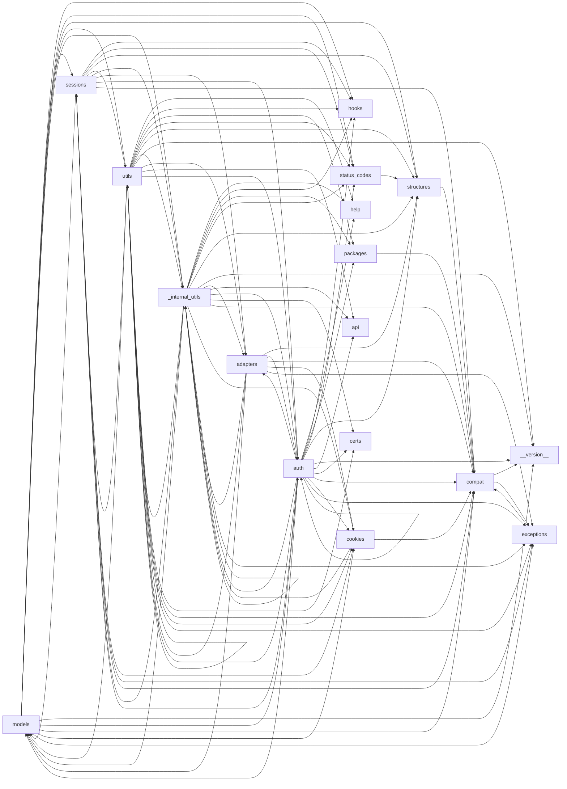

# 📘 REQUESTS: The Complete System Architecture

## 📜 Introduction
Welcome to the official technical reference for **requests**. This book is designed to provide a comprehensive walkthrough of the codebase, from high-level entry points to low-level utility functions. The system consists of 20 core modules, organized by their functional domain.

### How to read this book
Each chapter represents a logical layer of the application. We use **Dependency Architecture Graphs** to show how modules interact. Modules with a high **Impact Score** are critical components that serve as the foundation for the rest of the project.

<div style="page-break-after: always;"></div>

## 📑 Table of Contents
- [Chapter: Core Operations](#chapter-core-operations)
- [Chapter: Docs](#chapter-docs)
- [Chapter: Src](#chapter-src)
- [Conclusion](#conclusion)

<div style="page-break-after: always;"></div>

## Chapter: Core Operations

This chapter explores the **Core Operations** layer. These modules handle the specific logic required for this part of the system's lifecycle.

### 📉 Chapter Dependency Web
```mermaid
graph LR
```

### 📄 Module: `setup.py`
**Description & Role:** This module is a vital part of the `Chapter: Core Operations` layer. 

---

<div style="page-break-after: always;"></div>

## Chapter: Docs

This chapter explores the **Docs** layer. These modules handle the specific logic required for this part of the system's lifecycle.

### 📉 Chapter Dependency Web
```mermaid
graph LR
```

### 📄 Module: `docs/conf.py`
**Description & Role:** This module is a vital part of the `Chapter: Docs` layer. 

---
### 📄 Module: `docs/_themes/flask_theme_support.py`
**Description & Role:** This module is a vital part of the `Chapter: Docs` layer. 

#### 🏛️ Architectural Classes
##### `FlaskyStyle`
_This component is waiting for detailed documentation._

---

<div style="page-break-after: always;"></div>

## Chapter: Src

This chapter explores the **Src** layer. These modules handle the specific logic required for this part of the system's lifecycle.

### 📉 Chapter Dependency Web


### 📄 Module: `src/requests/compat.py`
**Description & Role:** This module is a vital part of the `Chapter: Src` layer. It is a **high-traffic core component**, meaning many other parts of the system rely on its stability.

#### ⚙️ Operational Logic (Functions)
##### `_resolve_char_detection`
Find supported character detection libraries.

---
### 📄 Module: `src/requests/exceptions.py`
**Description & Role:** This module is a vital part of the `Chapter: Src` layer. It is a **high-traffic core component**, meaning many other parts of the system rely on its stability.

#### 🏛️ Architectural Classes
##### `UnrewindableBodyError`
Requests encountered an error when trying to rewind a body.

##### `RequestsWarning`
Base warning for Requests.

##### `FileModeWarning`
A file was opened in text mode, but Requests determined its binary length.

##### `RequestsDependencyWarning`
An imported dependency doesn't match the expected version range.

##### `RequestException`
There was an ambiguous exception that occurred while handling your request.

##### `InvalidJSONError`
A JSON error occurred.

##### `JSONDecodeError`
Couldn't decode the text into json

##### `HTTPError`
An HTTP error occurred.

##### `ConnectionError`
A Connection error occurred.

##### `ProxyError`
A proxy error occurred.

##### `SSLError`
An SSL error occurred.

##### `Timeout`
The request timed out. Catching this error will catch both :exc:`~requests.exceptions.ConnectTimeout` and :exc:`~requests.exceptions.ReadTimeout` errors.

##### `ConnectTimeout`
The request timed out while trying to connect to the remote server. Requests that produced this error are safe to retry.

##### `ReadTimeout`
The server did not send any data in the allotted amount of time.

##### `URLRequired`
A valid URL is required to make a request.

##### `TooManyRedirects`
Too many redirects.

##### `MissingSchema`
The URL scheme (e.g. http or https) is missing.

##### `InvalidSchema`
The URL scheme provided is either invalid or unsupported.

##### `InvalidURL`
The URL provided was somehow invalid.

##### `InvalidHeader`
The header value provided was somehow invalid.

##### `InvalidProxyURL`
The proxy URL provided is invalid.

##### `ChunkedEncodingError`
The server declared chunked encoding but sent an invalid chunk.

##### `ContentDecodingError`
Failed to decode response content.

##### `StreamConsumedError`
The content for this response was already consumed.

##### `RetryError`
Custom retries logic failed

---
### 📄 Module: `src/requests/structures.py`
**Description & Role:** This module is a vital part of the `Chapter: Src` layer. It is a **high-traffic core component**, meaning many other parts of the system rely on its stability.

#### 🏛️ Architectural Classes
##### `CaseInsensitiveDict`
A case-insensitive ``dict``-like object. Implements all methods and operations of ``MutableMapping`` as well as dict's ``copy``. Also provides ``lower_items``. All keys are expected to be strings. The structure remembers the case of the last key to be set, and ``iter(instance)``, ``keys()``, ``items()``, ``iterkeys()``, and ``iteritems()`` will contain case-sensitive keys. However, querying and contains testing is case insensitive:: cid = CaseInsensitiveDict() cid['Accept'] = 'application/json' cid['aCCEPT'] == 'application/json'  # True list(cid) == ['Accept']  # True For example, ``headers['content-encoding']`` will return the value of a ``'Content-Encoding'`` response header, regardless of how the header name was originally stored. If the constructor, ``.update``, or equality comparison operations are given keys that have equal ``.lower()``s, the behavior is undefined.

##### `LookupDict`
Dictionary lookup object.

---
### 📄 Module: `src/requests/sessions.py`
**Description & Role:** This module is a vital part of the `Chapter: Src` layer. It is a **high-traffic core component**, meaning many other parts of the system rely on its stability.

#### 🏛️ Architectural Classes
##### `SessionRedirectMixin`
_This component is waiting for detailed documentation._

##### `Session`
A Requests session. Provides cookie persistence, connection-pooling, and configuration. Basic Usage:: >>> import requests >>> s = requests.Session() >>> s.get('https://httpbin.org/get') <Response [200]> Or as a context manager:: >>> with requests.Session() as s: ...     s.get('https://httpbin.org/get') <Response [200]>

#### ⚙️ Operational Logic (Functions)
##### `merge_setting`
Determines appropriate setting for a given request, taking into account the explicit setting on that request, and the setting in the session. If a setting is a dictionary, they will be merged together using `dict_class`

##### `merge_hooks`
Properly merges both requests and session hooks. This is necessary because when request_hooks == {'response': []}, the merge breaks Session hooks entirely.

##### `session`
Returns a :class:`Session` for context-management. .. deprecated:: 1.0.0 This method has been deprecated since version 1.0.0 and is only kept for backwards compatibility. New code should use :class:`~requests.sessions.Session` to create a session. This may be removed at a future date. :rtype: Session

---
### 📄 Module: `src/requests/_internal_utils.py`
**Description & Role:** This module is a vital part of the `Chapter: Src` layer. It is a **high-traffic core component**, meaning many other parts of the system rely on its stability.

#### ⚙️ Operational Logic (Functions)
##### `to_native_string`
Given a string object, regardless of type, returns a representation of that string in the native string type, encoding and decoding where necessary. This assumes ASCII unless told otherwise.

##### `unicode_is_ascii`
Determine if unicode string only contains ASCII characters. unicode string to check. Must be unicode and not Python 2 `str`. :rtype: bool

---
### 📄 Module: `src/requests/__version__.py`
**Description & Role:** This module is a vital part of the `Chapter: Src` layer. It is a **high-traffic core component**, meaning many other parts of the system rely on its stability.

---
### 📄 Module: `src/requests/auth.py`
**Description & Role:** This module is a vital part of the `Chapter: Src` layer. It is a **high-traffic core component**, meaning many other parts of the system rely on its stability.

#### 🏛️ Architectural Classes
##### `AuthBase`
Base class that all auth implementations derive from

##### `HTTPBasicAuth`
Attaches HTTP Basic Authentication to the given Request object.

##### `HTTPProxyAuth`
Attaches HTTP Proxy Authentication to a given Request object.

##### `HTTPDigestAuth`
Attaches HTTP Digest Authentication to the given Request object.

#### ⚙️ Operational Logic (Functions)
##### `_basic_auth_str`
Returns a Basic Auth string.

---
### 📄 Module: `src/requests/cookies.py`
**Description & Role:** This module is a vital part of the `Chapter: Src` layer. It is a **high-traffic core component**, meaning many other parts of the system rely on its stability.

#### 🏛️ Architectural Classes
##### `MockRequest`
Wraps a `requests.Request` to mimic a `urllib2.Request`. The code in `http.cookiejar.CookieJar` expects this interface in order to correctly manage cookie policies, i.e., determine whether a cookie can be set, given the domains of the request and the cookie. The original request object is read-only. The client is responsible for collecting the new headers via `get_new_headers()` and interpreting them appropriately. You probably want `get_cookie_header`, defined below.

##### `MockResponse`
Wraps a `httplib.HTTPMessage` to mimic a `urllib.addinfourl`. ...what? Basically, expose the parsed HTTP headers from the server response the way `http.cookiejar` expects to see them.

##### `CookieConflictError`
There are two cookies that meet the criteria specified in the cookie jar. Use .get and .set and include domain and path args in order to be more specific.

##### `RequestsCookieJar`
Compatibility class; is a http.cookiejar.CookieJar, but exposes a dict interface. This is the CookieJar we create by default for requests and sessions that don't specify one, since some clients may expect response.cookies and session.cookies to support dict operations. Requests does not use the dict interface internally; it's just for compatibility with external client code. All requests code should work out of the box with externally provided instances of ``CookieJar``, e.g. ``LWPCookieJar`` and ``FileCookieJar``. Unlike a regular CookieJar, this class is pickleable. .. warning:: dictionary operations that are normally O(1) may be O(n).

#### ⚙️ Operational Logic (Functions)
##### `extract_cookies_to_jar`
Extract the cookies from the response into a CookieJar. http.cookiejar.CookieJar (not necessarily a RequestsCookieJar) our own requests.Request object urllib3.HTTPResponse object

##### `get_cookie_header`
Produce an appropriate Cookie header string to be sent with `request`, or None. :rtype: str

##### `remove_cookie_by_name`
Unsets a cookie by name, by default over all domains and paths. Wraps CookieJar.clear(), is O(n).

##### `_copy_cookie_jar`
_This component is waiting for detailed documentation._

##### `create_cookie`
Make a cookie from underspecified parameters. By default, the pair of `name` and `value` will be set for the domain '' and sent on every request (this is sometimes called a "supercookie").

##### `morsel_to_cookie`
Convert a Morsel object into a Cookie containing the one k/v pair.

##### `cookiejar_from_dict`
Returns a CookieJar from a key/value dictionary. Dict of key/values to insert into CookieJar. (optional) A cookiejar to add the cookies to. (optional) If False, will not replace cookies already in the jar with new ones. :rtype: CookieJar

##### `merge_cookies`
Add cookies to cookiejar and returns a merged CookieJar. CookieJar object to add the cookies to. Dictionary or CookieJar object to be added. :rtype: CookieJar

---
### 📄 Module: `src/requests/models.py`
**Description & Role:** This module is a vital part of the `Chapter: Src` layer. It is a **high-traffic core component**, meaning many other parts of the system rely on its stability.

#### 🏛️ Architectural Classes
##### `RequestEncodingMixin`
_This component is waiting for detailed documentation._

##### `RequestHooksMixin`
_This component is waiting for detailed documentation._

##### `Request`
A user-created :class:`Request <Request>` object. Used to prepare a :class:`PreparedRequest <PreparedRequest>`, which is sent to the server. HTTP method to use. URL to send. dictionary of headers to send. dictionary of {filename: fileobject} files to multipart upload. the body to attach to the request. If a dictionary or list of tuples ``[(key, value)]`` is provided, form-encoding will take place. json for the body to attach to the request (if files or data is not specified). URL parameters to append to the URL. If a dictionary or list of tuples ``[(key, value)]`` is provided, form-encoding will take place. Auth handler or (user, pass) tuple. dictionary or CookieJar of cookies to attach to this request. dictionary of callback hooks, for internal usage. Usage:: >>> import requests >>> req = requests.Request('GET', 'https://httpbin.org/get') >>> req.prepare() <PreparedRequest [GET]>

##### `PreparedRequest`
The fully mutable :class:`PreparedRequest <PreparedRequest>` object, containing the exact bytes that will be sent to the server. Instances are generated from a :class:`Request <Request>` object, and should not be instantiated manually; doing so may produce undesirable effects. Usage:: >>> import requests >>> req = requests.Request('GET', 'https://httpbin.org/get') >>> r = req.prepare() >>> r <PreparedRequest [GET]> >>> s = requests.Session() >>> s.send(r) <Response [200]>

##### `Response`
The :class:`Response <Response>` object, which contains a server's response to an HTTP request.

---
### 📄 Module: `src/requests/status_codes.py`
**Description & Role:** This module is a vital part of the `Chapter: Src` layer. It is a **high-traffic core component**, meaning many other parts of the system rely on its stability.

#### ⚙️ Operational Logic (Functions)
##### `_init`
_This component is waiting for detailed documentation._

---
### 📄 Module: `src/requests/utils.py`
**Description & Role:** This module is a vital part of the `Chapter: Src` layer. It is a **high-traffic core component**, meaning many other parts of the system rely on its stability.

#### ⚙️ Operational Logic (Functions)
##### `dict_to_sequence`
Returns an internal sequence dictionary update.

##### `super_len`
_This component is waiting for detailed documentation._

##### `get_netrc_auth`
Returns the Requests tuple auth for a given url from netrc.

##### `guess_filename`
Tries to guess the filename of the given object.

##### `extract_zipped_paths`
Replace nonexistent paths that look like they refer to a member of a zip archive with the location of an extracted copy of the target, or else just return the provided path unchanged.

##### `atomic_open`
Write a file to the disk in an atomic fashion

##### `from_key_val_list`
Take an object and test to see if it can be represented as a dictionary. Unless it can not be represented as such, return an OrderedDict, e.g., :: >>> from_key_val_list([('key', 'val')]) OrderedDict([('key', 'val')]) >>> from_key_val_list('string') Traceback (most recent call last): ... ValueError: cannot encode objects that are not 2-tuples >>> from_key_val_list({'key': 'val'}) OrderedDict([('key', 'val')]) :rtype: OrderedDict

##### `to_key_val_list`
Take an object and test to see if it can be represented as a dictionary. If it can be, return a list of tuples, e.g., :: >>> to_key_val_list([('key', 'val')]) [('key', 'val')] >>> to_key_val_list({'key': 'val'}) [('key', 'val')] >>> to_key_val_list('string') Traceback (most recent call last): ... ValueError: cannot encode objects that are not 2-tuples :rtype: list

##### `parse_list_header`
Parse lists as described by RFC 2068 Section 2. In particular, parse comma-separated lists where the elements of the list may include quoted-strings.  A quoted-string could contain a comma.  A non-quoted string could have quotes in the middle.  Quotes are removed automatically after parsing. It basically works like :func:`parse_set_header` just that items may appear multiple times and case sensitivity is preserved. The return value is a standard :class:`list`: >>> parse_list_header('token, "quoted value"') ['token', 'quoted value'] To create a header from the :class:`list` again, use the :func:`dump_header` function. a string with a list header. :return: :class:`list` :rtype: list

##### `parse_dict_header`
Parse lists of key, value pairs as described by RFC 2068 Section 2 and convert them into a python dict: >>> d = parse_dict_header('foo="is a fish", bar="as well"') >>> type(d) is dict True >>> sorted(d.items()) [('bar', 'as well'), ('foo', 'is a fish')] If there is no value for a key it will be `None`: >>> parse_dict_header('key_without_value') {'key_without_value': None} To create a header from the :class:`dict` again, use the :func:`dump_header` function. a string with a dict header. :return: :class:`dict` :rtype: dict

##### `unquote_header_value`
Unquotes a header value.  (Reversal of :func:`quote_header_value`). This does not use the real unquoting but what browsers are actually using for quoting. the header value to unquote. :rtype: str

##### `dict_from_cookiejar`
Returns a key/value dictionary from a CookieJar. CookieJar object to extract cookies from. :rtype: dict

##### `add_dict_to_cookiejar`
Returns a CookieJar from a key/value dictionary. CookieJar to insert cookies into. Dict of key/values to insert into CookieJar. :rtype: CookieJar

##### `get_encodings_from_content`
Returns encodings from given content string. bytestring to extract encodings from.

##### `_parse_content_type_header`
Returns content type and parameters from given header string :return: tuple containing content type and dictionary of parameters

##### `get_encoding_from_headers`
Returns encodings from given HTTP Header Dict. dictionary to extract encoding from. :rtype: str

##### `stream_decode_response_unicode`
Stream decodes an iterator.

##### `iter_slices`
Iterate over slices of a string.

##### `get_unicode_from_response`
Returns the requested content back in unicode. Response object to get unicode content from. Tried: 1. charset from content-type 2. fall back and replace all unicode characters :rtype: str

##### `unquote_unreserved`
Un-escape any percent-escape sequences in a URI that are unreserved characters. This leaves all reserved, illegal and non-ASCII bytes encoded. :rtype: str

##### `requote_uri`
Re-quote the given URI. This function passes the given URI through an unquote/quote cycle to ensure that it is fully and consistently quoted. :rtype: str

##### `address_in_network`
This function allows you to check if an IP belongs to a network subnet Example: returns True if ip = 192.168.1.1 and net = 192.168.1.0/24 returns False if ip = 192.168.1.1 and net = 192.168.100.0/24 :rtype: bool

##### `dotted_netmask`
Converts mask from /xx format to xxx.xxx.xxx.xxx Example: if mask is 24 function returns 255.255.255.0 :rtype: str

##### `is_ipv4_address`
:rtype: bool

##### `is_valid_cidr`
Very simple check of the cidr format in no_proxy variable. :rtype: bool

##### `set_environ`
Set the environment variable 'env_name' to 'value' Save previous value, yield, and then restore the previous value stored in the environment variable 'env_name'. If 'value' is None, do nothing

##### `should_bypass_proxies`
Returns whether we should bypass proxies or not. :rtype: bool

##### `get_environ_proxies`
Return a dict of environment proxies. :rtype: dict

##### `select_proxy`
Select a proxy for the url, if applicable. The url being for the request A dictionary of schemes or schemes and hosts to proxy URLs

##### `resolve_proxies`
This method takes proxy information from a request and configuration input to resolve a mapping of target proxies. This will consider settings such as NO_PROXY to strip proxy configurations. Request or PreparedRequest A dictionary of schemes or schemes and hosts to proxy URLs Boolean declaring whether to trust environment configs :rtype: dict

##### `default_user_agent`
Return a string representing the default user agent. :rtype: str

##### `default_headers`
:rtype: requests.structures.CaseInsensitiveDict

##### `parse_header_links`
Return a list of parsed link headers proxies. i.e. Link: <http:/.../front.jpeg>; rel=front; type="image/jpeg",<http://.../back.jpeg>; rel=back;type="image/jpeg" :rtype: list

##### `guess_json_utf`
:rtype: str

##### `prepend_scheme_if_needed`
Given a URL that may or may not have a scheme, prepend the given scheme. Does not replace a present scheme with the one provided as an argument. :rtype: str

##### `get_auth_from_url`
Given a url with authentication components, extract them into a tuple of username,password. :rtype: (str,str)

##### `check_header_validity`
Verifies that header parts don't contain leading whitespace reserved characters, or return characters. tuple, in the format (name, value).

##### `_validate_header_part`
_This component is waiting for detailed documentation._

##### `urldefragauth`
Given a url remove the fragment and the authentication part. :rtype: str

##### `rewind_body`
Move file pointer back to its recorded starting position so it can be read again on redirect.

---
### 📄 Module: `src/requests/hooks.py`
**Description & Role:** This module is a vital part of the `Chapter: Src` layer. It is a **high-traffic core component**, meaning many other parts of the system rely on its stability.

#### ⚙️ Operational Logic (Functions)
##### `default_hooks`
_This component is waiting for detailed documentation._

##### `dispatch_hook`
Dispatches a hook dictionary on a given piece of data.

---
### 📄 Module: `src/requests/adapters.py`
**Description & Role:** This module is a vital part of the `Chapter: Src` layer. It is a **high-traffic core component**, meaning many other parts of the system rely on its stability.

#### 🏛️ Architectural Classes
##### `BaseAdapter`
The Base Transport Adapter

##### `HTTPAdapter`
The built-in HTTP Adapter for urllib3. Provides a general-case interface for Requests sessions to contact HTTP and HTTPS urls by implementing the Transport Adapter interface. This class will usually be created by the :class:`Session <Session>` class under the covers. The number of urllib3 connection pools to cache. The maximum number of connections to save in the pool. The maximum number of retries each connection should attempt. Note, this applies only to failed DNS lookups, socket connections and connection timeouts, never to requests where data has made it to the server. By default, Requests does not retry failed connections. If you need granular control over the conditions under which we retry a request, import urllib3's ``Retry`` class and pass that instead. Whether the connection pool should block for connections. Usage:: >>> import requests >>> s = requests.Session() >>> a = requests.adapters.HTTPAdapter(max_retries=3) >>> s.mount('http://', a)

#### ⚙️ Operational Logic (Functions)
##### `_urllib3_request_context`
_This component is waiting for detailed documentation._

---
### 📄 Module: `src/requests/api.py`
**Description & Role:** This module is a vital part of the `Chapter: Src` layer. It is a **high-traffic core component**, meaning many other parts of the system rely on its stability.

#### ⚙️ Operational Logic (Functions)
##### `request`
Constructs and sends a :class:`Request <Request>`. method for the new :class:`Request` object: ``GET``, ``OPTIONS``, ``HEAD``, ``POST``, ``PUT``, ``PATCH``, or ``DELETE``. URL for the new :class:`Request` object. (optional) Dictionary, list of tuples or bytes to send in the query string for the :class:`Request`. (optional) Dictionary, list of tuples, bytes, or file-like object to send in the body of the :class:`Request`. (optional) A JSON serializable Python object to send in the body of the :class:`Request`. (optional) Dictionary of HTTP Headers to send with the :class:`Request`. (optional) Dict or CookieJar object to send with the :class:`Request`. (optional) Dictionary of ``'name': file-like-objects`` (or ``{'name': file-tuple}``) for multipart encoding upload. ``file-tuple`` can be a 2-tuple ``('filename', fileobj)``, 3-tuple ``('filename', fileobj, 'content_type')`` or a 4-tuple ``('filename', fileobj, 'content_type', custom_headers)``, where ``'content_type'`` is a string defining the content type of the given file and ``custom_headers`` a dict-like object containing additional headers to add for the file. (optional) Auth tuple to enable Basic/Digest/Custom HTTP Auth. (optional) How many seconds to wait for the server to send data before giving up, as a float, or a :ref:`(connect timeout, read timeout) <timeouts>` tuple. float or tuple (optional) Boolean. Enable/disable GET/OPTIONS/POST/PUT/PATCH/DELETE/HEAD redirection. Defaults to ``True``. bool (optional) Dictionary mapping protocol to the URL of the proxy. (optional) Either a boolean, in which case it controls whether we verify the server's TLS certificate, or a string, in which case it must be a path to a CA bundle to use. Defaults to ``True``. (optional) if ``False``, the response content will be immediately downloaded. (optional) if String, path to ssl client cert file (.pem). If Tuple, ('cert', 'key') pair. :return: :class:`Response <Response>` object :rtype: requests.Response Usage:: >>> import requests >>> req = requests.request('GET', 'https://httpbin.org/get') >>> req <Response [200]>

##### `get`
Sends a GET request. URL for the new :class:`Request` object. (optional) Dictionary, list of tuples or bytes to send in the query string for the :class:`Request`. Optional arguments that ``request`` takes. :return: :class:`Response <Response>` object :rtype: requests.Response

##### `options`
Sends an OPTIONS request. URL for the new :class:`Request` object. Optional arguments that ``request`` takes. :return: :class:`Response <Response>` object :rtype: requests.Response

##### `head`
Sends a HEAD request. URL for the new :class:`Request` object. Optional arguments that ``request`` takes. If `allow_redirects` is not provided, it will be set to `False` (as opposed to the default :meth:`request` behavior). :return: :class:`Response <Response>` object :rtype: requests.Response

##### `post`
Sends a POST request. URL for the new :class:`Request` object. (optional) Dictionary, list of tuples, bytes, or file-like object to send in the body of the :class:`Request`. (optional) A JSON serializable Python object to send in the body of the :class:`Request`. Optional arguments that ``request`` takes. :return: :class:`Response <Response>` object :rtype: requests.Response

##### `put`
Sends a PUT request. URL for the new :class:`Request` object. (optional) Dictionary, list of tuples, bytes, or file-like object to send in the body of the :class:`Request`. (optional) A JSON serializable Python object to send in the body of the :class:`Request`. Optional arguments that ``request`` takes. :return: :class:`Response <Response>` object :rtype: requests.Response

##### `patch`
Sends a PATCH request. URL for the new :class:`Request` object. (optional) Dictionary, list of tuples, bytes, or file-like object to send in the body of the :class:`Request`. (optional) A JSON serializable Python object to send in the body of the :class:`Request`. Optional arguments that ``request`` takes. :return: :class:`Response <Response>` object :rtype: requests.Response

##### `delete`
Sends a DELETE request. URL for the new :class:`Request` object. Optional arguments that ``request`` takes. :return: :class:`Response <Response>` object :rtype: requests.Response

---
### 📄 Module: `src/requests/help.py`
**Description & Role:** This module is a vital part of the `Chapter: Src` layer. It is a **high-traffic core component**, meaning many other parts of the system rely on its stability.

#### ⚙️ Operational Logic (Functions)
##### `_implementation`
Return a dict with the Python implementation and version. Provide both the name and the version of the Python implementation currently running. For example, on CPython 3.10.3 it will return {'name': 'CPython', 'version': '3.10.3'}. This function works best on CPython and PyPy: in particular, it probably doesn't work for Jython or IronPython. Future investigation should be done to work out the correct shape of the code for those platforms.

##### `info`
Generate information for a bug report.

##### `main`
Pretty-print the bug information as JSON.

---
### 📄 Module: `src/requests/packages.py`
**Description & Role:** This module is a vital part of the `Chapter: Src` layer. It is a **high-traffic core component**, meaning many other parts of the system rely on its stability.

---
### 📄 Module: `src/requests/certs.py`
**Description & Role:** This module is a vital part of the `Chapter: Src` layer. It is a **high-traffic core component**, meaning many other parts of the system rely on its stability.

---

<div style="page-break-after: always;"></div>

## 🏁 Conclusion
This concludes the technical walkthrough of **requests**. By analyzing the dependencies and module definitions, we can see a clear separation of concerns across the codebase. The architecture is designed for scalability, with core logic isolated from supporting utilities.

### Next Steps for Developers
1. Review the high-impact modules identified in each chapter.
2. Follow the dependency graphs to understand data flow.
3. Ensure all new classes follow the established documentation patterns found in this manual.
