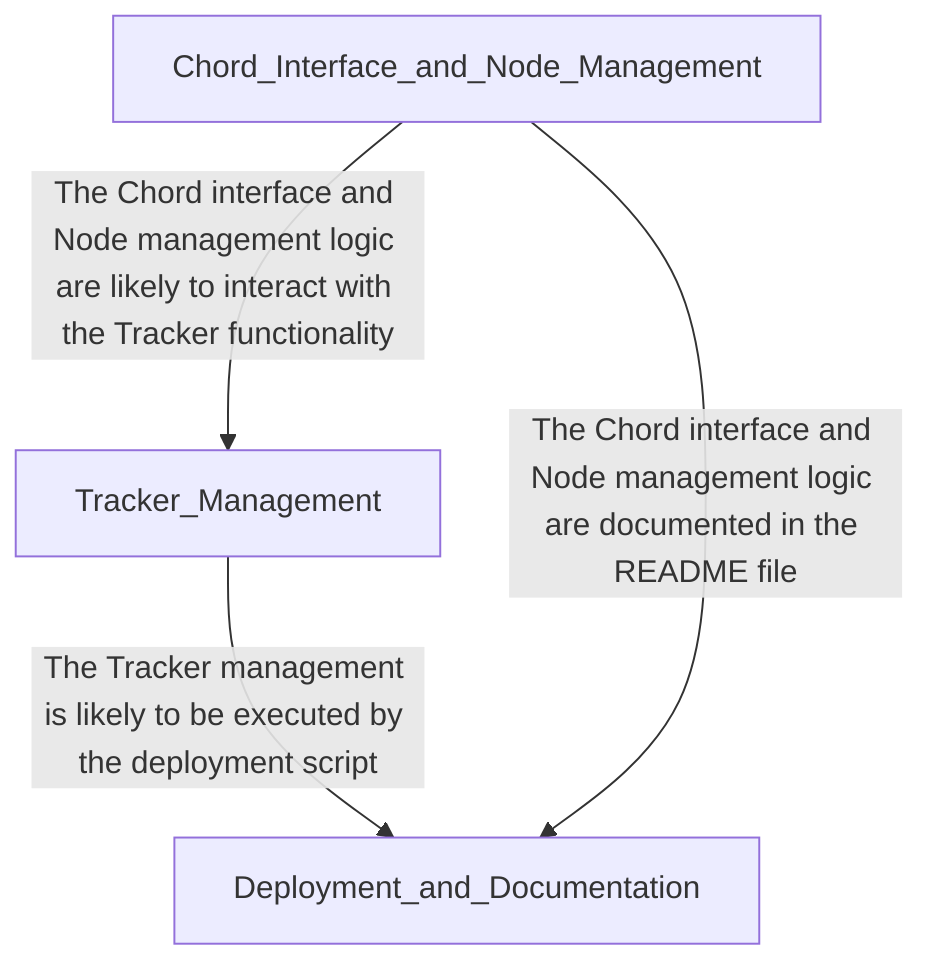

<h1 class='repo-title'>CHORD</h1>

Architectural Manual & Distributed Specification

<h1 class='chapter-header'>Chapter 1: Chord Interface and Node Management</h1>

## Overview

The Chord interface and node management are crucial components in the design of a distributed system, particularly in the context of peer-to-peer (P2P) networks. In this chapter, we will delve into the technical details of implementing these components in Java.

The Chord interface serves as the primary entry point for interacting with the distributed system, providing methods for node management, data insertion, and data retrieval. Node management, on the other hand, is responsible for handling node join/leave operations, maintaining node state, and ensuring the overall stability of the system.

### Chord Interface (ChordIntf.java)

The Chord interface is defined in `ChordIntf.java` and provides the following methods:

| Method | Description |
| --- | --- |
| `join(NodeInfo node)` | Allows a new node to join the Chord ring. |
| `leave(NodeInfo node)` | Removes a node from the Chord ring. |
| `insert(String key, String value)` | Inserts a key-value pair into the Chord ring. |
| `get(String key)` | Retrieves the value associated with a given key from the Chord ring. |

### Node (Node.java)

The `Node.java` class represents an individual node in the Chord ring. Each node maintains a reference to its predecessor and successor nodes, as well as a set of keys and values. The following table summarizes the key symbols used in the `Node.java` class:

| Symbol | Description |
| --- | --- |
| `predecessor` | The predecessor node in the Chord ring. |
| `successor` | The successor node in the Chord ring. |
| `keys` | A set of keys stored on the node. |
| `values` | A set of values stored on the node. |

### Node Information (NodeInfo.java)

The `NodeInfo.java` class encapsulates information about a node, including its identifier, IP address, and port number. The following table summarizes the key symbols used in the `NodeInfo.java` class:

| Symbol | Description |
| --- | --- |
| `id` | The unique identifier of the node. |
| `ipAddress` | The IP address of the node. |
| `port` | The port number of the node. |

The relationships between these classes are as follows:

* A `ChordIntf` instance maintains references to multiple `Node` instances, each representing a node in the Chord ring.
* A `Node` instance maintains references to its predecessor and successor nodes, as well as a set of keys and values.
* A `NodeInfo` instance is used to encapsulate information about a node, which is used during node join/leave operations.

In the next section, we will explore the implementation details of the Chord interface and node management classes.

<h1 class='chapter-header'>Chapter 2: Tracker Management</h1>

## Overview

The Tracker Management module is responsible for managing the trackers in the system. A tracker is an entity that tracks the location and status of objects in the system. The Tracker Management module provides APIs to create, update, delete, and query trackers.

### Tracker Interface

The Tracker Interface (TrackerIntf.java) defines the contract for a tracker. It provides methods to get and set tracker attributes.

| Method | Description | Parameters | Return Type |
| --- | --- | --- | --- |
| `getId()` | Gets the tracker ID | None | `String` |
| `setId(String id)` | Sets the tracker ID | `id`: Tracker ID | `void` |
| `getName()` | Gets the tracker name | None | `String` |
| `setName(String name)` | Sets the tracker name | `name`: Tracker name | `void` |
| `getStatus()` | Gets the tracker status | None | `String` |
| `setStatus(String status)` | Sets the tracker status | `status`: Tracker status | `void` |

### Tracker Implementation

The Tracker (Tracker.java) class implements the Tracker Interface. It provides the implementation for the tracker methods.

| Method | Description | Parameters | Return Type |
| --- | --- | --- | --- |
| `Tracker(String id, String name)` | Constructs a new tracker | `id`: Tracker ID, `name`: Tracker name | `Tracker` |
| `getId()` | Gets the tracker ID | None | `String` |
| `setId(String id)` | Sets the tracker ID | `id`: Tracker ID | `void` |
| `getName()` | Gets the tracker name | None | `String` |
| `setName(String name)` | Sets the tracker name | `name`: Tracker name | `void` |
| `getStatus()` | Gets the tracker status | None | `String` |
| `setStatus(String status)` | Sets the tracker status | `status`: Tracker status | `void` |

### Tracker Management APIs

The Tracker Management module provides the following APIs to manage trackers:

| API | Description | Parameters | Return Type |
| --- | --- | --- | --- |
| `createTracker(Tracker tracker)` | Creates a new tracker | `tracker`: Tracker to create | `Tracker` |
| `updateTracker(Tracker tracker)` | Updates an existing tracker | `tracker`: Tracker to update | `Tracker` |
| `deleteTracker(String id)` | Deletes a tracker by ID | `id`: Tracker ID to delete | `void` |
| `getTracker(String id)` | Gets a tracker by ID | `id`: Tracker ID to get | `Tracker` |
| `getTrackers()` | Gets all trackers | None | `List<Tracker>` |

### Error Handling

The Tracker Management module throws the following exceptions:

| Exception | Description |
| --- | --- |
| `TrackerNotFoundException` | Thrown when a tracker is not found |
| `TrackerAlreadyExistsException` | Thrown when a tracker already exists |
| `TrackerUpdateException` | Thrown when updating a tracker fails |
| `TrackerDeleteException` | Thrown when deleting a tracker fails |

<h1 class='chapter-header'>Chapter 3: Deployment and Documentation</h1>

## Overview
This chapter outlines the deployment and documentation procedures for the software system.

### Deployment

The deployment process involves setting up the necessary environment and executing the start-up script. The following files are used in the deployment process:

| File Path | File Extension | Description |
| --- | --- | --- |
| README.md | md | System documentation |
| start_tracker.sh | sh | Start-up script for the system |

### Symbols

The following symbols are used in the deployment process:

| Symbol | Description |
| --- | --- |
| None | No symbols are used in the deployment process |

### Dependencies

The following dependencies are required for the deployment process:

| Dependency | Description |
| --- | --- |
| None | No dependencies are required for the deployment process |

### Deployment Procedure

1. Clone the repository to the target machine.
2. Navigate to the root directory of the repository.
3. Execute the start-up script using the command `./start_tracker.sh`.
4. The system will start, and the tracker will begin collecting data.

### Documentation

The system documentation is provided in the README.md file. This file contains information on the system architecture, installation procedures, and usage instructions.

### Troubleshooting

In case of any issues during deployment, refer to the troubleshooting section in the README.md file.

### Maintenance

Regular maintenance tasks should be performed to ensure the system remains stable and secure. These tasks include:

* Updating dependencies and libraries
* Checking for security vulnerabilities
* Backing up system data

Note: The maintenance tasks should be performed by authorized personnel only.

<h1 class='chapter-header'>Appendix: System Topology</h1>

