<style>
                .page-break { page-break-before: always; }
                .cover-page {
                    text-align: center;
                    padding-top: 250px;
                    padding-bottom: 250px;
                    font-family: sans-serif;
                }
                .repo-title {
                    font-size: 80px;
                    font-weight: 900;
                    margin: 0;
                    color: #1a1a1a;
                    text-transform: uppercase;
                    line-height: 1;
                }
                .repo-subtitle {
                    font-size: 24px;
                    color: #666;
                    margin-top: 10px;
                    letter-spacing: 2px;
                }
                .repo-meta {
                    margin-top: 50px;
                    font-size: 16px;
                    color: #888;
                }
            </style>

<div class='cover-page'>

<h1 class='repo-title'>HTTPIE</h1>
<p class='repo-subtitle'>Engineering Specification & Architectural Manual</p>
<div class='repo-meta'>
<p>CONFIDENTIAL | INTERNAL ENGINEERING USE ONLY</p>
<p>Generated: 2026-02-21</p>
</div>
</div>

<div class="page-break"></div>

## 1. Architectural Blueprint

**Chapter 1: Architectural Blueprint**

**System Topology**

The system is comprised of multiple Python modules, each serving a specific purpose. The modules are organized into several packages, including `httpie`, `httpie.cli`, `httpie.manager`, `httpie.output`, and `httpie.plugins`. The system also includes various utility modules and test files.

**Core Orchestration Pattern**

The core orchestration pattern in this system is the **Command-Line Interface (CLI) Pattern**. The CLI pattern is used to define a set of commands and subcommands that can be executed from the command line. The `httpie.cli` package contains the core CLI logic, including the `argparser` module, which defines the command-line arguments and options.

The CLI pattern is used in conjunction with the **Facade Pattern**, which provides a unified interface to the system's functionality. The `httpie.manager` package acts as a facade, providing a high-level interface to the system's features.

**Primary Entry Point**

The primary entry point of the system is the `httpie/manager/cli.py` module. This module defines the main CLI entry point, which is responsible for parsing command-line arguments and dispatching the corresponding commands.

The `httpie/manager/cli.py` module has a downstream impact on the following modules:

* `httpie/cli/argparser.py`: This module defines the command-line arguments and options.
* `httpie/manager/core.py`: This module provides the core logic for dispatching commands.
* `httpie/output/models.py`: This module defines the output models for the system.

The `httpie/manager/cli.py` module is also dependent on several other modules, including `httpie/cli/utils.py`, `httpie/internal/daemons.py`, and `httpie/internal/update_warnings.py`.

**Downstream Impact**

The downstream impact of the `httpie/manager/cli.py` module is significant, as it affects the entire system's functionality. The module's dependencies and the modules it depends on are critical to the system's operation.

The `httpie/cli/argparser.py` module, for example, is responsible for defining the command-line arguments and options. If this module is modified, it could impact the entire system's functionality.

Similarly, the `httpie/manager/core.py` module provides the core logic for dispatching commands. If this module is modified, it could impact the system's ability to execute commands correctly.

In conclusion, the `httpie/manager/cli.py` module is the primary entry point of the system, and its downstream impact is significant. The module's dependencies and the modules it depends on are critical to the system's operation, and any modifications to these modules could have a significant impact on the system's functionality.


<div class="page-break"></div>

## 2. Networking and Protocols

**Chapter 2: Networking and Protocols**

### 2.1 HTTP Adapters

HTTPie utilizes a modular design for its HTTP adapters, allowing for easy extension and customization. The `HTTPieHTTPAdapter` class, defined in `httpie/adapters.py`, serves as the base adapter for all HTTP requests.

*   The `HTTPieHTTPAdapter` class inherits from `requests.adapters.HTTPAdapter` and overrides the `send` method to handle HTTPie-specific features, such as request retries and SSL verification.
*   The adapter also implements the `build_response` method, which constructs an HTTP response object from the raw response data.

### 2.2 SSL/TLS Implementation

HTTPie's SSL/TLS implementation is handled by the `HTTPieHTTPSAdapter` class, defined in `httpie/ssl_.py`. This adapter extends the `HTTPieHTTPAdapter` class and provides additional functionality for SSL/TLS connections.

*   The `HTTPieHTTPSAdapter` class overrides the `send` method to handle SSL/TLS-specific features, such as certificate verification and key file encryption.
*   The adapter also implements the `_is_key_file_encrypted` method, which checks if a key file is encrypted and returns a boolean value indicating the result.

### 2.3 Request Body Preparation

HTTPie's request body preparation is handled by the `prepare_request_body` function, defined in `httpie/uploads.py`. This function takes a request object and prepares the request body for transmission.

*   The `prepare_request_body` function checks if the request body is a file or a string and prepares it accordingly.
*   If the request body is a file, the function uses the `_prepare_file_for_upload` method to read the file contents and prepare the request body.
*   If the request body is a string, the function uses the `as_bytes` method to convert the string to bytes and prepare the request body.

### 2.4 Multipart Uploads

HTTPie's multipart upload implementation is handled by the `get_multipart_data_and_content_type` function, defined in `httpie/uploads.py`. This function takes a request object and prepares the multipart data and content type for transmission.

*   The `get_multipart_data_and_content_type` function checks if the request body is a multipart upload and prepares the data and content type accordingly.
*   If the request body is a multipart upload, the function uses the `ChunkedMultipartUploadStream` class to prepare the data and content type.

### 2.5 Downloading Files

HTTPie's file download implementation is handled by the `Downloader` class, defined in `httpie/downloads.py`. This class provides a simple way to download files from a URL.

*   The `Downloader` class takes a URL and a file path as input and downloads the file from the URL to the specified path.
*   The class also provides a `DownloadStatus` object, which contains information about the download status, such as the total size and the number of bytes downloaded.

### 2.6 HTTPie Certificate

HTTPie's certificate implementation is handled by the `HTTPieCertificate` class, defined in `httpie/ssl_.py`. This class provides a simple way to load and verify certificates.

*   The `HTTPieCertificate` class takes a certificate file path as input and loads the certificate from the file.
*   The class also provides a `verify` method, which checks if the certificate is valid and returns a boolean value indicating the result.

### 2.7 Network Protocols

HTTPie supports multiple network protocols, including HTTP/1.1 and HTTP/2. The protocol implementation is handled by the `HTTPieHTTPAdapter` class, which provides a simple way to send requests over different protocols.

*   The `HTTPieHTTPAdapter` class takes a protocol version as input and sends the request using the specified protocol.
*   The class also provides a `build_response` method, which constructs an HTTP response object from the raw response data.

### 2.8 Connection Pooling

HTTPie uses connection pooling to improve performance and reduce the overhead of establishing new connections. The connection pooling implementation is handled by the `HTTPieHTTPAdapter` class.

*   The `HTTPieHTTPAdapter` class uses a connection pool to manage connections to the server.
*   The class also provides a `close` method, which closes the connection pool and releases any system resources associated with it.

### 2.9 Request Retries

HTTPie provides a request retry mechanism to handle failed requests. The request retry implementation is handled by the `HTTPieHTTPAdapter` class.

*   The `HTTPieHTTPAdapter` class takes a retry count as input and retries the request if it fails.
*   The class also provides a `send` method, which sends the request and retries it if necessary.

### 2.10 Request Timeout

HTTPie provides a request timeout mechanism to handle requests that take too long to complete. The request timeout implementation is handled by the `HTTPieHTTPAdapter` class.

*   The `HTTPieHTTPAdapter` class takes a timeout value as input and raises a timeout exception if the request takes longer than the specified time.
*   The class also provides a `send` method, which sends the request and raises a timeout exception if necessary.


<div class="page-break"></div>

## 3. Data Processing and Formatting

Chapter 3: Data Processing and Formatting
==========================================

### 3.1 Data Processing Overview

The data processing module is responsible for handling and transforming data between different formats, including JSON, XML, and HTTP headers. This module is implemented in `httpie/output/processing.py`.

### 3.2 JSON Data Processing

JSON data processing is handled by the `JSONFormatter` class in `httpie/output/formatters/json.py`. This class provides methods for formatting JSON data, including:

*   `format_json`: Formats JSON data into a human-readable format.
*   `format_json_body`: Formats the body of a JSON response.

The `JSONFormatter` class uses the `EnhancedJsonLexer` class from `httpie/output/lexers/json.py` to lex the JSON data and provide syntax highlighting.

### 3.3 XML Data Processing

XML data processing is handled by the `XMLFormatter` class in `httpie/output/formatters/xml.py`. This class provides methods for formatting XML data, including:

*   `parse_xml`: Parses XML data into a Python object.
*   `pretty_xml`: Formats XML data into a human-readable format.
*   `format_xml_body`: Formats the body of an XML response.

The `XMLFormatter` class uses the `parse_declaration` function to parse the XML declaration and the `parse_xml` function to parse the XML data.

### 3.4 HTTP Header Data Processing

HTTP header data processing is handled by the `HeadersFormatter` class in `httpie/output/formatters/headers.py`. This class provides methods for formatting HTTP headers, including:

*   `format_headers`: Formats HTTP headers into a human-readable format.

### 3.5 Data Conversion

Data conversion between different formats is handled by the `Conversion` class in `httpie/output/processing.py`. This class provides methods for converting data between JSON, XML, and HTTP headers, including:

*   `convert_json_to_xml`: Converts JSON data to XML.
*   `convert_xml_to_json`: Converts XML data to JSON.
*   `convert_headers_to_json`: Converts HTTP headers to JSON.

### 3.6 Data Formatting

Data formatting is handled by the `Formatting` class in `httpie/output/processing.py`. This class provides methods for formatting data into a human-readable format, including:

*   `format_data`: Formats data into a human-readable format.
*   `format_json`: Formats JSON data into a human-readable format.
*   `format_xml`: Formats XML data into a human-readable format.
*   `format_headers`: Formats HTTP headers into a human-readable format.

### 3.7 MIME Type Validation

MIME type validation is handled by the `is_valid_mime` function in `httpie/output/processing.py`. This function checks if a given MIME type is valid and returns a boolean value indicating whether the MIME type is valid or not.

### 3.8 Implementation Details

The data processing module is implemented using a combination of Python classes and functions. The `JSONFormatter`, `XMLFormatter`, and `HeadersFormatter` classes handle the formatting of JSON, XML, and HTTP headers, respectively. The `Conversion` class handles data conversion between different formats, and the `Formatting` class handles data formatting into a human-readable format. The `is_valid_mime` function handles MIME type validation.

The data processing module uses a variety of dependencies, including `httpie/cli/nested_json/interpret.py`, `httpie/manager/core.py`, `httpie/manager/tasks/plugins.py`, `httpie/output/streams.py`, `httpie/output/ui/rich_progress.py`, `httpie/plugins/base.py`, `httpie/plugins/builtin.py`, `httpie/plugins/manager.py`, `httpie/plugins/registry.py`, and `httpie/plugins/__init__.py`.

The data processing module is tested using a variety of test cases, including `tests/test_auth_plugins.py`, `tests/test_compress.py`, `tests/test_cookie_on_redirects.py`, `tests/test_plugins_cli.py`, `tests/test_redirects.py`, `tests/test_regressions.py`, `tests/test_stream.py`, and `tests/utils/plugins_cli.py`.

### 3.9 Conclusion

In conclusion, the data processing module is a critical component of the HTTPie tool, responsible for handling and transforming data between different formats. The module is implemented using a combination of Python classes and functions and uses a variety of dependencies to handle data conversion, formatting, and MIME type validation. The module is tested using a variety of test cases to ensure its correctness and reliability.


<div class="page-break"></div>

## 4. Authentication and Authorization

**Chapter 4: Authentication and Authorization**

### 4.1 Overview

HTTPie provides a robust authentication and authorization system, allowing users to authenticate with various methods, including Basic Auth, Digest Auth, and Bearer Auth. This chapter delves into the implementation details of the authentication and authorization mechanisms in HTTPie.

### 4.2 Authentication Plugins

HTTPie uses a plugin-based architecture to handle authentication. The `httpie.plugins.base` module defines the base classes for authentication plugins, including `AuthPlugin`, `TransportPlugin`, `ConverterPlugin`, and `FormatterPlugin`. These classes provide a common interface for implementing different authentication mechanisms.

The `httpie.plugins.builtin` module contains built-in authentication plugins, including:

* `BuiltinAuthPlugin`: A base class for built-in authentication plugins.
* `HTTPBasicAuth`: Implements Basic Auth authentication.
* `HTTPBearerAuth`: Implements Bearer Auth authentication.
* `BasicAuthPlugin`: Implements Basic Auth authentication using a plugin.
* `DigestAuthPlugin`: Implements Digest Auth authentication using a plugin.
* `BearerAuthPlugin`: Implements Bearer Auth authentication using a plugin.

### 4.3 Authentication Credentials

HTTPie uses the `httpie.cli.argtypes` module to handle authentication credentials. The `AuthCredentials` class represents a pair of authentication credentials, including a username and password. The `AuthCredentialsArgType` class is used to parse authentication credentials from the command line.

### 4.4 Authentication Mechanisms

HTTPie supports several authentication mechanisms, including:

* Basic Auth: Implemented using the `HTTPBasicAuth` class.
* Digest Auth: Implemented using the `DigestAuthPlugin` class.
* Bearer Auth: Implemented using the `HTTPBearerAuth` class.

### 4.5 Authorization

HTTPie does not provide explicit authorization mechanisms. Instead, it relies on the authentication mechanisms to authorize requests. Once a user is authenticated, they are authorized to make requests to the server.

### 4.6 Implementation Details

The authentication and authorization mechanisms in HTTPie are implemented using a combination of plugin-based architecture and command-line argument parsing.

When a user runs HTTPie with authentication credentials, the `AuthCredentialsArgType` class parses the credentials from the command line. The `AuthPlugin` class then uses these credentials to authenticate the user with the server.

The `httpie.plugins.builtin` module contains the implementation details of the built-in authentication plugins. Each plugin class implements the `authenticate` method, which takes the authentication credentials as input and returns an authenticated session object.

The `httpie.cli.options` module defines the command-line options for authentication, including the `--auth` option. The `httpie.cli.argparser` module parses the command-line options and creates an instance of the `AuthCredentials` class.

### 4.7 Code Examples

The following code examples illustrate the implementation details of the authentication and authorization mechanisms in HTTPie:

```python
# httpie/plugins/base.py
class AuthPlugin:
    def authenticate(self, credentials):
        # Implement authentication logic here
        pass

# httpie/plugins/builtin.py
class HTTPBasicAuth(AuthPlugin):
    def authenticate(self, credentials):
        # Implement Basic Auth authentication logic here
        pass

# httpie/cli/argtypes.py
class AuthCredentials:
    def __init__(self, username, password):
        self.username = username
        self.password = password

class AuthCredentialsArgType:
    def __call__(self, value):
        # Parse authentication credentials from the command line
        pass

# httpie/cli/options.py
class ParserSpec:
    def __init__(self):
        self.options = [
            # Define command-line options for authentication
            Argument('--auth', type=AuthCredentialsArgType()),
        ]

# httpie/cli/argparser.py
def parse_args(args):
    # Parse command-line options and create an instance of the AuthCredentials class
    pass
```

### 4.8 Conclusion

In conclusion, HTTPie provides a robust authentication and authorization system using a plugin-based architecture and command-line argument parsing. The implementation details of the authentication and authorization mechanisms are discussed in this chapter, including the use of authentication plugins, authentication credentials, and authorization mechanisms. The code examples provided illustrate the implementation details of the authentication and authorization mechanisms in HTTPie.


<div class="page-break"></div>

## 5. Configuration and Settings

**Chapter 5: Configuration and Settings**

### 5.1 Configuration File

The configuration file is stored in the default configuration directory, which can be obtained using the `get_default_config_dir` function from `httpie/config.py`. The configuration file is a JSON file that stores the user's preferences and settings.

#### 5.1.1 Configuration File Structure

The configuration file has the following structure:
```json
{
    "default_options": {
        "output": "json",
        "indent": 4,
        "sort_keys": true
    },
    "sessions": {
        "default": {
            "headers": {
                "User-Agent": "HTTPie/3.2.1"
            },
            "cookies": {
                "session_id": "abc123"
            }
        }
    }
}
```
#### 5.1.2 Reading and Writing the Configuration File

The `read_raw_config` function from `httpie/config.py` reads the configuration file and returns a dictionary containing the configuration data. The `BaseConfigDict` class from `httpie/config.py` provides a dictionary-like interface for accessing and modifying the configuration data.

### 5.2 Configuration Options

The following configuration options are available:

* `output`: The output format, which can be one of `json`, `xml`, or `text`.
* `indent`: The indentation level for JSON output.
* `sort_keys`: A boolean indicating whether to sort keys in JSON output.
* `headers`: A dictionary of default headers to include in requests.
* `cookies`: A dictionary of default cookies to include in requests.

### 5.3 Session Configuration

Session configuration is stored in the `sessions` section of the configuration file. Each session has a unique name and can have its own set of headers and cookies.

#### 5.3.1 Session Upgrades

The `upgrade_session` function from `httpie/manager/tasks/sessions.py` upgrades a session to the latest format. The `cli_upgrade_session` function from `httpie/manager/tasks/sessions.py` upgrades a session from the command line.

### 5.4 Configuration Errors

The `ConfigFileError` exception from `httpie/config.py` is raised when there is an error reading or writing the configuration file.

### 5.5 Compatibility

The `httpie/compat.py` module provides compatibility functions for different Python versions.

### 5.6 Encoding

The `httpie/encoding.py` module provides functions for encoding and decoding data.

### 5.7 JSON Parsing

The `httpie/cli/nested_json` module provides functions for parsing and generating JSON data.

### 5.8 Configuration Directory

The `get_default_config_dir` function from `httpie/config.py` returns the default configuration directory.

### 5.9 Dependencies

The configuration module depends on the following modules:

* `httpie/context.py`
* `httpie/status.py`
* `httpie/cli/argparser.py`
* `httpie/cli/nested_json/errors.py`
* `httpie/cli/nested_json/interpret.py`
* `httpie/cli/nested_json/parse.py`
* `httpie/cli/nested_json/tokens.py`
* `httpie/cli/nested_json/__init__.py`
* `httpie/manager/compat.py`
* `httpie/output/formatters/json.py`
* `httpie/output/lexers/json.py`
* `tests/test_encoding.py`
* `tests/test_json.py`
* `tests/fixtures/test.json`
* `tests/fixtures/test_with_dupe_keys.json`
* `docs/config.json`
* `docs/contributors/people.json`
* `docs/packaging/linux-centos/README.md`

### 5.10 Symbols

The configuration module exports the following symbols:

* `get_default_config_dir`
* `ConfigFileError`
* `read_raw_config`
* `BaseConfigDict`
* `Config`

### 5.11 Internal Functions

The configuration module uses the following internal functions:

* `_check_status`
* `_parse_options`
* `is_daemon_mode`
* `run_daemon_task`
* `cli_check_updates`
* `cli_export_args`
* `cli_sessions`
* `upgrade_session`
* `cli_upgrade_session`
* `cli_upgrade_all_sessions`


<div class="page-break"></div>

## 6. Testing and Development

**Chapter 6: Testing and Development**

### 6.1 Testing Framework

The testing framework used is Pytest, a popular testing framework for Python. The tests are organized into separate files, each containing a set of related tests.

### 6.2 Test Structure

Each test file contains a set of test functions, which are prefixed with the `test_` keyword. These functions contain the test logic and assertions.

### 6.3 Test Fixtures

Test fixtures are used to set up and tear down resources needed for testing. In this implementation, fixtures are used to create temporary files and directories, as well as to start and stop HTTP servers.

### 6.4 Test Dependencies

The tests have dependencies on various modules and packages, including:

* `httpie`: The main package being tested.
* `pytest`: The testing framework.
* `tests/utils`: A module containing utility functions for testing.
* `tests/fixtures`: A module containing fixtures for testing.

### 6.5 Test Implementation

The tests are implemented using a combination of Pytest's built-in assertions and custom assertions. The tests cover a range of scenarios, including:

* Command-line interface (CLI) tests: These tests verify the behavior of the CLI, including parsing of arguments and options.
* HTTP request and response tests: These tests verify the behavior of the HTTP client, including sending requests and parsing responses.
* JSON and XML parsing tests: These tests verify the behavior of the JSON and XML parsers.
* Error handling tests: These tests verify the behavior of the error handling mechanisms.

### 6.6 Test Coverage

The tests aim to cover all aspects of the implementation, including:

* CLI argument and option parsing
* HTTP request and response handling
* JSON and XML parsing
* Error handling

### 6.7 Development Guidelines

To contribute to the development of this project, follow these guidelines:

* Write tests for all new functionality
* Use Pytest as the testing framework
* Follow the existing coding style and conventions
* Use fixtures to set up and tear down resources needed for testing
* Use custom assertions to verify the behavior of the implementation

### 6.8 Code Review

All code changes must undergo a code review before being merged into the main branch. The code review should verify that:

* The code is well-organized and follows the existing coding style and conventions
* The code is well-tested and has adequate test coverage
* The code is free of bugs and errors

### 6.9 Continuous Integration

The project uses continuous integration (CI) to automate the testing and build process. The CI pipeline runs the tests and builds the project on every commit, ensuring that the project is always in a releasable state.

### 6.10 Release Process

The release process involves the following steps:

* Update the version number in the `__init__.py` file
* Run the tests and build the project using the CI pipeline
* Create a release tag and push it to the repository
* Create a release package and upload it to the package repository

By following these guidelines and processes, we can ensure that the project is well-tested, well-maintained, and always in a releasable state.


<div class="page-break"></div>

## Appendix: Module Dependency Graph

```mermaid
graph TD
  httpie_cli_utils_py --> httpie_cli_argparser_py
  tests_test_httpie_cli_py --> tests_utils_matching_tokens_py
  tests_test_httpie_cli_py --> tests_utils_matching___init___py
  tests_utils_matching___init___py --> tests_utils_matching_tokens_py
  tests_utils_matching___init___py --> httpie_cli_nested_json_tokens_py
  httpie_cli_nested_json_errors_py --> tests_utils_matching_tokens_py
  httpie_cli_nested_json_errors_py --> httpie_cli_nested_json_tokens_py
  httpie_cli_nested_json_interpret_py --> tests_utils_matching_tokens_py
  httpie_cli_nested_json_interpret_py --> httpie_cli_nested_json_errors_py
  httpie_cli_nested_json_parse_py --> tests_utils_matching_tokens_py
  httpie_cli_nested_json_parse_py --> httpie_cli_nested_json_errors_py
  httpie_cli_nested_json___init___py --> tests_utils_matching_tokens_py
  httpie_cli_nested_json___init___py --> httpie_cli_nested_json_errors_py
  httpie_internal_daemons_py --> docs_packaging_linux_centos_README_md
  httpie_internal_daemons_py --> httpie_compat_py
  httpie_internal_daemon_runner_py --> httpie_internal_update_warnings_py
  httpie_internal_daemon_runner_py --> httpie_context_py
  httpie_internal_update_warnings_py --> httpie_cli_utils_py
  httpie_internal_update_warnings_py --> tests_test_httpie_cli_py
  httpie_legacy_v3_1_0_session_cookie_format_py --> httpie_sessions_py
  httpie_legacy_v3_1_0_session_cookie_format_py --> httpie_cli_argparser_py
  httpie_legacy_v3_2_0_session_header_format_py --> httpie_sessions_py
  httpie_manager_cli_py --> httpie_cli_utils_py
  httpie_manager_cli_py --> tests_test_httpie_cli_py
  httpie_manager_compat_py --> httpie_compat_py
  httpie_manager_core_py --> httpie_manager_cli_py
  httpie_manager_core_py --> httpie_manager_tasks_check_updates_py
  httpie_manager___main___py --> httpie_manager_cli_py
  httpie_manager___main___py --> httpie_manager_core_py
  httpie_manager_tasks_check_updates_py --> httpie_internal_update_warnings_py
  httpie_manager_tasks_check_updates_py --> httpie_context_py
  httpie_manager_tasks_export_args_py --> httpie_cli_nested_json_errors_py
  httpie_manager_tasks_export_args_py --> httpie_cli_nested_json_interpret_py
  httpie_manager_tasks_plugins_py --> httpie_cli_nested_json_interpret_py
  httpie_manager_tasks_plugins_py --> httpie_manager_cli_py
  httpie_manager_tasks_sessions_py --> httpie_legacy_v3_1_0_session_cookie_format_py
  httpie_manager_tasks_sessions_py --> httpie_legacy_v3_2_0_session_header_format_py
  httpie_manager_tasks___init___py --> httpie_manager_tasks_check_updates_py
  httpie_manager_tasks___init___py --> httpie_manager_tasks_export_args_py
  httpie_output_models_py --> httpie_output_formatters_colors_py
  httpie_output_models_py --> httpie_context_py
  httpie_output_processing_py --> httpie_cli_nested_json_interpret_py
  httpie_output_processing_py --> httpie_manager_core_py
  httpie_output_streams_py --> httpie_cli_utils_py
  httpie_output_streams_py --> tests_utils_matching_tokens_py
  httpie_output_utils_py --> httpie_cli_utils_py
  httpie_output_utils_py --> tests_utils_matching_tokens_py
  httpie_output_writer_py --> httpie_cli_utils_py
  httpie_output_writer_py --> tests_utils_matching_tokens_py
  httpie_output_formatters_colors_py --> httpie_cli_nested_json_errors_py
  httpie_output_formatters_colors_py --> httpie_cli_nested_json_interpret_py
  httpie_output_formatters_headers_py --> httpie_manager_tasks_plugins_py
  httpie_output_formatters_headers_py --> httpie_plugins_base_py
  httpie_output_formatters_json_py --> httpie_cli_utils_py
  httpie_output_formatters_json_py --> tests_utils_matching_tokens_py
  httpie_output_formatters_xml_py --> httpie_manager_tasks_plugins_py
  httpie_output_formatters_xml_py --> httpie_plugins_base_py
  httpie_output_lexers_http_py --> httpie_cli_nested_json_interpret_py
  httpie_output_lexers_http_py --> httpie_manager_core_py
  httpie_output_lexers_json_py --> httpie_cli_nested_json_interpret_py
  httpie_output_lexers_json_py --> httpie_manager_core_py
  httpie_output_lexers_metadata_py --> httpie_output_lexers_common_py
  httpie_output_lexers_metadata_py --> httpie_models_py
  httpie_output_ui_man_pages_py --> docs_packaging_linux_centos_README_md
  httpie_output_ui_man_pages_py --> httpie_context_py
  httpie_output_ui_rich_help_py --> httpie_cli_nested_json_interpret_py
  httpie_output_ui_rich_help_py --> httpie_manager_core_py
  httpie_output_ui_rich_palette_py --> httpie_output_ui_palette_py
  httpie_output_ui_rich_progress_py --> httpie_output_ui_rich_help_py
  httpie_output_ui_rich_progress_py --> httpie_output_ui_rich_palette_py
  httpie_output_ui_rich_utils_py --> httpie_output_ui_rich_palette_py
  httpie_output_ui_rich_utils_py --> docs_packaging_linux_centos_README_md
  httpie_plugins_builtin_py --> httpie_plugins_base_py
  httpie_plugins_manager_py --> httpie_cli_utils_py
  httpie_plugins_manager_py --> tests_utils_matching_tokens_py
  httpie_plugins_registry_py --> httpie_manager_cli_py
  httpie_plugins_registry_py --> httpie_manager_compat_py
  httpie_plugins___init___py --> httpie_plugins_base_py
  tests_conftest_py --> httpie_cli_utils_py
  tests_conftest_py --> tests_utils_matching_tokens_py
  tests_test_auth_py --> httpie_cli_utils_py
  tests_test_auth_py --> tests_utils_matching_tokens_py
  tests_test_auth_plugins_py --> httpie_cli_utils_py
  tests_test_auth_plugins_py --> tests_utils_matching_tokens_py
  tests_test_binary_py --> httpie_cli_utils_py
  tests_test_binary_py --> tests_utils_matching_tokens_py
  tests_test_cli_py --> httpie_cli_utils_py
  tests_test_cli_py --> tests_utils_matching_tokens_py
  tests_test_cli_ui_py --> tests_utils_matching_tokens_py
  tests_test_cli_ui_py --> tests_utils_matching___init___py
  tests_test_cli_utils_py --> httpie_cli_utils_py
  tests_test_cli_utils_py --> pytest_ini
  tests_test_compress_py --> httpie_cli_utils_py
  tests_test_compress_py --> tests_utils_matching_tokens_py
  tests_test_config_py --> httpie_cli_utils_py
  tests_test_config_py --> tests_utils_matching_tokens_py
  tests_test_cookie_py --> httpie_cli_utils_py
  tests_test_cookie_py --> tests_utils_matching_tokens_py
  tests_test_cookie_on_redirects_py --> httpie_cli_utils_py
  tests_test_cookie_on_redirects_py --> tests_utils_matching_tokens_py
  tests_test_defaults_py --> httpie_cli_utils_py
  tests_test_defaults_py --> tests_utils_matching_tokens_py
  tests_test_downloads_py --> httpie_cli_utils_py
  tests_test_downloads_py --> tests_utils_matching_tokens_py
  tests_test_encoding_py --> httpie_cli_utils_py
  tests_test_encoding_py --> tests_utils_matching_tokens_py
  tests_test_errors_py --> httpie_cli_utils_py
  tests_test_errors_py --> tests_utils_matching_tokens_py
  tests_test_exit_status_py --> httpie_cli_utils_py
  tests_test_exit_status_py --> tests_utils_matching_tokens_py
  tests_test_httpie_py --> httpie_cli_utils_py
  tests_test_httpie_py --> tests_test_httpie_cli_py
  tests_test_json_py --> httpie_cli_utils_py
  tests_test_json_py --> tests_utils_matching_tokens_py
  tests_test_meta_py --> httpie_cli_utils_py
  tests_test_meta_py --> tests_utils_matching_tokens_py
  tests_test_offline_py --> httpie_cli_utils_py
  tests_test_offline_py --> tests_utils_matching_tokens_py
  tests_test_output_py --> httpie_cli_utils_py
  tests_test_output_py --> tests_utils_matching_tokens_py
  tests_test_parser_schema_py --> httpie_cli_options_py
  tests_test_plugins_cli_py --> tests_utils_plugins_cli_py
  tests_test_plugins_cli_py --> pytest_ini
  tests_test_redirects_py --> httpie_cli_utils_py
  tests_test_redirects_py --> tests_utils_matching_tokens_py
  tests_test_regressions_py --> httpie_cli_utils_py
  tests_test_regressions_py --> tests_utils_matching_tokens_py
  tests_test_sessions_py --> httpie_cli_utils_py
  tests_test_sessions_py --> tests_utils_matching_tokens_py
  tests_test_ssl_py --> httpie_cli_utils_py
  tests_test_ssl_py --> tests_utils_matching_tokens_py
  tests_test_stream_py --> httpie_cli_utils_py
  tests_test_stream_py --> tests_utils_matching_tokens_py
  tests_test_tokens_py --> httpie_cli_utils_py
  tests_test_tokens_py --> tests_utils_matching_tokens_py
  tests_test_transport_plugin_py --> httpie_cli_utils_py
  tests_test_transport_plugin_py --> tests_utils_matching_tokens_py
  tests_test_update_warnings_py --> httpie_cli_utils_py
  tests_test_update_warnings_py --> tests_utils_matching_tokens_py
  tests_test_uploads_py --> httpie_cli_utils_py
  tests_test_uploads_py --> tests_utils_matching_tokens_py
  tests_test_windows_py --> httpie_cli_utils_py
  tests_test_windows_py --> tests_utils_matching_tokens_py
  tests_test_xml_py --> httpie_cli_utils_py
  tests_test_xml_py --> tests_utils_matching_tokens_py
  tests_fixtures___init___py --> httpie_cli_utils_py
  tests_fixtures___init___py --> tests_test_httpie_cli_py
  tests_utils_http_server_py --> httpie_cli_utils_py
  tests_utils_http_server_py --> tests_test_httpie_cli_py
  tests_utils_plugins_cli_py --> tests_utils_matching_tokens_py
  tests_utils_plugins_cli_py --> tests_utils_matching___init___py
  tests_utils___init___py --> httpie_cli_nested_json_errors_py
  tests_utils___init___py --> httpie_cli_nested_json_interpret_py
  tests_utils_matching_parsing_py --> httpie_cli_utils_py
  tests_utils_matching_parsing_py --> tests_utils_matching_tokens_py
  tests_utils_matching_test_matching_py --> httpie_cli_utils_py
  tests_utils_matching_test_matching_py --> tests_utils_matching_tokens_py
  docs_contributors_fetch_py --> httpie_cli_nested_json_errors_py
  docs_contributors_fetch_py --> httpie_cli_nested_json_interpret_py
  docs_contributors_generate_py --> docs_contributors_fetch_py
  docs_contributors_generate_py --> docs_contributors_snippet_jinja2
  docs_installation_generate_py --> httpie_cli_nested_json_interpret_py
  docs_installation_generate_py --> httpie_manager_core_py
  extras_packaging_linux_build_py --> httpie_cli_utils_py
  extras_packaging_linux_build_py --> tests_test_httpie_cli_py
  extras_packaging_linux_scripts_httpie_cli_py --> httpie_manager___main___py
  extras_packaging_linux_scripts_http_cli_py --> httpie___main___py
  extras_profiling_benchmarks_py --> docs_packaging_linux_centos_README_md
  extras_profiling_run_py --> httpie_cli_argparser_py
  extras_scripts_generate_man_pages_py --> httpie_cli_utils_py
  extras_scripts_generate_man_pages_py --> tests_test_httpie_cli_py
  httpie_adapters_py --> httpie_cli_dicts_py
  httpie_client_py --> httpie_cli_utils_py
  httpie_client_py --> tests_utils_matching_tokens_py
  httpie_compat_py --> httpie_cli_utils_py
  httpie_compat_py --> tests_test_httpie_cli_py
  httpie_config_py --> httpie_cli_nested_json_errors_py
  httpie_config_py --> httpie_cli_nested_json_interpret_py
  httpie_context_py --> httpie_cli_utils_py
  httpie_context_py --> tests_utils_matching_tokens_py
  httpie_cookies_py --> httpie_cli_utils_py
  httpie_cookies_py --> tests_test_httpie_cli_py
  httpie_core_py --> httpie_cli_utils_py
  httpie_core_py --> tests_utils_matching_tokens_py
  httpie_downloads_py --> httpie_cli_nested_json_interpret_py
  httpie_downloads_py --> httpie_manager_core_py
  httpie_models_py --> httpie_cli_utils_py
  httpie_models_py --> tests_utils_matching_tokens_py
  httpie_sessions_py --> httpie_cli_utils_py
  httpie_sessions_py --> tests_utils_matching_tokens_py
  httpie_ssl__py --> httpie_manager_compat_py
  httpie_ssl__py --> tests_test_ssl_py
  httpie_uploads_py --> httpie_manager_compat_py
  httpie_uploads_py --> docs_packaging_linux_centos_README_md
  httpie_utils_py --> httpie_cli_nested_json_errors_py
  httpie_utils_py --> httpie_cli_nested_json_interpret_py
  httpie___main___py --> httpie_core_py
  httpie___main___py --> httpie_status_py
  httpie_cli_argparser_py --> httpie_cli_utils_py
  httpie_cli_argparser_py --> tests_utils_matching_tokens_py
  httpie_cli_argtypes_py --> httpie_manager_tasks_sessions_py
  httpie_cli_argtypes_py --> tests_test_sessions_py
  httpie_cli_constants_py --> httpie_cli_nested_json_interpret_py
  httpie_cli_constants_py --> httpie_manager_core_py
  httpie_cli_definition_py --> httpie_cli_utils_py
  httpie_cli_definition_py --> tests_test_httpie_cli_py
  httpie_cli_options_py --> httpie_cli_utils_py
  httpie_cli_options_py --> httpie_cli_argparser_py
  httpie_cli_requestitems_py --> httpie_cli_utils_py
  httpie_cli_requestitems_py --> tests_utils_matching_tokens_py
```


