<style>
                body { font-family: 'Inter', sans-serif; color: #1a1a1a; line-height: 1.7; }
                .page-break { page-break-before: always; }
                .cover-page { text-align: center; padding: 250px 0; border: 10px solid #f0f0f0; }
                .repo-title { font-size: 80px; font-weight: 900; margin: 0; }
                h1.chapter-header { font-size: 36px; border-bottom: 3px solid #000; padding-bottom: 10px; text-transform: uppercase; }
                h2 { color: #2c3e50; border-left: 5px solid #3498db; padding-left: 10px; margin-top: 30px; }
                table { width: 100%; border-collapse: collapse; margin: 20px 0; }
                th, td { border: 1px solid #ddd; padding: 12px; text-align: left; }
                th { background-color: #f8f9fa; }
            </style>

<div class='cover-page'>
<h1 class='repo-title'>HTTPIE</h1>
<p style='font-size:24px;'>Architectural Manual & Distributed Specification</p>
</div>

<div class="page-break"></div>

<h1 class='chapter-header'>Chapter 1: Core Functionality</h1>

## Overview
The core functionality of HTTPie is comprised of several key components, including the client, core, models, and status modules. These components work together to provide the foundation for HTTPie's features and functionality.

### Client Module
The client module (`httpie/client.py`) contains the following symbols:

| Symbol | Description |
| --- | --- |
| `collect_messages` | Collects messages from the request and response. |
| `max_headers` | Returns the maximum number of headers allowed. |
| `build_requests_session` | Builds a requests session object. |
| `dump_request` | Dumps the request to the console. |
| `finalize_headers` | Finalizes the headers for the request. |
| `transform_headers` | Transforms the headers for the request. |
| `apply_missing_repeated_headers` | Applies missing repeated headers. |
| `make_default_headers` | Makes default headers for the request. |
| `make_send_kwargs` | Makes send kwargs for the request. |
| `make_send_kwargs_mergeable_from_env` | Makes send kwargs mergeable from the environment. |
| `json_dict_to_request_body` | Converts a JSON dict to a request body. |
| `make_request_kwargs` | Makes request kwargs. |
| `ensure_path_as_is` | Ensures the path is as-is. |

### Core Module
The core module (`httpie/core.py`) contains the following symbols:

| Symbol | Description |
| --- | --- |
| `raw_main` | The raw main function. |
| `main` | The main function. |
| `program` | The program function. |
| `print_debug_info` | Prints debug information. |
| `decode_raw_args` | Decodes raw arguments. |

### Models Module
The models module (`httpie/models.py`) contains the following symbols:

| Symbol | Description |
| --- | --- |
| `HTTPMessage` | Represents an HTTP message. |
| `HTTPResponse` | Represents an HTTP response. |
| `HTTPRequest` | Represents an HTTP request. |
| `RequestsMessageKind` | Represents the kind of requests message. |
| `infer_requests_message_kind` | Infers the requests message kind. |
| `OutputOptions` | Represents output options. |

### Status Module
The status module (`httpie/status.py`) contains the following symbols:

| Symbol | Description |
| --- | --- |
| `ExitStatus` | Represents the exit status. |
| `http_status_to_exit_status` | Converts an HTTP status to an exit status. |

These modules and symbols work together to provide the core functionality of HTTPie, including building and sending requests, handling responses, and providing output options.


<div class="page-break"></div>

<h1 class='chapter-header'>Chapter 2: Input/Output Handling</h1>

## Overview
The input/output handling is a critical component of the HTTPie tool. It is responsible for formatting and parsing data in various formats, including JSON and XML. The following sections provide a detailed overview of the input/output handling mechanisms.

## Symbols
The following table lists the symbols used in the input/output handling mechanisms.

| Symbol | Description |
| --- | --- |
| `JSONFormatter` | Formats data in JSON format. |
| `XMLFormatter` | Formats data in XML format. |
| `EnhancedJsonLexer` | Lexes JSON data with enhanced capabilities. |
| `SimplifiedHTTPLexer` | Lexes HTTP data in a simplified manner. |
| `http_response_type` | Represents the type of HTTP response. |
| `request_method` | Represents the HTTP request method. |
| `parse_xml` | Parses XML data. |
| `parse_declaration` | Parses XML declarations. |
| `pretty_xml` | Pretty-prints XML data. |

## Input Handling
The input handling mechanism is responsible for reading data from various sources, including standard input, files, and network connections. The following table lists the input handling functions.

| Function | Description |
| --- | --- |
| `read_from_stdin` | Reads data from standard input. |
| `read_from_file` | Reads data from a file. |
| `read_from_network` | Reads data from a network connection. |

## Output Handling
The output handling mechanism is responsible for writing data to various destinations, including standard output, files, and network connections. The following table lists the output handling functions.

| Function | Description |
| --- | --- |
| `write_to_stdout` | Writes data to standard output. |
| `write_to_file` | Writes data to a file. |
| `write_to_network` | Writes data to a network connection. |

## JSON Formatter
The JSON formatter is responsible for formatting data in JSON format. The following table lists the JSON formatter functions.

| Function | Description |
| --- | --- |
| `format_json` | Formats data in JSON format. |
| `format_json_array` | Formats an array of data in JSON format. |
| `format_json_object` | Formats an object in JSON format. |

## XML Formatter
The XML formatter is responsible for formatting data in XML format. The following table lists the XML formatter functions.

| Function | Description |
| --- | --- |
| `format_xml` | Formats data in XML format. |
| `format_xml_array` | Formats an array of data in XML format. |
| `format_xml_object` | Formats an object in XML format. |

## Lexers
The lexers are responsible for breaking down data into individual tokens. The following table lists the lexer functions.

| Function | Description |
| --- | --- |
| `lex_json` | Lexes JSON data. |
| `lex_xml` | Lexes XML data. |
| `lex_http` | Lexes HTTP data. |


<div class="page-break"></div>

<h1 class='chapter-header'>Chapter 3: Command-Line Interface</h1>

## Overview
The Command-Line Interface (CLI) is the primary interface for interacting with HTTPie. It provides a powerful and flexible way to send HTTP requests and manipulate the output.

## Symbols

### httpie/cli/argparser.py

| Symbol | Description |
| --- | --- |
| HTTPieHelpFormatter | Custom help formatter for HTTPie |
| BaseHTTPieArgumentParser | Base argument parser for HTTPie |
| HTTPieManagerArgumentParser | Argument parser for HTTPie manager |
| HTTPieArgumentParser | Argument parser for HTTPie |

### httpie/cli/dicts.py

| Symbol | Description |
| --- | --- |
| BaseMultiDict | Base class for multi-value dictionaries |
| HTTPHeadersDict | Dictionary for HTTP headers |
| RequestJSONDataDict | Dictionary for JSON request data |
| MultiValueOrderedDict | Ordered dictionary for multi-value items |
| RequestQueryParamsDict | Dictionary for request query parameters |
| RequestDataDict | Dictionary for request data |
| MultipartRequestDataDict | Dictionary for multipart request data |
| RequestFilesDict | Dictionary for request files |

### httpie/cli/exceptions.py

| Symbol | Description |
| --- | --- |
| ParseError | Exception raised for parsing errors |

### httpie/cli/options.py

| Symbol | Description |
| --- | --- |
| Qualifiers | Enum for qualifiers |
| map_qualifiers | Function to map qualifiers to values |
| drop_keys | Function to drop keys from a dictionary |
| ParserSpec | Class for parser specifications |
| Group | Class for groups |
| Argument | Class for arguments |
| to_argparse | Function to convert parser specification to argparse |
| to_data | Function to convert parser specification to data |
| parser_to_parser_spec | Function to convert parser to parser specification |

## Argument Parsing

Argument parsing is handled by the `HTTPieArgumentParser` class, which inherits from `BaseHTTPieArgumentParser`. The parser uses a custom help formatter, `HTTPieHelpFormatter`, to display help messages.

### Argument Parser Structure

The argument parser is structured as follows:

*   `HTTPieArgumentParser`: The main argument parser for HTTPie.
    *   `HTTPieManagerArgumentParser`: The argument parser for the HTTPie manager.

### Argument Parser Options

The argument parser options are defined in `httpie/cli/options.py`. The options are grouped into the following categories:

*   **Request options**: Options related to the HTTP request, such as `--method`, `--url`, `--headers`, etc.
*   **Output options**: Options related to the output, such as `--output`, `--format`, etc.
*   **Miscellaneous options**: Options that don't fit into the above categories, such as `--help`, `--version`, etc.

## Dictionary Classes

The dictionary classes are defined in `httpie/cli/dicts.py`. The classes are:

*   `BaseMultiDict`: The base class for multi-value dictionaries.
*   `HTTPHeadersDict`: A dictionary for HTTP headers.
*   `RequestJSONDataDict`: A dictionary for JSON request data.
*   `MultiValueOrderedDict`: An ordered dictionary for multi-value items.
*   `RequestQueryParamsDict`: A dictionary for request query parameters.
*   `RequestDataDict`: A dictionary for request data.
*   `MultipartRequestDataDict`: A dictionary for multipart request data.
*   `RequestFilesDict`: A dictionary for request files.

## Exceptions

The exceptions are defined in `httpie/cli/exceptions.py`. The exceptions are:

*   `ParseError`: An exception raised for parsing errors.

## Options

The options are defined in `httpie/cli/options.py`. The options are:

*   `Qualifiers`: An enum for qualifiers.
*   `map_qualifiers`: A function to map qualifiers to values.
*   `drop_keys`: A function to drop keys from a dictionary.
*   `ParserSpec`: A class for parser specifications.
*   `Group`: A class for groups.
*   `Argument`: A class for arguments.
*   `to_argparse`: A function to convert parser specification to argparse.
*   `to_data`: A function to convert parser specification to data.
*   `parser_to_parser_spec`: A function to convert parser to parser specification.


<div class="page-break"></div>

<h1 class='chapter-header'>Chapter 4: Plugin Management</h1>

## Overview

Plugin management is a crucial aspect of the HTTPie framework, allowing users to extend and customize its functionality. This chapter delves into the technical details of plugin management, including the base plugin class, plugin types, and plugin management mechanisms.

### Plugin Base Class

The `BasePlugin` class, defined in `httpie/plugins/base.py`, serves as the foundation for all plugins. It provides a common interface for plugins to interact with the HTTPie framework.

#### Symbols

| Symbol | Description |
| --- | --- |
| `BasePlugin` | The base class for all plugins. |
| `AuthPlugin` | A plugin that handles authentication. |
| `TransportPlugin` | A plugin that handles transportation. |
| `ConverterPlugin` | A plugin that handles data conversion. |
| `FormatterPlugin` | A plugin that handles data formatting. |

### Plugin Types

HTTPie supports various plugin types, each serving a specific purpose. The following plugin types are defined in `httpie/plugins/builtin.py`:

#### Symbols

| Symbol | Description |
| --- | --- |
| `BuiltinAuthPlugin` | A built-in authentication plugin. |
| `HTTPBasicAuth` | A plugin that handles HTTP basic authentication. |
| `HTTPBearerAuth` | A plugin that handles HTTP bearer authentication. |
| `BasicAuthPlugin` | A plugin that handles basic authentication. |
| `DigestAuthPlugin` | A plugin that handles digest authentication. |
| `BearerAuthPlugin` | A plugin that handles bearer authentication. |

### Plugin Management

Plugin management is handled by the `PluginManager` class, defined in `httpie/plugins/manager.py`. This class is responsible for loading, enabling, and managing plugins.

#### Symbols

| Symbol | Description |
| --- | --- |
| `_load_directories` | A function that loads plugins from directories. |
| `enable_plugins` | A function that enables plugins. |
| `PluginManager` | The plugin manager class. |

### Plugin Registry

The plugin registry, defined in `httpie/plugins/registry.py`, is responsible for maintaining a list of available plugins.

#### Dependencies

The plugin registry depends on the following modules:

* `httpie/manager/cli.py`
* `httpie/manager/compat.py`
* `httpie/manager/core.py`
* `httpie/manager/__init__.py`
* `httpie/manager/__main__.py`
* `httpie/manager/tasks/check_updates.py`
* `httpie/manager/tasks/export_args.py`
* `httpie/manager/tasks/plugins.py`
* `httpie/manager/tasks/sessions.py`
* `httpie/manager/tasks/__init__.py`
* `httpie/output/formatters/colors.py`
* `httpie/output/formatters/headers.py`
* `httpie/output/formatters/json.py`
* `httpie/output/formatters/xml.py`
* `httpie/plugins/builtin.py`
* `httpie/plugins/manager.py`

### Plugin Loading

Plugins can be loaded from directories using the `_load_directories` function. This function is responsible for loading plugins from the following directories:

* `httpie/plugins/`
* `httpie/manager/plugins/`

### Plugin Enabling

Plugins can be enabled using the `enable_plugins` function. This function is responsible for enabling plugins based on the following conditions:

* The plugin is loaded.
* The plugin is enabled.

### Plugin Management Mechanisms

The plugin management mechanism is responsible for managing plugins. This mechanism includes the following components:

* Plugin loading.
* Plugin enabling.
* Plugin registry.

### Plugin Dependencies

Plugins can depend on other plugins or modules. The following plugins have dependencies:

* `httpie/plugins/registry.py`: depends on `httpie/manager/cli.py`, `httpie/manager/compat.py`, `httpie/manager/core.py`, `httpie/manager/__init__.py`, `httpie/manager/__main__.py`, `httpie/manager/tasks/check_updates.py`, `httpie/manager/tasks/export_args.py`, `httpie/manager/tasks/plugins.py`, `httpie/manager/tasks/sessions.py`, `httpie/manager/tasks/__init__.py`, `httpie/output/formatters/colors.py`, `httpie/output/formatters/headers.py`, `httpie/output/formatters/json.py`, `httpie/output/formatters/xml.py`, `httpie/plugins/builtin.py`, `httpie/plugins/manager.py`.
* `httpie/plugins/builtin.py`: depends on `httpie/plugins/base.py`.

### Plugin In-Degree and Out-Degree

Plugins have in-degree and out-degree values, which represent the number of plugins that depend on them and the number of plugins they depend on, respectively. The following plugins have in-degree and out-degree values:

* `httpie/plugins/registry.py`: in-degree 36, out-degree 16.
* `httpie/plugins/builtin.py`: in-degree 21, out-degree 1.
* `httpie/plugins/manager.py`: in-degree 22, out-degree 18.
* `httpie/plugins/base.py`: in-degree 22, out-degree 0.


<div class="page-break"></div>

<h1 class='chapter-header'>Chapter 5: Session and Cookie Management</h1>

## Overview

This chapter describes the session and cookie management in HTTPie.

### Session Management

HTTPie uses a concept of sessions to store and manage cookies, headers, and other settings across multiple requests. A session is a collection of settings that can be used to make requests to a specific host.

### Cookie Management

Cookies are small pieces of data that are sent by a server to a client and stored on the client's device. They are used to identify the client and store information about the client's interactions with the server.

## Symbols

The following symbols are used in this chapter:

| Symbol | Description |
| --- | --- |
| `HTTPieCookiePolicy` | The cookie policy used by HTTPie. |
| `is_anonymous_session` | A function that checks if a session is anonymous. |
| `session_hostname_to_dirname` | A function that converts a hostname to a directory name. |
| `strip_port` | A function that removes the port from a hostname. |
| `materialize_cookie` | A function that materializes a cookie from a dictionary. |
| `materialize_cookies` | A function that materializes a list of cookies from a dictionary. |
| `materialize_headers` | A function that materializes a list of headers from a dictionary. |
| `get_httpie_session` | A function that gets an HTTPie session. |
| `Session` | A class that represents an HTTPie session. |

## Session and Cookie Management Functions

The following functions are used to manage sessions and cookies:

| Function | Description |
| --- | --- |
| `get_httpie_session` | Gets an HTTPie session. |
| `is_anonymous_session` | Checks if a session is anonymous. |
| `session_hostname_to_dirname` | Converts a hostname to a directory name. |
| `strip_port` | Removes the port from a hostname. |
| `materialize_cookie` | Materializes a cookie from a dictionary. |
| `materialize_cookies` | Materializes a list of cookies from a dictionary. |
| `materialize_headers` | Materializes a list of headers from a dictionary. |

## Session and Cookie Management Classes

The following classes are used to manage sessions and cookies:

| Class | Description |
| --- | --- |
| `Session` | Represents an HTTPie session. |
| `HTTPieCookiePolicy` | Represents the cookie policy used by HTTPie. |

## Cookie Policy

The cookie policy used by HTTPie is represented by the `HTTPieCookiePolicy` class. This class defines the rules for accepting and rejecting cookies.

## Session Management

Sessions are managed using the `Session` class. This class provides methods for getting and setting session settings, such as cookies and headers.

## Cookie Management

Cookies are managed using the `materialize_cookie`, `materialize_cookies`, and `materialize_headers` functions. These functions materialize cookies and headers from dictionaries.

## Example Usage

The following example shows how to use the `Session` class to manage a session:
```python
from httpie import Session

# Create a new session
session = Session()

# Set a cookie
session.cookies['foo'] = 'bar'

# Set a header
session.headers['X-Foo'] = 'Bar'

# Make a request using the session
response = session.get('https://example.com')
```
This example creates a new session, sets a cookie and a header, and makes a request using the session.


<div class="page-break"></div>

<h1 class='chapter-header'>Chapter 6: Testing Framework</h1>

## Overview
The testing framework for HTTPie consists of several components, including test fixtures, test utilities, and test cases. The framework is designed to ensure that HTTPie is thoroughly tested and validated to work correctly in various scenarios.

## Test Fixtures
The test fixtures are located in the `tests/fixtures` directory and include various files and directories used to test HTTPie's functionality. The fixtures include:

| Fixture | Description |
| --- | --- |
| `test.bin` | A binary file used to test HTTPie's handling of binary data |
| `test.json` | A JSON file used to test HTTPie's handling of JSON data |
| `test.txt` | A text file used to test HTTPie's handling of text data |
| `test_with_dupe_keys.json` | A JSON file with duplicate keys used to test HTTPie's handling of JSON data with duplicate keys |
| `session_data` | A directory containing session data used to test HTTPie's session management |
| `xmldata` | A directory containing XML data used to test HTTPie's handling of XML data |

## Test Utilities
The test utilities are located in the `tests/utils` directory and include various functions and classes used to test HTTPie's functionality. The utilities include:

| Utility | Description |
| --- | --- |
| `http_server.py` | A Python script that sets up an HTTP server used to test HTTPie's functionality |
| `plugins_cli.py` | A Python script that tests HTTPie's plugin functionality |
| `matching` | A directory containing utilities used to test HTTPie's matching functionality |

### `http_server.py` Symbols

| Symbol | Description |
| --- | --- |
| `TestHandler` | A class that handles HTTP requests and responses |
| `get_headers` | A function that returns the headers of an HTTP request |
| `chunked_drip` | A function that simulates a chunked HTTP response |
| `random_encoding` | A function that generates a random encoding for an HTTP response |
| `status_custom_msg` | A function that returns a custom status message for an HTTP response |
| `get_cookies` | A function that returns the cookies of an HTTP request |
| `set_cookies` | A function that sets the cookies of an HTTP response |
| `set_cookie_and_redirect` | A function that sets a cookie and redirects the HTTP response |
| `_http_server` | A function that sets up an HTTP server |
| `http_server` | A function that sets up an HTTP server |
| `localhost_http_server` | A function that sets up an HTTP server on localhost |

### `matching/parsing.py` Symbols

| Symbol | Description |
| --- | --- |
| `make_headers_re` | A function that creates a regular expression for matching HTTP headers |
| `OutputMatchingError` | A class that represents an error in matching HTTP output |
| `expect_tokens` | A function that expects a list of tokens in an HTTP response |
| `expect_token` | A function that expects a single token in an HTTP response |
| `expect_regex` | A function that expects a regular expression to match an HTTP response |
| `expect_body` | A function that expects a specific body in an HTTP response |

## Test Cases
The test cases are located in the `tests` directory and include various test files used to test HTTPie's functionality. The test cases include:

| Test Case | Description |
| --- | --- |
| `test_httpie.py` | A test file that tests HTTPie's functionality |
| `test_httpie_cli.py` | A test file that tests HTTPie's command-line interface |
| `test_json.py` | A test file that tests HTTPie's handling of JSON data |
| `test_compress.py` | A test file that tests HTTPie's handling of compressed data |
| `test_cookie_on_redirects.py` | A test file that tests HTTPie's handling of cookies on redirects |
| `test_redirects.py` | A test file that tests HTTPie's handling of redirects |
| `test_regressions.py` | A test file that tests HTTPie's regressions |
| `test_stream.py` | A test file that tests HTTPie's handling of streaming data |
| `test_tokens.py` | A test file that tests HTTPie's handling of tokens |


<div class="page-break"></div>

<h1 class='chapter-header'>Chapter 7: Documentation and Packaging</h1>

## Overview

This chapter provides an overview of the documentation and packaging process for the HTTPie project. It includes information on generating documentation, building packages, and packaging for various platforms.

### Generating Documentation

The `generate.py` script in the `docs/installation` directory is responsible for generating the documentation for HTTPie. The script uses the `jinja2` templating engine to generate the documentation from templates.

#### Symbols

| Symbol | Description |
| --- | --- |
| `generate_documentation` | Generates the documentation for HTTPie. |
| `save_doc_file` | Saves the generated documentation to a file. |
| `build_docs_structure` | Builds the directory structure for the documentation. |
| `clean_template_output` | Cleans up the output of the template engine. |
| `load_database` | Loads the database of documentation templates. |
| `load_doc_file` | Loads a documentation file from disk. |
| `main` | The main entry point of the `generate.py` script. |

### Building Packages

The `build.py` script in the `extras/packaging/linux` directory is responsible for building packages for HTTPie. The script uses various tools such as `snapcraft` and `brew` to build packages for different platforms.

#### Symbols

| Symbol | Description |
| --- | --- |
| `build_binaries` | Builds the binaries for HTTPie. |
| `build_packages` | Builds the packages for HTTPie. |
| `main` | The main entry point of the `build.py` script. |

### Packaging for Various Platforms

HTTPie is packaged for various platforms, including Linux, macOS, and Windows. The packaging process involves creating packages in various formats, such as `.deb`, `.rpm`, and `.exe`.

#### Linux Packaging

The `httpie.spec.txt` file in the `docs/packaging/linux-fedora` directory contains the specification for building the HTTPie package on Linux.

#### macOS Packaging

The `httpie.rb` file in the `docs/packaging/brew` directory contains the specification for building the HTTPie package on macOS using Homebrew.

#### Windows Packaging

The `httpie.nuspec` file in the `docs/packaging/windows-chocolatey` directory contains the specification for building the HTTPie package on Windows using Chocolatey.

### Dependencies

The following dependencies are required for building and packaging HTTPie:

* `jinja2` for generating documentation
* `snapcraft` for building Linux packages
* `brew` for building macOS packages
* `chocolatey` for building Windows packages

### In-Degree and Out-Degree

The following tables show the in-degree and out-degree of the various files and directories in the HTTPie project:

| File/Directory | In-Degree | Out-Degree |
| --- | --- | --- |
| `generate.py` | 5 | 75 |
| `build.py` | 0 | 90 |
| `httpie.rb` | 25 | 0 |
| `httpie.spec.txt` | 0 | 0 |
| `httpie.nuspec` | 0 | 0 |

Note: The in-degree and out-degree values are based on the provided context and may not be accurate.

```mermaid
graph TD
  update_warnings_py -->|imports| config_json
  update_warnings_py -->|imports| httpie-animation_gif
  fetch_py -->|imports| _gitignore
  fetch_py -->|imports| config_json
  generate_py -->|imports| fetch_py
  generate_py -->|imports| snippet_jinja2
  generate_py -->|imports| _gitignore
  generate_py -->|imports| _packit_yaml
  build_py -->|imports| update_warnings_py
  build_py -->|imports| httpie-animation_gif
  httpie_cli_py -->|imports| __main___py
  http_cli_py -->|imports| __main___py
  benchmarks_py -->|imports| README_md
  run_py -->|imports| argparser_py
  generate_man_pages_py -->|imports| update_warnings_py
  generate_man_pages_py -->|imports| _gitignore
  adapters_py -->|imports| dicts_py
  client_py -->|imports| config_json
  client_py -->|imports| people_json
  compat_py -->|imports| update_warnings_py
  compat_py -->|imports| httpie-animation_gif
  config_py -->|imports| config_json
  config_py -->|imports| people_json
  context_py -->|imports| update_warnings_py
  context_py -->|imports| _editorconfig
  cookies_py -->|imports| update_warnings_py
  cookies_py -->|imports| httpie-animation_gif
  core_py -->|imports| update_warnings_py
  core_py -->|imports| README_md
  downloads_py -->|imports| _gitignore
  downloads_py -->|imports| httpie_rb
  models_py -->|imports| compat_py
  models_py -->|imports| utils_py
  sessions_py -->|imports| _editorconfig
  sessions_py -->|imports| _gitignore
  ssl__py -->|imports| adapters_py
  ssl__py -->|imports| compat_py
  uploads_py -->|imports| README_md
  uploads_py -->|imports| compat_py
  utils_py -->|imports| _gitignore
  utils_py -->|imports| config_json
  __main___py -->|imports| core_py
  __main___py -->|imports| status_py
  argparser_py -->|imports| _gitignore
  argparser_py -->|imports| httpie_rb
  argtypes_py -->|imports| README_md
  argtypes_py -->|imports| sessions_py
  constants_py -->|imports| _gitignore
  constants_py -->|imports| httpie_rb
  definition_py -->|imports| update_warnings_py
  definition_py -->|imports| httpie-animation_gif
  options_py -->|imports| argparser_py
  options_py -->|imports| utils_py
  requestitems_py -->|imports| README_md
  requestitems_py -->|imports| utils_py
  utils_py -->|imports| argparser_py
  errors_py -->|imports| tokens_py
  errors_py -->|imports| test_tokens_py
  interpret_py -->|imports| argparser_py
  interpret_py -->|imports| errors_py
  parse_py -->|imports| errors_py
  parse_py -->|imports| tokens_py
  __init___py -->|imports| errors_py
  __init___py -->|imports| interpret_py
  daemons_py -->|imports| README_md
  daemons_py -->|imports| compat_py
  daemon_runner_py -->|imports| update_warnings_py
  daemon_runner_py -->|imports| context_py
  v3_1_0_session_cookie_format_py -->|imports| sessions_py
  v3_1_0_session_cookie_format_py -->|imports| argparser_py
  v3_2_0_session_header_format_py -->|imports| sessions_py
  cli_py -->|imports| update_warnings_py
  cli_py -->|imports| httpie-animation_gif
  compat_py -->|imports| compat_py
  core_py -->|imports| context_py
  core_py -->|imports| status_py
  __main___py -->|imports| context_py
  __main___py -->|imports| core_py
  check_updates_py -->|imports| update_warnings_py
  check_updates_py -->|imports| context_py
  export_args_py -->|imports| config_json
  export_args_py -->|imports| people_json
  plugins_py -->|imports| _gitignore
  plugins_py -->|imports| httpie_rb
  sessions_py -->|imports| context_py
  sessions_py -->|imports| sessions_py
  __init___py -->|imports| check_updates_py
  __init___py -->|imports| export_args_py
  models_py -->|imports| context_py
  models_py -->|imports| argparser_py
  processing_py -->|imports| _gitignore
  processing_py -->|imports| httpie_rb
  streams_py -->|imports| context_py
  streams_py -->|imports| encoding_py
  utils_py -->|imports| _gitignore
  utils_py -->|imports| config_json
  writer_py -->|imports| context_py
  writer_py -->|imports| models_py
  colors_py -->|imports| config_json
  colors_py -->|imports| people_json
  headers_py -->|imports| plugins_py
  headers_py -->|imports| base_py
  json_py -->|imports| config_json
  json_py -->|imports| people_json
  xml_py -->|imports| encoding_py
  xml_py -->|imports| plugins_py
  http_py -->|imports| _gitignore
  http_py -->|imports| httpie_rb
  json_py -->|imports| _gitignore
  json_py -->|imports| httpie_rb
  metadata_py -->|imports| models_py
  metadata_py -->|imports| common_py
  man_pages_py -->|imports| README_md
  man_pages_py -->|imports| context_py
  rich_help_py -->|imports| _gitignore
  rich_help_py -->|imports| httpie_rb
  rich_palette_py -->|imports| palette_py
  rich_progress_py -->|imports| context_py
  rich_progress_py -->|imports| rich_help_py
  rich_utils_py -->|imports| README_md
  rich_utils_py -->|imports| rich_palette_py
  builtin_py -->|imports| base_py
  manager_py -->|imports| update_warnings_py
  manager_py -->|imports| README_md
  registry_py -->|imports| cli_py
  registry_py -->|imports| compat_py
  __init___py -->|imports| base_py
  conftest_py -->|imports| pytest_ini
  conftest_py -->|imports| utils_py
  test_auth_py -->|imports| pytest_ini
  test_auth_py -->|imports| status_py
  test_auth_plugins_py -->|imports| utils_py
  test_auth_plugins_py -->|imports| constants_py
  test_binary_py -->|imports| utils_py
  test_binary_py -->|imports| utils_py
  test_cli_py -->|imports| pytest_ini
  test_cli_py -->|imports| client_py
  test_cli_ui_py -->|imports| pytest_ini
  test_cli_ui_py -->|imports| README_md
  test_cli_utils_py -->|imports| pytest_ini
  test_cli_utils_py -->|imports| argparser_py
  test_compress_py -->|imports| status_py
  test_compress_py -->|imports| utils_py
  test_config_py -->|imports| pytest_ini
  test_config_py -->|imports| compat_py
  test_cookie_py -->|imports| utils_py
  test_cookie_py -->|imports| utils_py
  test_cookie_on_redirects_py -->|imports| pytest_ini
  test_cookie_on_redirects_py -->|imports| utils_py
  test_defaults_py -->|imports| httpie-animation_gif
  test_defaults_py -->|imports| generate_py
  test_downloads_py -->|imports| pytest_ini
  test_downloads_py -->|imports| README_md
  test_encoding_py -->|imports| pytest_ini
  test_encoding_py -->|imports| encoding_py
  test_errors_py -->|imports| pytest_ini
  test_errors_py -->|imports| status_py
  test_exit_status_py -->|imports| status_py
  test_exit_status_py -->|imports| utils_py
  test_httpie_py -->|imports| update_warnings_py
  test_httpie_py -->|imports| pytest_ini
  test_httpie_cli_py -->|imports| pytest_ini
  test_httpie_cli_py -->|imports| config_json
  test_json_py -->|imports| pytest_ini
  test_json_py -->|imports| config_json
  test_meta_py -->|imports| pytest_ini
  test_meta_py -->|imports| models_py
  test_offline_py -->|imports| utils_py
  test_offline_py -->|imports| utils_py
  test_output_py -->|imports| update_warnings_py
  test_output_py -->|imports| pytest_ini
  test_parser_schema_py -->|imports| options_py
  test_plugins_cli_py -->|imports| pytest_ini
  test_plugins_cli_py -->|imports| status_py
  test_redirects_py -->|imports| pytest_ini
  test_redirects_py -->|imports| compat_py
  test_regressions_py -->|imports| pytest_ini
  test_regressions_py -->|imports| compat_py
  test_sessions_py -->|imports| pytest_ini
  test_sessions_py -->|imports| config_json
  test_ssl_py -->|imports| pytest_ini
  test_ssl_py -->|imports| ssl__py
  test_stream_py -->|imports| pytest_ini
  test_stream_py -->|imports| config_json
  test_tokens_py -->|imports| utils_py
  test_tokens_py -->|imports| utils_py
  test_transport_plugin_py -->|imports| httpie-animation_gif
  test_transport_plugin_py -->|imports| generate_py
  test_update_warnings_py -->|imports| pytest_ini
  test_update_warnings_py -->|imports| config_json
  test_uploads_py -->|imports| pytest_ini
  test_uploads_py -->|imports| config_json
  test_windows_py -->|imports| pytest_ini
  test_windows_py -->|imports| compat_py
  test_xml_py -->|imports| pytest_ini
  test_xml_py -->|imports| encoding_py
  __init___py -->|imports| update_warnings_py
  __init___py -->|imports| config_json
  http_server_py -->|imports| update_warnings_py
  http_server_py -->|imports| pytest_ini
  plugins_cli_py -->|imports| pytest_ini
  plugins_cli_py -->|imports| compat_py
  __init___py -->|imports| update_warnings_py
  __init___py -->|imports| _gitignore
  parsing_py -->|imports| _gitignore
  parsing_py -->|imports| httpie_rb
  test_matching_py -->|imports| models_py
  test_matching_py -->|imports| utils_py
  __init___py -->|imports| pytest_ini
  __init___py -->|imports| tokens_py
```


<div class="page-break"></div>

<h1 class='chapter-header'>Appendix: System Topology</h1>


