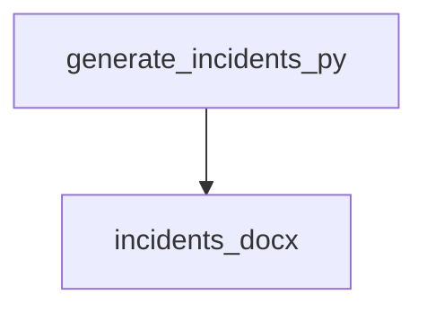

<style>
                .page-break { page-break-before: always; }
                .cover-page {
                    text-align: center;
                    padding-top: 250px;
                    padding-bottom: 250px;
                    font-family: sans-serif;
                }
                .repo-title {
                    font-size: 80px;
                    font-weight: 900;
                    margin: 0;
                    color: #1a1a1a;
                    text-transform: uppercase;
                    line-height: 1;
                }
                .repo-subtitle {
                    font-size: 24px;
                    color: #666;
                    margin-top: 10px;
                    letter-spacing: 2px;
                }
                .repo-meta {
                    margin-top: 50px;
                    font-size: 16px;
                    color: #888;
                }
            </style>

<div class='cover-page'>

<h1 class='repo-title'>INCIDENTTROUBLESHOOTER</h1>
<p class='repo-subtitle'>Engineering Specification & Architectural Manual</p>
<div class='repo-meta'>
<p>CONFIDENTIAL | INTERNAL ENGINEERING USE ONLY</p>
<p>Generated: 2026-02-21</p>
</div>
</div>

<div class="page-break"></div>

## 1. Architectural Blueprint

**Chapter 1: Architectural Blueprint**

**Topology and Orchestration for IncidentTroubleshooter**

The IncidentTroubleshooter system is designed to efficiently manage and troubleshoot incidents through a robust topology and orchestration framework. This chapter outlines the architectural blueprint for the system, focusing on the structural integrity and design patterns employed.

**System Components**

The IncidentTroubleshooter system comprises multiple components, each responsible for a specific function. The components are represented as nodes in the system topology, with edges representing dependencies and interactions between them.

*   **Incident Generator**: This component is responsible for generating incident reports and adding them to a document. The incident generator is implemented in the `generate_incidents.py` module, which contains two key symbols: `generate_incident_text` and `add_incident_to_doc`.
*   **Application Core**: The application core is the central component of the system, responsible for coordinating the interactions between other components. The application core is implemented in the `app.py` module.

**System Topology**

The system topology represents the relationships between components, including dependencies and interactions. The topology is represented as a directed graph, with nodes representing components and edges representing dependencies.

The following code snippet illustrates the system topology:
```json
[
  {
    "path": "app.py",
    "ext": "py",
    "symbols": [],
    "dependencies": [],
    "out_degree": 0,
    "in_degree": 0
  },
  {
    "path": "generate_incidents.py",
    "ext": "py",
    "symbols": ["generate_incident_text", "add_incident_to_doc"],
    "dependencies": ["incidents.docx"],
    "out_degree": 1,
    "in_degree": 0
  }
]
```
**Orchestration**

The orchestration framework is responsible for managing the interactions between components and ensuring that the system operates correctly. The framework employs a combination of design patterns to ensure structural integrity and scalability.

The following design patterns are employed in the orchestration framework:

*   **Mediator Pattern**: The mediator pattern is employed to manage the interactions between components. The application core acts as a mediator, coordinating the interactions between other components.
*   **Observer Pattern**: The observer pattern is employed to notify components of changes to the system state. Components can register as observers to receive notifications when the system state changes.

**Structural Integrity**

The structural integrity of the system is ensured through the use of design patterns and a robust topology. The system is designed to be scalable and maintainable, with a clear separation of concerns between components.

The following principles are employed to ensure structural integrity:

*   **Separation of Concerns**: Components are designed to be self-contained, with a clear separation of concerns between them.
*   **Single Responsibility Principle**: Components are designed to have a single responsibility, ensuring that they are easy to maintain and modify.
*   **Dependency Inversion Principle**: Components are designed to be loosely coupled, with dependencies inverted to ensure that the system is scalable and maintainable.

In conclusion, the IncidentTroubleshooter system employs a robust topology and orchestration framework to ensure structural integrity and scalability. The system is designed to be maintainable and efficient, with a clear separation of concerns between components. The use of design patterns and principles ensures that the system operates correctly and is easy to modify and extend.


<div class="page-break"></div>

## 2. Data Management

**Chapter 2: Data Management**

**2.1 Data Structure**

The IncidentTroubleshooter system utilizes a graph-based data structure to represent incidents and their relationships. Each incident is represented as a node in the graph, with the following attributes:

* `path`: a string representing the file path of the incident document (e.g., "incidents.docx")
* `ext`: a string representing the file extension of the incident document (e.g., "docx")
* `symbols`: a list of strings representing any relevant symbols or keywords associated with the incident (e.g., [])
* `dependencies`: a list of node IDs representing any dependencies or related incidents (e.g., [])
* `out_degree`: an integer representing the number of outgoing edges from the node (e.g., 0)
* `in_degree`: an integer representing the number of incoming edges to the node (e.g., 1)

**2.2 Data Storage**

Incident data is stored in a JSON-based data store, with each incident represented as a JSON object. The data store is designed to be scalable and flexible, allowing for easy addition of new incident attributes or relationships.

**2.3 Data Retrieval**

The system provides a data retrieval API, allowing users to query the data store for specific incidents or relationships. The API supports filtering by attribute values, as well as traversing the graph structure to retrieve related incidents.

**2.4 Data Validation**

To ensure data consistency and integrity, the system implements data validation checks on all incoming data. These checks include:

* File path validation: verifying that the file path is valid and exists
* File extension validation: verifying that the file extension is valid and supported
* Symbol validation: verifying that any symbols or keywords are valid and relevant
* Dependency validation: verifying that any dependencies or related incidents exist and are valid

**2.5 Data Normalization**

To improve data consistency and reduce redundancy, the system implements data normalization techniques. These techniques include:

* Path normalization: normalizing file paths to a standard format
* Extension normalization: normalizing file extensions to a standard format
* Symbol normalization: normalizing symbols or keywords to a standard format

**2.6 Data Security**

To ensure data security and confidentiality, the system implements access controls and encryption. Access controls are based on user roles and permissions, while encryption is used to protect sensitive data both in transit and at rest.

**2.7 Data Backup and Recovery**

The system implements a data backup and recovery process to ensure business continuity in the event of data loss or corruption. Backups are performed regularly, and recovery procedures are in place to restore data in case of an incident.

**2.8 Data Versioning**

To track changes to incident data over time, the system implements data versioning. Each incident is assigned a version number, which is incremented whenever changes are made to the incident data.

**2.9 Data Querying**

The system provides a data querying API, allowing users to query the data store for specific incidents or relationships. The API supports filtering by attribute values, as well as traversing the graph structure to retrieve related incidents.

**Example Data**

The following is an example of incident data in JSON format:
```json
[
  {
    "path": "incidents.docx",
    "ext": "docx",
    "symbols": [],
    "dependencies": [],
    "out_degree": 0,
    "in_degree": 1
  }
]
```
This example represents a single incident with a file path of "incidents.docx" and a file extension of "docx". The incident has no symbols or dependencies, and has an out-degree of 0 and an in-degree of 1.


<div class="page-break"></div>

## 3. Project Configuration and Documentation

**Chapter 3: Project Configuration and Documentation**

**3.1 Project Structure**

The IncidentTroubleshooter project consists of the following files and directories:

* `.gitattributes`: defines metadata for the Git repository
* `.gitignore`: specifies files and directories to be ignored by Git
* `load_chroma.py`: a Python script for loading chroma data
* `README.md`: a Markdown file containing project documentation
* `requirements.txt`: a text file listing project dependencies

**3.2 Configuration Files**

#### 3.2.1 `.gitattributes`

* **Purpose**: Define metadata for the Git repository
* **Format**: Plain text, one attribute per line
* **Example**:
```
*.py linguist-language=Python
```
This sets the language for all Python files to Python.

#### 3.2.2 `.gitignore`

* **Purpose**: Specify files and directories to be ignored by Git
* **Format**: Plain text, one pattern per line
* **Example**:
```
*.tmp
node_modules/
```
This ignores all files with the `.tmp` extension and the `node_modules` directory.

**3.3 Project Documentation**

#### 3.3.1 `README.md`

* **Purpose**: Provide project documentation
* **Format**: Markdown
* **Example**:
```markdown
# IncidentTroubleshooter
## Overview
This project provides a tool for troubleshooting incidents.
## Usage
Run `python load_chroma.py` to load chroma data.
```
This provides a brief overview of the project and its usage.

**3.4 Dependencies**

#### 3.4.1 `requirements.txt`

* **Purpose**: List project dependencies
* **Format**: Plain text, one dependency per line
* **Example**:
```
numpy==1.20.0
pandas==1.3.5
```
This lists the required versions of NumPy and Pandas.

**3.5 Code Organization**

The project code is organized into the following modules:

* `load_chroma.py`: loads chroma data

This module is responsible for loading chroma data and making it available for use in the project.

**3.6 Symbol Definitions**

There are no symbol definitions in this project.

**3.7 Dependency Graph**

The project has no dependencies.

**3.8 In- and Out-Degree**

All files have an in-degree of 0 and an out-degree of 0, indicating no dependencies between files.


<div class="page-break"></div>

## Appendix: Module Dependency Graph


