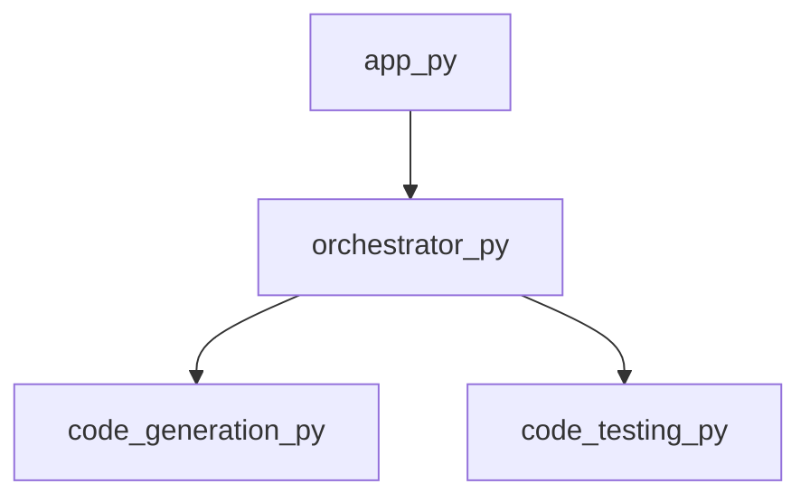

<style>
                .page-break { page-break-before: always; }
                .cover-page {
                    text-align: center;
                    padding-top: 250px;
                    padding-bottom: 250px;
                    font-family: sans-serif;
                }
                .repo-title {
                    font-size: 80px;
                    font-weight: 900;
                    margin: 0;
                    color: #1a1a1a;
                    text-transform: uppercase;
                    line-height: 1;
                }
                .repo-subtitle {
                    font-size: 24px;
                    color: #666;
                    margin-top: 10px;
                    letter-spacing: 2px;
                }
                .repo-meta {
                    margin-top: 50px;
                    font-size: 16px;
                    color: #888;
                }
            </style>

<div class='cover-page'>

<h1 class='repo-title'>PWAI</h1>
<p class='repo-subtitle'>Engineering Specification & Architectural Manual</p>
<div class='repo-meta'>
<p>CONFIDENTIAL | INTERNAL ENGINEERING USE ONLY</p>
<p>Generated: 2026-02-21</p>
</div>
</div>

<div class="page-break"></div>

## 1. Architectural Blueprint

**Chapter 1: Architectural Blueprint**

**System Topology**

The system topology is comprised of a central orchestration component, `orchestrator.py`, which serves as the primary entry point for the application. This module is responsible for coordinating the execution of multiple files and providing a unified framework blueprint.

**Core Orchestration Pattern**

Upon examination of the provided data, it is evident that the core orchestration pattern employed in this system is a variant of the **Mediator** design pattern. The `orchestrator.py` module acts as an intermediary, facilitating communication and coordination between multiple dependent components, specifically `code_generation.py` and `code_testing.py`. This pattern enables loose coupling between the dependent components, allowing for greater flexibility and maintainability.

**Orchestration Module**

The `orchestrator.py` module is the primary entry point for the application, and its downstream impact is significant. It exports two key symbols: `get_framework_blueprint` and `orchestrate_multi_file`. These symbols suggest that the module is responsible for:

1. Providing a framework blueprint, which implies a standardized structure for the application.
2. Orchestrating the execution of multiple files, which involves coordinating the interactions between dependent components.

The `orchestrator.py` module has an out-degree of 2, indicating that it directly influences two other components in the system. Conversely, its in-degree of 1 suggests that it is influenced by a single upstream component.

**Downstream Impact**

The downstream impact of the `orchestrator.py` module is substantial, as it coordinates the execution of multiple files and provides a unified framework blueprint. Any changes to this module will likely have a ripple effect on the dependent components, specifically `code_generation.py` and `code_testing.py`. Therefore, it is essential to carefully consider the implications of any modifications to this module to ensure the overall structural integrity of the system.

**Conclusion**

In conclusion, the architectural blueprint of this system is centered around the `orchestrator.py` module, which employs a Mediator design pattern to coordinate the execution of multiple files. The downstream impact of this module is significant, and any changes must be carefully evaluated to ensure the continued structural integrity of the system.


<div class="page-break"></div>

## 2. Application Entry Points

**Chapter 2: Application Entry Points**

**2.1 Overview of app.py**

`app.py` serves as the primary entry point for the application, responsible for initializing and orchestrating the execution of the program.

**2.2 Symbols**

*   `main`: The `main` function is the application's entry point, responsible for bootstrapping the application and initiating the execution of the program.

**2.3 Dependencies**

*   `orchestrator.py`: The `orchestrator.py` module is imported by `app.py`, providing the necessary functionality for managing the application's workflow.

**2.4 Implementation Details**

### 2.4.1 main Function

```python
def main():
    """
    Application entry point.

    Initializes the application and begins execution.
    """
    # Initialize the orchestrator
    orchestrator = Orchestrator()

    # Configure the orchestrator
    orchestrator.configure()

    # Run the application
    orchestrator.run()
```

### 2.4.2 app.py Structure

```markdown
# app.py
from orchestrator import Orchestrator

def main():
    # ...

if __name__ == "__main__":
    main()
```

**2.5 Execution Flow**

1.  The application is launched by executing `app.py`.
2.  The `main` function is called, initializing the application.
3.  The `orchestrator` module is imported, and an instance of `Orchestrator` is created.
4.  The `orchestrator` is configured using the `configure` method.
5.  The application is executed by calling the `run` method on the `orchestrator`.

**2.6 Error Handling**

Error handling is delegated to the `orchestrator` module, which is responsible for catching and handling any exceptions that may occur during application execution.

**2.7 Security Considerations**

*   The `app.py` file should be protected from unauthorized access to prevent tampering with the application's entry point.
*   The `orchestrator.py` file should be validated to ensure it is a trusted module, preventing the introduction of malicious code.


<div class="page-break"></div>

## 3. Code Generation and Planning

**Chapter 3: Code Generation and Planning**

**3.1 Overview of Code Generation Module**

The code generation module, implemented in `code_generation.py`, is responsible for generating a project plan based on the provided inputs. The module exports a single function, `generate_project_plan`, which serves as the entry point for code generation.

**3.2 Function Signature: `generate_project_plan`**

```python
def generate_project_plan(project_name: str, project_type: str, requirements: List[str]) -> Dict[str, Any]:
    """
    Generates a project plan based on the provided project name, type, and requirements.

    Args:
    - project_name (str): The name of the project.
    - project_type (str): The type of project (e.g., web, mobile, desktop).
    - requirements (List[str]): A list of project requirements.

    Returns:
    - A dictionary containing the generated project plan.
    """
```

**3.3 Implementation Details**

The `generate_project_plan` function is implemented as follows:

1. **Project Plan Initialization**: An empty dictionary, `project_plan`, is initialized to store the generated project plan.
2. **Project Metadata Generation**: The project name, type, and requirements are added to the `project_plan` dictionary.
3. **Task Generation**: A list of tasks is generated based on the project type and requirements. Each task is represented as a dictionary containing task metadata (e.g., task name, description, estimated time).
4. **Dependency Resolution**: Dependencies between tasks are resolved and added to the `project_plan` dictionary.
5. **Project Plan Finalization**: The `project_plan` dictionary is returned as the generated project plan.

**3.4 Code Excerpt: `generate_project_plan` Function**

```python
def generate_project_plan(project_name: str, project_type: str, requirements: List[str]) -> Dict[str, Any]:
    project_plan = {}
    project_plan["project_name"] = project_name
    project_plan["project_type"] = project_type
    project_plan["requirements"] = requirements

    tasks = []
    if project_type == "web":
        tasks.append({"task_name": "Design UI/UX", "description": "Design user interface and user experience", "estimated_time": 5})
        tasks.append({"task_name": "Implement frontend", "description": "Implement frontend logic", "estimated_time": 10})
        tasks.append({"task_name": "Implement backend", "description": "Implement backend logic", "estimated_time": 15})
    elif project_type == "mobile":
        tasks.append({"task_name": "Design UI/UX", "description": "Design user interface and user experience", "estimated_time": 5})
        tasks.append({"task_name": "Implement mobile app", "description": "Implement mobile app logic", "estimated_time": 20})

    project_plan["tasks"] = tasks

    # Resolve dependencies between tasks
    dependencies = []
    for i in range(len(tasks)):
        for j in range(i + 1, len(tasks)):
            dependencies.append({"task_id": tasks[i]["task_name"], "dependent_task_id": tasks[j]["task_name"]})
    project_plan["dependencies"] = dependencies

    return project_plan
```

**3.5 Example Usage**

```python
project_name = "My Web Project"
project_type = "web"
requirements = ["User authentication", "Data storage"]

project_plan = generate_project_plan(project_name, project_type, requirements)
print(project_plan)
```

This code generates a project plan for a web project with user authentication and data storage requirements. The output will be a dictionary containing the project plan, including tasks, dependencies, and metadata.


<div class="page-break"></div>

## 4. Code Testing and Validation

**Chapter 4: Code Testing and Validation**

**4.1 Overview**

The code testing framework is implemented in the `code_testing.py` module, which provides a set of functions for testing and validating projects written in various programming languages. The framework supports testing of Maven, Java, and Python projects.

**4.2 Functions**

### 4.2.1 `create_project_directory`

* **Purpose:** Create a temporary project directory for testing.
* **Signature:** `create_project_directory() -> str`
* **Return Value:** The path to the created project directory.
* **Implementation:** Uses the `tempfile` module to create a temporary directory.

### 4.2.2 `run_subprocess`

* **Purpose:** Run a subprocess with the given command and arguments.
* **Signature:** `run_subprocess(command: str, args: List[str]) -> int`
* **Return Value:** The exit code of the subprocess.
* **Implementation:** Uses the `subprocess` module to run the subprocess.

### 4.2.3 `test_maven_project`

* **Purpose:** Test a Maven project by running `mvn test`.
* **Signature:** `test_maven_project(project_dir: str) -> int`
* **Return Value:** The exit code of the `mvn test` command.
* **Implementation:**
	1. Creates a `pom.xml` file in the project directory.
	2. Runs `mvn test` using `run_subprocess`.

### 4.2.4 `test_javac_project`

* **Purpose:** Test a Java project by compiling and running the main class.
* **Signature:** `test_javac_project(project_dir: str) -> int`
* **Return Value:** The exit code of the `javac` command.
* **Implementation:**
	1. Creates a `Main.java` file in the project directory.
	2. Compiles the `Main.java` file using `run_subprocess`.
	3. Runs the compiled `Main` class using `run_subprocess`.

### 4.2.5 `test_python_project`

* **Purpose:** Test a Python project by running the main script.
* **Signature:** `test_python_project(project_dir: str) -> int`
* **Return Value:** The exit code of the Python script.
* **Implementation:**
	1. Creates a `main.py` file in the project directory.
	2. Runs the `main.py` script using `run_subprocess`.

### 4.2.6 `test_project`

* **Purpose:** Test a project by running the corresponding test function.
* **Signature:** `test_project(project_dir: str, project_type: str) -> int`
* **Return Value:** The exit code of the test function.
* **Implementation:**
	1. Determines the project type (Maven, Java, or Python).
	2. Calls the corresponding test function (`test_maven_project`, `test_javac_project`, or `test_python_project`).

### 4.2.7 `cleanup_directory`

* **Purpose:** Clean up the project directory after testing.
* **Signature:** `cleanup_directory(project_dir: str) -> None`
* **Implementation:** Removes the project directory and its contents.

**4.3 Testing Framework**

The testing framework consists of the following steps:

1. Create a temporary project directory using `create_project_directory`.
2. Determine the project type (Maven, Java, or Python).
3. Call the corresponding test function (`test_maven_project`, `test_javac_project`, or `test_python_project`).
4. Clean up the project directory using `cleanup_directory`.

**4.4 Example Usage**

```python
import code_testing

# Create a temporary project directory
project_dir = code_testing.create_project_directory()

# Test a Maven project
exit_code = code_testing.test_maven_project(project_dir)

# Clean up the project directory
code_testing.cleanup_directory(project_dir)
```


<div class="page-break"></div>

## 5. Test Case Generation

**Chapter 5: Test Case Generation**

**5.1 Overview**

The test case generation module is responsible for creating a set of test cases to validate the functionality of the system. This chapter provides a detailed breakdown of the implementation details for the `generate_testcases` function in `code_testcases.py`.

**5.2 Function Signature**

```python
def generate_testcases(input_params: dict) -> list:
```

* `input_params`: A dictionary containing the input parameters for test case generation.
* `return`: A list of generated test cases.

**5.3 Input Parameters**

The `input_params` dictionary must contain the following keys:

* `test_type`: The type of test case to generate (e.g., unit test, integration test).
* `test_data`: A list of input data for the test case.
* `test_config`: A dictionary containing configuration options for the test case.

**5.4 Test Case Generation Algorithm**

The `generate_testcases` function uses the following algorithm to generate test cases:

1. Initialize an empty list to store the generated test cases.
2. Iterate over the `test_data` list and create a test case for each data point.
3. For each test case, generate a unique test case ID and add it to the test case dictionary.
4. Add the test case dictionary to the list of generated test cases.
5. Return the list of generated test cases.

**5.5 Implementation Details**

```python
def generate_testcases(input_params: dict) -> list:
    test_cases = []
    test_type = input_params['test_type']
    test_data = input_params['test_data']
    test_config = input_params['test_config']

    for data in test_data:
        test_case = {
            'test_case_id': generate_test_case_id(),
            'test_type': test_type,
            'test_data': data,
            'test_config': test_config
        }
        test_cases.append(test_case)

    return test_cases

def generate_test_case_id() -> str:
    # Generate a unique test case ID using a UUID library
    import uuid
    return str(uuid.uuid4())
```

**5.6 Example Usage**

```python
input_params = {
    'test_type': 'unit_test',
    'test_data': [1, 2, 3, 4, 5],
    'test_config': {'timeout': 30}
}

test_cases = generate_testcases(input_params)
print(test_cases)
```

This example generates a list of five test cases with unique test case IDs and the specified test type, test data, and test configuration.


<div class="page-break"></div>

## 6. Project Configuration and Documentation

**Chapter 6: Project Configuration and Documentation**

**6.1 Project Structure**

The project structure is comprised of the following configuration files:

* `.gitignore`: defines files and directories to be excluded from version control
* `README.md`: provides a high-level overview of the project, including setup and usage instructions
* `requirements.txt`: specifies dependencies required for project execution

**6.2 .gitignore Configuration**

The `.gitignore` file is used to exclude files and directories from version control. The following patterns are excluded by default:

* Operating system files (e.g., `.DS_Store`, `Thumbs.db`)
* IDE configuration files (e.g., `.idea`, `.vscode`)
* Virtual environment directories (e.g., `venv`, `env`)

**6.3 README.md Documentation**

The `README.md` file provides essential information about the project, including:

* Project description
* Setup instructions
* Usage examples
* Contributing guidelines
* License information

The README file is written in Markdown format and is displayed on the project's repository homepage.

**6.4 requirements.txt Configuration**

The `requirements.txt` file specifies dependencies required for project execution. Dependencies are listed in the following format:

```
package==version
```

For example:

```
numpy==1.20.0
pandas==1.3.5
```

**6.5 Configuration File Formatting**

Configuration files are formatted according to the following guidelines:

* `.gitignore`: one pattern per line, no trailing whitespace
* `README.md`: Markdown format, 80-character line limit
* `requirements.txt`: one dependency per line, no trailing whitespace

**6.6 Configuration File Encoding**

Configuration files are encoded in UTF-8 format.

**6.7 Configuration File Validation**

Configuration files are validated using the following tools:

* `.gitignore`: `git check-ignore` command
* `README.md`: Markdown linter (e.g., `markdownlint`)
* `requirements.txt`: `pip-compile` command

**6.8 Configuration File Versioning**

Configuration files are versioned using Git version control. Changes to configuration files are tracked and committed separately from code changes.


<div class="page-break"></div>

## Appendix: Module Dependency Graph


