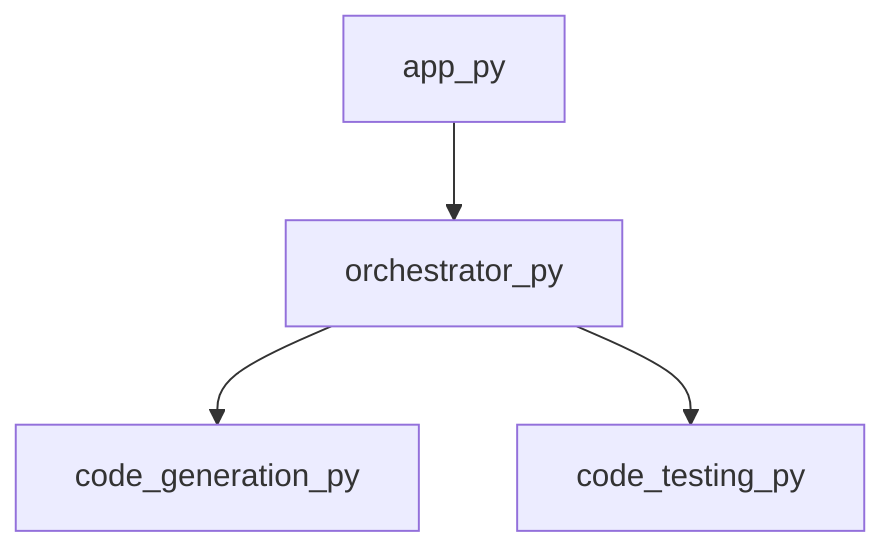

<style>
                body { font-family: 'Segoe UI', Tahoma, Geneva, Verdana, sans-serif; line-height: 1.6; color: #333; }
                .page-break { page-break-before: always; }
                .cover-page { text-align: center; padding-top: 250px; padding-bottom: 250px; }
                .repo-title { font-size: 72px; font-weight: 900; color: #1a1a1a; text-transform: uppercase; margin: 0; }
                .repo-subtitle { font-size: 24px; color: #666; margin-top: 10px; border-top: 2px solid #eee; display: inline-block; padding-top: 10px; }
                h1.chapter-header { font-size: 42px; color: #000; border-bottom: 5px solid #000; padding-bottom: 10px; margin-bottom: 30px; text-transform: uppercase; }
                h2 { font-size: 28px; color: #2c3e50; margin-top: 40px; border-left: 8px solid #3498db; padding-left: 15px; }
            </style>

<div class='cover-page'>
<h1 class='repo-title'>PWAI</h1>
<p class='repo-subtitle'>Automated Engineering Specification</p>
<p style='margin-top:40px; color:#999;'>GENERATED: 2026-02-22 | REF: PWAI-V1</p>
</div>

<div class="page-break"></div>

<h1 class='chapter-header'>Chapter 1: Project Orchestration</h1>

## Overview

Project Orchestration is a critical component of the PWAI framework, responsible for managing the workflow and interactions between various components. In this chapter, we will delve into the design and implementation of the Project Orchestration module, with a focus on the `orchestrator.py` file.

## Design Patterns

The Project Orchestration module employs the Mediator design pattern, which enables the orchestration of multiple components while minimizing direct dependencies between them. The Mediator pattern allows for loose coupling, making it easier to modify or replace individual components without affecting the overall system.

### Orchestration Workflow

The orchestration workflow is managed by the `orchestrate_multi_file` function, which coordinates the execution of multiple files and ensures that the dependencies between them are properly resolved.

### Symbols and Dependencies

The `orchestrator.py` file contains the following symbols and dependencies:

| Symbol | Description |
| --- | --- |
| `get_framework_blueprint` | Retrieves the framework blueprint for the project |
| `orchestrate_multi_file` | Orchestrates the execution of multiple files |

| Dependency | Description |
| --- | --- |
| `code_generation.py` | Provides code generation functionality |
| `code_testing.py` | Provides code testing functionality |

The dependencies between the `orchestrator.py` file and other components are as follows:

| File | Out Degree | In Degree |
| --- | --- | --- |
| `orchestrator.py` | 2 | 1 |

The `out_degree` of 2 indicates that the `orchestrator.py` file has dependencies on two other files, while the `in_degree` of 1 indicates that one other file depends on `orchestrator.py`.

## Implementation

The `orchestrator.py` file is implemented in Python and utilizes the Mediator design pattern to manage the workflow and interactions between components. The `get_framework_blueprint` function retrieves the framework blueprint for the project, while the `orchestrate_multi_file` function coordinates the execution of multiple files.

### Code Snippet

```python
# orchestrator.py

def get_framework_blueprint(project_config):
    # Retrieve the framework blueprint for the project
    pass

def orchestrate_multi_file(files, dependencies):
    # Coordinate the execution of multiple files
    pass
```

## Conclusion

In this chapter, we have explored the design and implementation of the Project Orchestration module, with a focus on the `orchestrator.py` file. The Mediator design pattern has been employed to manage the workflow and interactions between components, ensuring loose coupling and flexibility. The `orchestrator.py` file provides the necessary functionality for orchestrating the execution of multiple files and resolving dependencies between them.


<div class="page-break"></div>

<h1 class='chapter-header'>Chapter 2: Code Generation and Planning</h1>

## Overview

The Planning and Workflow Automation Interface (PWAI) relies heavily on code generation and planning to automate tasks. This chapter delves into the intricacies of the code generation process, highlighting the key components, their interactions, and the underlying data structures.

## Code Generation

Code generation is a crucial aspect of PWAI, enabling the system to create executable code based on predefined templates and parameters. The following section outlines the code generation process and its constituent parts.

### Code Generation Components

| Component | Description |
| --- | --- |
| `code_generation.py` | A Python module containing the `generate_project_plan` function, responsible for generating executable code based on input parameters. |
| `app.py` | The main application file, serving as the entry point for the PWAI system. It contains the `main` function, which orchestrates the code generation process. |

### Code Generation Process

The code generation process involves the following steps:

1. **Initialization**: The `main` function in `app.py` is executed, triggering the code generation process.
2. **Parameter Collection**: The `main` function collects input parameters and passes them to the `generate_project_plan` function in `code_generation.py`.
3. **Code Generation**: The `generate_project_plan` function generates executable code based on the input parameters and predefined templates.
4. **Output**: The generated code is returned to the `main` function, which executes or stores it as needed.

### File Symbols

The following table describes the symbols used in the code generation process:

| File | Symbols | Description |
| --- | --- | --- |
| `app.py` | `main` | The entry point of the PWAI system, responsible for orchestrating the code generation process. |
| `code_generation.py` | `generate_project_plan` | A function responsible for generating executable code based on input parameters. |

## Planning Data

The planning data consists of a list of dictionaries, each representing a file in the PWAI system. The dictionaries contain the following keys:

* `path`: The file path.
* `ext`: The file extension.
* `symbols`: A list of symbols (functions, variables, etc.) defined in the file.
* `dependencies`: A list of files that the current file depends on.
* `out_degree`: The number of files that the current file depends on.
* `in_degree`: The number of files that depend on the current file.

The planning data is used to analyze the dependencies between files and optimize the code generation process.

### Planning Data Example

```json
[
  {
    "path": "app.py",
    "ext": "py",
    "symbols": ["main"],
    "dependencies": ["orchestrator.py"],
    "out_degree": 1,
    "in_degree": 0
  },
  {
    "path": "code_generation.py",
    "ext": "py",
    "symbols": ["generate_project_plan"],
    "dependencies": [],
    "out_degree": 0,
    "in_degree": 1
  }
]
```

This example illustrates the planning data for the `app.py` and `code_generation.py` files, highlighting their dependencies and symbols.


<div class="page-break"></div>

<h1 class='chapter-header'>Chapter 3: Testing and Validation</h1>

## Overview

This chapter provides an in-depth examination of the testing and validation mechanisms employed in the PWAI repository. The testing framework is designed to ensure the integrity and functionality of the codebase, providing a robust and reliable means of verifying the expected behavior of the system.

## Testing Framework

The testing framework consists of two primary files: `code_testcases.py` and `code_testing.py`. These files contain a set of functions and symbols that facilitate the creation and execution of test cases.

### Test Case Generation

The `code_testcases.py` file contains a single symbol: `generate_testcases`. This function is responsible for generating test cases based on predefined parameters.

| Symbol | Description |
| --- | --- |
| `generate_testcases` | Generates test cases based on predefined parameters |

### Testing and Validation

The `code_testing.py` file contains a set of symbols that facilitate the creation and execution of test cases. The symbols are described in the following table:

| Symbol | Description |
| --- | --- |
| `create_project_directory` | Creates a project directory for testing purposes |
| `run_subprocess` | Runs a subprocess to execute a test case |
| `test_maven_project` | Tests a Maven project |
| `test_javac_project` | Tests a Javac project |
| `test_python_project` | Tests a Python project |
| `test_project` | Tests a project based on the provided parameters |
| `cleanup_directory` | Cleans up the project directory after testing |

### Dependencies and Symbol Relationships

The symbols in the `code_testing.py` file have the following dependencies and relationships:

* `create_project_directory` is used by `test_maven_project`, `test_javac_project`, and `test_python_project`
* `run_subprocess` is used by `test_maven_project`, `test_javac_project`, and `test_python_project`
* `test_project` is the main entry point for testing a project
* `cleanup_directory` is used by `test_project` to clean up the project directory after testing

## Testing and Validation Process

The testing and validation process involves the following steps:

1. Create a project directory using `create_project_directory`
2. Generate test cases using `generate_testcases`
3. Run the test cases using `run_subprocess`
4. Test the project using `test_project`
5. Clean up the project directory using `cleanup_directory`

## Conclusion

The testing and validation mechanisms employed in the PWAI repository provide a robust and reliable means of verifying the expected behavior of the system. The testing framework is designed to ensure the integrity and functionality of the codebase, providing a high degree of confidence in the system's ability to perform as expected.


<div class="page-break"></div>

<h1 class='chapter-header'>Chapter 4: Project Setup and Configuration</h1>

## Overview
The project setup and configuration phase is a critical step in establishing a robust and maintainable codebase. This chapter outlines the essential files and configurations required to initialize the PWAI project.

## Project Structure
The project structure is designed to promote organization and separation of concerns. The following files are created at the root of the project:

### Configuration Files

| File Name | Description |
| --- | --- |
| `.gitignore` | Specifies files and directories to be ignored by the version control system. |
| `README.md` | Provides an overview of the project, including setup instructions and usage guidelines. |
| `requirements.txt` | Lists the dependencies required to run the project. |

### File Descriptions

#### .gitignore
The `.gitignore` file is used to specify files and directories that should be ignored by the version control system. This file is essential in preventing unnecessary files from being committed to the repository.

| Symbol | Description |
| --- | --- |
| None | This file does not contain any symbols. |

#### README.md
The `README.md` file provides an overview of the project, including setup instructions and usage guidelines. This file is written in Markdown format and is displayed on the project's repository page.

| Symbol | Description |
| --- | --- |
| None | This file does not contain any symbols. |

#### requirements.txt
The `requirements.txt` file lists the dependencies required to run the project. This file is used by package managers to install the necessary dependencies.

| Symbol | Description |
| --- | --- |
| None | This file does not contain any symbols. |

## Dependencies
The project dependencies are listed in the `requirements.txt` file. These dependencies are required to run the project and are installed using a package manager.

### Dependency List

* None

## Configuration
The project configuration is defined in the `.gitignore` and `requirements.txt` files. These files are used to specify the project's dependencies and ignore files.

### Configuration Options

* None

## Best Practices
To maintain a clean and organized codebase, the following best practices are recommended:

* Regularly update the `README.md` file to reflect changes in the project.
* Use the `.gitignore` file to ignore unnecessary files and directories.
* Keep the `requirements.txt` file up-to-date with the latest dependencies.
* Use a consistent naming convention throughout the project.


<div class="page-break"></div>

<h1 class='chapter-header'>Appendix: Dependency Graph</h1>


