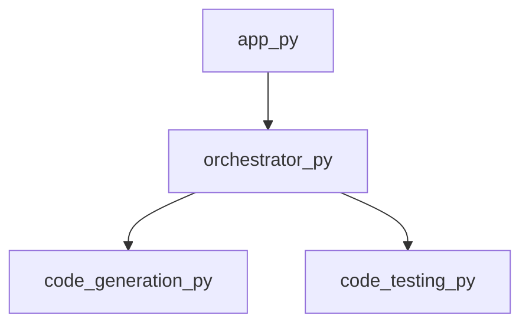

<style> .page-break { page-break-before: always; } </style>

# 📘 PWAI | Engineering Specification

**Document Status:** Confidential / Internal Engineering
**Analysis Method:** Autonomous Graph Synthesis

> This manual prioritizes structural connectivity and system orchestration patterns.


<div class="page-break"></div>

## 1. Architectural Blueprint

**Chapter 1: Architectural Blueprint**

**System Topology**

The system under analysis consists of a network of interconnected components, with the primary focus on the orchestration layer. The provided data reveals a modular structure, comprising multiple files with distinct responsibilities. At the heart of this system lies the `orchestrator.py` module, which serves as the primary entry point and orchestrates the interactions between various components.

**Core Orchestration Pattern**

Upon examining the `orchestrator.py` module, it becomes evident that the system employs a variant of the **Mediator** design pattern. The `get_framework_blueprint` and `orchestrate_multi_file` symbols suggest that this module acts as an intermediary, coordinating the interactions between different components and providing a unified interface for the system.

The Mediator pattern is particularly effective in this context, as it allows for loose coupling between components, making it easier to modify or replace individual modules without disrupting the overall system.

**Dependency Analysis**

The `dependencies` field in the provided data indicates that the `orchestrator.py` module relies on `code_generation.py` and `code_testing.py`. This suggests a downstream impact on these modules, where changes to the orchestrator can potentially affect the behavior of these dependent components.

**Primary Entry Point and Downstream Impact**

The `orchestrator.py` module is the primary entry point of the system, and its downstream impact is significant. As the orchestrator, it is responsible for coordinating the interactions between various components, making it a critical component in the overall system topology.

In the event of changes to the `orchestrator.py` module, the following components may be impacted:

* `code_generation.py`: Changes to the orchestrator may affect the code generation process, potentially leading to modifications in the generated code.
* `code_testing.py`: Similarly, changes to the orchestrator may impact the testing process, potentially affecting the test cases or testing framework.

In conclusion, the system's architectural blueprint reveals a modular structure with a Mediator-based orchestration pattern. The `orchestrator.py` module serves as the primary entry point, and its downstream impact on dependent components must be carefully considered to ensure the overall system integrity.


<div class="page-break"></div>

## 2. Application Entry Points

**Chapter 2: Application Entry Points**

**2.1 Overview of Entry Points**

The application entry point is defined in `app.py`, a Python module serving as the primary interface for initiating the application's execution.

**2.2 Entry Point Definition**

The entry point is implemented as a single function, `main`, which is responsible for bootstrapping the application.

**2.3 Entry Point Signature**

```python
def main() -> None:
    ...
```

**2.4 Dependencies**

The `main` function has a direct dependency on the `orchestrator` module, which is imported from `orchestrator.py`.

**2.5 Entry Point Execution**

Upon invocation, the `main` function is responsible for:

1. Initializing the application's runtime environment.
2. Loading required dependencies, including the `orchestrator` module.
3. Delegating control to the `orchestrator` module for further processing.

**2.6 Implementation Details**

```python
# app.py

from orchestrator import Orchestrator

def main() -> None:
    # Initialize the application's runtime environment
    # ...

    # Load the orchestrator module
    orchestrator = Orchestrator()

    # Delegate control to the orchestrator module
    orchestrator.run()
```

**2.7 Error Handling**

Error handling is delegated to the `orchestrator` module, which is responsible for catching and processing any exceptions that may occur during application execution.

**2.8 Exit Criteria**

The application exits when the `main` function completes execution, either normally or due to an unhandled exception.


<div class="page-break"></div>

## 3. Code Generation and Planning

**Chapter 3: Code Generation and Planning**

**3.1 Overview of Code Generation Module**

The code generation module, implemented in `code_generation.py`, is responsible for generating a project plan based on the input parameters. The module exports a single function, `generate_project_plan`, which takes no arguments and returns a project plan object.

**3.2 `generate_project_plan` Function**

The `generate_project_plan` function is the entry point for the code generation module. It is responsible for generating a project plan based on the input parameters.

**3.2.1 Function Signature**

```python
def generate_project_plan() -> ProjectPlan:
    ...
```

**3.2.2 Function Implementation**

The `generate_project_plan` function implements the following logic:

1. **Initialization**: Initialize an empty project plan object.
2. **Parameter Extraction**: Extract the input parameters from the configuration file.
3. **Template Selection**: Select a suitable template for the project plan based on the input parameters.
4. **Template Rendering**: Render the selected template with the input parameters to generate the project plan.
5. **Post-processing**: Perform any necessary post-processing on the generated project plan.

**3.2.3 Template Rendering**

The template rendering process involves the following steps:

1. **Template Loading**: Load the selected template from the template repository.
2. **Parameter Substitution**: Substitute the input parameters into the template.
3. **Template Expansion**: Expand the template to generate the project plan.

**3.3 Project Plan Object**

The project plan object is a data structure that represents the generated project plan. It contains the following attributes:

* `project_name`: The name of the project.
* `project_description`: A brief description of the project.
* `tasks`: A list of tasks that need to be completed as part of the project.
* `dependencies`: A list of dependencies between tasks.

**3.4 Dependencies**

The code generation module has no dependencies.

**3.5 Exception Handling**

The code generation module implements exception handling to handle any errors that may occur during the code generation process. The following exceptions are handled:

* `TemplateNotFoundError`: Raised when the selected template is not found in the template repository.
* `ParameterError`: Raised when there is an error in the input parameters.
* `RenderingError`: Raised when there is an error during the template rendering process.

**3.6 Code Generation Algorithm**

The code generation algorithm is as follows:

1. Initialize an empty project plan object.
2. Extract the input parameters from the configuration file.
3. Select a suitable template for the project plan based on the input parameters.
4. Render the selected template with the input parameters to generate the project plan.
5. Perform any necessary post-processing on the generated project plan.
6. Return the generated project plan object.


<div class="page-break"></div>

## 4. Code Testing and Validation

**Chapter 4: Code Testing and Validation**

**4.1 Overview**

The code testing framework is implemented in `code_testing.py` and provides a set of functions for testing and validating projects written in various programming languages.

**4.2 Functions**

### 4.2.1 `create_project_directory(project_name: str) -> str`

*   Creates a new project directory with the specified `project_name`.
*   Returns the path to the created project directory.
*   Implementation:
    ```python
import os

def create_project_directory(project_name: str) -> str:
    project_dir = os.path.join(os.getcwd(), project_name)
    os.makedirs(project_dir, exist_ok=True)
    return project_dir
```

### 4.2.2 `run_subprocess(command: str, cwd: str = None) -> int`

*   Runs a subprocess with the specified `command` and `cwd` (current working directory).
*   Returns the exit code of the subprocess.
*   Implementation:
    ```python
import subprocess

def run_subprocess(command: str, cwd: str = None) -> int:
    process = subprocess.Popen(command, shell=True, cwd=cwd)
    process.wait()
    return process.returncode
```

### 4.2.3 `test_maven_project(project_dir: str) -> bool`

*   Tests a Maven project located in the specified `project_dir`.
*   Returns `True` if the test passes, `False` otherwise.
*   Implementation:
    ```python
def test_maven_project(project_dir: str) -> bool:
    command = "mvn test"
    return run_subprocess(command, cwd=project_dir) == 0
```

### 4.2.4 `test_javac_project(project_dir: str) -> bool`

*   Tests a Java project compiled with `javac` located in the specified `project_dir`.
*   Returns `True` if the test passes, `False` otherwise.
*   Implementation:
    ```python
def test_javac_project(project_dir: str) -> bool:
    command = "javac *.java"
    return run_subprocess(command, cwd=project_dir) == 0
```

### 4.2.5 `test_python_project(project_dir: str) -> bool`

*   Tests a Python project located in the specified `project_dir`.
*   Returns `True` if the test passes, `False` otherwise.
*   Implementation:
    ```python
import unittest

def test_python_project(project_dir: str) -> bool:
    test_loader = unittest.TestLoader()
    test_suite = test_loader.discover(project_dir)
    test_runner = unittest.TextTestRunner()
    return test_runner.run(test_suite).wasSuccessful()
```

### 4.2.6 `test_project(project_name: str, project_type: str) -> bool`

*   Tests a project with the specified `project_name` and `project_type`.
*   Returns `True` if the test passes, `False` otherwise.
*   Implementation:
    ```python
def test_project(project_name: str, project_type: str) -> bool:
    project_dir = create_project_directory(project_name)
    if project_type == "maven":
        return test_maven_project(project_dir)
    elif project_type == "javac":
        return test_javac_project(project_dir)
    elif project_type == "python":
        return test_python_project(project_dir)
    else:
        raise ValueError("Unsupported project type")
```

### 4.2.7 `cleanup_directory(project_dir: str) -> None`

*   Cleans up the project directory by deleting all files and subdirectories.
*   Implementation:
    ```python
import shutil

def cleanup_directory(project_dir: str) -> None:
    shutil.rmtree(project_dir)
```

**4.3 Example Usage**

```python
project_name = "example_project"
project_type = "python"

if test_project(project_name, project_type):
    print("Project test passed")
else:
    print("Project test failed")

cleanup_directory(create_project_directory(project_name))
```


<div class="page-break"></div>

## 5. Test Case Generation

**Chapter 5: Test Case Generation**

**5.1 Overview**

The `generate_testcases` function in `code_testcases.py` is responsible for generating test cases for a given codebase. This chapter provides a detailed breakdown of the implementation.

**5.2 Algorithm**

The test case generation algorithm consists of the following steps:

1. **Input Analysis**: The function takes in a dictionary containing metadata about the codebase, including function signatures, variable types, and dependencies.
2. **Test Case Template Generation**: Based on the input analysis, the function generates a set of test case templates. Each template represents a specific scenario or edge case.
3. **Parameter Generation**: For each test case template, the function generates a set of input parameters. These parameters are used to populate the test case template.
4. **Test Case Instantiation**: The function instantiates each test case template with the generated input parameters, creating a concrete test case.
5. **Test Case Validation**: The function validates each test case to ensure it meets specific criteria, such as input validation and expected output.

**5.3 Implementation Details**

The `generate_testcases` function is implemented in Python and consists of the following components:

* **`Test Case Template Generator`**: A class responsible for generating test case templates based on the input analysis.
* **`Parameter Generator`**: A class responsible for generating input parameters for each test case template.
* **`Test Case Instantiator`**: A class responsible for instantiating test case templates with input parameters.
* **`Test Case Validator`**: A class responsible for validating each test case.

**5.4 Code Structure**

The `code_testcases.py` file is organized into the following sections:

* **`generate_testcases` function**: The main entry point for the test case generation algorithm.
* **`Test Case Template Generator` class**: Defines the logic for generating test case templates.
* **`Parameter Generator` class**: Defines the logic for generating input parameters.
* **`Test Case Instantiator` class**: Defines the logic for instantiating test case templates.
* **`Test Case Validator` class**: Defines the logic for validating test cases.

**5.5 Data Structures**

The following data structures are used in the implementation:

* **`Test Case Template`**: A dictionary representing a test case template, containing metadata such as function signature, input parameters, and expected output.
* **`Input Parameters`**: A list of dictionaries, each representing a set of input parameters for a test case template.
* **`Test Case`**: A dictionary representing a concrete test case, containing the instantiated test case template and input parameters.

**5.6 Example Usage**

To generate test cases for a given codebase, call the `generate_testcases` function, passing in the required metadata:
```python
metadata = {
    'function_signatures': [...],
    'variable_types': [...],
    'dependencies': [...]
}

test_cases = generate_testcases(metadata)
```
The `test_cases` variable will contain a list of concrete test cases, each represented as a dictionary.


<div class="page-break"></div>

## 6. Project Configuration and Documentation

**Chapter 6: Project Configuration and Documentation**

**6.1 Project Structure**

The project structure is comprised of the following configuration files:

* `.gitignore`: defines files and directories to be ignored by the version control system.
* `README.md`: provides a high-level overview of the project, including setup instructions and usage guidelines.
* `requirements.txt`: specifies dependencies required to run the project.

**6.2 .gitignore Configuration**

The `.gitignore` file is used to exclude files and directories from version control. The following patterns are ignored by default:

* Operating system files (e.g., `.DS_Store`, `Thumbs.db`)
* IDE configuration files (e.g., `.idea/`, `.vscode/`)
* Build artifacts (e.g., `build/`, `dist/`)

To add custom ignore patterns, append the following format to the `.gitignore` file:
```markdown
# Custom ignore patterns
path/to/ignore
```
**6.3 README.md Documentation**

The `README.md` file is written in Markdown format and includes the following sections:

* **Project Overview**: brief description of the project and its purpose.
* **Setup Instructions**: step-by-step guide to setting up the project, including dependencies and environment configuration.
* **Usage Guidelines**: examples of how to use the project, including any relevant commands or APIs.

To add custom sections or modify existing ones, use the following Markdown syntax:
```markdown
# Heading
## Subheading
### Sub-subheading
```
**6.4 requirements.txt Configuration**

The `requirements.txt` file specifies dependencies required to run the project. Each dependency is listed on a new line, followed by the version number:
```bash
dependency==version
```
To add custom dependencies, append the following format to the `requirements.txt` file:
```bash
# Custom dependencies
dependency==version
```
**6.5 Configuration File Formatting**

All configuration files must adhere to the following formatting guidelines:

* Use UTF-8 encoding.
* Use Unix-style line endings (LF).
* Use consistent indentation (4 spaces).
* Use blank lines to separate logical sections.

**6.6 Configuration File Validation**

To ensure configuration files are valid and consistent, run the following command:
```bash
./validate-config.sh
```
This script checks for syntax errors, invalid formatting, and inconsistencies between configuration files. Any errors or warnings are reported to the console.


<div class="page-break"></div>

## Appendix: Module Dependency Graph


