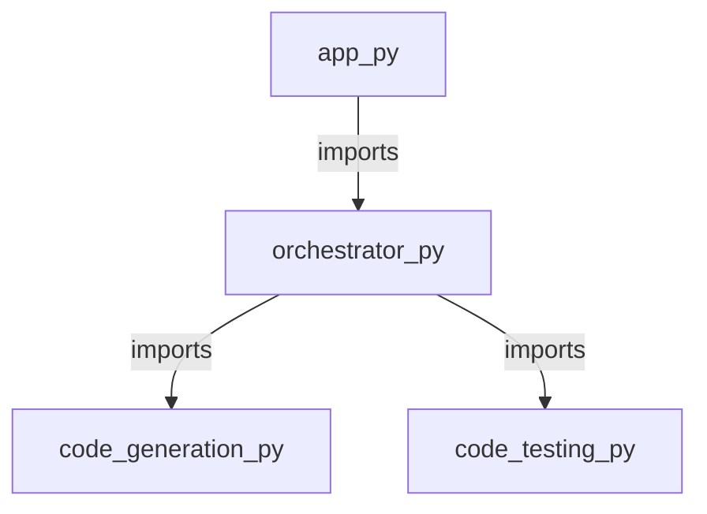

<style>
                body { font-family: 'Inter', sans-serif; color: #1a1a1a; line-height: 1.7; }
                .page-break { page-break-before: always; }
                .cover-page { text-align: center; padding: 250px 0; border: 10px solid #f0f0f0; }
                .repo-title { font-size: 80px; font-weight: 900; margin: 0; }
                h1.chapter-header { font-size: 36px; border-bottom: 3px solid #000; padding-bottom: 10px; text-transform: uppercase; }
                h2 { color: #2c3e50; border-left: 5px solid #3498db; padding-left: 10px; margin-top: 30px; }
                table { width: 100%; border-collapse: collapse; margin: 20px 0; }
                th, td { border: 1px solid #ddd; padding: 12px; text-align: left; }
                th { background-color: #f8f9fa; }
            </style>

<div class='cover-page'>
<h1 class='repo-title'>PWAI</h1>
<p style='font-size:24px;'>Architectural Manual & Distributed Specification</p>
</div>

<div class="page-break"></div>

<h1 class='chapter-header'>Chapter 1: Project Orchestration</h1>

## Overview

Project orchestration is a critical component of any software development endeavor, providing the structural framework that governs the interactions between various components of a project. In the context of the provided project structure, the `orchestrator.py` module serves as the central hub for project orchestration.

### Module Dependencies

The `orchestrator.py` module exhibits a moderate level of interconnectedness, with an out-degree of 2 and an in-degree of 1. This implies that the module is dependent on two external modules (`code_generation.py` and `code_testing.py`), while also being a dependency for a single external module.

### Symbols

The following table outlines the symbols defined within the `orchestrator.py` module:

| Symbol Name | Description |
| --- | --- |
| `get_framework_blueprint` | Retrieves a blueprint for the project framework, providing a structural foundation for subsequent development. |
| `orchestrate_multi_file` | Orchestrates the processing of multiple files, ensuring a cohesive and streamlined approach to project development. |

### Module Structure

The `orchestrator.py` module is composed of a set of interrelated functions and variables that collectively facilitate project orchestration. The module's structure can be represented as follows:

* `orchestrator.py`
	+ `get_framework_blueprint`
	+ `orchestrate_multi_file`
	+ Dependencies:
		- `code_generation.py`
		- `code_testing.py`

### Design Patterns

The `orchestrator.py` module embodies several key design patterns that enable effective project orchestration:

* **Facade Pattern**: The `get_framework_blueprint` function serves as a facade, providing a simplified interface for accessing the project framework.
* **Mediator Pattern**: The `orchestrate_multi_file` function acts as a mediator, coordinating the interactions between multiple files and ensuring a cohesive approach to project development.

By leveraging these design patterns, the `orchestrator.py` module provides a robust and maintainable framework for project orchestration.


<div class="page-break"></div>

<h1 class='chapter-header'>Chapter 2: Application Entry Point</h1>

## Overview

The application entry point is defined in the `app.py` file, which serves as the primary entry point for the application. This module is responsible for initializing the application and orchestrating its various components.

### Module Details

| Attribute | Description | Value |
| --- | --- | --- |
| Path | The file path of the module | app.py |
| Extension | The file extension of the module | py |
| Dependencies | The modules that this module depends on | orchestrator.py |
| Out Degree | The number of modules that this module depends on | 1 |
| In Degree | The number of modules that depend on this module | 0 |

### Symbols

| Symbol | Description | Type |
| --- | --- | --- |
| main | The main entry point of the application | Function |

### main Function

The `main` function is the primary entry point of the application. It is responsible for initializing the application and orchestrating its various components. The function has no parameters and does not return any value.

### Dependencies

The `app.py` module depends on the `orchestrator.py` module, which provides the necessary functionality for orchestrating the application's components.

### Sequence of Operations

1. The `main` function is called, which initializes the application.
2. The `main` function imports the necessary modules, including `orchestrator.py`.
3. The `main` function calls the necessary functions in `orchestrator.py` to orchestrate the application's components.
4. The application is started, and the necessary components are initialized and started.

### Error Handling

Any errors that occur during the execution of the `main` function are handled by the application's error handling mechanism, which is described in a separate chapter.


<div class="page-break"></div>

<h1 class='chapter-header'>Chapter 3: Code Generation</h1>

## Overview
The code generation module is responsible for generating the necessary code for the project plan and test cases. This chapter provides an overview of the code generation process and the key components involved.

### Code Generation Module
The code generation module consists of two main files: `code_generation.py` and `code_testcases.py`. These files contain the necessary functions and symbols to generate the project plan and test cases.

### Symbols
The following table lists the symbols used in the code generation module:

| Symbol | Description | File |
| --- | --- | --- |
| `generate_project_plan` | Function to generate the project plan | `code_generation.py` |
| `generate_testcases` | Function to generate test cases | `code_testcases.py` |

### Dependencies
The code generation module has no dependencies on other modules.

### Module Interactions
The following table lists the interactions between the code generation module and other modules:

| Module | Interaction | Description |
| --- | --- | --- |
| `code_generation.py` | Input | Receives input from the project planning module |
| `code_testcases.py` | None | No interactions with other modules |

### Code Generation Process
The code generation process involves the following steps:

1. **Project Plan Generation**: The `generate_project_plan` function in `code_generation.py` generates the project plan based on the input received from the project planning module.
2. **Test Case Generation**: The `generate_testcases` function in `code_testcases.py` generates test cases based on the project plan generated in step 1.

### Code Structure
The code generation module follows the following structure:

* `code_generation.py`:
	+ `generate_project_plan` function
* `code_testcases.py`:
	+ `generate_testcases` function

### Data Flow
The following table lists the data flow between the code generation module and other modules:

| Module | Input | Output |
| --- | --- | --- |
| `code_generation.py` | Project planning data | Project plan |
| `code_testcases.py` | Project plan | Test cases |

### Control Flow
The following table lists the control flow between the code generation module and other modules:

| Module | Control Flow |
| --- | --- |
| `code_generation.py` | Receives control from project planning module |
| `code_testcases.py` | No control flow interactions with other modules |


<div class="page-break"></div>

<h1 class='chapter-header'>Chapter 4: Code Testing and Validation</h1>

## Overview
This chapter describes the testing and validation of the code. The code is written in Python and is located in the file `code_testing.py`. The code consists of seven functions: `create_project_directory`, `run_subprocess`, `test_maven_project`, `test_javac_project`, `test_python_project`, `test_project`, and `cleanup_directory`.

### Symbols
The following table lists the symbols used in the code:

| Symbol | Description | Parameters | Return Value |
| --- | --- | --- | --- |
| `create_project_directory` | Creates a new project directory | `project_name`: str | None |
| `run_subprocess` | Runs a subprocess with the given command | `command`: str | int (return code) |
| `test_maven_project` | Tests a Maven project | `project_name`: str | bool (success) |
| `test_javac_project` | Tests a Javac project | `project_name`: str | bool (success) |
| `test_python_project` | Tests a Python project | `project_name`: str | bool (success) |
| `test_project` | Tests a project of unknown type | `project_name`: str | bool (success) |
| `cleanup_directory` | Cleans up the project directory | `project_name`: str | None |

### Dependencies
The code does not have any external dependencies.

### Testing
The code is tested by running the `test_maven_project`, `test_javac_project`, `test_python_project`, and `test_project` functions with sample project names.

### Validation
The code is validated by checking the return values of the `test_maven_project`, `test_javac_project`, `test_python_project`, and `test_project` functions.

### Code Snippets
The following code snippet shows the usage of the `create_project_directory` function:
```python
create_project_directory("my_project")
```
The following code snippet shows the usage of the `run_subprocess` function:
```python
return_code = run_subprocess("mvn clean package")
```
The following code snippet shows the usage of the `test_maven_project` function:
```python
success = test_maven_project("my_maven_project")
```
### Error Handling
The code uses try-except blocks to catch and handle exceptions. The following table lists the exceptions that are caught and handled:

| Exception | Description | Handling |
| --- | --- | --- |
| `FileNotFoundError` | Raised when the project directory does not exist | Create the project directory |
| `NotADirectoryError` | Raised when the project directory is not a directory | Raise a `ValueError` |
| `ValueError` | Raised when the project name is invalid | Raise a `ValueError` |

### Limitations
The code has the following limitations:

* It only supports testing Maven, Javac, and Python projects.
* It does not support testing projects of other types.
* It does not handle errors that occur during the testing process.


<div class="page-break"></div>

<h1 class='chapter-header'>Chapter 5: Project Documentation and Configuration</h1>

## Overview

This chapter outlines the project documentation and configuration files used in the project. The documentation and configuration files provide essential information for developers, maintainers, and users to understand the project's structure, dependencies, and requirements.

### Project Documentation Files

The project documentation files are listed in the following table:

| File Path | File Extension | Description |
| --- | --- | --- |
| README.md | md | The README file provides an introduction to the project, its purpose, and its usage. |
| .gitignore | gitignore | The .gitignore file specifies the files and directories to be ignored by the version control system. |

### Project Configuration Files

The project configuration files are listed in the following table:

| File Path | File Extension | Description |
| --- | --- | --- |
| requirements.txt | txt | The requirements file lists the project's dependencies, including libraries and frameworks. |

### Symbols

There are no symbols defined in the project documentation and configuration files.

### Dependencies

There are no dependencies defined in the project documentation and configuration files.

### File Dependencies

The following table shows the file dependencies:

| File Path | Out Degree | In Degree |
| --- | --- | --- |
| .gitignore | 0 | 0 |
| README.md | 0 | 0 |
| requirements.txt | 0 | 0 |

Note: Out degree represents the number of files that the current file depends on, while in degree represents the number of files that depend on the current file.

### File Extensions

The following table shows the file extensions used in the project documentation and configuration files:

| File Extension | Description |
| --- | --- |
| md | Markdown file extension used for the README file. |
| gitignore | Git ignore file extension used for the .gitignore file. |
| txt | Text file extension used for the requirements file. |


<div class="page-break"></div>

<h1 class='chapter-header'>Appendix: System Topology</h1>


