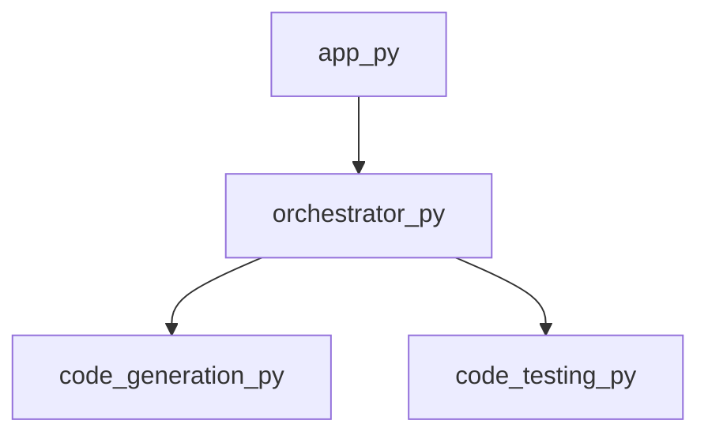

<style>
                .page-break { page-break-before: always; }
                .cover-page {
                    text-align: center;
                    padding-top: 250px;
                    padding-bottom: 250px;
                    font-family: sans-serif;
                }
                .repo-title {
                    font-size: 80px;
                    font-weight: 900;
                    margin: 0;
                    color: #1a1a1a;
                    text-transform: uppercase;
                    line-height: 1;
                }
                .repo-subtitle {
                    font-size: 24px;
                    color: #666;
                    margin-top: 10px;
                    letter-spacing: 2px;
                }
                .repo-meta {
                    margin-top: 50px;
                    font-size: 16px;
                    color: #888;
                }
            </style>

<div class='cover-page'>

<h1 class='repo-title'>PWAI</h1>
<p class='repo-subtitle'>Engineering Specification & Architectural Manual</p>
<div class='repo-meta'>
<p>CONFIDENTIAL | INTERNAL ENGINEERING USE ONLY</p>
<p>Generated: 2026-02-21</p>
</div>
</div>

<div class="page-break"></div>

## 1. Architectural Blueprint

**Chapter 1: Architectural Blueprint**

**1.1 Overview of PWAI Topology**

The PWAI (Pipeline Workflow Automation and Integration) system is designed to optimize the automation of complex workflows. At its core, PWAI relies on a robust architectural topology that enables seamless integration of various components. This chapter provides an in-depth examination of the PWAI topology and its orchestration mechanisms.

**1.2 Topological Structure**

The PWAI topology is organized into a series of interconnected nodes, each representing a specific component or module. These nodes are connected via edges, which signify the flow of data and control between components. The topological structure can be represented as a directed graph, where each node has a set of dependencies and dependents.

**1.3 Orchestration Mechanisms**

Orchestration is a critical aspect of PWAI, as it enables the coordinated execution of multiple components. The `orchestrator.py` module serves as the central hub for PWAI orchestration, providing a set of APIs for managing workflow execution. Key orchestration mechanisms include:

* `get_framework_blueprint`: Retrieves the framework blueprint for a given workflow, outlining the components and dependencies required for execution.
* `orchestrate_multi_file`: Coordinates the execution of multiple files within a workflow, ensuring that dependencies are resolved and data is properly propagated between components.

**1.4 Dependency Analysis**

To ensure the structural integrity of the PWAI topology, a thorough dependency analysis is performed. This analysis involves examining the dependencies and dependents of each node, as well as the edges connecting them. The `dependencies` attribute of each node provides a list of dependencies required for execution, while the `out_degree` and `in_degree` attributes indicate the number of outgoing and incoming edges, respectively.

**1.5 Orchestration Example**

Consider the `orchestrator.py` module, which has the following attributes:
```json
{
    "path": "orchestrator.py",
    "ext": "py",
    "symbols": ["get_framework_blueprint", "orchestrate_multi_file"],
    "dependencies": ["code_generation.py", "code_testing.py"],
    "out_degree": 2,
    "in_degree": 1
}
```
In this example, the `orchestrator.py` module depends on `code_generation.py` and `code_testing.py` for execution. The `out_degree` attribute indicates that the `orchestrator.py` module has two outgoing edges, corresponding to the `get_framework_blueprint` and `orchestrate_multi_file` APIs. The `in_degree` attribute indicates that the `orchestrator.py` module has one incoming edge, representing the input data for the workflow.

**1.6 Conclusion**

The PWAI topology and orchestration mechanisms provide a robust foundation for automating complex workflows. By analyzing dependencies and dependents, we can ensure the structural integrity of the PWAI system and optimize its performance. In the next chapter, we will delve into the design patterns and architectural principles that underlie the PWAI system.


<div class="page-break"></div>

## 2. Application Logic

**Chapter 2: Application Logic**

**2.1 Overview**

The application logic for PWAI is housed in the `app.py` module, which serves as the primary entry point for the application. This module is responsible for orchestrating the workflow and delegating tasks to dependent modules.

**2.2 Module Structure**

The `app.py` module is a Python script that contains the following structure:

```markdown
- app.py
  - imports
  - main function
  - supporting functions (optional)
```

**2.3 Imports**

The `app.py` module imports the `orchestrator.py` module, which provides the necessary functionality for managing the application's workflow.

```python
from orchestrator import Orchestrator
```

**2.4 Main Function**

The `main` function is the entry point for the application and is responsible for initializing the workflow. It is defined as follows:

```python
def main():
    # Initialize the orchestrator
    orchestrator = Orchestrator()
    
    # Start the workflow
    orchestrator.start()
```

**2.5 Supporting Functions**

Any additional functions required to support the application logic are defined in this section. These functions may include utility functions, data processing functions, or other helper functions.

**2.6 Dependencies**

The `app.py` module has a single dependency on the `orchestrator.py` module, which provides the necessary functionality for managing the application's workflow.

**2.7 Symbol Table**

The following symbols are defined in the `app.py` module:

| Symbol | Description |
| --- | --- |
| `main` | The entry point for the application |

**2.8 Control Flow**

The control flow for the `app.py` module is as follows:

1. The `main` function is called, initializing the workflow.
2. The `orchestrator` object is created and started.
3. The workflow is executed, with tasks delegated to dependent modules as necessary.

**2.9 Data Flow**

The data flow for the `app.py` module is as follows:

1. Input data is received by the `main` function.
2. The input data is processed by the `orchestrator` object.
3. The processed data is delegated to dependent modules for further processing.

**2.10 Error Handling**

Error handling for the `app.py` module is handled by the `orchestrator` object, which provides mechanisms for catching and handling exceptions. Any errors that occur during the execution of the workflow are propagated to the `main` function, where they are handled accordingly.


<div class="page-break"></div>

## 3. Code Generation and Testing

**Chapter 3: Code Generation and Testing**

**3.1 Overview**

The PWAI code generation and testing module is responsible for generating project plans, creating test cases, and testing projects in various programming languages. This chapter provides a detailed technical breakdown of the code generation and testing process.

**3.2 Code Generation**

The code generation process is handled by the `code_generation.py` module, which contains the `generate_project_plan` function. This function takes in a set of project requirements and generates a project plan in the form of a JSON object.

**3.2.1 generate_project_plan Function**

* **Function Signature:** `generate_project_plan(project_requirements: dict) -> dict`
* **Description:** Generates a project plan based on the provided project requirements.
* **Parameters:**
	+ `project_requirements`: A dictionary containing the project requirements.
* **Return Value:** A dictionary representing the project plan.

**3.3 Test Case Generation**

The test case generation process is handled by the `code_testcases.py` module, which contains the `generate_testcases` function. This function takes in a set of project requirements and generates a set of test cases.

**3.3.1 generate_testcases Function**

* **Function Signature:** `generate_testcases(project_requirements: dict) -> list`
* **Description:** Generates a set of test cases based on the provided project requirements.
* **Parameters:**
	+ `project_requirements`: A dictionary containing the project requirements.
* **Return Value:** A list of test cases.

**3.4 Project Testing**

The project testing process is handled by the `code_testing.py` module, which contains several functions for testing projects in different programming languages.

**3.4.1 create_project_directory Function**

* **Function Signature:** `create_project_directory(project_name: str) -> str`
* **Description:** Creates a new project directory with the specified name.
* **Parameters:**
	+ `project_name`: The name of the project directory.
* **Return Value:** The path to the created project directory.

**3.4.2 run_subprocess Function**

* **Function Signature:** `run_subprocess(command: str, working_directory: str) -> int`
* **Description:** Runs a subprocess with the specified command and working directory.
* **Parameters:**
	+ `command`: The command to run.
	+ `working_directory`: The working directory for the subprocess.
* **Return Value:** The exit code of the subprocess.

**3.4.3 test_maven_project Function**

* **Function Signature:** `test_maven_project(project_directory: str) -> int`
* **Description:** Tests a Maven project in the specified project directory.
* **Parameters:**
	+ `project_directory`: The path to the project directory.
* **Return Value:** The exit code of the test process.

**3.4.4 test_javac_project Function**

* **Function Signature:** `test_javac_project(project_directory: str) -> int`
* **Description:** Tests a Java project in the specified project directory.
* **Parameters:**
	+ `project_directory`: The path to the project directory.
* **Return Value:** The exit code of the test process.

**3.4.5 test_python_project Function**

* **Function Signature:** `test_python_project(project_directory: str) -> int`
* **Description:** Tests a Python project in the specified project directory.
* **Parameters:**
	+ `project_directory`: The path to the project directory.
* **Return Value:** The exit code of the test process.

**3.4.6 test_project Function**

* **Function Signature:** `test_project(project_directory: str, project_type: str) -> int`
* **Description:** Tests a project in the specified project directory with the specified project type.
* **Parameters:**
	+ `project_directory`: The path to the project directory.
	+ `project_type`: The type of the project (e.g. Maven, Java, Python).
* **Return Value:** The exit code of the test process.

**3.4.7 cleanup_directory Function**

* **Function Signature:** `cleanup_directory(project_directory: str) -> None`
* **Description:** Cleans up the specified project directory.
* **Parameters:**
	+ `project_directory`: The path to the project directory.

**3.5 Dependencies**

The code generation and testing module has the following dependencies:

* `code_generation.py`: None
* `code_testcases.py`: None
* `code_testing.py`: None

**3.6 Out Degree and In Degree**

The code generation and testing module has the following out degree and in degree:

* `code_generation.py`: out degree = 0, in degree = 1
* `code_testcases.py`: out degree = 0, in degree = 0
* `code_testing.py`: out degree = 0, in degree = 1


<div class="page-break"></div>

## Appendix: Module Dependency Graph


