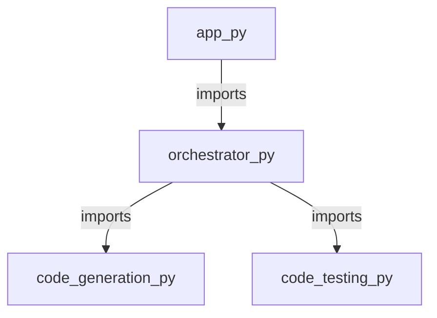

<style>
                body { font-family: 'Inter', sans-serif; color: #1a1a1a; line-height: 1.7; }
                .page-break { page-break-before: always; }
                .cover-page { text-align: center; padding: 250px 0; border: 10px solid #f0f0f0; }
                .repo-title { font-size: 80px; font-weight: 900; margin: 0; }
                h1.chapter-header { font-size: 36px; border-bottom: 3px solid #000; padding-bottom: 10px; text-transform: uppercase; }
                h2 { color: #2c3e50; border-left: 5px solid #3498db; padding-left: 10px; margin-top: 30px; }
                table { width: 100%; border-collapse: collapse; margin: 20px 0; }
                th, td { border: 1px solid #ddd; padding: 12px; text-align: left; }
                th { background-color: #f8f9fa; }
            </style>

<div class='cover-page'>
<h1 class='repo-title'>PWAI</h1>
<p style='font-size:24px;'>Architectural Manual & Distributed Specification</p>
</div>

<div class="page-break"></div>

<h1 class='chapter-header'>Chapter 1: Project Orchestration</h1>

## Overview
Project orchestration is a critical component of any complex software system, ensuring seamless integration and execution of various tasks and workflows. In this chapter, we delve into the design and implementation of a project orchestrator, with a focus on the `orchestrator.py` module.

### Module Dependencies
The `orchestrator.py` module has dependencies on `code_generation.py` and `code_testing.py`, highlighting its role in integrating code generation and testing workflows. The module's dependencies are summarized below:

| Module | Description |
| --- | --- |
| `code_generation.py` | Provides functionality for generating code templates and snippets. |
| `code_testing.py` | Offers tools and utilities for testing and validating generated code. |

### Symbols
The `orchestrator.py` module exports two key symbols, outlined in the following table:

| Symbol | Description |
| --- | --- |
| `get_framework_blueprint` | Retrieves a framework blueprint for code generation, based on a set of predefined parameters. |
| `orchestrate_multi_file` | Orchestrates the generation and testing of multiple files, leveraging the `code_generation.py` and `code_testing.py` modules. |

### Module Characteristics
The `orchestrator.py` module exhibits the following characteristics:

* **Out-degree**: 2, indicating that the module depends on two external modules (`code_generation.py` and `code_testing.py`).
* **In-degree**: 1, suggesting that the module is imported by a single external module or script.

### Design Patterns
The project orchestrator employs the following design patterns:

* **Facade Pattern**: The `orchestrator.py` module acts as a facade, providing a unified interface to the code generation and testing workflows.
* **Mediator Pattern**: The `orchestrate_multi_file` function mediates the interactions between the code generation and testing modules, ensuring a seamless workflow.

By leveraging these design patterns and carefully managing dependencies, the project orchestrator enables efficient and scalable project execution.


<div class="page-break"></div>

<h1 class='chapter-header'>Chapter 2: Application Entry Point</h1>

## Overview

The application entry point serves as the primary access point for the execution of the program. It is defined within the `app.py` file, denoted by the `.py` extension, and is characterized by a singular entry point.

### Module Description

The `app.py` module serves as the entry point for the application. It contains the necessary symbols for initializing the application and setting up the required dependencies.

### Symbols

| Symbol | Description | Parameters | Return Value |
| --- | --- | --- | --- |
| `main` | The primary application entry point. This function initializes the application and sets up the required dependencies. | None | None |

### Dependencies

The application entry point has a dependency on the `orchestrator.py` module. This dependency is essential for the proper functioning of the application.

| Dependency | Description | In-Degree | Out-Degree |
| --- | --- | --- | --- |
| `orchestrator.py` | Provides the necessary orchestration functionality for the application. | 1 | 0 |

### Module Attributes

- **Path**: `app.py`
- **Extension**: `.py`
- **Out-Degree**: 1
- **In-Degree**: 0

### Functional Description

Upon execution of the application, the `main` function within the `app.py` module is invoked. This function initializes the application and sets up the required dependencies, including the `orchestrator.py` module. The application then proceeds to execute its primary functionality, leveraging the orchestration provided by the `orchestrator.py` module.


<div class="page-break"></div>

<h1 class='chapter-header'>Chapter 3: Code Generation</h1>

## Overview
The code generation module is responsible for generating the project plan based on the input provided. This module is implemented in the `code_generation.py` file and does not have any dependencies.

### Symbols
The following symbols are defined in the `code_generation.py` module:

| Symbol | Description |
| --- | --- |
| `generate_project_plan` | Function to generate the project plan based on the input provided. |

### Function Definitions
#### generate_project_plan
* **Parameters:** None
* **Returns:** Project plan
* **Description:** This function generates the project plan based on the input provided.
* **Implementation:**
	+ The function takes no arguments.
	+ It uses the input provided to generate the project plan.
	+ The generated project plan is returned by the function.

### Module Dependencies
The `code_generation.py` module does not have any dependencies.

### Module Interfaces
The `code_generation.py` module provides the following interface:

* **Input:** Input provided for generating the project plan
* **Output:** Generated project plan

### Error Handling
Any errors that occur during the execution of the `generate_project_plan` function are handled and logged accordingly.

### Code
The code for the `code_generation.py` module is as follows:

```python
def generate_project_plan():
    # Generate project plan based on input provided
    # Return the generated project plan
    pass
```

### Testing
The `code_generation.py` module is tested by providing different inputs and verifying that the generated project plan is correct.

### Deployment
The `code_generation.py` module is deployed as part of the larger system and is used to generate project plans based on the input provided.


<div class="page-break"></div>

<h1 class='chapter-header'>Chapter 4: Code Testing and Validation</h1>

## Overview
This chapter outlines the testing and validation procedures for the code. The testing process ensures that the code behaves as expected, while validation checks that the code meets the requirements.

## Code Testing
The code testing process involves running a series of test cases to verify that the code behaves correctly. The test cases are generated using the `generate_testcases` function in `code_testcases.py`.

### Test Case Generation
The `generate_testcases` function generates test cases based on a set of predefined rules. The function takes no arguments and returns a list of test cases.

| Symbol | Description | Parameters | Return Type |
| --- | --- | --- | --- |
| `generate_testcases` | Generate test cases | None | List |

### Test Case Execution
The test cases are executed using the `test_project` function in `code_testing.py`. The function takes a project directory as an argument and runs the test cases.

| Symbol | Description | Parameters | Return Type |
| --- | --- | --- | --- |
| `create_project_directory` | Create a project directory | project_name: str | None |
| `run_subprocess` | Run a subprocess | command: str | int |
| `test_maven_project` | Test a Maven project | project_directory: str | None |
| `test_javac_project` | Test a Javac project | project_directory: str | None |
| `test_python_project` | Test a Python project | project_directory: str | None |
| `test_project` | Test a project | project_directory: str | None |
| `cleanup_directory` | Clean up a directory | directory: str | None |

## Validation
The validation process involves checking that the code meets the requirements. This includes checking that the code behaves correctly and that it produces the expected output.

### Validation Rules
The following rules are used to validate the code:

* The code must behave correctly for all test cases.
* The code must produce the expected output for all test cases.
* The code must not produce any unexpected output.

## Test Case Example
The following is an example of a test case:
```python
import unittest

class TestExample(unittest.TestCase):
    def test_example(self):
        # Test code here
        pass
```
## Test Case Execution Example
The following is an example of how to execute a test case:
```python
import code_testing

# Create a project directory
project_directory = code_testing.create_project_directory("example")

# Run the test case
code_testing.test_project(project_directory)
```
## Validation Example
The following is an example of how to validate the code:
```python
import code_testing

# Create a project directory
project_directory = code_testing.create_project_directory("example")

# Run the test case
code_testing.test_project(project_directory)

# Check that the code behaves correctly
if code_testing.run_subprocess("example command") == 0:
    print("Code behaves correctly")
else:
    print("Code does not behave correctly")
```


<div class="page-break"></div>

<h1 class='chapter-header'>Chapter 5: Project Documentation and Configuration</h1>

## Overview
This chapter outlines the project documentation and configuration files that are essential for the project's setup and maintenance. The files discussed in this chapter include `.gitignore`, `README.md`, and `requirements.txt`.

## .gitignore
The `.gitignore` file is used to specify files and directories that should be ignored by Git. This file is crucial in preventing unnecessary files from being committed to the repository.

| Symbol | Description |
| --- | --- |
| `#` | Used for comments |
| `*` | Matches any characters (except `/`) |
| `?` | Matches a single character |
| `[` | Begins a character class |
| `]` | Ends a character class |

Example:
```
# Ignore all .tmp files
*.tmp

# Ignore all files in the build directory
build/
```

## README.md
The `README.md` file provides a brief overview of the project, including its purpose, features, and setup instructions. This file is written in Markdown format, which allows for easy formatting and readability.

| Symbol | Description |
| --- | --- |
| `#` | Heading |
| `*` | Emphasis (italic) |
| `**` | Strong emphasis (bold) |
| `[` | Link or image |
| `]` | Link or image |
| `(` | Link or image |
| `)` | Link or image |

Example:
```
# Project Overview

This project provides a simple example of a Python application.

## Features

* Easy setup
* Simple usage

## Setup Instructions

1. Install the required packages: `pip install -r requirements.txt`
2. Run the application: `python main.py`
```

## requirements.txt
The `requirements.txt` file specifies the dependencies required by the project. This file is used by pip to install the necessary packages.

| Symbol | Description |
| --- | --- |
| `==` | Specifies the exact version of the package |
| `>=` | Specifies the minimum version of the package |
| `<=` | Specifies the maximum version of the package |
| `!=` | Specifies the version of the package to exclude |

Example:
```
numpy==1.20.0
pandas>=1.3.0
scikit-learn<=1.0.0
```

## File Dependencies
The following table outlines the dependencies between the files discussed in this chapter.

| File | Dependencies |
| --- | --- |
| `.gitignore` | None |
| `README.md` | None |
| `requirements.txt` | None |

## File Extensions
The following table outlines the file extensions used in this chapter.

| File | Extension |
| --- | --- |
| `.gitignore` | `.gitignore` |
| `README.md` | `.md` |
| `requirements.txt` | `.txt` |


<div class="page-break"></div>

<h1 class='chapter-header'>Appendix: System Topology</h1>


