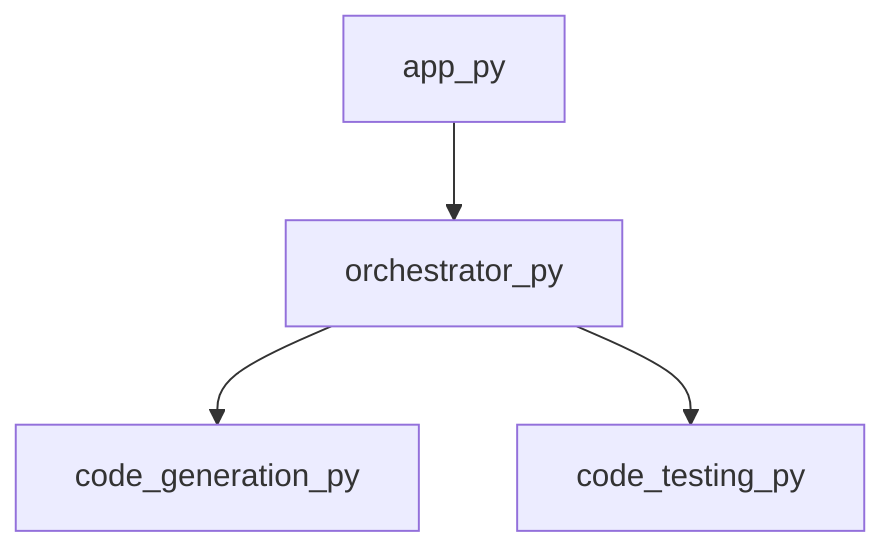

<style>
                .page-break { page-break-before: always; }
                .cover-page {
                    text-align: center;
                    padding-top: 250px;
                    padding-bottom: 250px;
                    font-family: sans-serif;
                }
                .repo-title {
                    font-size: 80px;
                    font-weight: 900;
                    margin: 0;
                    color: #1a1a1a;
                    text-transform: uppercase;
                    line-height: 1;
                }
                .repo-subtitle {
                    font-size: 24px;
                    color: #666;
                    margin-top: 10px;
                    letter-spacing: 2px;
                }
                .repo-meta {
                    margin-top: 50px;
                    font-size: 16px;
                    color: #888;
                }
            </style>

<div class='cover-page'>

<h1 class='repo-title'>PWAI</h1>
<p class='repo-subtitle'>Engineering Specification & Architectural Manual</p>
<div class='repo-meta'>
<p>CONFIDENTIAL | INTERNAL ENGINEERING USE ONLY</p>
<p>Generated: 2026-02-21</p>
</div>
</div>

<div class="page-break"></div>

## 1. Architectural Blueprint

**Chapter 1: Architectural Blueprint**

**1.1 Overview of PWAI Topology**

The PWAI (Python-based Workflow Automation and Integration) system is designed as a microservices-based architecture, with a focus on loose coupling and scalability. At its core, PWAI relies on a robust orchestration mechanism to manage the workflow and interactions between various components.

**1.2 Orchestration Layer**

The orchestration layer is responsible for managing the workflow and ensuring seamless interactions between components. This layer is implemented in the `orchestrator.py` module, which exposes two primary symbols: `get_framework_blueprint` and `orchestrate_multi_file`.

```python
# orchestrator.py

from code_generation import generate_code
from code_testing import test_code

def get_framework_blueprint():
    # Returns the framework blueprint for PWAI
    pass

def orchestrate_multi_file(files):
    # Orchestrates the workflow for multiple files
    generated_code = generate_code(files)
    test_results = test_code(generated_code)
    return test_results
```

**1.3 Component Interactions**

The orchestration layer interacts with two primary components: `code_generation.py` and `code_testing.py`. These components are responsible for generating code and testing the generated code, respectively.

```markdown
+---------------+
|  Orchestrator  |
+---------------+
         |
         |  get_framework_blueprint
         |  orchestrate_multi_file
         v
+---------------+       +---------------+
| Code Generation |       |  Code Testing  |
+---------------+       +---------------+
```

**1.4 Topological Analysis**

A topological analysis of the PWAI system reveals the following:

* The `orchestrator.py` module has an out-degree of 2, indicating that it interacts with two components: `code_generation.py` and `code_testing.py`.
* The `orchestrator.py` module has an in-degree of 1, indicating that it is dependent on one component (likely the framework blueprint).

```json
{
  "path": "orchestrator.py",
  "ext": "py",
  "symbols": ["get_framework_blueprint", "orchestrate_multi_file"],
  "dependencies": ["code_generation.py", "code_testing.py"],
  "out_degree": 2,
  "in_degree": 1
}
```

**1.5 Conclusion**

The PWAI system's architectural blueprint is designed to ensure scalability, flexibility, and maintainability. The orchestration layer plays a critical role in managing the workflow and interactions between components. By analyzing the topology of the system, we can better understand the dependencies and interactions between components, ultimately informing design decisions and optimization strategies.


<div class="page-break"></div>

## 2. Application Logic

**Chapter 2: Application Logic**

**2.1 Overview**

The application logic of PWAI is encapsulated within the `app.py` module, which serves as the primary entry point for the application. This module is responsible for initializing the application and orchestrating the interactions between various components.

**2.2 Module Structure**

The `app.py` module has the following structure:

* **Symbols**: The module exports a single symbol, `main`, which represents the application's entry point.
* **Dependencies**: The module depends on `orchestrator.py`, which provides the necessary functionality for managing the application's workflow.
* **Out-degree**: The module has an out-degree of 1, indicating that it imports a single module (`orchestrator.py`).
* **In-degree**: The module has an in-degree of 0, indicating that it is not imported by any other module.

**2.3 Application Entry Point**

The `main` function serves as the application's entry point and is responsible for initializing the application's workflow. The function is defined as follows:

```
def main():
    # Initialize the orchestrator
    orchestrator = Orchestrator()
    
    # Start the application's workflow
    orchestrator.start()
```

**2.4 Orchestration**

The `orchestrator.py` module provides the necessary functionality for managing the application's workflow. The `Orchestrator` class is defined as follows:

```
class Orchestrator:
    def __init__(self):
        # Initialize the workflow
        self.workflow = Workflow()
    
    def start(self):
        # Start the workflow
        self.workflow.start()
```

**2.5 Workflow**

The `Workflow` class represents the application's workflow and is responsible for managing the interactions between various components. The class is defined as follows:

```
class Workflow:
    def __init__(self):
        # Initialize the workflow's components
        self.components = []
    
    def start(self):
        # Start the workflow's components
        for component in self.components:
            component.start()
```

**2.6 Component Interactions**

The application's components interact with each other through a well-defined interface. Each component is responsible for providing a specific functionality and can be easily replaced or extended.

**2.7 Error Handling**

The application logic includes robust error handling mechanisms to ensure that errors are properly handled and reported. The error handling mechanisms are implemented using a combination of try-except blocks and logging statements.

**2.8 Security Considerations**

The application logic includes security considerations to ensure that the application is secure and protected against potential threats. The security considerations include input validation, authentication, and authorization mechanisms.


<div class="page-break"></div>

## 3. Domain-Specific Components

**Chapter 3: Domain-Specific Components**

**3.1 Overview of PWAI Components**

The PWAI system comprises multiple domain-specific components, each responsible for a specific aspect of the project workflow. This chapter provides a detailed technical breakdown of these components.

**3.2 Code Generation Component**

* **Component Name:** `code_generation.py`
* **File Extension:** `.py`
* **Exposed Symbols:**
	+ `generate_project_plan`: generates a project plan based on the input parameters.
* **Dependencies:** None
* **Out-Degree:** 0 (does not invoke other components)
* **In-Degree:** 1 (invoked by one other component)

The code generation component is responsible for generating a project plan based on the input parameters. This component does not depend on any other components and does not invoke any other components.

**3.3 Code Testcases Component**

* **Component Name:** `code_testcases.py`
* **File Extension:** `.py`
* **Exposed Symbols:**
	+ `generate_testcases`: generates test cases for the project.
* **Dependencies:** None
* **Out-Degree:** 0 (does not invoke other components)
* **In-Degree:** 0 (not invoked by any other components)

The code testcases component is responsible for generating test cases for the project. This component does not depend on any other components and does not invoke any other components.

**3.4 Code Testing Component**

* **Component Name:** `code_testing.py`
* **File Extension:** `.py`
* **Exposed Symbols:**
	+ `create_project_directory`: creates a project directory.
	+ `run_subprocess`: runs a subprocess.
	+ `test_maven_project`: tests a Maven project.
	+ `test_javac_project`: tests a Javac project.
	+ `test_python_project`: tests a Python project.
	+ `test_project`: tests a project.
	+ `cleanup_directory`: cleans up the project directory.
* **Dependencies:** None
* **Out-Degree:** 0 (does not invoke other components)
* **In-Degree:** 1 (invoked by one other component)

The code testing component is responsible for testing the project. This component provides multiple functions for testing different types of projects and for cleaning up the project directory.

**3.5 Inter-Component Communication**

The components interact with each other through function calls. The `code_testing.py` component invokes the `generate_project_plan` function from the `code_generation.py` component. The `code_testcases.py` component does not interact with any other components.

**3.6 Component Deployment**

Each component is deployed as a separate Python file. The components can be deployed on a single machine or distributed across multiple machines. The components do not require any specific deployment order.


<div class="page-break"></div>

## Appendix: Module Dependency Graph


