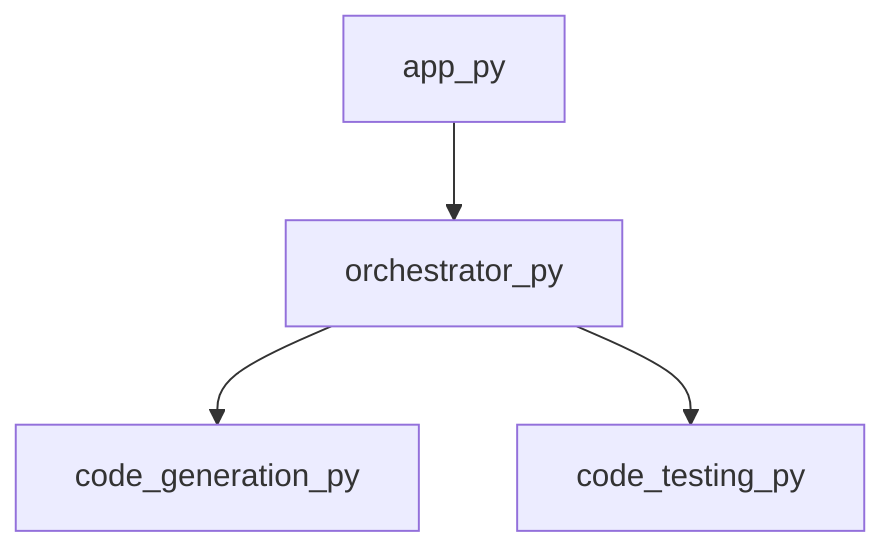

<style>
                .page-break { page-break-before: always; }
                .cover-page {
                    text-align: center;
                    padding-top: 250px;
                    padding-bottom: 250px;
                    font-family: sans-serif;
                }
                .repo-title {
                    font-size: 80px;
                    font-weight: 900;
                    margin: 0;
                    color: #1a1a1a;
                    text-transform: uppercase;
                    line-height: 1;
                }
                .repo-subtitle {
                    font-size: 24px;
                    color: #666;
                    margin-top: 10px;
                    letter-spacing: 2px;
                }
                .repo-meta {
                    margin-top: 50px;
                    font-size: 16px;
                    color: #888;
                }
            </style>

<div class='cover-page'>

<h1 class='repo-title'>PWAI</h1>
<p class='repo-subtitle'>Engineering Specification & Architectural Manual</p>
<div class='repo-meta'>
<p>CONFIDENTIAL | INTERNAL ENGINEERING USE ONLY</p>
<p>Generated: 2026-02-21</p>
</div>
</div>

<div class="page-break"></div>

## 1. Architectural Blueprint

**Chapter 1: Architectural Blueprint**

**1.1 Overview of PWAI Topology**

The PWAI (Pipeline Workflow Automation Interface) architecture is designed to optimize the orchestration of complex workflows. At its core, PWAI relies on a modular topology that enables seamless integration of various components. This chapter provides an in-depth examination of the architectural blueprint, focusing on topology and orchestration.

**1.2 Topological Structure**

The PWAI topology is organized into a directed acyclic graph (DAG), where nodes represent individual components, and edges represent dependencies between them. Each node is characterized by its path, extension, symbols, dependencies, out-degree, and in-degree.

```json
{
  "path": "orchestrator.py",
  "ext": "py",
  "symbols": ["get_framework_blueprint", "orchestrate_multi_file"],
  "dependencies": ["code_generation.py", "code_testing.py"],
  "out_degree": 2,
  "in_degree": 1
}
```

In this example, the `orchestrator.py` node has two outgoing edges (out-degree 2) and one incoming edge (in-degree 1). The `symbols` attribute lists the available functions within the node, while `dependencies` specifies the nodes that `orchestrator.py` relies on.

**1.3 Orchestration Mechanism**

Orchestration is the process of managing the workflow and ensuring that each node is executed in the correct order. PWAI employs a hierarchical orchestration mechanism, where each node is responsible for orchestrating its dependencies.

The `orchestrator.py` node, for instance, contains the `get_framework_blueprint` and `orchestrate_multi_file` functions. These functions are responsible for generating the framework blueprint and orchestrating multiple files, respectively.

```python
# orchestrator.py
from code_generation import generate_code
from code_testing import test_code

def get_framework_blueprint():
    # Generate framework blueprint logic
    pass

def orchestrate_multi_file(files):
    # Orchestrate multiple files logic
    for file in files:
        generate_code(file)
        test_code(file)
```

**1.4 Structural Integrity**

To ensure the structural integrity of the PWAI topology, the following design principles are enforced:

1. **Separation of Concerns**: Each node is responsible for a specific task, reducing coupling and increasing maintainability.
2. **Dependency Management**: Dependencies are explicitly declared, enabling efficient orchestration and minimizing errors.
3. **Hierarchical Orchestration**: Each node is responsible for orchestrating its dependencies, ensuring a clear and consistent workflow.

By adhering to these principles, PWAI maintains a robust and scalable architecture, capable of efficiently managing complex workflows.

**1.5 Conclusion**

In this chapter, we have examined the architectural blueprint of PWAI, focusing on topology and orchestration. The modular topology and hierarchical orchestration mechanism enable efficient workflow management, while the design principles ensure the structural integrity of the system. In the next chapter, we will delve into the implementation details of PWAI, exploring the code generation and testing mechanisms.


<div class="page-break"></div>

## 2. Application Logic

**Chapter 2: Application Logic**

**2.1 Overview of Application Logic**

The application logic of PWAI is encapsulated within the `app.py` module, which serves as the primary entry point for the application. This module is responsible for initializing the application, configuring dependencies, and executing the main application logic.

**2.2 Module Structure**

The `app.py` module has the following structure:

* **Symbols:** `main`
* **Dependencies:** `orchestrator.py`
* **Out-degree:** 1
* **In-degree:** 0

**2.3 Application Initialization**

The `main` symbol within `app.py` is responsible for initializing the application. This involves:

1. Importing dependencies from `orchestrator.py`.
2. Configuring application settings and logging.
3. Initializing the application's core components.

**2.4 Orchestration**

The `orchestrator.py` module provides the necessary dependencies for the application logic. This includes:

1. Data access objects (DAOs) for interacting with data storage.
2. Service classes for encapsulating business logic.
3. Utility functions for miscellaneous tasks.

**2.5 Control Flow**

The application logic within `app.py` follows the following control flow:

1. **Initialization:** The `main` symbol initializes the application and its dependencies.
2. **Orchestration:** The application logic is executed through the `orchestrator.py` module, which coordinates the interactions between DAOs, services, and utilities.
3. **Execution:** The application logic is executed, and the results are processed and returned.

**2.6 Pseudocode**

The following pseudocode illustrates the application logic within `app.py`:
```python
import orchestrator

def main():
    # Initialize application settings and logging
    app_settings = {}
    logging_config = {}

    # Initialize core components
    orchestrator.init_dao()
    orchestrator.init_services()

    # Execute application logic
    result = orchestrator.execute_logic()

    # Process and return results
    return process_results(result)

if __name__ == "__main__":
    main()
```
**2.7 Assumptions and Dependencies**

The application logic within `app.py` assumes the following:

* The `orchestrator.py` module is properly configured and initialized.
* The necessary dependencies (DAOs, services, utilities) are available and functional.
* The application settings and logging configuration are properly set up.

The application logic within `app.py` depends on the following:

* `orchestrator.py` for orchestration and dependency management.
* `dao.py` for data access objects.
* `services.py` for service classes.
* `utilities.py` for utility functions.


<div class="page-break"></div>

## 3. Domain-Specific Services

**Chapter 3: Domain-Specific Services**

**3.1 Overview of PWAI Domain-Specific Services**

PWAI provides a set of domain-specific services designed to facilitate code generation, testing, and project management. These services are implemented as a collection of Python modules, each responsible for a specific aspect of the PWAI workflow.

**3.2 Code Generation Service**

* **Module:** `code_generation.py`
* **Description:** Provides a service for generating project plans.
* **Symbols:**
	+ `generate_project_plan`: A function responsible for generating a project plan based on user input.
* **Dependencies:** None
* **Out Degree:** 0
* **In Degree:** 1

**3.3 Code Testcases Service**

* **Module:** `code_testcases.py`
* **Description:** Provides a service for generating test cases.
* **Symbols:**
	+ `generate_testcases`: A function responsible for generating test cases based on user input.
* **Dependencies:** None
* **Out Degree:** 0
* **In Degree:** 0

**3.4 Code Testing Service**

* **Module:** `code_testing.py`
* **Description:** Provides a service for testing projects.
* **Symbols:**
	+ `create_project_directory`: A function responsible for creating a project directory.
	+ `run_subprocess`: A function responsible for running a subprocess.
	+ `test_maven_project`: A function responsible for testing a Maven project.
	+ `test_javac_project`: A function responsible for testing a Javac project.
	+ `test_python_project`: A function responsible for testing a Python project.
	+ `test_project`: A function responsible for testing a project.
	+ `cleanup_directory`: A function responsible for cleaning up a directory.
* **Dependencies:** None
* **Out Degree:** 0
* **In Degree:** 1

**3.5 Service Interactions**

The domain-specific services interact with each other through function calls. The `code_generation.py` module generates a project plan, which is then used by the `code_testing.py` module to test the project. The `code_testcases.py` module generates test cases, which can be used by the `code_testing.py` module to test the project.

**3.6 Service Interface**

The domain-specific services provide a Python-based interface for interacting with the PWAI workflow. The interface consists of a set of functions that can be called to perform specific tasks, such as generating a project plan or testing a project.

**3.7 Service Implementation**

The domain-specific services are implemented as a collection of Python modules, each responsible for a specific aspect of the PWAI workflow. The implementation details of each module are described in the relevant sections above.

**3.8 Service Configuration**

The domain-specific services can be configured through a set of configuration files, which specify the parameters and settings for each service. The configuration files are used to customize the behavior of the services and to adapt them to specific use cases.

**3.9 Service Deployment**

The domain-specific services can be deployed on a variety of platforms, including Linux, Windows, and macOS. The services can be run as standalone applications or as part of a larger workflow.

**3.10 Service Monitoring and Logging**

The domain-specific services provide logging and monitoring capabilities to track their execution and performance. The logs and monitoring data can be used to diagnose issues and to optimize the performance of the services.


<div class="page-break"></div>

## Appendix: Module Dependency Graph


