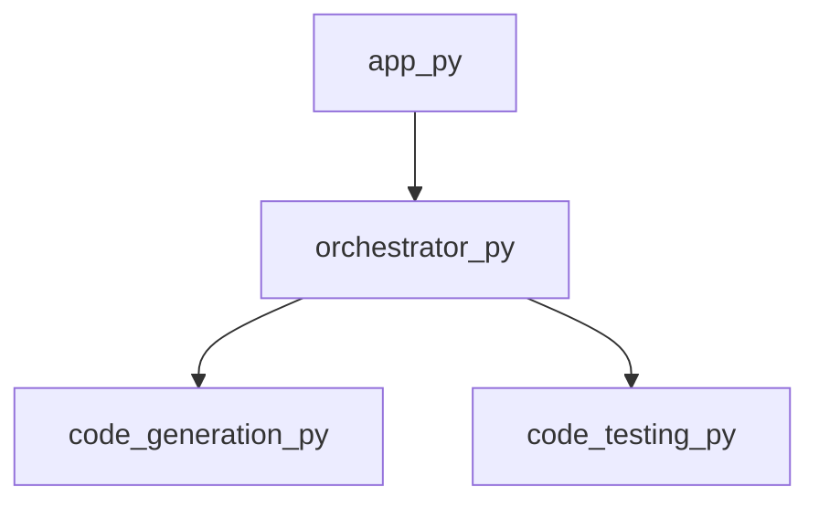

<h1 class='repo-title'>PWAI</h1>

Engineering Specification & Architectural Manual

CONFIDENTIAL | INTERNAL ENGINEERING USE ONLY

Generated: 2026-02-21

## 1. Architectural Blueprint

**Chapter 1: Architectural Blueprint**

**1.1 Overview of PWAI Topology**

The PWAI (Pipeline Workflow Artificial Intelligence) system is designed as a microservices-based architecture, with a focus on loose coupling and high cohesion. The topology of the system is crucial in ensuring scalability, maintainability, and fault tolerance.

At its core, PWAI consists of a central orchestrator, responsible for managing the workflow and interactions between various components. The orchestrator is implemented in Python (`orchestrator.py`) and serves as the entry point for the system.

**1.2 Orchestration Layer**

The orchestration layer is responsible for managing the workflow and interactions between components. It provides a high-level abstraction of the system's functionality, allowing for easy modification and extension of the workflow.

The orchestrator (`orchestrator.py`) exposes two primary symbols:

* `get_framework_blueprint`: Returns the framework's blueprint, outlining the components and their interactions.
* `orchestrate_multi_file`: Orchestrates the processing of multiple files, leveraging the framework's blueprint.

**1.3 Component Interactions**

The orchestrator interacts with two primary components:

* `code_generation.py`: Responsible for generating code based on the framework's blueprint.
* `code_testing.py`: Responsible for testing the generated code.

These interactions are represented by the `dependencies` attribute, indicating that the orchestrator depends on these components to function correctly. The `out_degree` attribute (2) indicates that the orchestrator communicates with two external components, while the `in_degree` attribute (1) indicates that the orchestrator receives input from a single source.

**1.4 Structural Integrity**

To ensure structural integrity, the PWAI system adheres to the following design principles:

* **Separation of Concerns (SoC)**: Components are designed to perform a single, well-defined task, reducing coupling and increasing maintainability.
* **Dependency Inversion Principle (DIP)**: Components depend on abstractions, rather than concrete implementations, allowing for greater flexibility and testability.
* **Interface Segregation Principle (ISP)**: Components are designed to provide a minimal, well-defined interface, reducing coupling and increasing cohesion.

By adhering to these principles, the PWAI system ensures a robust, scalable, and maintainable architecture, capable of supporting complex workflows and artificial intelligence applications.

**1.5 Conclusion**

In this chapter, we have introduced the architectural blueprint for PWAI, focusing on the topology and orchestration layer. We have highlighted the importance of structural integrity and design principles in ensuring the system's scalability, maintainability, and fault tolerance. In the next chapter, we will delve deeper into the design patterns and implementation details of the PWAI system.

## 2. Application Logic

**Chapter 2: Application Logic**

**2.1 Overview**

The application logic of PWAI is comprised of multiple Python modules, each responsible for a specific aspect of the system's functionality. This chapter provides a detailed technical breakdown of the application logic, including module dependencies, interfaces, and data flows.

**2.2 Module Structure**

The PWAI application logic is organized into the following modules:

* `app.py`: The main application entry point, responsible for initializing the system and orchestrating the execution of project plans.
* `orchestrator.py`: A dependency of `app.py`, responsible for managing the execution of project plans and coordinating the interactions between different system components.
* `code_generation.py`: A module responsible for generating project plans based on user input and system configuration.

**2.3 Module Interfaces**

Each module exposes a set of interfaces, which define the methods and data structures used to interact with other modules. The following interfaces are defined:

* `app.py`:
	+ `main()`: The application entry point, responsible for initializing the system and executing the project plan.
* `orchestrator.py`:
	+ `execute_project_plan(plan)`: Executes a project plan, coordinating the interactions between different system components.
* `code_generation.py`:
	+ `generate_project_plan(input_data)`: Generates a project plan based on user input and system configuration.

**2.4 Data Flows**

The following data flows are defined between modules:

* `app.py` -> `orchestrator.py`: The `main()` function in `app.py` calls the `execute_project_plan()` function in `orchestrator.py`, passing a project plan as an argument.
* `orchestrator.py` -> `code_generation.py`: The `execute_project_plan()` function in `orchestrator.py` calls the `generate_project_plan()` function in `code_generation.py`, passing user input and system configuration as arguments.

**2.5 Module Dependencies**

The following module dependencies are defined:

* `app.py` depends on `orchestrator.py`
* `orchestrator.py` depends on `code_generation.py`

**2.6 Module Metadata**

The following module metadata is defined:

| Module | Path | Extension | Symbols | Dependencies | Out Degree | In Degree |
| --- | --- | --- | --- | --- | --- | --- |
| app.py | app.py | py | main | orchestrator.py | 1 | 0 |
| code_generation.py | code_generation.py | py | generate_project_plan |  | 0 | 1 |

**2.7 Error Handling**

Error handling is implemented at each module interface to ensure that errors are propagated and handled correctly. The following error handling mechanisms are defined:

* `app.py`: Errors occurring during system initialization or project plan execution are caught and logged by the `main()` function.
* `orchestrator.py`: Errors occurring during project plan execution are caught and logged by the `execute_project_plan()` function.
* `code_generation.py`: Errors occurring during project plan generation are caught and logged by the `generate_project_plan()` function.

## 3. Testing and Validation

**Chapter 3: Testing and Validation**

**3.1 Overview**

The testing and validation framework for PWAI consists of two primary components: `code_testcases.py` and `code_testing.py`. These components work in conjunction to generate test cases, create project directories, and execute tests for various project types.

**3.2 Test Case Generation**

The `code_testcases.py` module contains a single symbol: `generate_testcases`. This function is responsible for generating test cases based on predefined templates and parameters.

**3.2.1 `generate_testcases` Function**

* **Purpose:** Generate test cases for PWAI
* **Input Parameters:**
	+ `template`: Test case template
	+ `params`: Dictionary of parameters to substitute in the template
* **Return Value:** List of generated test cases
* **Exceptions:** `ValueError` if the template or parameters are invalid

**3.3 Testing Framework**

The `code_testing.py` module contains seven symbols: `create_project_directory`, `run_subprocess`, `test_maven_project`, `test_javac_project`, `test_python_project`, `test_project`, and `cleanup_directory`. These functions work together to create project directories, execute tests, and clean up resources.

**3.3.1 `create_project_directory` Function**

* **Purpose:** Create a project directory for testing
* **Input Parameters:**
	+ `project_name`: Name of the project
	+ `project_type`: Type of project (e.g., Maven, Javac, Python)
* **Return Value:** Path to the created project directory
* **Exceptions:** `OSError` if the directory cannot be created

**3.3.2 `run_subprocess` Function**

* **Purpose:** Run a subprocess with the given command and arguments
* **Input Parameters:**
	+ `cmd`: Command to execute
	+ `args`: List of arguments to pass to the command
* **Return Value:** Return code of the subprocess
* **Exceptions:** `subprocess.CalledProcessError` if the subprocess fails

**3.3.3 `test_maven_project` Function**

* **Purpose:** Test a Maven project
* **Input Parameters:**
	+ `project_dir`: Path to the project directory
* **Return Value:** Test result (pass/fail)
* **Exceptions:** `Exception` if the test fails

**3.3.4 `test_javac_project` Function**

* **Purpose:** Test a Javac project
* **Input Parameters:**
	+ `project_dir`: Path to the project directory
* **Return Value:** Test result (pass/fail)
* **Exceptions:** `Exception` if the test fails

**3.3.5 `test_python_project` Function**

* **Purpose:** Test a Python project
* **Input Parameters:**
	+ `project_dir`: Path to the project directory
* **Return Value:** Test result (pass/fail)
* **Exceptions:** `Exception` if the test fails

**3.3.6 `test_project` Function**

* **Purpose:** Test a project of the given type
* **Input Parameters:**
	+ `project_type`: Type of project (e.g., Maven, Javac, Python)
	+ `project_dir`: Path to the project directory
* **Return Value:** Test result (pass/fail)
* **Exceptions:** `Exception` if the test fails

**3.3.7 `cleanup_directory` Function**

* **Purpose:** Clean up the project directory after testing
* **Input Parameters:**
	+ `project_dir`: Path to the project directory
* **Return Value:** None
* **Exceptions:** `OSError` if the directory cannot be cleaned up

**3.4 Testing Workflow**

The testing workflow for PWAI consists of the following steps:

1. Generate test cases using `generate_testcases`
2. Create a project directory using `create_project_directory`
3. Run the test using `test_project`
4. Clean up the project directory using `cleanup_directory`

**3.5 Validation**

Validation of PWAI involves verifying that the testing framework produces the expected results. This includes checking the test results, verifying that the project directory is created and cleaned up correctly, and ensuring that the testing framework handles exceptions correctly.

## Appendix: Module Dependency Graph

