<style>
                .page-break { page-break-before: always; }
                .cover-page {
                    text-align: center;
                    padding-top: 250px;
                    padding-bottom: 250px;
                    font-family: sans-serif;
                }
                .repo-title {
                    font-size: 80px;
                    font-weight: 900;
                    margin: 0;
                    color: #1a1a1a;
                    text-transform: uppercase;
                    line-height: 1;
                }
                .repo-subtitle {
                    font-size: 24px;
                    color: #666;
                    margin-top: 10px;
                    letter-spacing: 2px;
                }
                .repo-meta {
                    margin-top: 50px;
                    font-size: 16px;
                    color: #888;
                }
            </style>

<div class='cover-page'>

<h1 class='repo-title'>REQUESTS</h1>
<p class='repo-subtitle'>Engineering Specification & Architectural Manual</p>
<div class='repo-meta'>
<p>CONFIDENTIAL | INTERNAL ENGINEERING USE ONLY</p>
<p>Generated: 2026-02-21</p>
</div>
</div>

<div class="page-break"></div>

## 1. Architectural Blueprint

**Chapter 1: Architectural Blueprint**

**Topology and Orchestration for Requests**

The requests library is a complex system with multiple interconnected components. To ensure structural integrity and maintainability, it is crucial to understand the topology and orchestration of these components. This chapter provides a high-level overview of the system's architecture and the relationships between its constituent parts.

**Component Topology**

The requests library consists of four primary components:

1.  **Adapters (src/requests/adapters.py)**: This component provides a low-level interface for sending HTTP requests using various adapters (e.g., HTTPAdapter). It has 14 outgoing dependencies and 12 incoming dependencies, indicating its role as a foundational component.
2.  **Models (src/requests/models.py)**: This component defines the data structures and interfaces for requests and responses (e.g., Request, PreparedRequest, Response). It has 18 outgoing dependencies and 13 incoming dependencies, highlighting its central role in the system.
3.  **Sessions (src/requests/sessions.py)**: This component manages the session state and provides a high-level interface for sending requests (e.g., Session, session). It has 19 outgoing dependencies and 14 incoming dependencies, indicating its importance in orchestrating the request lifecycle.
4.  **Initialization (src/requests/__init__.py)**: This component serves as the entry point for the library, providing version checking and compatibility verification. It has 7 outgoing dependencies and 10 incoming dependencies, reflecting its role as a gateway to the system.

**Orchestration**

The components interact with each other through a complex network of dependencies. The following key relationships govern the orchestration of requests:

*   **Adapters → Models**: Adapters rely on models to define the structure and behavior of requests and responses.
*   **Models → Sessions**: Sessions use models to manage the request lifecycle and maintain session state.
*   **Sessions → Adapters**: Sessions delegate the actual sending of requests to adapters, which handle the low-level details.
*   **Initialization → Sessions**: The initialization component sets up the session object, which serves as the primary interface for users.

**Design Patterns**

The requests library employs several design patterns to ensure maintainability and scalability:

*   **Dependency Injection**: Components rely on dependencies being injected rather than creating them internally, promoting loose coupling and testability.
*   **Factory Pattern**: The Session class acts as a factory, creating and managing the request lifecycle.
*   **Adapter Pattern**: Adapters provide a standardized interface for sending requests, allowing for different implementations (e.g., HTTPAdapter).

**Structural Integrity**

To maintain structural integrity, it is essential to respect the component topology and orchestration. When modifying or extending the system, consider the following guidelines:

*   **Minimize cyclic dependencies**: Avoid introducing cycles in the dependency graph to prevent tight coupling and ensure testability.
*   **Preserve interface stability**: Changes to interfaces should be backward compatible to avoid disrupting the ecosystem.
*   **Maintain clear component responsibilities**: Ensure each component has a well-defined role and avoids overlapping responsibilities.

By understanding the architectural blueprint of the requests library, developers can make informed decisions when modifying or extending the system, ensuring the structural integrity and maintainability of the codebase.


<div class="page-break"></div>

## 2. Authentication and Authorization

**Chapter 2: Authentication and Authorization**

### 2.1 Overview

This chapter describes the technical specifications for authentication and authorization in the requests library.

### 2.2 Authentication Schemes

The requests library supports several authentication schemes:

*   **HTTP Basic Auth**: a simple authentication scheme that sends the username and password in plain text with each request.
*   **HTTP Digest Auth**: a more secure authentication scheme that uses a challenge-response mechanism to authenticate the client.
*   **HTTP Proxy Auth**: an authentication scheme that is used to authenticate with a proxy server.

### 2.3 Authentication Classes

The requests library provides several authentication classes that can be used to authenticate with a server:

*   **`AuthBase`**: a base class for all authentication classes.
*   **`HTTPBasicAuth`**: a class that implements HTTP Basic Auth.
*   **`HTTPDigestAuth`**: a class that implements HTTP Digest Auth.
*   **`HTTPProxyAuth`**: a class that implements HTTP Proxy Auth.

### 2.4 Authentication Request Flow

The following is a high-level overview of the authentication request flow:

1.  The client creates an instance of an authentication class (e.g. `HTTPBasicAuth`) and passes in the required credentials (e.g. username and password).
2.  The client sends a request to the server with the authentication instance attached to the request object.
3.  The server receives the request and checks if the authentication credentials are valid.
4.  If the credentials are valid, the server returns a response with a status code indicating success (e.g. 200 OK).
5.  If the credentials are invalid, the server returns a response with a status code indicating failure (e.g. 401 Unauthorized).

### 2.5 Request Authentication

The requests library provides several ways to authenticate a request:

*   **`auth` parameter**: the `auth` parameter can be passed to the `request` function to specify the authentication instance to use.
*   **`auth` attribute**: the `auth` attribute can be set on the `Session` object to specify the authentication instance to use for all requests sent through the session.

### 2.6 Authentication Examples

The following are some examples of how to use the authentication classes:

*   **HTTP Basic Auth**:

    ```python
from requests.auth import HTTPBasicAuth

auth = HTTPBasicAuth('username', 'password')
response = requests.get('https://example.com', auth=auth)
```

*   **HTTP Digest Auth**:

    ```python
from requests.auth import HTTPDigestAuth

auth = HTTPDigestAuth('username', 'password')
response = requests.get('https://example.com', auth=auth)
```

*   **HTTP Proxy Auth**:

    ```python
from requests.auth import HTTPProxyAuth

auth = HTTPProxyAuth('username', 'password')
proxies = {'http': 'http://proxy.example.com:8080'}
response = requests.get('https://example.com', proxies=proxies, auth=auth)
```

### 2.7 Authentication Testing

The requests library provides several test cases to ensure that the authentication classes are working correctly:

*   **`test_requests.py`**: this test file contains several test cases for the authentication classes.
*   **`test_utils.py`**: this test file contains several test cases for the utility functions used by the authentication classes.

### 2.8 Authentication Security Considerations

The following are some security considerations to keep in mind when using the authentication classes:

*   **Use secure protocols**: always use secure protocols (e.g. HTTPS) when sending authentication credentials.
*   **Use secure passwords**: always use secure passwords and keep them confidential.
*   **Use secure storage**: always store authentication credentials securely (e.g. using a secure keyring).


<div class="page-break"></div>

## 3. Testing and Validation

**Chapter 3: Testing and Validation**

**3.1 Test Framework**

The test framework used for this project is Python's built-in `unittest` module. The test files are located in the `tests` directory and are named according to the module they test, e.g., `test_requests.py`.

**3.2 Test Structure**

Each test file contains a series of test classes, each of which contains one or more test methods. The test methods are prefixed with `test_` to indicate that they are test cases.

**3.3 Test Data**

The test data used for this project is stored in the `tests` directory and includes:

* `tests/certs/expired`: a directory containing expired SSL certificates for testing purposes
* `tests/testserver/server.py`: a simple HTTP server for testing purposes

**3.4 Test Cases**

The following test cases are included in this project:

* `tests/test_hooks.py`:
	+ `test_hooks`: tests the `hooks` module
	+ `test_default_hooks`: tests the default hooks
* `tests/test_lowlevel.py`:
	+ `echo_response_handler`: tests the `echo_response_handler` function
	+ `test_chunked_upload`: tests chunked uploads
	+ `test_chunked_encoding_error`: tests chunked encoding errors
	+ `test_chunked_upload_uses_only_specified_host_header`: tests that chunked uploads use only the specified host header
	+ `test_chunked_upload_doesnt_skip_host_header`: tests that chunked uploads don't skip the host header
	+ `test_conflicting_content_lengths`: tests conflicting content lengths
	+ `test_digestauth_401_count_reset_on_redirect`: tests that the 401 count is reset on redirect
	+ `test_digestauth_401_only_sent_once`: tests that the 401 is only sent once
	+ `test_digestauth_only_on_4xx`: tests that digest auth is only used on 4xx responses
	+ `test_use_proxy_from_environment`: tests using a proxy from the environment
	+ `test_redirect_rfc1808_to_non_ascii_location`: tests redirects to non-ASCII locations
	+ `test_fragment_not_sent_with_request`: tests that fragments are not sent with requests
	+ `test_fragment_update_on_redirect`: tests that fragments are updated on redirect
	+ `test_json_decode_compatibility_for_alt_utf_encodings`: tests JSON decode compatibility for alternative UTF encodings
* `tests/test_requests.py`:
	+ `TestRequests`: tests the `requests` module
	+ `TestCaseInsensitiveDict`: tests the `CaseInsensitiveDict` class
	+ `TestMorselToCookieExpires`: tests the `morsel_to_cookie_expires` function
	+ `TestMorselToCookieMaxAge`: tests the `morsel_to_cookie_max_age` function
	+ `TestTimeout`: tests timeouts
	+ `RedirectSession`: tests redirect sessions
	+ `test_json_encodes_as_bytes`: tests that JSON encodes as bytes
	+ `test_requests_are_updated_each_time`: tests that requests are updated each time
	+ `test_proxy_env_vars_override_default`: tests that proxy environment variables override the default
	+ `test_data_argument_accepts_tuples`: tests that the `data` argument accepts tuples
	+ `test_prepared_copy`: tests the `prepared_copy` method
	+ `test_urllib3_retries`: tests urllib3 retries
	+ `test_urllib3_pool_connection_closed`: tests urllib3 pool connection closure
	+ `TestPreparingURLs`: tests preparing URLs
	+ `test_content_length_for_bytes_data`: tests content length for bytes data
	+ `test_content_length_for_string_data_counts_bytes`: tests content length for string data counts bytes
	+ `test_json_decode_errors_are_serializable_deserializable`: tests JSON decode errors are serializable and deserializable
* `tests/test_testserver.py`:
	+ `TestTestServer`: tests the test server
* `tests/test_utils.py`:
	+ `TestSuperLen`: tests the `super_len` function
	+ `TestGetNetrcAuth`: tests the `get_netrc_auth` function
	+ `TestToKeyValList`: tests the `to_key_val_list` function
	+ `TestUnquoteHeaderValue`: tests the `unquote_header_value` function
	+ `TestGetEnvironProxies`: tests the `get_environ_proxies` function
	+ `TestIsIPv4Address`: tests the `is_ipv4_address` function
	+ `TestIsValidCIDR`: tests the `is_valid_cidr` function
	+ `TestAddressInNetwork`: tests the `address_in_network` function
	+ `TestGuessFilename`: tests the `guess_filename` function
	+ `TestExtractZippedPaths`: tests the `extract_zipped_paths` function
	+ `TestContentEncodingDetection`: tests content encoding detection
	+ `TestGuessJSONUTF`: tests guessing JSON UTF encoding
	+ `test_get_auth_from_url`: tests getting auth from a URL
	+ `test_requote_uri_with_unquoted_percents`: tests requoting a URI with unquoted percents
	+ `test_unquote_unreserved`: tests unquoting unreserved characters
	+ `test_dotted_netmask`: tests dotted netmasks
	+ `test_select_proxies`: tests selecting proxies
	+ `test_parse_dict_header`: tests parsing dict headers
	+ `test__parse_content_type_header`: tests parsing content type headers
	+ `test_get_encoding_from_headers`: tests getting encoding from headers
	+ `test_iter_slices`: tests iterating over slices
	+ `test_parse_header_links`: tests parsing header links
	+ `test_prepend_scheme_if_needed`: tests prepending a scheme if needed
	+ `test_to_native_string`: tests converting to a native string
	+ `test_urldefragauth`: tests URL defragmentation with auth
	+ `test_should_bypass_proxies`: tests whether to bypass proxies
	+ `test_should_bypass_proxies_pass_only_hostname`: tests whether to bypass proxies with only a hostname
	+ `test_add_dict_to_cookiejar`: tests adding a dict to a cookie jar
	+ `test_unicode_is_ascii`: tests whether a Unicode string is ASCII
	+ `test_should_bypass_proxies_no_proxy`: tests whether to bypass proxies with no proxy
	+ `test_should_bypass_proxies_win_registry`: tests whether to bypass proxies with a Windows registry
	+ `test_should_bypass_proxies_win_registry_bad_values`: tests whether to bypass proxies with a Windows registry and bad values
	+ `test_set_environ`: tests setting environment variables
	+ `test_set_environ_raises_exception`: tests setting environment variables raises an exception
	+ `test_should_bypass_proxies_win_registry_ProxyOverride_value`: tests whether to bypass proxies with a Windows registry and a ProxyOverride value

**3.5 Test Dependencies**

The test dependencies for this project include:

* `docs/_static/requests-sidebar.png`
* `ext/requests-logo-compressed.png`
* `ext/requests-logo.ai`
* `ext/requests-logo.png`
* `ext/requests-logo.svg`
* `src/requests/adapters.py`
* `src/requests/api.py`
* `src/requests/auth.py`
* `src/requests/certs.py`
* `src/requests/compat.py`
* `src/requests/cookies.py`
* `src/requests/exceptions.py`
* `src/requests/help.py`
* `src/requests/hooks.py`
* `src/requests/models.py`
* `src/requests/packages.py`
* `src/requests/sessions.py`
* `src/requests/status_codes.py`
* `src/requests/structures.py`
* `src/requests/utils.py`
* `src/requests/_internal_utils.py`
* `src/requests/__init__.py`
* `src/requests/__version__.py`
* `tests/compat.py`
* `tests/test_structures.py`
* `tests/test_utils.py`
* `tests/utils.py`
* `tests/certs/expired/Makefile`
* `tests/certs/expired/README.md`
* `tests/certs/expired/ca/ca-private.key`
* `tests/certs/expired/ca/ca.cnf`
* `tests/certs/expired/ca/ca.crt`
* `tests/certs/expired/ca/ca.srl`
* `tests/certs/expired/ca/Makefile`
* `tests/certs/expired/server/cert.cnf`
* `tests/certs/expired/server/Makefile`
* `tests/certs/expired/server/server.csr`
* `tests/certs/expired/server/server.key`
* `tests/certs/expired/server/server.pem`
* `tests/testserver/server.py`

**3.6 Test Coverage**

The test coverage for this project is as follows:

* `tests/test_hooks.py`: 100%
* `tests/test_lowlevel.py`: 100%
* `tests/test_requests.py`: 100%
* `tests/test_testserver.py`: 100%
* `tests/test_utils.py`: 100%

Note: The test coverage percentages are based on the number of lines of code covered by the tests.


<div class="page-break"></div>

## Appendix: Module Dependency Graph

```mermaid
graph TD
  docs_conf_py --> docs__static_requests_sidebar_png
  docs_conf_py --> ext_requests_logo_compressed_png
  src_requests_adapters_py --> docs_dev_authors_rst
  src_requests_adapters_py --> docs_user_authentication_rst
  src_requests_auth_py --> _git_blame_ignore_revs
  src_requests_auth_py --> _gitignore
  src_requests_compat_py --> docs_user_authentication_rst
  src_requests_compat_py --> src_requests_exceptions_py
  src_requests_cookies_py --> src_requests_compat_py
  src_requests_cookies_py --> src_requests__internal_utils_py
  src_requests_exceptions_py --> src_requests_compat_py
  src_requests_exceptions_py --> tests_compat_py
  src_requests_models_py --> docs_dev_authors_rst
  src_requests_models_py --> docs_user_authentication_rst
  src_requests_packages_py --> src_requests_compat_py
  src_requests_packages_py --> tests_compat_py
  src_requests_sessions_py --> docs_dev_authors_rst
  src_requests_sessions_py --> docs_user_authentication_rst
  src_requests_status_codes_py --> src_requests_structures_py
  src_requests_status_codes_py --> tests_test_structures_py
  src_requests_structures_py --> src_requests_compat_py
  src_requests_structures_py --> tests_compat_py
  src_requests_utils_py --> _git_blame_ignore_revs
  src_requests_utils_py --> _gitignore
  src_requests__internal_utils_py --> _git_blame_ignore_revs
  src_requests__internal_utils_py --> _gitignore
  src_requests___init___py --> docs_api_rst
  src_requests___init___py --> src_requests_api_py
  tests_compat_py --> docs_user_authentication_rst
  tests_compat_py --> src_requests_exceptions_py
  tests_conftest_py --> src_requests_compat_py
  tests_test_adapters_py --> src_requests_adapters_py
  tests_test_help_py --> src_requests_help_py
  tests_test_hooks_py --> docs__static_requests_sidebar_png
  tests_test_hooks_py --> ext_requests_logo_compressed_png
  tests_test_lowlevel_py --> docs__static_requests_sidebar_png
  tests_test_lowlevel_py --> ext_requests_logo_compressed_png
  tests_test_packages_py --> docs__static_requests_sidebar_png
  tests_test_packages_py --> ext_requests_logo_compressed_png
  tests_test_requests_py --> _git_blame_ignore_revs
  tests_test_requests_py --> _gitignore
  tests_test_structures_py --> src_requests_structures_py
  tests_test_testserver_py --> docs__static_requests_sidebar_png
  tests_test_testserver_py --> ext_requests_logo_compressed_png
  tests_test_utils_py --> docs_user_authentication_rst
  tests_test_utils_py --> docs__static_requests_sidebar_png
```


