<style>
                .page-break { page-break-before: always; }
                .cover-page {
                    text-align: center;
                    padding-top: 250px;
                    padding-bottom: 250px;
                    font-family: sans-serif;
                }
                .repo-title {
                    font-size: 80px;
                    font-weight: 900;
                    margin: 0;
                    color: #1a1a1a;
                    text-transform: uppercase;
                    line-height: 1;
                }
                .repo-subtitle {
                    font-size: 24px;
                    color: #666;
                    margin-top: 10px;
                    letter-spacing: 2px;
                }
                .repo-meta {
                    margin-top: 50px;
                    font-size: 16px;
                    color: #888;
                }
            </style>

<div class='cover-page'>

<h1 class='repo-title'>REQUESTS</h1>
<p class='repo-subtitle'>Engineering Specification & Architectural Manual</p>
<div class='repo-meta'>
<p>CONFIDENTIAL | INTERNAL ENGINEERING USE ONLY</p>
<p>Generated: 2026-02-21</p>
</div>
</div>

<div class="page-break"></div>

## 1. Architectural Blueprint

**Chapter 1: Architectural Blueprint**

**Topology and Orchestration for Requests**

The requests library is a complex system with multiple interconnected components. To understand the system's behavior, we need to analyze its topology and orchestration. In this chapter, we will delve into the architectural blueprint of the requests library, focusing on the relationships between its components and how they interact to process requests.

**Component Analysis**

The requests library consists of several key components, each responsible for a specific function:

1. **Adapters** (`src/requests/adapters.py`): Adapters are responsible for sending HTTP requests. They define the interface between the requests library and the underlying HTTP protocol.
2. **Models** (`src/requests/models.py`): Models represent the data structures used to construct and process HTTP requests and responses.
3. **Sessions** (`src/requests/sessions.py`): Sessions manage the persistence of certain parameters across requests, such as cookies and authentication.
4. **Structures** (`src/requests/structures.py`): Structures define the data structures used to represent HTTP headers and other metadata.
5. **Initialization** (`src/requests/__init__.py`): The initialization module is responsible for setting up the requests library and checking compatibility with other libraries.

**Topology**

The components interact with each other through a complex network of dependencies. The following diagram illustrates the topology of the requests library:
```
+---------------+
|  Adapters    |
+---------------+
        |
        |  depends on
        v
+---------------+
|  Models      |
+---------------+
        |
        |  depends on
        v
+---------------+
|  Sessions    |
+---------------+
        |
        |  depends on
        v
+---------------+
|  Structures  |
+---------------+
        |
        |  depends on
        v
+---------------+
|  Initialization|
+---------------+
```
The diagram shows that Adapters depend on Models, which in turn depend on Sessions. Sessions depend on Structures, and Initialization depends on multiple components.

**Orchestration**

The components interact with each other through a series of function calls and data exchanges. The following sequence diagram illustrates the orchestration of the requests library:
```
+---------------+
|  Client     |
+---------------+
        |
        |  sends request
        v
+---------------+
|  Adapters    |
+---------------+
        |
        |  creates Request object
        v
+---------------+
|  Models      |
+---------------+
        |
        |  constructs Request headers
        v
+---------------+
|  Sessions    |
+---------------+
        |
        |  adds session cookies and auth
        v
+---------------+
|  Structures  |
+---------------+
        |
        |  creates Response object
        v
+---------------+
|  Client     |
+---------------+
```
The diagram shows that the client sends a request to the Adapters, which create a Request object using the Models component. The Sessions component adds session cookies and authentication to the Request object, and the Structures component creates a Response object.

**Conclusion**

In this chapter, we analyzed the topology and orchestration of the requests library. We identified the key components and their relationships, and we illustrated the sequence of interactions between them. This understanding provides a solid foundation for designing and implementing changes to the requests library. In the next chapter, we will delve into the design patterns and structural integrity of the library.


<div class="page-break"></div>

## 2. Authentication and Authorization

**Chapter 2: Authentication and Authorization**

**2.1 Overview**

The `requests` library provides several authentication mechanisms to handle different types of authentication schemes. This chapter will cover the technical breakdown of these mechanisms and how they are implemented in the `requests` library.

**2.2 Authentication Mechanisms**

The `requests` library provides the following authentication mechanisms:

*   **HTTP Basic Auth**: Implemented in the `HTTPBasicAuth` class, this mechanism uses a username and password to authenticate requests.
*   **HTTP Proxy Auth**: Implemented in the `HTTPProxyAuth` class, this mechanism uses a username and password to authenticate requests through a proxy server.
*   **HTTP Digest Auth**: Implemented in the `HTTPDigestAuth` class, this mechanism uses a username and password to authenticate requests using a challenge-response mechanism.

**2.3 Authentication Classes**

The following classes are used to implement authentication mechanisms in the `requests` library:

### `AuthBase`

This is the base class for all authentication mechanisms. It provides a basic implementation of the authentication mechanism and is subclassed by other authentication classes.

```python
class AuthBase:
    def __call__(self, r):
        raise NotImplementedError

    def __eq__(self, other):
        return isinstance(other, AuthBase)

    def __ne__(self, other):
        return not self == other

    def __hash__(self):
        return hash(self.__class__.__name__)
```

### `HTTPBasicAuth`

This class implements the HTTP Basic Auth mechanism. It takes a username and password as input and sets the `Authorization` header in the request.

```python
class HTTPBasicAuth(AuthBase):
    def __init__(self, username, password):
        self.username = username
        self.password = password

    def __call__(self, r):
        r.headers['Authorization'] = _basic_auth_str(self.username, self.password)
        return r
```

### `HTTPProxyAuth`

This class implements the HTTP Proxy Auth mechanism. It takes a username and password as input and sets the `Proxy-Authorization` header in the request.

```python
class HTTPProxyAuth(AuthBase):
    def __init__(self, username, password):
        self.username = username
        self.password = password

    def __call__(self, r):
        r.headers['Proxy-Authorization'] = _basic_auth_str(self.username, self.password)
        return r
```

### `HTTPDigestAuth`

This class implements the HTTP Digest Auth mechanism. It takes a username and password as input and sets the `Authorization` header in the request using a challenge-response mechanism.

```python
class HTTPDigestAuth(AuthBase):
    def __init__(self, username, password):
        self.username = username
        self.password = password
        self._thread_local = threading.local()

    def __call__(self, r):
        # Implement the challenge-response mechanism
        # ...
        return r
```

**2.4 Authentication Hooks**

The `requests` library provides hooks to handle authentication mechanisms. These hooks are implemented in the `hooks.py` file.

```python
def default_hooks():
    return {'response': []}

def dispatch_hook(key, hooks, hook_data):
    hooks = hooks or {}
    hooks = hooks.get(key)
    if hooks:
        if hasattr(hooks, '__call__'):
            hooks = [hooks]
        for hook in hooks:
            _ = hook(hook_data)
```

**2.5 Authentication Utilities**

The `requests` library provides utilities to handle authentication mechanisms. These utilities are implemented in the `utils.py` file.

```python
def get_netrc_auth(url, raise_errors=False):
    # Implement the netrc authentication mechanism
    # ...

def get_auth_from_url(url):
    # Implement the authentication mechanism from the URL
    # ...
```

**2.6 Authentication Tests**

The `requests` library provides tests to handle authentication mechanisms. These tests are implemented in the `test_requests.py` and `test_hooks.py` files.

```python
def test_basic_auth():
    # Test the basic authentication mechanism
    # ...

def test_proxy_auth():
    # Test the proxy authentication mechanism
    # ...

def test_digest_auth():
    # Test the digest authentication mechanism
    # ...
```


<div class="page-break"></div>

## 3. Testing and Validation

**Chapter 3: Testing and Validation**

**3.1 Test Framework**

The test framework used for this project is Python's built-in `unittest` module. The test suite is composed of multiple test files, each containing a set of test cases.

**3.2 Test Files**

The following test files are included in the test suite:

* `tests/test_hooks.py`: Tests for hooks functionality.
* `tests/test_lowlevel.py`: Tests for low-level functionality.
* `tests/test_requests.py`: Tests for requests functionality.
* `tests/test_testserver.py`: Tests for test server functionality.
* `tests/test_utils.py`: Tests for utility functions.

**3.3 Test Cases**

Each test file contains a set of test cases, which are defined as classes that inherit from `unittest.TestCase`. Each test case contains a set of test methods, which are prefixed with `test_`.

**3.4 Test Dependencies**

The test files have the following dependencies:

* `tests/test_hooks.py`: Depends on `src/requests/hooks.py`, `src/requests/models.py`, and `src/requests/sessions.py`.
* `tests/test_lowlevel.py`: Depends on `src/requests/adapters.py`, `src/requests/api.py`, and `src/requests/sessions.py`.
* `tests/test_requests.py`: Depends on `src/requests/api.py`, `src/requests/auth.py`, and `src/requests/sessions.py`.
* `tests/test_testserver.py`: Depends on `src/requests/adapters.py`, `src/requests/api.py`, and `src/requests/sessions.py`.
* `tests/test_utils.py`: Depends on `src/requests/utils.py`, `src/requests/compat.py`, and `src/requests/structures.py`.

**3.5 Test Data**

The test data is stored in the `tests` directory and includes the following files:

* `tests/certs/expired/Makefile`: Certificate files for testing expired certificates.
* `tests/certs/expired/README.md`: README file for certificate files.
* `tests/certs/expired/ca/ca-private.key`: Private key for certificate authority.
* `tests/certs/expired/ca/ca.cnf`: Configuration file for certificate authority.
* `tests/certs/expired/ca/ca.crt`: Certificate for certificate authority.
* `tests/certs/expired/ca/ca.srl`: Serial number file for certificate authority.
* `tests/certs/expired/server/cert.cnf`: Configuration file for server certificate.
* `tests/certs/expired/server/Makefile`: Makefile for server certificate.
* `tests/certs/expired/server/server.csr`: Certificate signing request for server.
* `tests/certs/expired/server/server.key`: Private key for server.
* `tests/certs/expired/server/server.pem`: Certificate for server.

**3.6 Test Server**

The test server is implemented in `tests/testserver/server.py` and provides a simple HTTP server for testing purposes.

**3.7 Testing and Validation**

To run the tests, execute the following command:
```bash
python -m unittest discover -t tests -p 'test_*.py'
```
This will discover and run all test cases in the `tests` directory.

To validate the test results, check the output of the test run for any failures or errors. If all tests pass, the output should indicate the number of tests run and the number of successes.

**3.8 Code Coverage**

Code coverage is measured using the `coverage` tool. To generate a coverage report, execute the following command:
```bash
coverage run --source=src -m unittest discover -t tests -p 'test_*.py'
coverage report -m
```
This will generate a coverage report showing the percentage of code covered by the tests.

**3.9 Testing and Validation Schedule**

Testing and validation should be performed regularly, ideally after each code change. The test suite should be run in its entirety to ensure that all tests pass and that the code changes have not introduced any regressions.

In addition to regular testing, the test suite should be run as part of the continuous integration (CI) pipeline to ensure that the code is tested and validated automatically after each commit.


<div class="page-break"></div>

## Appendix: Module Dependency Graph

```mermaid
graph TD
  docs_conf_py --> docs__static_requests_sidebar_png
  docs_conf_py --> ext_requests_logo_compressed_png
  src_requests_adapters_py --> docs_dev_authors_rst
  src_requests_adapters_py --> docs_user_authentication_rst
  src_requests_auth_py --> _git_blame_ignore_revs
  src_requests_auth_py --> _gitignore
  src_requests_compat_py --> docs_user_authentication_rst
  src_requests_compat_py --> src_requests_exceptions_py
  src_requests_cookies_py --> src_requests_compat_py
  src_requests_cookies_py --> src_requests__internal_utils_py
  src_requests_exceptions_py --> src_requests_compat_py
  src_requests_exceptions_py --> tests_compat_py
  src_requests_models_py --> docs_dev_authors_rst
  src_requests_models_py --> docs_user_authentication_rst
  src_requests_packages_py --> src_requests_compat_py
  src_requests_packages_py --> tests_compat_py
  src_requests_sessions_py --> docs_dev_authors_rst
  src_requests_sessions_py --> docs_user_authentication_rst
  src_requests_status_codes_py --> src_requests_structures_py
  src_requests_status_codes_py --> tests_test_structures_py
  src_requests_structures_py --> src_requests_compat_py
  src_requests_structures_py --> tests_compat_py
  src_requests_utils_py --> _git_blame_ignore_revs
  src_requests_utils_py --> _gitignore
  src_requests__internal_utils_py --> _git_blame_ignore_revs
  src_requests__internal_utils_py --> _gitignore
  src_requests___init___py --> docs_api_rst
  src_requests___init___py --> src_requests_api_py
  tests_compat_py --> docs_user_authentication_rst
  tests_compat_py --> src_requests_exceptions_py
  tests_conftest_py --> src_requests_compat_py
  tests_test_adapters_py --> src_requests_adapters_py
  tests_test_help_py --> src_requests_help_py
  tests_test_hooks_py --> docs__static_requests_sidebar_png
  tests_test_hooks_py --> ext_requests_logo_compressed_png
  tests_test_lowlevel_py --> docs__static_requests_sidebar_png
  tests_test_lowlevel_py --> ext_requests_logo_compressed_png
  tests_test_packages_py --> docs__static_requests_sidebar_png
  tests_test_packages_py --> ext_requests_logo_compressed_png
  tests_test_requests_py --> _git_blame_ignore_revs
  tests_test_requests_py --> _gitignore
  tests_test_structures_py --> src_requests_structures_py
  tests_test_testserver_py --> docs__static_requests_sidebar_png
  tests_test_testserver_py --> ext_requests_logo_compressed_png
  tests_test_utils_py --> docs_user_authentication_rst
  tests_test_utils_py --> docs__static_requests_sidebar_png
```


