<style>
                body { font-family: 'Segoe UI', Tahoma, Geneva, Verdana, sans-serif; line-height: 1.6; color: #333; }
                .page-break { page-break-before: always; }
                .cover-page { text-align: center; padding-top: 250px; padding-bottom: 250px; }
                .repo-title { font-size: 72px; font-weight: 900; color: #1a1a1a; text-transform: uppercase; margin: 0; }
                .repo-subtitle { font-size: 24px; color: #666; margin-top: 10px; border-top: 2px solid #eee; display: inline-block; padding-top: 10px; }
                h1.chapter-header { font-size: 42px; color: #000; border-bottom: 5px solid #000; padding-bottom: 10px; margin-bottom: 30px; text-transform: uppercase; }
                h2 { font-size: 28px; color: #2c3e50; margin-top: 40px; border-left: 8px solid #3498db; padding-left: 15px; }
            </style>

<div class='cover-page'>
<h1 class='repo-title'>REQUESTS</h1>
<p class='repo-subtitle'>Automated Engineering Specification</p>
<p style='margin-top:40px; color:#999;'>GENERATED: 2026-02-22 | REF: REQUESTS-V1</p>
</div>

<div class="page-break"></div>

<h1 class='chapter-header'>Chapter 1: Introduction to Requests Library</h1>

## Overview

The Requests library is a popular, lightweight, and intuitive Python library used for making HTTP requests. It abstracts away the underlying complexity of HTTP, providing a simple and consistent interface for developers to work with. In this chapter, we will delve into the architecture of the Requests library, examining its key components, design patterns, and relationships.

## Architecture

The Requests library is composed of multiple modules, each responsible for a specific aspect of its functionality. The following sections will provide an overview of the key modules and their relationships.

### API Module

The `api.py` module serves as the primary entry point for the Requests library. It exposes a set of functions that enable developers to make HTTP requests, including `request`, `get`, `options`, `head`, `post`, `put`, `patch`, and `delete`. These functions are designed to be simple and intuitive, abstracting away the underlying complexity of HTTP.

| Symbol | Description |
| --- | --- |
| request | Sends an HTTP request |
| get | Sends an HTTP GET request |
| options | Sends an HTTP OPTIONS request |
| head | Sends an HTTP HEAD request |
| post | Sends an HTTP POST request |
| put | Sends an HTTP PUT request |
| patch | Sends an HTTP PATCH request |
| delete | Sends an HTTP DELETE request |

### Sessions Module

The `sessions.py` module is responsible for managing HTTP sessions. It provides a `Session` class that enables developers to persist parameters across multiple requests. The `Session` class is designed to be thread-safe, allowing multiple threads to share the same session.

| Symbol | Description |
| --- | --- |
| merge_setting | Merges two settings dictionaries |
| merge_hooks | Merges two hooks dictionaries |
| SessionRedirectMixin | Mixin for session redirect handling |
| Session | Represents an HTTP session |
| session | Creates a new HTTP session |

The `sessions.py` module has a high out-degree, indicating that it depends on multiple other modules within the Requests library. These dependencies include:

* `adapters.py`
* `auth.py`
* `compat.py`
* `cookies.py`
* `exceptions.py`
* `hooks.py`
* `models.py`
* `status_codes.py`
* `structures.py`
* `utils.py`
* `_internal_utils.py`

### Initialization Module

The `__init__.py` module serves as the initialization module for the Requests library. It provides a set of functions that enable developers to check the compatibility of the library and its dependencies.

| Symbol | Description |
| --- | --- |
| check_compatibility | Checks the compatibility of the library |
| _check_cryptography | Checks the cryptography library |

The `__init__.py` module has a moderate out-degree, indicating that it depends on several other modules within the Requests library. These dependencies include:

* `api.py`
* `exceptions.py`
* `models.py`
* `sessions.py`
* `status_codes.py`
* `__version__.py`

## Design Patterns

The Requests library employs several design patterns to ensure its maintainability, scalability, and performance. These patterns include:

* **Facade Pattern**: The `api.py` module provides a facade for the Requests library, abstracting away the underlying complexity of HTTP.
* **Singleton Pattern**: The `sessions.py` module uses a singleton pattern to ensure that only one instance of the `Session` class is created.
* **Dependency Injection Pattern**: The `sessions.py` module uses dependency injection to manage its dependencies, allowing for greater flexibility and testability.

By employing these design patterns, the Requests library is able to provide a simple, intuitive, and scalable interface for developers to work with.


<div class="page-break"></div>

<h1 class='chapter-header'>Chapter 2: Authentication and Authorization</h1>

## Overview

The requests library provides a robust framework for handling HTTP requests in Python. This chapter delves into the specifics of authentication and authorization, crucial aspects of HTTP communication. We will explore the technical implementation of these concepts within the requests library.

## Authentication and Authorization

The requests library provides several authentication and authorization mechanisms out of the box. These mechanisms are implemented in the `src/requests/auth.py` file.

### Authentication Classes

The following table describes the authentication classes implemented in the `src/requests/auth.py` file:

| Class | Description |
| --- | --- |
| `AuthBase` | Base class for all authentication mechanisms |
| `HTTPBasicAuth` | Implements HTTP Basic Authentication |
| `HTTPProxyAuth` | Implements HTTP Proxy Authentication |
| `HTTPDigestAuth` | Implements HTTP Digest Authentication |

### Authentication Functions

The following table describes the authentication functions implemented in the `src/requests/auth.py` file:

| Function | Description |
| --- | --- |
| `_basic_auth_str` | Returns a string representation of the HTTP Basic Authentication credentials |

### Example Usage

```python
import requests
from requests.auth import HTTPBasicAuth

# Create a session with HTTP Basic Authentication
session = requests.Session()
session.auth = HTTPBasicAuth('username', 'password')

# Send a request using the authenticated session
response = session.get('https://example.com')
```

## Hooks

The requests library provides a hook system that allows users to modify the request or response at various points during the request lifecycle. The hooks are implemented in the `src/requests/hooks.py` file.

### Hook Functions

The following table describes the hook functions implemented in the `src/requests/hooks.py` file:

| Function | Description |
| --- | --- |
| `default_hooks` | Returns a dictionary of default hooks |
| `dispatch_hook` | Dispatches a hook based on the hook type |

### Example Usage

```python
import requests

# Define a hook function
def hook_function(response):
    print('Hook function called')
    return response

# Create a session with a hook
session = requests.Session()
session.hooks['response'] = hook_function

# Send a request using the session with the hook
response = session.get('https://example.com')
```

## Dependencies

The following tables describe the dependencies of the `src/requests/auth.py` and `src/requests/hooks.py` files:

**src/requests/auth.py Dependencies**

| File | Description |
| --- | --- |
| `.git-blame-ignore-revs` | Git blame ignore revisions file |
| `.gitignore` | Git ignore file |
| `.pre-commit-config.yaml` | Pre-commit configuration file |
| `.readthedocs.yaml` | Read the Docs configuration file |
| `requirements-dev.txt` | Development requirements file |
| ... | ... |

**src/requests/hooks.py Dependencies**

| File | Description |
| --- | --- |
| None | This file has no dependencies |

## Architecture

The requests library follows a modular architecture, with each module responsible for a specific aspect of the library's functionality. The authentication and authorization mechanisms are implemented in the `src/requests/auth.py` file, while the hook system is implemented in the `src/requests/hooks.py` file.

The following diagram illustrates the high-level architecture of the requests library:
```markdown
+---------------+
|  requests    |
+---------------+
       |
       |
       v
+---------------+
|  auth.py     |
|  (Authentication) |
+---------------+
       |
       |
       v
+---------------+
|  hooks.py    |
|  (Hook System)  |
+---------------+
       |
       |
       v
+---------------+
|  sessions.py  |
|  (Session Management) |
+---------------+
       |
       |
       v
+---------------+
|  adapters.py  |
|  (Adapter Management) |
+---------------+
```
Note that this diagram is a simplified representation of the requests library's architecture and is not exhaustive.


<div class="page-break"></div>

<h1 class='chapter-header'>Chapter 3: Connection Management and Adapters</h1>

## Overview

Connection management and adapters are crucial components of the Requests library, enabling efficient and flexible communication with various web servers and services. This chapter delves into the technical details of these components, providing a comprehensive understanding of their architecture, functionality, and interactions.

## Connection Management

Connection management in Requests is handled by adapters, which are responsible for establishing, maintaining, and terminating connections to web servers. The primary adapter class is `HTTPAdapter`, which is derived from the `BaseAdapter` class.

### Adapters

Adapters are defined in the `src/requests/adapters.py` file, which contains the following symbols:

| Symbol | Description |
| --- | --- |
| `_urllib3_request_context` | Urllib3 request context |
| `BaseAdapter` | Base adapter class |
| `HTTPAdapter` | HTTP adapter class |

The `HTTPAdapter` class is the default adapter used by Requests for HTTP connections. It provides methods for sending HTTP requests, handling responses, and managing connections.

## Adapter Dependencies

The `src/requests/adapters.py` file has the following dependencies:

| Dependency | Description |
| --- | --- |
| `docs/dev/authors.rst` | Authors documentation |
| `docs/user/authentication.rst` | Authentication documentation |
| `src/requests/auth.py` | Authentication module |
| `src/requests/compat.py` | Compatibility module |
| `src/requests/cookies.py` | Cookies module |
| `src/requests/exceptions.py` | Exceptions module |
| `src/requests/models.py` | Models module |
| `src/requests/structures.py` | Structures module |
| `src/requests/utils.py` | Utilities module |
| `src/requests/_internal_utils.py` | Internal utilities module |
| `tests/compat.py` | Compatibility tests |
| `tests/test_structures.py` | Structures tests |
| `tests/test_utils.py` | Utilities tests |
| `tests/utils.py` | Test utilities |

These dependencies indicate that the adapters are closely tied to various aspects of the Requests library, including authentication, cookies, exceptions, and utilities.

## Compatibility Module

The `src/requests/compat.py` file provides compatibility functionality for the Requests library. It contains the following symbol:

| Symbol | Description |
| --- | --- |
| `_resolve_char_detection` | Character detection resolution |

This module has the following dependencies:

| Dependency | Description |
| --- | --- |
| `docs/user/authentication.rst` | Authentication documentation |
| `src/requests/exceptions.py` | Exceptions module |
| `src/requests/sessions.py` | Sessions module |
| `src/requests/__version__.py` | Version module |

The compatibility module is used by various components of the Requests library to ensure compatibility with different Python versions and libraries.

## Adapter Testing

The `tests/test_adapters.py` file contains tests for the adapters. It has the following dependency:

| Dependency | Description |
| --- | --- |
| `src/requests/adapters.py` | Adapters module |

This test module contains the following symbol:

| Symbol | Description |
| --- | --- |
| `test_request_url_trims_leading_path_separators` | Test request URL trimming |

This test ensures that the adapters correctly trim leading path separators from request URLs.

In conclusion, the connection management and adapters in Requests are designed to provide efficient and flexible communication with web servers and services. The adapters are responsible for establishing, maintaining, and terminating connections, while the compatibility module ensures compatibility with different Python versions and libraries. Thorough testing is performed to ensure the correctness and reliability of these components.


<div class="page-break"></div>

<h1 class='chapter-header'>Chapter 4: Request and Response Objects</h1>

## Overview

The Request and Response Objects are the core components of the requests library, enabling users to send HTTP requests and receive responses. This chapter delves into the technical details of these objects, exploring their composition, behavior, and interactions.

## Request Objects

Request Objects are instantiated from the `Request` class, which is defined in `src/requests/models.py`. The `Request` class inherits from `RequestEncodingMixin` and `RequestHooksMixin`, providing a comprehensive set of methods for handling request encoding and hooks.

### Request Symbols

The following table describes the symbols defined in `src/requests/models.py`:

| Symbol | Description |
| --- | --- |
| `RequestEncodingMixin` | Mixin class for handling request encoding |
| `RequestHooksMixin` | Mixin class for handling request hooks |
| `Request` | Class representing an HTTP request |
| `PreparedRequest` | Class representing a prepared HTTP request |
| `Response` | Class representing an HTTP response |

### Request Composition

A Request Object is composed of several key attributes:

* `method`: The HTTP method to use (e.g., GET, POST, PUT, DELETE)
* `url`: The URL of the request
* `headers`: A dictionary of request headers
* `data`: The request body data
* `params`: A dictionary of query parameters
* `auth`: Authentication information (if applicable)

### Request Behavior

When a Request Object is instantiated, it undergoes the following sequence of events:

1. The `__init__` method initializes the request attributes.
2. The `prepare` method prepares the request by encoding the data and setting the headers.
3. The `send` method sends the prepared request over the network.

## Response Objects

Response Objects are instantiated from the `Response` class, which is also defined in `src/requests/models.py`. The `Response` class represents an HTTP response, providing access to the response headers, content, and status code.

### Response Symbols

The following table describes the symbols defined in `src/requests/models.py` related to Response Objects:

| Symbol | Description |
| --- | --- |
| `Response` | Class representing an HTTP response |

### Response Composition

A Response Object is composed of several key attributes:

* `status_code`: The HTTP status code of the response
* `headers`: A dictionary of response headers
* `content`: The response body content
* `reason`: The reason phrase of the response

### Response Behavior

When a Response Object is instantiated, it undergoes the following sequence of events:

1. The `__init__` method initializes the response attributes.
2. The `parse` method parses the response headers and content.

## Interactions between Request and Response Objects

The Request and Response Objects interact through the `send` method of the Request Object, which sends the prepared request over the network and returns a Response Object. The Response Object is then used to access the response headers, content, and status code.

### Example Interaction

```python
import requests

# Create a Request Object
req = requests.Request('GET', 'https://www.example.com')

# Prepare the request
prep_req = req.prepare()

# Send the request and get the Response Object
resp = requests.Session().send(prep_req)

# Access the response headers, content, and status code
print(resp.headers)
print(resp.content)
print(resp.status_code)
```

In this example, the Request Object is created and prepared, then sent over the network using the `send` method. The Response Object is then used to access the response headers, content, and status code.


<div class="page-break"></div>

<h1 class='chapter-header'>Chapter 5: Error Handling and Exceptions</h1>

## Overview

Error handling and exceptions are critical components of the requests library, allowing developers to gracefully handle unexpected events and edge cases that may arise during HTTP requests. This chapter provides an in-depth examination of the error handling mechanisms and exception classes implemented in the requests library.

### Exception Classes

The requests library provides a range of exception classes that cater to specific error scenarios. These classes are defined in the `src/requests/exceptions.py` file and are summarized in the following table:

| Exception Class | Description |
| --- | --- |
| `RequestException` | Base exception class for all requests-related exceptions. |
| `InvalidJSONError` | Raised when invalid JSON data is encountered. |
| `JSONDecodeError` | Raised when JSON decoding fails. |
| `HTTPError` | Raised when an HTTP error occurs (4xx or 5xx status code). |
| `ConnectionError` | Raised when a network connection error occurs. |
| `ProxyError` | Raised when a proxy-related error occurs. |
| `SSLError` | Raised when an SSL-related error occurs. |
| `Timeout` | Raised when a request times out. |
| `ConnectTimeout` | Raised when a connection times out. |
| `ReadTimeout` | Raised when a read operation times out. |
| `URLRequired` | Raised when a URL is required but not provided. |
| `TooManyRedirects` | Raised when too many redirects occur. |
| `MissingSchema` | Raised when a schema (e.g., http/https) is missing from the URL. |
| `InvalidSchema` | Raised when an invalid schema is encountered. |
| `InvalidURL` | Raised when an invalid URL is encountered. |
| `InvalidHeader` | Raised when an invalid header is encountered. |
| `InvalidProxyURL` | Raised when an invalid proxy URL is encountered. |
| `ChunkedEncodingError` | Raised when a chunked encoding error occurs. |
| `ContentDecodingError` | Raised when content decoding fails. |
| `StreamConsumedError` | Raised when a stream is consumed prematurely. |
| `RetryError` | Raised when a retry fails. |
| `UnrewindableBodyError` | Raised when a request body cannot be rewound. |
| `RequestsWarning` | Base warning class for requests-related warnings. |
| `FileModeWarning` | Raised when an invalid file mode is encountered. |
| `RequestsDependencyWarning` | Raised when a dependency-related warning occurs. |

### Exception Hierarchy

The requests library's exception classes form a hierarchy, with `RequestException` serving as the base class for all other exception classes. This hierarchy is depicted in the following diagram:
```
RequestException
  |
  |-- HTTPError
  |-- ConnectionError
  |    |
  |    |-- ProxyError
  |    |-- SSLError
  |-- Timeout
  |    |
  |    |-- ConnectTimeout
  |    |-- ReadTimeout
  |-- URLRequired
  |-- TooManyRedirects
  |-- MissingSchema
  |-- InvalidSchema
  |-- InvalidURL
  |-- InvalidHeader
  |-- InvalidProxyURL
  |-- ChunkedEncodingError
  |-- ContentDecodingError
  |-- StreamConsumedError
  |-- RetryError
  |-- UnrewindableBodyError
  |-- RequestsWarning
  |    |
  |    |-- FileModeWarning
  |    |-- RequestsDependencyWarning
```
### Raising Exceptions

When an error occurs, the requests library raises an instance of the corresponding exception class. For example, if an HTTP error occurs, an `HTTPError` exception is raised. The exception instance contains information about the error, such as the status code and reason phrase.

### Catching Exceptions

To handle exceptions raised by the requests library, developers can use try-except blocks. For example:
```python
try:
    response = requests.get('https://example.com')
except requests.HTTPError as e:
    print(f'HTTP error: {e}')
except requests.ConnectionError as e:
    print(f'Connection error: {e}')
```
By catching specific exception classes, developers can handle different error scenarios in a targeted manner.

### Best Practices

To effectively use the requests library's error handling mechanisms:

* Always check the status code of the response object to ensure the request was successful.
* Use try-except blocks to catch specific exception classes and handle errors accordingly.
* Log or report errors to facilitate debugging and error tracking.
* Implement retry logic to handle transient errors.

By following these best practices and understanding the requests library's error handling mechanisms, developers can build robust and reliable applications that handle unexpected events and edge cases with ease.


<div class="page-break"></div>

<h1 class='chapter-header'>Chapter 6: Testing and Validation</h1>

## Overview

The testing and validation framework of the requests repository is designed to ensure the reliability, stability, and performance of the library. This chapter provides an in-depth examination of the testing framework, including the structure, organization, and implementation of the test suite.

## Test Suite Organization

The test suite is organized into multiple files, each containing a specific set of tests. The main test file is `tests/test_requests.py`, which contains a comprehensive set of tests for the requests library.

### Test File Structure

The test file structure is as follows:

| File Path | Description |
| --- | --- |
| `tests/test_requests.py` | Main test file for the requests library |
| `tests/test_testserver.py` | Test file for the test server |
| `tests/__init__.py` | Empty initialization file |

### Test Symbols

The test symbols for `tests/test_requests.py` are as follows:

| Symbol | Description |
| --- | --- |
| `TestRequests` | Test class for requests functionality |
| `TestCaseInsensitiveDict` | Test case for case-insensitive dictionary |
| `TestMorselToCookieExpires` | Test case for cookie expiration |
| `TestMorselToCookieMaxAge` | Test case for cookie max age |
| `TestTimeout` | Test case for timeout functionality |
| `RedirectSession` | Test case for redirect session |
| `test_json_encodes_as_bytes` | Test case for JSON encoding as bytes |
| `test_requests_are_updated_each_time` | Test case for updating requests |
| `test_proxy_env_vars_override_default` | Test case for proxy environment variables |
| `test_data_argument_accepts_tuples` | Test case for data argument accepting tuples |
| `test_prepared_copy` | Test case for prepared copy |
| `test_urllib3_retries` | Test case for urllib3 retries |
| `test_urllib3_pool_connection_closed` | Test case for urllib3 pool connection closure |
| `TestPreparingURLs` | Test case for preparing URLs |
| `test_content_length_for_bytes_data` | Test case for content length of bytes data |
| `test_content_length_for_string_data_counts_bytes` | Test case for content length of string data |
| `test_json_decode_errors_are_serializable_deserializable` | Test case for JSON decode errors |

## Test Dependencies

The test dependencies for `tests/test_requests.py` are as follows:

| Dependency | Description |
| --- | --- |
| `.git-blame-ignore-revs` | Git blame ignore revisions file |
| `.gitignore` | Git ignore file |
| `.pre-commit-config.yaml` | Pre-commit configuration file |
| `.readthedocs.yaml` | Read the Docs configuration file |
| `requirements-dev.txt` | Development requirements file |
| `docs/requirements.txt` | Documentation requirements file |
| `docs/community/out-there.rst` | Community documentation file |
| `docs/community/recommended.rst` | Community documentation file |
| `docs/community/release-process.rst` | Community documentation file |
| `docs/user/authentication.rst` | User documentation file |
| `docs/_static/requests-sidebar.png` | Static image file |
| `docs/_themes/.gitignore` | Theme ignore file |
| `ext/kr-compressed.png` | Compressed image file |
| `ext/psf-compressed.png` | Compressed image file |
| `ext/requests-logo-compressed.png` | Compressed image file |
| `ext/requests-logo.ai` | Image file |
| `ext/requests-logo.png` | Image file |
| `ext/requests-logo.svg` | Image file |
| `ext/ss-compressed.png` | Compressed image file |
| `src/requests/adapters.py` | Adapters module |
| `src/requests/api.py` | API module |
| `src/requests/auth.py` | Authentication module |
| `src/requests/certs.py` | Certificates module |
| `src/requests/compat.py` | Compatibility module |
| `src/requests/cookies.py` | Cookies module |
| `src/requests/exceptions.py` | Exceptions module |
| `src/requests/help.py` | Help module |
| `src/requests/hooks.py` | Hooks module |
| `src/requests/models.py` | Models module |
| `src/requests/packages.py` | Packages module |
| `src/requests/sessions.py` | Sessions module |
| `src/requests/status_codes.py` | Status codes module |
| `src/requests/structures.py` | Structures module |
| `src/requests/utils.py` | Utilities module |
| `src/requests/_internal_utils.py` | Internal utilities module |
| `src/requests/__init__.py` | Initialization file |
| `src/requests/__version__.py` | Version file |
| `tests/compat.py` | Compatibility test file |
| `tests/test_structures.py` | Structures test file |
| `tests/test_utils.py` | Utilities test file |
| `tests/utils.py` | Utilities test file |
| `tests/certs/expired/Makefile` | Makefile for expired certificates |
| `tests/certs/expired/README.md` | Readme file for expired certificates |
| `tests/certs/expired/ca/ca-private.key` | Private key for expired CA certificate |
| `tests/certs/expired/ca/ca.cnf` | Configuration file for expired CA certificate |
| `tests/certs/expired/ca/ca.crt` | Expired CA certificate |
| `tests/certs/expired/ca/ca.srl` | Serial number file for expired CA certificate |
| `tests/certs/expired/ca/Makefile` | Makefile for expired CA certificate |
| `tests/certs/expired/server/cert.cnf` | Configuration file for expired server certificate |
| `tests/certs/expired/server/Makefile` | Makefile for expired server certificate |
| `tests/certs/expired/server/server.csr` | Certificate signing request for expired server certificate |
| `tests/certs/expired/server/server.key` | Private key for expired server certificate |
| `tests/certs/expired/server/server.pem` | Expired server certificate |
| `tests/testserver/server.py` | Test server module |

## Test Server

The test server is implemented in `tests/testserver/server.py` and provides a basic HTTP server for testing purposes.

## Test Results

The test results are not included in this chapter, as they are subject to change with each test run. However, the test suite is designed to provide comprehensive coverage of the requests library and ensure its reliability and performance.


<div class="page-break"></div>

<h1 class='chapter-header'>Chapter 7: Advanced Topics</h1>

## Overview

The `requests` library is designed to be highly extensible and customizable. This chapter covers advanced topics that allow developers to take full advantage of the library's capabilities.

### Certificate Management

The `requests` library uses a certificate management system to handle SSL verification. The `certs.py` module is responsible for loading and verifying certificates.

#### Certificate Loading

The `certs.py` module loads certificates from the following locations:

| Location | Description |
| --- | --- |
| `src/requests/certs.py` | The default certificate bundle is loaded from this location. |

The certificate bundle is a collection of trusted certificates that are used to verify the identity of servers.

#### Certificate Verification

The `certs.py` module verifies certificates using the following steps:

1. Load the certificate bundle from the default location.
2. Extract the server's certificate from the SSL handshake.
3. Verify the server's certificate against the certificate bundle.

If the verification fails, a `SSLError` exception is raised.

### Makefile-based Certificate Generation

The `requests` library uses Makefiles to generate certificates for testing purposes. The `tests/certs/expired/Makefile` is an example of a Makefile that generates an expired certificate.

#### Makefile Targets

The `tests/certs/expired/Makefile` has the following targets:

| Target | Description |
| --- | --- |
| `expired.crt` | Generates an expired certificate. |
| `expired.key` | Generates a private key for the expired certificate. |

The Makefile uses OpenSSL to generate the certificate and private key.

#### Makefile Dependencies

The `tests/certs/expired/Makefile` has the following dependencies:

| Dependency | Description |
| --- | --- |
| `openssl` | The OpenSSL library is required to generate certificates. |

The Makefile uses the OpenSSL library to generate the certificate and private key.

### Code Structure

The code structure for the `requests` library is designed to be modular and extensible. The following table describes the code structure:

| Module | Description |
| --- | --- |
| `certs.py` | The certificate management module. |
| `tests/certs/expired/Makefile` | The Makefile for generating expired certificates. |

The code structure is designed to be easy to navigate and modify.

### Symbol Tables

The following symbol tables describe the symbols used in the `certs.py` module:

| Symbol | Description |
| --- | --- |
| `DEFAULT_CA_BUNDLE_PATH` | The default path to the certificate bundle. |
| `load_cert_chain` | A function that loads a certificate chain from a file. |

The symbol tables provide a quick reference to the symbols used in the code.

### Dependencies

The following table describes the dependencies for the `certs.py` module:

| Dependency | Description |
| --- | --- |
| `None` | The `certs.py` module has no dependencies. |

The dependencies table provides a quick reference to the dependencies required by the code.

### Out Degree and In Degree

The following table describes the out degree and in degree for the `certs.py` module:

| Module | Out Degree | In Degree |
| --- | --- | --- |
| `certs.py` | 0 | 10 |

The out degree and in degree provide a measure of the module's connectivity.

### Conclusion

The `requests` library is designed to be highly extensible and customizable. The certificate management system is an example of the library's advanced features. By understanding the code structure, symbol tables, dependencies, and out degree and in degree, developers can take full advantage of the library's capabilities.


<div class="page-break"></div>

<h1 class='chapter-header'>Chapter 8: Internal Utilities</h1>

## Overview

The internal utilities of the requests library are designed to provide a set of reusable functions that can be used throughout the library to perform common tasks. These utilities are used to simplify the code and make it more maintainable.

## Utilities

The requests library contains two utility files: `utils.py` and `_internal_utils.py`. These files contain a set of functions that are used throughout the library.

### utils.py

The `utils.py` file contains a set of functions that are used to perform common tasks such as:

| Function | Description |
| --- | --- |
| `dict_to_sequence` | Converts a dictionary to a sequence of key-value pairs. |
| `super_len` | Returns the length of an object. |
| `get_netrc_auth` | Returns the authentication information from a .netrc file. |
| `guess_filename` | Guesses the filename of a URL. |
| `extract_zipped_paths` | Extracts the paths from a zipped file. |
| `atomic_open` | Opens a file in atomic mode. |
| `from_key_val_list` | Converts a list of key-value pairs to a dictionary. |
| `to_key_val_list` | Converts a dictionary to a list of key-value pairs. |
| `parse_list_header` | Parses a list header. |
| `parse_dict_header` | Parses a dictionary header. |
| `unquote_header_value` | Unquotes a header value. |
| `dict_from_cookiejar` | Converts a cookie jar to a dictionary. |
| `add_dict_to_cookiejar` | Adds a dictionary to a cookie jar. |
| `get_encodings_from_content` | Returns the encodings from the content of a response. |
| `_parse_content_type_header` | Parses the content type header. |
| `get_encoding_from_headers` | Returns the encoding from the headers of a response. |
| `stream_decode_response_unicode` | Decodes the response content as unicode. |
| `iter_slices` | Iterates over the slices of a string. |
| `get_unicode_from_response` | Returns the unicode content of a response. |
| `unquote_unreserved` | Unquotes unreserved characters. |
| `requote_uri` | Requotes a URI. |
| `address_in_network` | Checks if an address is in a network. |
| `dotted_netmask` | Returns the dotted netmask. |
| `is_ipv4_address` | Checks if an address is an IPv4 address. |
| `is_valid_cidr` | Checks if a CIDR is valid. |
| `set_environ` | Sets the environment variables. |
| `should_bypass_proxies` | Checks if proxies should be bypassed. |
| `get_environ_proxies` | Returns the proxies from the environment variables. |
| `select_proxy` | Selects a proxy. |
| `resolve_proxies` | Resolves the proxies. |
| `default_user_agent` | Returns the default user agent. |
| `default_headers` | Returns the default headers. |
| `parse_header_links` | Parses the header links. |
| `guess_json_utf` | Guesses the JSON UTF encoding. |
| `prepend_scheme_if_needed` | Prepends the scheme to a URL if needed. |
| `get_auth_from_url` | Returns the authentication information from a URL. |
| `check_header_validity` | Checks the validity of a header. |
| `_validate_header_part` | Validates a header part. |
| `urldefragauth` | Returns the URL defragmentation authentication. |
| `rewind_body` | Rewinds the body of a response. |

### _internal_utils.py

The `_internal_utils.py` file contains a set of functions that are used internally by the requests library. These functions are not intended to be used by users of the library.

| Function | Description |
| --- | --- |
| `to_native_string` | Converts a string to a native string. |
| `unicode_is_ascii` | Checks if a unicode string is ASCII. |

## Dependencies

The internal utilities of the requests library depend on the following files:

* `.git-blame-ignore-revs`
* `.gitignore`
* `.pre-commit-config.yaml`
* `.readthedocs.yaml`
* `requirements-dev.txt`
* `docs/requirements.txt`
* `docs/community/out-there.rst`
* `docs/community/recommended.rst`
* `docs/community/release-process.rst`
* `docs/_static/requests-sidebar.png`
* `docs/_themes/.gitignore`
* `ext/kr-compressed.png`
* `ext/psf-compressed.png`
* `ext/requests-logo-compressed.png`
* `ext/requests-logo.ai`
* `ext/requests-logo.png`
* `ext/requests-logo.svg`
* `ext/ss-compressed.png`
* `src/requests/adapters.py`
* `src/requests/api.py`
* `src/requests/auth.py`
* `src/requests/certs.py`
* `src/requests/compat.py`
* `src/requests/cookies.py`
* `src/requests/exceptions.py`
* `src/requests/help.py`
* `src/requests/hooks.py`
* `src/requests/models.py`
* `src/requests/packages.py`
* `src/requests/sessions.py`
* `src/requests/status_codes.py`
* `src/requests/structures.py`
* `src/requests/__init__.py`
* `src/requests/__version__.py`
* `tests/compat.py`
* `tests/test_requests.py`
* `tests/test_structures.py`
* `tests/certs/expired/Makefile`
* `tests/certs/expired/README.md`
* `tests/certs/expired/ca/ca-private.key`
* `tests/certs/expired/ca/ca.cnf`
* `tests/certs/expired/ca/ca.crt`
* `tests/certs/expired/ca/ca.srl`
* `tests/certs/expired/ca/Makefile`
* `tests/certs/expired/server/cert.cnf`
* `tests/certs/expired/server/Makefile`
* `tests/certs/expired/server/server.csr`
* `tests/certs/expired/server/server.key`
* `tests/certs/expired/server/server.pem`


<div class="page-break"></div>

<h1 class='chapter-header'>Chapter 9: Legacy and Deprecated Features</h1>

## Overview
The `requests` library has undergone significant evolution since its inception, with certain features and components being relegated to legacy or deprecated status. This chapter provides a comprehensive overview of these legacy and deprecated features, highlighting their current status, functionality, and recommended alternatives.

### Legacy Features

Legacy features are components or functionalities that are still supported but no longer actively maintained or recommended for use. These features may be superseded by newer, more efficient, or more secure alternatives.

#### Packages Module
The `packages.py` module, located in `src/requests/packages.py`, is a legacy feature that was used to handle package dependencies. Although it is still supported, its usage is discouraged in favor of more modern and efficient package management techniques.

| Symbol | Description |
| --- | --- |
| - | No symbols are exported by this module. |

| Dependency | Description |
| --- | --- |
| `src/requests/compat.py` | Compatibility module for handling different Python versions. |
| `tests/compat.py` | Compatibility tests for ensuring cross-version compatibility. |

#### Status Codes Module
The `status_codes.py` module, located in `src/requests/status_codes.py`, is another legacy feature that was used to handle HTTP status codes. Although it is still supported, its usage is discouraged in favor of more modern and efficient status code handling mechanisms.

| Symbol | Description |
| --- | --- |
| `_init` | Initializes the status codes module. |

| Dependency | Description |
| --- | --- |
| `src/requests/structures.py` | Module containing data structures used by the `requests` library. |
| `tests/test_structures.py` | Tests for ensuring the correctness of the data structures. |

### Deprecated Features
Deprecated features are components or functionalities that are no longer supported and may be removed in future versions of the `requests` library. These features are not recommended for use and may cause compatibility issues or security vulnerabilities.

No deprecated features are documented in this chapter, as the focus is on legacy features that are still supported. However, it is essential to note that using deprecated features can lead to unexpected behavior, security issues, or compatibility problems.

### Recommendations
When working with legacy features, it is essential to consider the following recommendations:

* Avoid using legacy features whenever possible, opting for more modern and efficient alternatives instead.
* When using legacy features, ensure that you understand their limitations and potential security implications.
* Plan for the eventual removal of legacy features, as they may be deprecated or removed in future versions of the `requests` library.

By following these recommendations, you can ensure that your code remains compatible, secure, and maintainable, even when working with legacy features.


<div class="page-break"></div>

<h1 class='chapter-header'>Chapter 10: Documentation and Community</h1>

## Overview
The documentation and community components of the requests repository are critical to its success. High-quality documentation enables users to effectively utilize the library, while a strong community fosters growth, encourages contribution, and facilitates issue resolution. This chapter provides an overview of the repository's documentation and community structures.

## Documentation Structure
The documentation for the requests repository is contained within the `docs` directory. This directory houses the main index file (`index.rst`) as well as subdirectories for specific topics, such as community-related information (`community`).

### Index File
The `index.rst` file serves as the entry point for the documentation. It is written in reStructuredText (RST) format and contains no symbols or dependencies.

| File | Path | Extension | Symbols | Dependencies |
| --- | --- | --- | --- | --- |
| Index | `docs/index.rst` | RST | None | None |

### Community Documentation
The `community` subdirectory contains documentation related to community involvement, including a FAQ file (`faq.rst`). This file is also written in RST format and contains no symbols or dependencies.

| File | Path | Extension | Symbols | Dependencies |
| --- | --- | --- | --- | --- |
| FAQ | `docs/community/faq.rst` | RST | None | None |

## Community Structure
The requests repository's community is essential for its growth and success. The following sections outline the community structure and its components.

### Community Channels
Community channels, such as forums or mailing lists, are essential for facilitating discussion and issue resolution among users and contributors. These channels are not explicitly defined in the provided data but are crucial for a thriving community.

### Contribution Guidelines
Contribution guidelines outline the process for contributing to the repository, including coding standards, testing requirements, and documentation expectations. These guidelines are not explicitly defined in the provided data but are essential for maintaining a high-quality repository.

## Conclusion
The requests repository's documentation and community structures are vital components of its success. The `docs` directory houses the main index file and subdirectories for specific topics, while the community structure facilitates growth, encourages contribution, and resolves issues among users and contributors. By maintaining high-quality documentation and a strong community, the requests repository can continue to thrive.


<div class="page-break"></div>

<h1 class='chapter-header'>Chapter 11: Release Process and Contributing</h1>

## Overview

The release process for the requests repository involves several steps to ensure that high-quality, well-tested code is delivered to users. This chapter outlines the release process and contributing guidelines for the requests repository.

## Release Process

The release process for the requests repository is as follows:

### Pre-Release Checklist

Before a release can be made, the following conditions must be met:

* All tests must pass on the continuous integration (CI) server.
* All code changes must be reviewed and approved by at least one maintainer.
* The changelog must be updated to reflect the changes made in the release.

### Release Steps

The following steps must be taken to release a new version of the requests repository:

1. Update the version number in `setup.py`.
2. Create a new release on GitHub, including a description of the changes made in the release.
3. Tag the release commit with the version number.
4. Push the updated code and tags to GitHub.
5. Upload the release to PyPI.

### Post-Release Checklist

After a release has been made, the following steps must be taken:

* Update the documentation to reflect the new release.
* Update the README to reflect the new release.
* Announce the release on the requests mailing list and other relevant channels.

## Contributing Guidelines

The requests repository welcomes contributions from the community. The following guidelines must be followed when contributing to the repository:

### Getting Started

To get started with contributing to the requests repository, follow these steps:

1. Fork the repository on GitHub.
2. Clone the repository to your local machine.
3. Install the required dependencies using `pip`.
4. Run the tests using `pytest`.

### Contributing Code

When contributing code to the requests repository, the following guidelines must be followed:

* All code changes must be reviewed and approved by at least one maintainer.
* All code changes must include tests to ensure the change works as expected.
* All code changes must follow the PEP 8 style guide.

### Documentation

The requests repository uses reStructuredText for documentation. The following files are used for documentation:

| File | Description |
| --- | --- |
| `docs/dev/authors.rst` | List of authors who have contributed to the repository. |
| `docs/dev/contributing.rst` | Contributing guidelines for the repository. |

### Dependencies

The requests repository has the following dependencies:

| Dependency | Version |
| --- | --- |
| `pytest` | `>= 3.0` |
| `sphinx` | `>= 1.6` |

### File Structure

The requests repository has the following file structure:

* `docs/`: Documentation files.
* `requests/`: Source code for the requests library.
* `tests/`: Test files for the requests library.
* `setup.py`: Setup file for the requests library.

### Contributing to Documentation

When contributing to the documentation, the following guidelines must be followed:

* All documentation changes must be reviewed and approved by at least one maintainer.
* All documentation changes must follow the reStructuredText style guide.

### Authors

The following authors have contributed to the requests repository:

| Author | Contribution |
| --- | --- |
| Kenneth Reitz | Initial implementation of the requests library. |
| Other Authors | Various contributions to the repository. |


<div class="page-break"></div>

<h1 class='chapter-header'>Chapter 12: License and Copyright</h1>

## Overview

The requests repository contains license and copyright information in the form of two files: `LICENSE` and `NOTICE`. These files provide essential information regarding the usage, modification, and distribution of the requests library.

## License Information

The `LICENSE` file contains the terms and conditions under which the requests library can be used, modified, and distributed. The license information is crucial for users to understand their rights and responsibilities when using the library.

### License File Details

| **Attribute** | **Value** |
| --- | --- |
| Path | LICENSE |
| Extension | LICENSE |
| Symbols | None |
| Dependencies | None |
| Out Degree | 0 |
| In Degree | 0 |

## Copyright Information

The `NOTICE` file contains copyright information, including the names of the copyright holders and the years of publication. This information is essential for acknowledging the intellectual property rights of the creators and contributors of the requests library.

### Notice File Details

| **Attribute** | **Value** |
| --- | --- |
| Path | NOTICE |
| Extension | NOTICE |
| Symbols | None |
| Dependencies | None |
| Out Degree | 0 |
| In Degree | 0 |

## Compliance and Usage

To ensure compliance with the license and copyright terms, users of the requests library must:

* Read and understand the terms and conditions outlined in the `LICENSE` file.
* Acknowledge the copyright information provided in the `NOTICE` file.
* Use the library in accordance with the license terms, including any restrictions on modification, distribution, and usage.
* Provide proper attribution to the copyright holders when using or distributing the library.

By following these guidelines, users can ensure that they are using the requests library in a responsible and compliant manner.


<div class="page-break"></div>

<h1 class='chapter-header'>Chapter 13: Setup and Installation</h1>

## Overview

The setup and installation of the requests repository is a critical component of the project's architecture. This chapter provides a detailed examination of the files and processes involved in setting up and installing the repository.

## File Structure

The setup and installation of the requests repository is governed by two primary files: `requirements-dev.txt` and `setup.py`. The following sections provide an in-depth analysis of each file.

### requirements-dev.txt

The `requirements-dev.txt` file is a text file that outlines the dependencies required for development. The file has the following properties:

| Property | Value |
| --- | --- |
| Path | requirements-dev.txt |
| Extension | txt |
| Symbols | None |
| Dependencies | None |
| Out Degree | 0 |
| In Degree | 4 |

The absence of symbols and dependencies in this file indicates that it is primarily used for specifying development dependencies.

### setup.py

The `setup.py` file is a Python script that serves as the primary entry point for setting up and installing the repository. The file has the following properties:

| Property | Value |
| --- | --- |
| Path | setup.py |
| Extension | py |
| Symbols | None |
| Dependencies | None |
| Out Degree | 0 |
| In Degree | 0 |

The `setup.py` file is responsible for orchestrating the installation process, and its properties indicate that it is a self-contained script with no external dependencies.

## Installation Process

The installation process is initiated by executing the `setup.py` script. The script is responsible for reading the dependencies specified in `requirements-dev.txt` and installing them accordingly.

### Dependency Installation

The installation of dependencies is a critical component of the setup process. The following steps outline the dependency installation process:

1. **Read dependencies**: The `setup.py` script reads the dependencies specified in `requirements-dev.txt`.
2. **Install dependencies**: The script installs the specified dependencies using the package manager.
3. **Verify installation**: The script verifies that the dependencies have been installed correctly.

### Setup and Configuration

After installing the dependencies, the `setup.py` script configures the repository for use. The following steps outline the setup and configuration process:

1. **Initialize repository**: The script initializes the repository by setting up the necessary directories and files.
2. **Configure environment**: The script configures the environment by setting environment variables and installing necessary packages.
3. **Verify configuration**: The script verifies that the repository has been configured correctly.

## Conclusion

The setup and installation of the requests repository is a complex process that involves multiple files and scripts. Understanding the properties and behavior of these files is crucial for ensuring the successful installation and configuration of the repository. By following the steps outlined in this chapter, developers can ensure that the repository is set up and installed correctly, providing a solid foundation for further development.


<div class="page-break"></div>

<h1 class='chapter-header'>Chapter 14: Miscellaneous</h1>

## Overview

This chapter provides a comprehensive overview of miscellaneous repository files, including AUTHORS.rst, HISTORY.md, and README.md. These files contain essential information about the repository, its authors, history, and usage.

## Miscellaneous Files

The repository contains several miscellaneous files that provide additional context and information about the project.

### AUTHORS.rst

The AUTHORS.rst file contains a list of authors who have contributed to the repository. This file is essential for acknowledging the contributions of developers and maintaining a record of the project's history.

| Symbol | Description |
| --- | --- |
| None | This file does not contain any symbols. |

### HISTORY.md

The HISTORY.md file provides a detailed history of the repository, including changes, updates, and releases. This file is crucial for tracking the project's progress and understanding the evolution of the codebase.

| Symbol | Description |
| --- | --- |
| None | This file does not contain any symbols. |

### README.md

The README.md file serves as the primary entry point for the repository, providing essential information about the project, its purpose, and usage instructions. This file is vital for new users and developers looking to contribute to the project.

| Symbol | Description |
| --- | --- |
| None | This file does not contain any symbols. |

## Dependencies and Degrees

The miscellaneous files do not have any dependencies or degrees, as they are standalone files that do not rely on other files or modules.

| File | Dependencies | Out Degree | In Degree |
| --- | --- | --- | --- |
| AUTHORS.rst | [] | 0 | 0 |
| HISTORY.md | [] | 0 | 0 |
| README.md | [] | 0 | 0 |

## Conclusion

In conclusion, the miscellaneous files in the repository provide essential information about the project, its authors, history, and usage. These files are crucial for maintaining a record of the project's history, tracking its progress, and providing context for new users and developers.

```mermaid
graph TD
  conf_py --> requests_sidebar_png
  conf_py --> requests_logo_compressed_png
  adapters_py --> authors_rst
  adapters_py --> authentication_rst
  auth_py --> _git_blame_ignore_revs
  auth_py --> _gitignore
  compat_py --> authentication_rst
  compat_py --> exceptions_py
  cookies_py --> compat_py
  cookies_py --> _internal_utils_py
  exceptions_py --> compat_py
  exceptions_py --> compat_py
  models_py --> authors_rst
  models_py --> authentication_rst
  packages_py --> compat_py
  packages_py --> compat_py
  sessions_py --> authors_rst
  sessions_py --> authentication_rst
  status_codes_py --> structures_py
  status_codes_py --> test_structures_py
  structures_py --> compat_py
  structures_py --> compat_py
  utils_py --> _git_blame_ignore_revs
  utils_py --> _gitignore
  _internal_utils_py --> _git_blame_ignore_revs
  _internal_utils_py --> _gitignore
  __init___py --> api_rst
  __init___py --> api_py
  compat_py --> authentication_rst
  compat_py --> exceptions_py
  conftest_py --> compat_py
  test_adapters_py --> adapters_py
  test_help_py --> help_py
  test_hooks_py --> requests_sidebar_png
  test_hooks_py --> requests_logo_compressed_png
  test_lowlevel_py --> requests_sidebar_png
  test_lowlevel_py --> requests_logo_compressed_png
  test_packages_py --> requests_sidebar_png
  test_packages_py --> requests_logo_compressed_png
  test_requests_py --> _git_blame_ignore_revs
  test_requests_py --> _gitignore
  test_structures_py --> structures_py
  test_testserver_py --> requests_sidebar_png
  test_testserver_py --> requests_logo_compressed_png
  test_utils_py --> authentication_rst
  test_utils_py --> requests_sidebar_png
```


<div class="page-break"></div>

<h1 class='chapter-header'>Appendix: Dependency Graph</h1>


