<style> .page-break { page-break-before: always; } </style>

# 📘 REQUESTS | Engineering Specification

**Document Status:** Confidential / Internal Engineering
**Analysis Method:** Autonomous Graph Synthesis

> This manual prioritizes structural connectivity and system orchestration patterns.


<div class="page-break"></div>

## 1. Architectural Blueprint

**Chapter 1: Architectural Blueprint**

**System Topology**

The system topology is comprised of multiple Python modules, each serving a distinct purpose. The core modules are:

* `src/requests/*`: These modules form the foundation of the system, providing functionality for HTTP requests, authentication, and session management.
* `tests/*`: These modules contain unit tests and integration tests for the system, ensuring its stability and reliability.

**Core Orchestration Pattern**

The core orchestration pattern is a variant of the **Facade Pattern**, where the `src/requests/sessions.py` module acts as a unified interface to the underlying system. This module orchestrates the interactions between various components, such as authentication, cookies, and adapters, to provide a seamless experience for the user.

**Primary Entry Point**

The primary entry point of the system is the `src/requests/sessions.py` module, specifically the `Session` class. This class is responsible for managing the lifecycle of an HTTP session, including authentication, cookie management, and request execution.

**Downstream Impact**

The `Session` class has a significant downstream impact on the system, as it interacts with various components to fulfill its responsibilities. The following components are directly affected by the `Session` class:

* `src/requests/auth.py`: Authentication mechanisms are integrated into the `Session` class, ensuring that requests are properly authenticated.
* `src/requests/cookies.py`: Cookie management is handled by the `Session` class, which ensures that cookies are properly stored and transmitted with requests.
* `src/requests/adapters.py`: Adapters are used by the `Session` class to execute requests, providing a layer of abstraction between the session and the underlying transport.

**Assertion**

As the Senior Lead Systems Architect, I assert that the `src/requests/sessions.py` module is the primary entry point of the system, and its downstream impact is critical to the overall functionality of the system. The Facade Pattern employed by this module provides a unified interface to the underlying components, ensuring a seamless experience for the user.

**Systemic Dependencies**

The following dependencies are critical to the system's functionality:

* `src/requests/auth.py`: Authentication mechanisms rely on this module.
* `src/requests/cookies.py`: Cookie management relies on this module.
* `src/requests/adapters.py`: Adapters rely on this module for request execution.

These dependencies must be carefully managed to ensure the system's stability and reliability.

**Conclusion**

In conclusion, the system's topology is centered around the `src/requests/sessions.py` module, which acts as a unified interface to the underlying components. The Facade Pattern employed by this module provides a seamless experience for the user, while the downstream impact of the `Session` class is critical to the system's functionality. As the Senior Lead Systems Architect, I assert that this design pattern is essential to the system's overall architecture.


<div class="page-break"></div>

## 2. Request and Response Modeling

**Chapter 2: Request and Response Modeling**

**2.1 Request Modeling**

The `Request` object is the core of the requests library, representing an HTTP request. It is implemented in `src/requests/models.py`.

**Class Definition:**
```python
class Request(RequestEncodingMixin, RequestHooksMixin):
    def __init__(self,
                 method=None,
                 url=None,
                 headers=None,
                 files=None,
                 data=None,
                 params=None,
                 auth=None,
                 cookies=None,
                 hooks=None,
                 json=None):
        # ...
```
**Attributes:**

* `method`: The HTTP method (e.g., GET, POST, PUT, DELETE)
* `url`: The URL of the request
* `headers`: A dictionary of HTTP headers
* `files`: A dictionary of files to be sent with the request
* `data`: The request body
* `params`: A dictionary of query parameters
* `auth`: Authentication information (e.g., username, password)
* `cookies`: A dictionary of cookies to be sent with the request
* `hooks`: A dictionary of hooks to be executed during the request
* `json`: A JSON payload to be sent with the request

**Methods:**

* `prepare()`: Prepares the request for sending by merging the headers, files, and data.
* `send()`: Sends the prepared request.

**2.2 Response Modeling**

The `Response` object represents an HTTP response. It is implemented in `src/requests/models.py`.

**Class Definition:**
```python
class Response:
    def __init__(self):
        self._content = None
        self.status_code = None
        self.headers = CaseInsensitiveDict()
        self.url = None
        self.reason = None
        self.cookies = RequestsCookieJar()
        self.elapsed = None
        self.request = None
```
**Attributes:**

* `_content`: The response content
* `status_code`: The HTTP status code
* `headers`: A dictionary of HTTP headers
* `url`: The URL of the response
* `reason`: The reason phrase of the response
* `cookies`: A dictionary of cookies received with the response
* `elapsed`: The time elapsed during the request
* `request`: The original request object

**Methods:**

* `json()`: Returns the response content as JSON.
* `content`: Returns the response content as bytes.
* `text`: Returns the response content as text.
* `headers`: Returns the response headers.

**2.3 Cookie Modeling**

Cookies are modeled using the `RequestsCookieJar` class, implemented in `src/requests/cookies.py`.

**Class Definition:**
```python
class RequestsCookieJar(cookielib.CookieJar):
    def __init__(self):
        super(RequestsCookieJar, self).__init__()
        self._cookies_lock = threading.Lock()
```
**Attributes:**

* `_cookies_lock`: A lock for thread-safe access to cookies

**Methods:**

* `set_cookie()`: Sets a cookie in the jar.
* `get_cookie_header()`: Returns the cookie header for a given URL.
* `extract_cookies_to_jar()`: Extracts cookies from a response and adds them to the jar.

**2.4 Request and Response Hooks**

Hooks are functions that can be executed during the request and response processing. They are implemented in `src/requests/hooks.py`.

**Available Hooks:**

* `response`: Executed after the response is received.
* `request`: Executed before the request is sent.

**2.5 Request and Response Utilities**

Utilities for working with requests and responses are implemented in `src/requests/utils.py`.

**Available Utilities:**

* `dict_from_sequence()`: Converts a sequence of key-value pairs to a dictionary.
* `parse_header_links()`: Parses link headers.
* `stream_decode_response_unicode()`: Decodes a response stream to Unicode.
```


<div class="page-break"></div>

## 3. Authentication and Authorization

**Chapter 3: Authentication and Authorization**

### 3.1 Overview

The authentication and authorization module is implemented in `src/requests/auth.py`. This module provides classes and functions for handling different types of authentication, including basic authentication, proxy authentication, and digest authentication.

### 3.2 Classes and Functions

#### 3.2.1 `AuthBase`

`AuthBase` is the base class for all authentication classes. It defines the interface for authentication and provides a basic implementation of the authentication flow.

*   `__init__(self)`: Initializes the authentication object.
*   `__call__(self, r)`: Authenticates the request `r`.
*   `__eq__(self, other)`: Compares two authentication objects for equality.
*   `__ne__(self, other)`: Compares two authentication objects for inequality.

#### 3.2.2 `HTTPBasicAuth`

`HTTPBasicAuth` is a subclass of `AuthBase` that implements basic authentication.

*   `__init__(self, username, password)`: Initializes the basic authentication object with the given `username` and `password`.
*   `__call__(self, r)`: Authenticates the request `r` using basic authentication.

#### 3.2.3 `HTTPProxyAuth`

`HTTPProxyAuth` is a subclass of `AuthBase` that implements proxy authentication.

*   `__init__(self, username, password)`: Initializes the proxy authentication object with the given `username` and `password`.
*   `__call__(self, r)`: Authenticates the request `r` using proxy authentication.

#### 3.2.4 `HTTPDigestAuth`

`HTTPDigestAuth` is a subclass of `AuthBase` that implements digest authentication.

*   `__init__(self, username, password)`: Initializes the digest authentication object with the given `username` and `password`.
*   `__call__(self, r)`: Authenticates the request `r` using digest authentication.

#### 3.2.5 `_basic_auth_str`

`_basic_auth_str` is a function that generates the basic authentication string.

*   `username`: The username to use for authentication.
*   `password`: The password to use for authentication.
*   Returns: The basic authentication string.

### 3.3 Implementation Details

The authentication and authorization module uses the following implementation details:

*   The `AuthBase` class provides a basic implementation of the authentication flow, including the `__call__` method that authenticates the request.
*   The `HTTPBasicAuth`, `HTTPProxyAuth`, and `HTTPDigestAuth` classes implement the specific authentication mechanisms.
*   The `_basic_auth_str` function generates the basic authentication string.
*   The authentication and authorization module uses the `requests` library to send HTTP requests.

### 3.4 Dependencies

The authentication and authorization module depends on the following modules:

*   `src/requests/adapters.py`
*   `src/requests/api.py`
*   `src/requests/certs.py`
*   `src/requests/compat.py`
*   `src/requests/cookies.py`
*   `src/requests/exceptions.py`
*   `src/requests/help.py`
*   `src/requests/hooks.py`
*   `src/requests/models.py`
*   `src/requests/packages.py`
*   `src/requests/sessions.py`
*   `src/requests/status_codes.py`
*   `src/requests/structures.py`
*   `src/requests/utils.py`
*   `src/requests/_internal_utils.py`
*   `src/requests/__init__.py`
*   `src/requests/__version__.py`

### 3.5 Example Usage

Here is an example of using the authentication and authorization module:
```python
import requests
from requests.auth import HTTPBasicAuth

# Create a basic authentication object
auth = HTTPBasicAuth('username', 'password')

# Send a request with basic authentication
response = requests.get('https://example.com', auth=auth)

# Print the response status code
print(response.status_code)
```
This example creates a basic authentication object with the given username and password, and then sends a GET request to the specified URL with the authentication object. The response status code is then printed to the console.


<div class="page-break"></div>

## 4. Network and Transport Layer

**Chapter 4: Network and Transport Layer**

**4.1 Overview**

The network and transport layer of the requests library is responsible for establishing and managing connections to remote servers. This chapter provides a detailed breakdown of the implementation details.

**4.2 Adapters**

Adapters are the core components of the network and transport layer. They are responsible for sending HTTP requests and receiving responses. The requests library provides several adapters, including:

*   `BaseAdapter`: The base adapter class that defines the interface for all adapters.
*   `HTTPAdapter`: The default adapter used for sending HTTP requests.

**4.2.1 HTTPAdapter**

The `HTTPAdapter` class is the default adapter used for sending HTTP requests. It uses the `urllib3` library to manage connections and send requests.

*   **Connection Management**: The `HTTPAdapter` class uses the `urllib3` library to manage connections. It creates a connection pool that is used to reuse connections to the same host.
*   **Request Sending**: The `HTTPAdapter` class sends HTTP requests using the `urllib3` library. It uses the `request` method to send requests and receive responses.

**4.2.2 Request Context**

The `_urllib3_request_context` function is used to create a request context for the `urllib3` library. The request context is used to manage connections and send requests.

**4.3 API**

The requests library provides several API functions for sending HTTP requests. These functions include:

*   `request`: The `request` function is the core API function for sending HTTP requests. It takes a method, URL, and other parameters as input and returns a response object.
*   `get`, `options`, `head`, `post`, `put`, `patch`, `delete`: These functions are convenience wrappers around the `request` function. They provide a simpler interface for sending HTTP requests.

**4.4 Test Adapters**

The `test_adapters.py` file contains tests for the adapters. The `test_request_url_trims_leading_path_separators` function tests that the adapter trims leading path separators from the request URL.

**4.5 Implementation Details**

The following implementation details are relevant to the network and transport layer:

*   **Connection Keep-Alive**: The requests library uses connection keep-alive to reuse connections to the same host. This improves performance by reducing the overhead of establishing new connections.
*   **Connection Pooling**: The requests library uses connection pooling to manage connections. This improves performance by reusing connections to the same host.
*   **Request Chunking**: The requests library uses request chunking to send large requests in chunks. This improves performance by reducing the overhead of sending large requests.

**4.6 Code Excerpts**

The following code excerpts illustrate the implementation details of the network and transport layer:

```python
# src/requests/adapters.py

class BaseAdapter(object):
    def __init__(self, **kwargs):
        self.config = kwargs

    def send(self, request, **kwargs):
        raise NotImplementedError

class HTTPAdapter(BaseAdapter):
    def __init__(self, **kwargs):
        super(HTTPAdapter, self).__init__(**kwargs)
        self.poolmanager = PoolManager(num_pools=kwargs.get('num_pools', 10))

    def send(self, request, **kwargs):
        conn = self.poolmanager.connection_from_host(request.url)
        response = conn.urlopen(
            method=request.method,
            url=request.url,
            body=request.body,
            headers=request.headers,
            redirect=False,
            **kwargs
        )
        return response

def _urllib3_request_context(
        session, request, proxies, stream, verify, cert
):
    # Create a request context for the urllib3 library
    # ...
```

```python
# src/requests/api.py

def request(method, url, **kwargs):
    # Send an HTTP request
    # ...

def get(url, params=None, **kwargs):
    # Send a GET request
    return request('get', url, params=params, **kwargs)

def options(url, **kwargs):
    # Send an OPTIONS request
    return request('options', url, **kwargs)

def head(url, **kwargs):
    # Send a HEAD request
    return request('head', url, **kwargs)

def post(url, data=None, json=None, **kwargs):
    # Send a POST request
    return request('post', url, data=data, json=json, **kwargs)

def put(url, data=None, **kwargs):
    # Send a PUT request
    return request('put', url, data=data, **kwargs)

def patch(url, data=None, **kwargs):
    # Send a PATCH request
    return request('patch', url, data=data, **kwargs)

def delete(url, **kwargs):
    # Send a DELETE request
    return request('delete', url, **kwargs)
```

```python
# tests/test_adapters.py

def test_request_url_trims_leading_path_separators():
    # Test that the adapter trims leading path separators from the request URL
    # ...
```


<div class="page-break"></div>

## 5. Testing and Validation

**Chapter 5: Testing and Validation**

**5.1 Test Framework**

The test framework is implemented using Python's built-in `unittest` module. Test cases are defined in separate files, each containing a set of test methods. The test files are:

* `tests/test_adapters.py`
* `tests/test_hooks.py`
* `tests/test_requests.py`
* `tests/test_utils.py`

**5.2 Test Structure**

Each test file contains a set of test classes, each inheriting from `unittest.TestCase`. Test methods are defined within these classes, and are prefixed with `test_` to indicate that they are test cases.

**5.3 Test Dependencies**

Test dependencies are managed using the `dependencies` attribute of each test file. This attribute lists the files that are required to run the tests in that file. The dependencies are:

* `src/requests/adapters.py`
* `src/requests/api.py`
* `src/requests/auth.py`
* `src/requests/certs.py`
* `src/requests/compat.py`
* `src/requests/cookies.py`
* `src/requests/exceptions.py`
* `src/requests/help.py`
* `src/requests/hooks.py`
* `src/requests/models.py`
* `src/requests/packages.py`
* `src/requests/sessions.py`
* `src/requests/status_codes.py`
* `src/requests/structures.py`
* `src/requests/utils.py`
* `src/requests/_internal_utils.py`
* `src/requests/__init__.py`
* `src/requests/__version__.py`

**5.4 Test Implementation**

Test implementation details are as follows:

* `tests/test_adapters.py`:
	+ `test_request_url_trims_leading_path_separators`: Tests that the `request_url` method trims leading path separators from the URL.
* `tests/test_hooks.py`:
	+ `hook`: Tests that the `hook` function is called correctly.
	+ `test_hooks`: Tests that the `hooks` dictionary is populated correctly.
	+ `test_default_hooks`: Tests that the default hooks are set correctly.
* `tests/test_requests.py`:
	+ `TestRequests`: Tests that the `Requests` class is instantiated correctly.
	+ `TestCaseInsensitiveDict`: Tests that the `CaseInsensitiveDict` class is instantiated correctly.
	+ `TestMorselToCookieExpires`: Tests that the `morsel_to_cookie_expires` function works correctly.
	+ `TestMorselToCookieMaxAge`: Tests that the `morsel_to_cookie_max_age` function works correctly.
	+ `TestTimeout`: Tests that the `timeout` attribute is set correctly.
	+ `RedirectSession`: Tests that the `RedirectSession` class is instantiated correctly.
	+ `test_json_encodes_as_bytes`: Tests that JSON data is encoded as bytes correctly.
	+ `test_requests_are_updated_each_time`: Tests that the `requests` attribute is updated correctly.
	+ `test_proxy_env_vars_override_default`: Tests that proxy environment variables override the default proxy settings.
	+ `test_data_argument_accepts_tuples`: Tests that the `data` argument accepts tuples correctly.
	+ `test_prepared_copy`: Tests that the `prepared_copy` method works correctly.
	+ `test_urllib3_retries`: Tests that the `urllib3` retries are set correctly.
	+ `test_urllib3_pool_connection_closed`: Tests that the `urllib3` pool connection is closed correctly.
	+ `TestPreparingURLs`: Tests that the `PreparingURLs` class is instantiated correctly.
	+ `test_content_length_for_bytes_data`: Tests that the `content_length` attribute is set correctly for bytes data.
	+ `test_content_length_for_string_data_counts_bytes`: Tests that the `content_length` attribute is set correctly for string data.
	+ `test_json_decode_errors_are_serializable_deserializable`: Tests that JSON decode errors are serializable and deserializable correctly.
* `tests/test_utils.py`:
	+ `TestSuperLen`: Tests that the `super_len` function works correctly.
	+ `TestGetNetrcAuth`: Tests that the `get_netrc_auth` function works correctly.
	+ `TestToKeyValList`: Tests that the `to_key_val_list` function works correctly.
	+ `TestUnquoteHeaderValue`: Tests that the `unquote_header_value` function works correctly.
	+ `TestGetEnvironProxies`: Tests that the `get_environ_proxies` function works correctly.
	+ `TestIsIPv4Address`: Tests that the `is_ipv4_address` function works correctly.
	+ `TestIsValidCIDR`: Tests that the `is_valid_cidr` function works correctly.
	+ `TestAddressInNetwork`: Tests that the `address_in_network` function works correctly.
	+ `TestGuessFilename`: Tests that the `guess_filename` function works correctly.
	+ `TestExtractZippedPaths`: Tests that the `extract_zipped_paths` function works correctly.
	+ `TestContentEncodingDetection`: Tests that the `content_encoding_detection` function works correctly.
	+ `TestGuessJSONUTF`: Tests that the `guess_json_utf` function works correctly.
	+ `test_get_auth_from_url`: Tests that the `get_auth_from_url` function works correctly.
	+ `test_requote_uri_with_unquoted_percents`: Tests that the `requote_uri` function works correctly with unquoted percents.
	+ `test_unquote_unreserved`: Tests that the `unquote_unreserved` function works correctly.
	+ `test_dotted_netmask`: Tests that the `dotted_netmask` function works correctly.
	+ `test_select_proxies`: Tests that the `select_proxies` function works correctly.
	+ `test_parse_dict_header`: Tests that the `parse_dict_header` function works correctly.
	+ `test__parse_content_type_header`: Tests that the `_parse_content_type_header` function works correctly.
	+ `test_get_encoding_from_headers`: Tests that the `get_encoding_from_headers` function works correctly.
	+ `test_iter_slices`: Tests that the `iter_slices` function works correctly.
	+ `test_parse_header_links`: Tests that the `parse_header_links` function works correctly.
	+ `test_prepend_scheme_if_needed`: Tests that the `prepend_scheme_if_needed` function works correctly.
	+ `test_to_native_string`: Tests that the `to_native_string` function works correctly.
	+ `test_urldefragauth`: Tests that the `urldefragauth` function works correctly.
	+ `test_should_bypass_proxies`: Tests that the `should_bypass_proxies` function works correctly.
	+ `test_should_bypass_proxies_pass_only_hostname`: Tests that the `should_bypass_proxies` function works correctly when passing only the hostname.
	+ `test_add_dict_to_cookiejar`: Tests that the `add_dict_to_cookiejar` function works correctly.
	+ `test_unicode_is_ascii`: Tests that the `unicode_is_ascii` function works correctly.
	+ `test_should_bypass_proxies_no_proxy`: Tests that the `should_bypass_proxies` function works correctly when no proxy is set.
	+ `test_should_bypass_proxies_win_registry`: Tests that the `should_bypass_proxies` function works correctly on Windows when using the registry.
	+ `test_should_bypass_proxies_win_registry_bad_values`: Tests that the `should_bypass_proxies` function works correctly on Windows when using the registry with bad values.
	+ `test_set_environ`: Tests that the `set_environ` function works correctly.
	+ `test_set_environ_raises_exception`: Tests that the `set_environ` function raises an exception correctly.
	+ `test_should_bypass_proxies_win_registry_ProxyOverride_value`: Tests that the `should_bypass_proxies` function works correctly on Windows when using the registry with a ProxyOverride value.

**5.5 Test Coverage**

Test coverage is measured using the `coverage` module. The test coverage report is generated using the `coverage report` command.

**5.6 Test Automation**

Test automation is implemented using the `tox` tool. The `tox` tool is used to run the tests on multiple Python versions and platforms.

**5.7 Test Maintenance**

Test maintenance is performed regularly to ensure that the tests remain relevant and effective. The tests are reviewed and updated as necessary to reflect changes to the codebase.


<div class="page-break"></div>

## 6. Documentation and Configuration

**Chapter 6: Documentation and Configuration**

**6.1 Documentation Structure**

The documentation is structured as follows:

* `docs/conf.py`: The Sphinx configuration file, which defines the documentation build process and layout.
* `docs/dev/contributing.rst`: A reStructuredText file containing information for developers contributing to the project.
* `docs/user/authentication.rst`: A reStructuredText file containing user documentation for authentication.

**6.2 Configuration Files**

The project uses the following configuration files:

* `pyproject.toml`: A TOML file containing project metadata, dependencies, and build settings.
* `setup.py`: A Python script used to build and install the project.

**6.3 Sphinx Configuration**

The Sphinx configuration file `docs/conf.py` contains the following settings:

* `project`: The project name.
* `version`: The project version.
* `release`: The project release.
* `copyright`: The project copyright notice.
* `author`: The project author.
* `extensions`: A list of Sphinx extensions to enable.
* `templates_path`: A list of directories containing custom templates.
* `exclude_patterns`: A list of patterns to exclude from the documentation build.
* `html_theme`: The HTML theme to use.
* `html_static_path`: A list of directories containing custom static files.

**6.4 reStructuredText Files**

The reStructuredText files `docs/dev/contributing.rst` and `docs/user/authentication.rst` contain the following elements:

* Headers: Defined using the `=` character.
* Sections: Defined using the `==` character.
* Subsections: Defined using the `===` character.
* Lists: Defined using the `-` character.
* Links: Defined using the `.. _` syntax.
* Images: Defined using the `.. image::` syntax.

**6.5 Dependencies**

The documentation build process depends on the following files:

* `src/requests/adapters.py`
* `src/requests/api.py`
* `src/requests/auth.py`
* `src/requests/certs.py`
* `src/requests/compat.py`
* `src/requests/cookies.py`
* `src/requests/exceptions.py`
* `src/requests/help.py`
* `src/requests/hooks.py`
* `src/requests/models.py`
* `src/requests/packages.py`
* `src/requests/sessions.py`
* `src/requests/status_codes.py`
* `src/requests/structures.py`
* `src/requests/utils.py`
* `src/requests/_internal_utils.py`
* `src/requests/__init__.py`
* `src/requests/__version__.py`
* `tests/test_requests.py`

**6.6 Build Process**

The documentation build process involves the following steps:

1. Run `sphinx-build` with the `-b` option to specify the builder.
2. Run `sphinx-build` with the `-d` option to specify the output directory.
3. Run `sphinx-build` with the `-c` option to specify the configuration file.

The build process generates HTML documentation in the `docs/_build/html` directory.


<div class="page-break"></div>

## Appendix: Module Dependency Graph

```mermaid
graph TD
  docs_conf_py --> docs__static_requests_sidebar_png
  docs_conf_py --> ext_requests_logo_compressed_png
  src_requests_adapters_py --> docs_dev_authors_rst
  src_requests_adapters_py --> docs_user_authentication_rst
  src_requests_auth_py --> tests_certs_expired_ca_ca_cnf
  src_requests_auth_py --> tests_certs_expired_ca_ca_crt
  src_requests_compat_py --> docs_user_authentication_rst
  src_requests_compat_py --> src_requests_exceptions_py
  src_requests_cookies_py --> src_requests_compat_py
  src_requests_cookies_py --> src_requests__internal_utils_py
  src_requests_exceptions_py --> src_requests_compat_py
  src_requests_exceptions_py --> tests_compat_py
  src_requests_models_py --> docs_dev_authors_rst
  src_requests_models_py --> docs_user_authentication_rst
  src_requests_packages_py --> src_requests_compat_py
  src_requests_packages_py --> tests_compat_py
  src_requests_sessions_py --> docs_dev_authors_rst
  src_requests_sessions_py --> docs_user_authentication_rst
  src_requests_status_codes_py --> src_requests_structures_py
  src_requests_status_codes_py --> tests_test_structures_py
  src_requests_structures_py --> src_requests_compat_py
  src_requests_structures_py --> tests_compat_py
  src_requests_utils_py --> tests_certs_expired_ca_ca_cnf
  src_requests_utils_py --> tests_certs_expired_ca_ca_crt
  src_requests__internal_utils_py --> tests_certs_expired_ca_ca_cnf
  src_requests__internal_utils_py --> tests_certs_expired_ca_ca_crt
  src_requests___init___py --> docs_api_rst
  src_requests___init___py --> src_requests_api_py
  tests_compat_py --> docs_user_authentication_rst
  tests_compat_py --> src_requests_exceptions_py
  tests_conftest_py --> src_requests_compat_py
  tests_test_adapters_py --> src_requests_adapters_py
  tests_test_help_py --> src_requests_help_py
  tests_test_hooks_py --> docs__static_requests_sidebar_png
  tests_test_hooks_py --> ext_requests_logo_compressed_png
  tests_test_lowlevel_py --> tests_testserver_server_py
  tests_test_lowlevel_py --> docs__static_requests_sidebar_png
  tests_test_packages_py --> docs__static_requests_sidebar_png
  tests_test_packages_py --> ext_requests_logo_compressed_png
  tests_test_requests_py --> tests_certs_expired_ca_ca_cnf
  tests_test_requests_py --> tests_certs_expired_ca_ca_crt
  tests_test_structures_py --> src_requests_structures_py
  tests_test_testserver_py --> tests_testserver_server_py
  tests_test_testserver_py --> docs__static_requests_sidebar_png
  tests_test_utils_py --> docs_user_authentication_rst
  tests_test_utils_py --> docs__static_requests_sidebar_png
```


