<style>
                .page-break { page-break-before: always; }
                .cover-page {
                    text-align: center;
                    padding-top: 250px;
                    padding-bottom: 250px;
                    font-family: sans-serif;
                }
                .repo-title {
                    font-size: 80px;
                    font-weight: 900;
                    margin: 0;
                    color: #1a1a1a;
                    text-transform: uppercase;
                    line-height: 1;
                }
                .repo-subtitle {
                    font-size: 24px;
                    color: #666;
                    margin-top: 10px;
                    letter-spacing: 2px;
                }
                .repo-meta {
                    margin-top: 50px;
                    font-size: 16px;
                    color: #888;
                }
            </style>

<div class='cover-page'>

<h1 class='repo-title'>REQUESTS</h1>
<p class='repo-subtitle'>Engineering Specification & Architectural Manual</p>
<div class='repo-meta'>
<p>CONFIDENTIAL | INTERNAL ENGINEERING USE ONLY</p>
<p>Generated: 2026-02-21</p>
</div>
</div>

<div class="page-break"></div>

## 1. Architectural Blueprint

**Chapter 1: Architectural Blueprint**

**Topology and Orchestration for Requests**

The architectural blueprint for the requests library is a complex network of interconnected components. To ensure the structural integrity of the system, it is essential to understand the topology and orchestration of these components.

**Component Analysis**

The system consists of four primary components:

1. **Adapters** (`src/requests/adapters.py`): This component provides the interface between the requests library and the underlying network infrastructure. It defines the `_urllib3_request_context`, `BaseAdapter`, and `HTTPAdapter` symbols.
2. **Hooks** (`src/requests/hooks.py`): This component provides a mechanism for dispatching hooks during the request lifecycle. It defines the `default_hooks` and `dispatch_hook` symbols.
3. **Models** (`src/requests/models.py`): This component defines the data structures and interfaces for requests and responses. It defines the `RequestEncodingMixin`, `RequestHooksMixin`, `Request`, `PreparedRequest`, and `Response` symbols.
4. **Sessions** (`src/requests/sessions.py`): This component provides a mechanism for managing sessions and sending requests. It defines the `merge_setting`, `merge_hooks`, `SessionRedirectMixin`, `Session`, and `session` symbols.

**Dependency Analysis**

The components have the following dependencies:

* Adapters: 14 outgoing dependencies, 12 incoming dependencies
* Hooks: 0 outgoing dependencies, 12 incoming dependencies
* Models: 18 outgoing dependencies, 13 incoming dependencies
* Sessions: 19 outgoing dependencies, 14 incoming dependencies

**Orchestration**

The orchestration of the components is as follows:

1. The `__init__.py` component initializes the system and checks for compatibility.
2. The `sessions.py` component creates a session object, which is used to send requests.
3. The `models.py` component defines the request and response data structures.
4. The `adapters.py` component provides the interface to the underlying network infrastructure.
5. The `hooks.py` component dispatches hooks during the request lifecycle.

**Structural Integrity**

To ensure the structural integrity of the system, the following design patterns and principles are employed:

* **Separation of Concerns**: Each component has a well-defined responsibility and interface.
* **Dependency Injection**: Components are loosely coupled, with dependencies injected through the constructor or setter methods.
* **Interface Segregation**: Interfaces are designed to be client-specific, reducing the impact of changes to the system.

By employing these design patterns and principles, the requests library ensures a robust and maintainable architecture.


<div class="page-break"></div>

## 2. Authentication and Authorization

**Chapter 2: Authentication and Authorization**

### 2.1 Overview

This chapter provides a detailed technical breakdown of the authentication and authorization mechanisms used in the requests library. The following sections outline the various authentication schemes, their implementation details, and usage examples.

### 2.2 Authentication Schemes

The requests library supports several authentication schemes, including:

* **Basic Authentication**: Implemented using the `HTTPBasicAuth` class, which takes a username and password as input.
* **Digest Authentication**: Implemented using the `HTTPDigestAuth` class, which takes a username and password as input.
* **Proxy Authentication**: Implemented using the `HTTPProxyAuth` class, which takes a username and password as input.

### 2.3 Implementation Details

The authentication schemes are implemented using the following classes and methods:

* `_basic_auth_str`: A function that takes a username and password as input and returns a base64-encoded string.
* `AuthBase`: A base class for all authentication schemes, which provides a `__call__` method that returns a tuple containing the authentication headers.
* `HTTPBasicAuth`, `HTTPDigestAuth`, and `HTTPProxyAuth`: Subclasses of `AuthBase` that implement the specific authentication schemes.

### 2.4 Usage Examples

The following examples demonstrate how to use the authentication schemes:

* **Basic Authentication**:
```python
import requests
from requests.auth import HTTPBasicAuth

username = 'user'
password = 'pass'

auth = HTTPBasicAuth(username, password)
response = requests.get('https://example.com', auth=auth)
```

* **Digest Authentication**:
```python
import requests
from requests.auth import HTTPDigestAuth

username = 'user'
password = 'pass'

auth = HTTPDigestAuth(username, password)
response = requests.get('https://example.com', auth=auth)
```

* **Proxy Authentication**:
```python
import requests
from requests.auth import HTTPProxyAuth

username = 'user'
password = 'pass'

auth = HTTPProxyAuth(username, password)
proxies = {'http': 'http://proxy.example.com:8080'}
response = requests.get('https://example.com', auth=auth, proxies=proxies)
```

### 2.5 Request Authentication Flow

The following steps outline the request authentication flow:

1. The user creates an instance of the desired authentication scheme (e.g., `HTTPBasicAuth`).
2. The user passes the authentication instance to the `requests.get` method using the `auth` parameter.
3. The `requests` library calls the `__call__` method of the authentication instance to obtain the authentication headers.
4. The authentication headers are added to the request headers.
5. The request is sent to the server.

### 2.6 Authentication Header Format

The authentication headers are formatted as follows:

* **Basic Authentication**: `Authorization: Basic <base64-encoded-username-password>`
* **Digest Authentication**: `Authorization: Digest <digest-token>`
* **Proxy Authentication**: `Proxy-Authorization: <proxy-auth-token>`

### 2.7 Security Considerations

The following security considerations should be taken into account when using the authentication schemes:

* **Password Storage**: Passwords should be stored securely using a secure password storage mechanism.
* **Password Transmission**: Passwords should be transmitted securely using a secure communication protocol (e.g., HTTPS).
* **Authentication Header Security**: Authentication headers should be protected from tampering and eavesdropping.

### 2.8 Conclusion

In conclusion, the requests library provides a robust and flexible authentication mechanism that supports various authentication schemes. By understanding the implementation details and usage examples, developers can effectively use the authentication schemes to secure their requests. Additionally, developers should be aware of the security considerations to ensure the secure transmission and storage of sensitive information.


<div class="page-break"></div>

## 3. Testing and Development

**Chapter 3: Testing and Development**

### 3.1 Test Framework

The test framework consists of multiple test files, each containing a set of test cases for a specific component of the requests library. The test files are:

* `tests/test_hooks.py`: Tests the hooks functionality of the requests library.
* `tests/test_lowlevel.py`: Tests the low-level functionality of the requests library, including chunked uploads and downloads.
* `tests/test_packages.py`: Tests the packages functionality of the requests library.
* `tests/test_testserver.py`: Tests the test server functionality of the requests library.
* `tests/testserver/server.py`: Implements the test server used by the test framework.

### 3.2 Test Dependencies

Each test file has a set of dependencies that are required to run the tests. These dependencies include:

* `docs/_static/requests-sidebar.png`: A static image file used by the test framework.
* `ext/requests-logo-compressed.png`: A compressed version of the requests logo used by the test framework.
* `ext/requests-logo.ai`: The requests logo in AI format used by the test framework.
* `ext/requests-logo.png`: The requests logo in PNG format used by the test framework.
* `ext/requests-logo.svg`: The requests logo in SVG format used by the test framework.
* `src/requests/adapters.py`: The adapters module of the requests library.
* `src/requests/api.py`: The API module of the requests library.
* `src/requests/auth.py`: The authentication module of the requests library.
* `src/requests/certs.py`: The certificates module of the requests library.
* `src/requests/compat.py`: The compatibility module of the requests library.
* `src/requests/cookies.py`: The cookies module of the requests library.
* `src/requests/exceptions.py`: The exceptions module of the requests library.
* `src/requests/help.py`: The help module of the requests library.
* `src/requests/hooks.py`: The hooks module of the requests library.
* `src/requests/models.py`: The models module of the requests library.
* `src/requests/packages.py`: The packages module of the requests library.
* `src/requests/sessions.py`: The sessions module of the requests library.
* `src/requests/status_codes.py`: The status codes module of the requests library.
* `src/requests/structures.py`: The structures module of the requests library.
* `src/requests/utils.py`: The utilities module of the requests library.
* `src/requests/_internal_utils.py`: The internal utilities module of the requests library.
* `src/requests/__init__.py`: The initialization module of the requests library.
* `src/requests/__version__.py`: The version module of the requests library.
* `tests/test_requests.py`: The test requests module of the test framework.
* `tests/test_utils.py`: The test utilities module of the test framework.
* `tests/utils.py`: The utilities module of the test framework.

### 3.3 Test Cases

Each test file contains a set of test cases that are designed to test specific functionality of the requests library. The test cases are:

* `tests/test_hooks.py`:
	+ `test_hooks`: Tests the hooks functionality of the requests library.
	+ `test_default_hooks`: Tests the default hooks functionality of the requests library.
* `tests/test_lowlevel.py`:
	+ `echo_response_handler`: Tests the echo response handler functionality of the requests library.
	+ `test_chunked_upload`: Tests the chunked upload functionality of the requests library.
	+ `test_chunked_encoding_error`: Tests the chunked encoding error functionality of the requests library.
	+ `test_chunked_upload_uses_only_specified_host_header`: Tests the chunked upload uses only specified host header functionality of the requests library.
	+ `test_chunked_upload_doesnt_skip_host_header`: Tests the chunked upload doesn't skip host header functionality of the requests library.
	+ `test_conflicting_content_lengths`: Tests the conflicting content lengths functionality of the requests library.
	+ `test_digestauth_401_count_reset_on_redirect`: Tests the digest authentication 401 count reset on redirect functionality of the requests library.
	+ `test_digestauth_401_only_sent_once`: Tests the digest authentication 401 only sent once functionality of the requests library.
	+ `test_digestauth_only_on_4xx`: Tests the digest authentication only on 4xx functionality of the requests library.
	+ `test_use_proxy_from_environment`: Tests the use proxy from environment functionality of the requests library.
	+ `test_redirect_rfc1808_to_non_ascii_location`: Tests the redirect RFC 1808 to non-ASCII location functionality of the requests library.
	+ `test_fragment_not_sent_with_request`: Tests the fragment not sent with request functionality of the requests library.
	+ `test_fragment_update_on_redirect`: Tests the fragment update on redirect functionality of the requests library.
	+ `test_json_decode_compatibility_for_alt_utf_encodings`: Tests the JSON decode compatibility for alternative UTF encodings functionality of the requests library.
* `tests/test_packages.py`:
	+ `test_can_access_urllib3_attribute`: Tests the can access urllib3 attribute functionality of the requests library.
	+ `test_can_access_idna_attribute`: Tests the can access idna attribute functionality of the requests library.
	+ `test_can_access_chardet_attribute`: Tests the can access chardet attribute functionality of the requests library.
* `tests/test_testserver.py`:
	+ `TestTestServer`: Tests the test server functionality of the requests library.

### 3.4 Test Server

The test server is implemented in `tests/testserver/server.py` and provides a simple server that can be used to test the requests library. The test server has the following functionality:

* `consume_socket_content`: Consumes the content of a socket.
* `Server`: A simple server that can be used to test the requests library.
* `TLSServer`: A TLS server that can be used to test the requests library.

### 3.5 Test Dependencies Graph

The test dependencies graph shows the dependencies between the test files and the modules of the requests library. The graph is represented as a directed graph where each node represents a test file or a module of the requests library, and each edge represents a dependency between two nodes.

The test dependencies graph is as follows:

* `tests/test_hooks.py` depends on:
	+ `src/requests/hooks.py`
	+ `src/requests/models.py`
	+ `src/requests/sessions.py`
	+ `src/requests/status_codes.py`
	+ `src/requests/structures.py`
	+ `src/requests/utils.py`
	+ `src/requests/_internal_utils.py`
	+ `src/requests/__init__.py`
	+ `src/requests/__version__.py`
	+ `tests/test_requests.py`
* `tests/test_lowlevel.py` depends on:
	+ `src/requests/adapters.py`
	+ `src/requests/api.py`
	+ `src/requests/auth.py`
	+ `src/requests/certs.py`
	+ `src/requests/compat.py`
	+ `src/requests/cookies.py`
	+ `src/requests/exceptions.py`
	+ `src/requests/help.py`
	+ `src/requests/hooks.py`
	+ `src/requests/models.py`
	+ `src/requests/packages.py`
	+ `src/requests/sessions.py`
	+ `src/requests/status_codes.py`
	+ `src/requests/structures.py`
	+ `src/requests/utils.py`
	+ `src/requests/_internal_utils.py`
	+ `src/requests/__init__.py`
	+ `src/requests/__version__.py`
	+ `tests/test_requests.py`
	+ `tests/test_utils.py`
	+ `tests/utils.py`
	+ `tests/testserver/server.py`
* `tests/test_packages.py` depends on:
	+ `src/requests/packages.py`
	+ `src/requests/sessions.py`
	+ `src/requests/status_codes.py`
	+ `src/requests/structures.py`
	+ `src/requests/utils.py`
	+ `src/requests/_internal_utils.py`
	+ `src/requests/__init__.py`
	+ `src/requests/__version__.py`
	+ `tests/test_requests.py`
* `tests/test_testserver.py` depends on:
	+ `tests/testserver/server.py`
	+ `src/requests/adapters.py`
	+ `src/requests/api.py`
	+ `src/requests/auth.py`
	+ `src/requests/certs.py`
	+ `src/requests/compat.py`
	+ `src/requests/cookies.py`
	+ `src/requests/exceptions.py`
	+ `src/requests/help.py`
	+ `src/requests/hooks.py`
	+ `src/requests/models.py`
	+ `src/requests/packages.py`
	+ `src/requests/sessions.py`
	+ `src/requests/status_codes.py`
	+ `src/requests/structures.py`
	+ `src/requests/utils.py`
	+ `src/requests/_internal_utils.py`
	+ `src/requests/__init__.py`
	+ `src/requests/__version__.py`
	+ `tests/test_requests.py`

Note that this graph is not exhaustive and only shows the dependencies between the test files and the modules of the requests library. There may be additional dependencies between the test files and other modules or libraries.


<div class="page-break"></div>

## Appendix: Module Dependency Graph

```mermaid
graph TD
  docs_conf_py --> docs__static_requests_sidebar_png
  docs_conf_py --> ext_requests_logo_compressed_png
  src_requests_adapters_py --> docs_dev_authors_rst
  src_requests_adapters_py --> docs_user_authentication_rst
  src_requests_auth_py --> _git_blame_ignore_revs
  src_requests_auth_py --> _gitignore
  src_requests_compat_py --> docs_user_authentication_rst
  src_requests_compat_py --> src_requests_exceptions_py
  src_requests_cookies_py --> src_requests_compat_py
  src_requests_cookies_py --> src_requests__internal_utils_py
  src_requests_exceptions_py --> src_requests_compat_py
  src_requests_exceptions_py --> tests_compat_py
  src_requests_models_py --> docs_dev_authors_rst
  src_requests_models_py --> docs_user_authentication_rst
  src_requests_packages_py --> src_requests_compat_py
  src_requests_packages_py --> tests_compat_py
  src_requests_sessions_py --> docs_dev_authors_rst
  src_requests_sessions_py --> docs_user_authentication_rst
  src_requests_status_codes_py --> src_requests_structures_py
  src_requests_status_codes_py --> tests_test_structures_py
  src_requests_structures_py --> src_requests_compat_py
  src_requests_structures_py --> tests_compat_py
  src_requests_utils_py --> _git_blame_ignore_revs
  src_requests_utils_py --> _gitignore
  src_requests__internal_utils_py --> _git_blame_ignore_revs
  src_requests__internal_utils_py --> _gitignore
  src_requests___init___py --> docs_api_rst
  src_requests___init___py --> src_requests_api_py
  tests_compat_py --> docs_user_authentication_rst
  tests_compat_py --> src_requests_exceptions_py
  tests_conftest_py --> src_requests_compat_py
  tests_test_adapters_py --> src_requests_adapters_py
  tests_test_help_py --> src_requests_help_py
  tests_test_hooks_py --> docs__static_requests_sidebar_png
  tests_test_hooks_py --> ext_requests_logo_compressed_png
  tests_test_lowlevel_py --> docs__static_requests_sidebar_png
  tests_test_lowlevel_py --> ext_requests_logo_compressed_png
  tests_test_packages_py --> docs__static_requests_sidebar_png
  tests_test_packages_py --> ext_requests_logo_compressed_png
  tests_test_requests_py --> _git_blame_ignore_revs
  tests_test_requests_py --> _gitignore
  tests_test_structures_py --> src_requests_structures_py
  tests_test_testserver_py --> docs__static_requests_sidebar_png
  tests_test_testserver_py --> ext_requests_logo_compressed_png
  tests_test_utils_py --> docs_user_authentication_rst
  tests_test_utils_py --> docs__static_requests_sidebar_png
```


