<style>
                body { font-family: 'Inter', sans-serif; color: #1a1a1a; line-height: 1.7; }
                .page-break { page-break-before: always; }
                .cover-page { text-align: center; padding: 250px 0; border: 10px solid #f0f0f0; }
                .repo-title { font-size: 80px; font-weight: 900; margin: 0; }
                h1.chapter-header { font-size: 36px; border-bottom: 3px solid #000; padding-bottom: 10px; text-transform: uppercase; }
                h2 { color: #2c3e50; border-left: 5px solid #3498db; padding-left: 10px; margin-top: 30px; }
                table { width: 100%; border-collapse: collapse; margin: 20px 0; }
                th, td { border: 1px solid #ddd; padding: 12px; text-align: left; }
                th { background-color: #f8f9fa; }
            </style>

<div class='cover-page'>
<h1 class='repo-title'>REQUESTS</h1>
<p style='font-size:24px;'>Architectural Manual & Distributed Specification</p>
</div>

<div class="page-break"></div>

<h1 class='chapter-header'>Chapter 1: Authentication and Authorization</h1>

## Overview

Authentication and Authorization are critical components of any system that requires secure access to resources. In the context of the provided codebase, authentication and authorization are implemented using various classes and functions in the `src/requests/auth.py` module.

### Authentication Classes

The following table summarizes the authentication classes implemented in the `src/requests/auth.py` module:

| Class | Description |
| --- | --- |
| `AuthBase` | Base class for all authentication classes. |
| `HTTPBasicAuth` | Implementation of HTTP Basic Authentication. |
| `HTTPProxyAuth` | Implementation of HTTP Proxy Authentication. |
| `HTTPDigestAuth` | Implementation of HTTP Digest Authentication. |

### Authentication Symbols

The following table summarizes the symbols related to authentication in the `src/requests/auth.py` module:

| Symbol | Description |
| --- | --- |
| `_basic_auth_str` | Helper function to construct a basic authentication string. |

### Authorization

Authorization is the process of determining whether an authenticated user has the necessary permissions to access a particular resource. In the provided codebase, authorization is not explicitly implemented, but it can be achieved using the authentication classes and functions in conjunction with additional logic to verify user permissions.

### Example Usage

The following example demonstrates how to use the `HTTPBasicAuth` class to authenticate a request:
```python
from src.requests.auth import HTTPBasicAuth

auth = HTTPBasicAuth('username', 'password')
response = requests.get('https://example.com', auth=auth)
```
In this example, the `HTTPBasicAuth` class is used to create an authentication object that is passed to the `requests.get` function to authenticate the request.

### Best Practices

When implementing authentication and authorization, it is essential to follow best practices to ensure the security of the system:

* Use secure protocols for authentication and authorization, such as HTTPS.
* Store sensitive information, such as passwords, securely using encryption or hashing.
* Implement rate limiting and IP blocking to prevent brute-force attacks.
* Use secure random number generators to generate session IDs and other security-related tokens.
* Regularly review and update authentication and authorization logic to ensure it remains secure and up-to-date.


<div class="page-break"></div>

<h1 class='chapter-header'>Chapter 2: Network and Transport</h1>

## Overview
This chapter provides technical specifications for the network and transport layers of the system, including adapters and sessions.

### 2.1 Adapters
Adapters are used to handle the underlying network communication. The following table lists the symbols defined in `src/requests/adapters.py`.

| Symbol | Description |
| --- | --- |
| `_urllib3_request_context` | Context manager for urllib3 requests |
| `BaseAdapter` | Base class for adapters |
| `HTTPAdapter` | Adapter for HTTP requests |

The following table lists the dependencies for `src/requests/adapters.py`.

| Dependency | Description |
| --- | --- |
| `docs/dev/authors.rst` | Documentation for authors |
| `docs/user/authentication.rst` | Documentation for user authentication |
| `src/requests/auth.py` | Authentication module |
| `src/requests/compat.py` | Compatibility module |
| `src/requests/cookies.py` | Cookies module |
| `src/requests/exceptions.py` | Exceptions module |
| `src/requests/models.py` | Models module |
| `src/requests/structures.py` | Structures module |
| `src/requests/utils.py` | Utilities module |
| `src/requests/_internal_utils.py` | Internal utilities module |
| `tests/compat.py` | Compatibility tests |
| `tests/test_structures.py` | Structures tests |
| `tests/test_utils.py` | Utilities tests |
| `tests/utils.py` | Utilities tests |

### 2.2 Sessions
Sessions are used to manage the interaction between the client and server. The following table lists the symbols defined in `src/requests/sessions.py`.

| Symbol | Description |
| --- | --- |
| `merge_setting` | Merge setting function |
| `merge_hooks` | Merge hooks function |
| `SessionRedirectMixin` | Session redirect mixin class |
| `Session` | Session class |
| `session` | Session instance |

The following table lists the dependencies for `src/requests/sessions.py`.

| Dependency | Description |
| --- | --- |
| `docs/dev/authors.rst` | Documentation for authors |
| `docs/user/authentication.rst` | Documentation for user authentication |
| `src/requests/adapters.py` | Adapters module |
| `src/requests/auth.py` | Authentication module |
| `src/requests/compat.py` | Compatibility module |
| `src/requests/cookies.py` | Cookies module |
| `src/requests/exceptions.py` | Exceptions module |
| `src/requests/hooks.py` | Hooks module |
| `src/requests/models.py` | Models module |
| `src/requests/status_codes.py` | Status codes module |
| `src/requests/structures.py` | Structures module |
| `src/requests/utils.py` | Utilities module |
| `src/requests/_internal_utils.py` | Internal utilities module |
| `tests/compat.py` | Compatibility tests |
| `tests/test_adapters.py` | Adapters tests |
| `tests/test_hooks.py` | Hooks tests |
| `tests/test_structures.py` | Structures tests |
| `tests/test_utils.py` | Utilities tests |
| `tests/utils.py` | Utilities tests |

### 2.3 Test Adapters
Test adapters are used to test the adapters module. The following table lists the symbols defined in `tests/test_adapters.py`.

| Symbol | Description |
| --- | --- |
| `test_request_url_trims_leading_path_separators` | Test request URL trims leading path separators |

The following table lists the dependencies for `tests/test_adapters.py`.

| Dependency | Description |
| --- | --- |
| `src/requests/adapters.py` | Adapters module |


<div class="page-break"></div>

<h1 class='chapter-header'>Chapter 3: Request and Response</h1>

## Overview
This chapter provides an in-depth examination of the Request and Response objects, which are fundamental components of the requests library.

### Request Object
The Request object is a critical component of the requests library, allowing users to send HTTP requests to servers. The Request object is defined in the `src/requests/models.py` file and is composed of several key attributes and methods.

#### Request Attributes
The following table outlines the key attributes of the Request object:

| Attribute | Description |
| --- | --- |
| `method` | The HTTP method to be used for the request (e.g., GET, POST, PUT, etc.) |
| `url` | The URL of the server to which the request is being sent |
| `headers` | A dictionary of HTTP headers to be included in the request |
| `data` | The data to be sent in the request body |
| `params` | A dictionary of query parameters to be included in the request URL |
| `auth` | Authentication credentials to be used for the request |
| `cookies` | A dictionary of cookies to be included in the request |

#### Request Methods
The following table outlines the key methods of the Request object:

| Method | Description |
| --- | --- |
| `__init__` | Initializes a new Request object |
| `prepare` | Prepares the request for sending by converting the request data into a bytes-like object |
| `send` | Sends the prepared request to the server |

### Response Object
The Response object is returned by the `send` method of the Request object and contains the server's response to the request. The Response object is also defined in the `src/requests/models.py` file and is composed of several key attributes and methods.

#### Response Attributes
The following table outlines the key attributes of the Response object:

| Attribute | Description |
| --- | --- |
| `status_code` | The HTTP status code returned by the server |
| `headers` | A dictionary of HTTP headers returned by the server |
| `content` | The content of the response body |
| `text` | The text content of the response body, decoded using the encoding specified in the response headers |
| `json` | The JSON content of the response body, parsed into a Python object |

#### Response Methods
The following table outlines the key methods of the Response object:

| Method | Description |
| --- | --- |
| `__init__` | Initializes a new Response object |
| `raise_for_status` | Raises an exception if the response status code indicates an error |
| `json` | Parses the response content as JSON and returns a Python object |

### Request and Response Examples
The following code examples demonstrate how to use the Request and Response objects to send an HTTP request and retrieve the server's response:

```python
import requests

# Create a new Request object
req = requests.Request('GET', 'https://example.com')

# Prepare the request for sending
prep_req = req.prepare()

# Send the prepared request to the server
resp = requests.Session().send(prep_req)

# Print the response status code
print(resp.status_code)

# Print the response text content
print(resp.text)
```

```python
import requests

# Send an HTTP request to the server using the requests.get function
resp = requests.get('https://example.com')

# Print the response status code
print(resp.status_code)

# Print the response text content
print(resp.text)
```

### API Endpoints
The following table outlines the API endpoints for the Request and Response objects:

| Endpoint | Description |
| --- | --- |
| `requests.Request` | Creates a new Request object |
| `requests.Response` | Creates a new Response object |
| `requests.Session.send` | Sends a prepared Request object to the server |
| `requests.get` | Sends an HTTP GET request to the server |
| `requests.post` | Sends an HTTP POST request to the server |
| `requests.put` | Sends an HTTP PUT request to the server |
| `requests.patch` | Sends an HTTP PATCH request to the server |
| `requests.delete` | Sends an HTTP DELETE request to the server |


<div class="page-break"></div>

<h1 class='chapter-header'>Chapter 4: Utilities and Helpers</h1>

## Overview
The Utilities and Helpers module provides various functions and classes to support the functionality of the requests library. These utilities include functions for parsing headers, handling authentication, working with cookies, and more.

### Symbols

| Symbol | Description |
| --- | --- |
| dict_to_sequence | Converts a dictionary to a sequence of key-value pairs. |
| super_len | Returns the length of an object, handling cases where the object does not have a defined length. |
| get_netrc_auth | Retrieves authentication information from a .netrc file. |
| guess_filename | Attempts to guess the filename of a file based on its URL. |
| extract_zipped_paths | Extracts the paths from a zip file. |
| atomic_open | Opens a file in atomic write mode, ensuring that the file is not truncated in case of an error. |
| from_key_val_list | Converts a list of key-value pairs to a dictionary. |
| to_key_val_list | Converts a dictionary to a list of key-value pairs. |
| parse_list_header | Parses a list header into a list of values. |
| parse_dict_header | Parses a dictionary header into a dictionary. |
| unquote_header_value | Unquotes a header value. |
| dict_from_cookiejar | Converts a cookie jar to a dictionary. |
| add_dict_to_cookiejar | Adds a dictionary to a cookie jar. |
| get_encodings_from_content | Retrieves the encodings from a content string. |
| _parse_content_type_header | Parses a content type header into a dictionary. |
| get_encoding_from_headers | Retrieves the encoding from a headers dictionary. |
| stream_decode_response_unicode | Decodes a response stream into Unicode. |
| iter_slices | Iterates over slices of a string. |
| get_unicode_from_response | Retrieves the Unicode content from a response. |
| unquote_unreserved | Unquotes unreserved characters in a string. |
| requote_uri | Requotes a URI. |
| address_in_network | Checks if an address is in a network. |
| dotted_netmask | Converts a netmask to a dotted decimal representation. |
| is_ipv4_address | Checks if a string is an IPv4 address. |
| is_valid_cidr | Checks if a string is a valid CIDR. |
| set_environ | Sets environment variables. |
| should_bypass_proxies | Checks if a request should bypass proxies. |
| get_environ_proxies | Retrieves proxies from environment variables. |
| select_proxy | Selects a proxy from a list of proxies. |
| resolve_proxies | Resolves proxies for a request. |
| default_user_agent | Returns the default user agent string. |
| default_headers | Returns the default headers dictionary. |
| parse_header_links | Parses header links into a dictionary. |
| guess_json_utf | Attempts to guess the UTF encoding of a JSON string. |
| prepend_scheme_if_needed | Prepends a scheme to a URL if necessary. |
| get_auth_from_url | Retrieves authentication information from a URL. |
| check_header_validity | Checks the validity of a header. |
| _validate_header_part | Validates a header part. |
| urldefragauth | Removes authentication information from a URL. |
| rewind_body | Rewinds a response body. |

### Internal Utilities

| Symbol | Description |
| --- | --- |
| to_native_string | Converts a string to a native string. |
| unicode_is_ascii | Checks if a Unicode string is ASCII. |

### Test Utilities

| Symbol | Description |
| --- | --- |
| TestSuperLen | Tests the super_len function. |
| TestGetNetrcAuth | Tests the get_netrc_auth function. |
| TestToKeyValList | Tests the to_key_val_list function. |
| TestUnquoteHeaderValue | Tests the unquote_header_value function. |
| TestGetEnvironProxies | Tests the get_environ_proxies function. |
| TestIsIPv4Address | Tests the is_ipv4_address function. |
| TestIsValidCIDR | Tests the is_valid_cidr function. |
| TestAddressInNetwork | Tests the address_in_network function. |
| TestGuessFilename | Tests the guess_filename function. |
| TestExtractZippedPaths | Tests the extract_zipped_paths function. |
| TestContentEncodingDetection | Tests the content encoding detection functions. |
| TestGuessJSONUTF | Tests the guess_json_utf function. |
| test_get_auth_from_url | Tests the get_auth_from_url function. |
| test_requote_uri_with_unquoted_percents | Tests the requote_uri function with unquoted percents. |
| test_unquote_unreserved | Tests the unquote_unreserved function. |
| test_dotted_netmask | Tests the dotted_netmask function. |
| test_select_proxies | Tests the select_proxy function. |
| test_parse_dict_header | Tests the parse_dict_header function. |
| test__parse_content_type_header | Tests the _parse_content_type_header function. |
| test_get_encoding_from_headers | Tests the get_encoding_from_headers function. |
| test_iter_slices | Tests the iter_slices function. |
| test_parse_header_links | Tests the parse_header_links function. |
| test_prepend_scheme_if_needed | Tests the prepend_scheme_if_needed function. |
| test_to_native_string | Tests the to_native_string function. |
| test_urldefragauth | Tests the urldefragauth function. |
| test_should_bypass_proxies | Tests the should_bypass_proxies function. |
| test_should_bypass_proxies_pass_only_hostname | Tests the should_bypass_proxies function with only hostname. |
| test_add_dict_to_cookiejar | Tests the add_dict_to_cookiejar function. |
| test_unicode_is_ascii | Tests the unicode_is_ascii function. |
| test_should_bypass_proxies_no_proxy | Tests the should_bypass_proxies function with no proxy. |
| test_should_bypass_proxies_win_registry | Tests the should_bypass_proxies function with Windows registry. |
| test_should_bypass_proxies_win_registry_bad_values | Tests the should_bypass_proxies function with Windows registry bad values. |
| test_set_environ | Tests the set_environ function. |
| test_set_environ_raises_exception | Tests the set_environ function raises exception. |
| test_should_bypass_proxies_win_registry_ProxyOverride_value | Tests the should_bypass_proxies function with Windows registry ProxyOverride value. |


<div class="page-break"></div>

<h1 class='chapter-header'>Chapter 5: Error Handling and Exceptions</h1>

## Overview

Error handling and exceptions are critical components of the requests library, allowing developers to handle and manage errors that may occur during HTTP requests. This chapter provides an overview of the error handling and exception mechanisms in the requests library.

## Error Handling Mechanisms

The requests library provides several error handling mechanisms, including:

* **Try-Except Blocks**: Used to catch and handle exceptions that occur during HTTP requests.
* **Error Callbacks**: Allow developers to specify custom error handling functions.
* **Retry Mechanisms**: Enable developers to retry failed requests.

## Exception Classes

The requests library provides several exception classes, each representing a specific type of error that may occur during an HTTP request. The following table summarizes the exception classes:

| Exception Class | Description |
| --- | --- |
| `RequestException` | Base class for all exceptions that occur during an HTTP request. |
| `InvalidJSONError` | Raised when invalid JSON is encountered. |
| `JSONDecodeError` | Raised when JSON decoding fails. |
| `HTTPError` | Raised when an HTTP error occurs (e.g., 404, 500). |
| `ConnectionError` | Raised when a network connection error occurs. |
| `ProxyError` | Raised when a proxy error occurs. |
| `SSLError` | Raised when an SSL/TLS error occurs. |
| `Timeout` | Raised when a request times out. |
| `ConnectTimeout` | Raised when a connection timeout occurs. |
| `ReadTimeout` | Raised when a read timeout occurs. |
| `URLRequired` | Raised when a URL is required but not provided. |
| `TooManyRedirects` | Raised when too many redirects occur. |
| `MissingSchema` | Raised when a schema is missing from a URL. |
| `InvalidSchema` | Raised when an invalid schema is encountered. |
| `InvalidURL` | Raised when an invalid URL is encountered. |
| `InvalidHeader` | Raised when an invalid header is encountered. |
| `InvalidProxyURL` | Raised when an invalid proxy URL is encountered. |
| `ChunkedEncodingError` | Raised when a chunked encoding error occurs. |
| `ContentDecodingError` | Raised when a content decoding error occurs. |
| `StreamConsumedError` | Raised when a stream is consumed prematurely. |
| `RetryError` | Raised when a retry error occurs. |
| `UnrewindableBodyError` | Raised when an unrewindable body error occurs. |
| `RequestsWarning` | Base class for all warnings that occur during an HTTP request. |
| `FileModeWarning` | Raised when a file mode warning occurs. |
| `RequestsDependencyWarning` | Raised when a dependency warning occurs. |

## Error Handling Best Practices

To effectively handle errors in the requests library, developers should:

* Use try-except blocks to catch and handle exceptions.
* Specify custom error handling functions using error callbacks.
* Implement retry mechanisms to handle transient errors.
* Log errors and exceptions to track and debug issues.
* Test error handling mechanisms thoroughly to ensure robustness.


<div class="page-break"></div>

<h1 class='chapter-header'>Chapter 6: Testing and Development</h1>

## Overview
The testing and development process for this project involves a series of tests and checks to ensure the code is functioning correctly. This chapter outlines the testing process, including the tests that are run and the dependencies required.

## Testing Process
The testing process involves running a series of tests to check the functionality of the code. These tests are defined in the following files:

* tests/test_adapters.py
* tests/test_requests.py
* tests/test_utils.py

## Test Symbols
The following tables outline the test symbols defined in each file:

### tests/test_adapters.py

| Symbol | Description |
| --- | --- |
| test_request_url_trims_leading_path_separators | Test that leading path separators are trimmed from the request URL |

### tests/test_requests.py

| Symbol | Description |
| --- | --- |
| TestRequests | Test the Requests class |
| TestCaseInsensitiveDict | Test the case-insensitive dictionary |
| TestMorselToCookieExpires | Test the morsel to cookie expires conversion |
| TestMorselToCookieMaxAge | Test the morsel to cookie max age conversion |
| TestTimeout | Test the timeout functionality |
| RedirectSession | Test the redirect session functionality |
| test_json_encodes_as_bytes | Test that JSON is encoded as bytes |
| test_requests_are_updated_each_time | Test that requests are updated each time |
| test_proxy_env_vars_override_default | Test that proxy environment variables override the default |
| test_data_argument_accepts_tuples | Test that the data argument accepts tuples |
| test_prepared_copy | Test the prepared copy functionality |
| test_urllib3_retries | Test the urllib3 retries functionality |
| test_urllib3_pool_connection_closed | Test the urllib3 pool connection closed functionality |
| TestPreparingURLs | Test the preparing URLs functionality |
| test_content_length_for_bytes_data | Test the content length for bytes data |
| test_content_length_for_string_data_counts_bytes | Test the content length for string data counts bytes |
| test_json_decode_errors_are_serializable_deserializable | Test that JSON decode errors are serializable and deserializable |

### tests/test_utils.py

| Symbol | Description |
| --- | --- |
| TestSuperLen | Test the super length functionality |
| TestGetNetrcAuth | Test the get netrc auth functionality |
| TestToKeyValList | Test the to key val list functionality |
| TestUnquoteHeaderValue | Test the unquote header value functionality |
| TestGetEnvironProxies | Test the get environ proxies functionality |
| TestIsIPv4Address | Test the is IPv4 address functionality |
| TestIsValidCIDR | Test the is valid CIDR functionality |
| TestAddressInNetwork | Test the address in network functionality |
| TestGuessFilename | Test the guess filename functionality |
| TestExtractZippedPaths | Test the extract zipped paths functionality |
| TestContentEncodingDetection | Test the content encoding detection functionality |
| TestGuessJSONUTF | Test the guess JSON UTF functionality |
| test_get_auth_from_url | Test the get auth from URL functionality |
| test_requote_uri_with_unquoted_percents | Test the requote URI with unquoted percents functionality |
| test_unquote_unreserved | Test the unquote unreserved functionality |
| test_dotted_netmask | Test the dotted netmask functionality |
| test_select_proxies | Test the select proxies functionality |
| test_parse_dict_header | Test the parse dict header functionality |
| test__parse_content_type_header | Test the parse content type header functionality |
| test_get_encoding_from_headers | Test the get encoding from headers functionality |
| test_iter_slices | Test the iter slices functionality |
| test_parse_header_links | Test the parse header links functionality |
| test_prepend_scheme_if_needed | Test the prepend scheme if needed functionality |
| test_to_native_string | Test the to native string functionality |
| test_urldefragauth | Test the URL defrag auth functionality |
| test_should_bypass_proxies | Test the should bypass proxies functionality |
| test_should_bypass_proxies_pass_only_hostname | Test the should bypass proxies pass only hostname functionality |
| test_add_dict_to_cookiejar | Test the add dict to cookie jar functionality |
| test_unicode_is_ascii | Test the Unicode is ASCII functionality |
| test_should_bypass_proxies_no_proxy | Test the should bypass proxies no proxy functionality |
| test_should_bypass_proxies_win_registry | Test the should bypass proxies win registry functionality |
| test_should_bypass_proxies_win_registry_bad_values | Test the should bypass proxies win registry bad values functionality |
| test_set_environ | Test the set environ functionality |
| test_set_environ_raises_exception | Test the set environ raises exception functionality |
| test_should_bypass_proxies_win_registry_ProxyOverride_value | Test the should bypass proxies win registry ProxyOverride value functionality |

## Dependencies
The following dependencies are required for the testing process:

* src/requests/adapters.py
* src/requests/api.py
* src/requests/auth.py
* src/requests/certs.py
* src/requests/compat.py
* src/requests/cookies.py
* src/requests/exceptions.py
* src/requests/help.py
* src/requests/hooks.py
* src/requests/models.py
* src/requests/packages.py
* src/requests/sessions.py
* src/requests/status_codes.py
* src/requests/structures.py
* src/requests/utils.py
* src/requests/_internal_utils.py
* src/requests/__init__.py
* src/requests/__version__.py
* tests/compat.py
* tests/test_structures.py
* tests/test_utils.py
* tests/utils.py
* tests/certs/expired/Makefile
* tests/certs/expired/README.md
* tests/certs/expired/ca/ca-private.key
* tests/certs/expired/ca/ca.cnf
* tests/certs/expired/ca/ca.crt
* tests/certs/expired/ca/ca.srl
* tests/certs/expired/ca/Makefile
* tests/certs/expired/server/cert.cnf
* tests/certs/expired/server/Makefile
* tests/certs/expired/server/server.csr
* tests/certs/expired/server/server.key
* tests/test_requests.py


<div class="page-break"></div>

<h1 class='chapter-header'>Chapter 7: Documentation and Resources</h1>

## Overview
This chapter outlines the documentation and resources provided with the project. The documentation is comprised of multiple files in Markdown and reStructuredText formats.

## File Structure
The documentation files are located in the root directory and the `docs` subdirectory. The following table lists the documentation files:

| File Path | File Extension | Description |
| --- | --- | --- |
| README.md | md | Project overview and introduction |
| docs/index.rst | rst | Documentation index and table of contents |
| docs/user/quickstart.rst | rst | Quick start guide for users |

## Symbols and Notation
The documentation files contain the following symbols:

| Symbol | Description |
| --- | --- |
| None | No symbols are used in the documentation files |

## Dependencies
The documentation files do not have any dependencies.

## Out-Degree and In-Degree
The out-degree and in-degree of each documentation file are as follows:

| File Path | Out-Degree | In-Degree |
| --- | --- | --- |
| README.md | 0 | 0 |
| docs/index.rst | 0 | 0 |
| docs/user/quickstart.rst | 0 | 0 |

## File Format
The documentation files are written in Markdown and reStructuredText formats.

* Markdown files have the `.md` extension.
* reStructuredText files have the `.rst` extension.

## File Encoding
The documentation files are encoded in UTF-8.

## Additional Resources
No additional resources are provided with the project.

## Document Control
The documentation is subject to change. Updates to the documentation will be made as necessary.

```mermaid
graph TD
  conf_py -->|imports| requests-sidebar_png
  conf_py -->|imports| requests-logo-compressed_png
  adapters_py -->|imports| authors_rst
  adapters_py -->|imports| authentication_rst
  auth_py -->|imports| server_pem
  auth_py -->|imports| _git-blame-ignore-revs
  compat_py -->|imports| authentication_rst
  compat_py -->|imports| exceptions_py
  cookies_py -->|imports| compat_py
  cookies_py -->|imports| _internal_utils_py
  exceptions_py -->|imports| compat_py
  exceptions_py -->|imports| compat_py
  models_py -->|imports| authors_rst
  models_py -->|imports| authentication_rst
  packages_py -->|imports| compat_py
  packages_py -->|imports| compat_py
  sessions_py -->|imports| authors_rst
  sessions_py -->|imports| authentication_rst
  status_codes_py -->|imports| structures_py
  status_codes_py -->|imports| test_structures_py
  structures_py -->|imports| compat_py
  structures_py -->|imports| compat_py
  utils_py -->|imports| server_pem
  utils_py -->|imports| _git-blame-ignore-revs
  _internal_utils_py -->|imports| server_pem
  _internal_utils_py -->|imports| _git-blame-ignore-revs
  __init___py -->|imports| api_rst
  __init___py -->|imports| api_py
  compat_py -->|imports| authentication_rst
  compat_py -->|imports| exceptions_py
  conftest_py -->|imports| compat_py
  test_adapters_py -->|imports| adapters_py
  test_help_py -->|imports| help_py
  test_hooks_py -->|imports| requests-sidebar_png
  test_hooks_py -->|imports| requests-logo-compressed_png
  test_lowlevel_py -->|imports| server_py
  test_lowlevel_py -->|imports| requests-sidebar_png
  test_packages_py -->|imports| requests-sidebar_png
  test_packages_py -->|imports| requests-logo-compressed_png
  test_requests_py -->|imports| server_pem
  test_requests_py -->|imports| server_py
  test_structures_py -->|imports| structures_py
  test_testserver_py -->|imports| server_py
  test_testserver_py -->|imports| requests-sidebar_png
  test_utils_py -->|imports| authentication_rst
  test_utils_py -->|imports| requests-sidebar_png
```


<div class="page-break"></div>

<h1 class='chapter-header'>Appendix: System Topology</h1>


