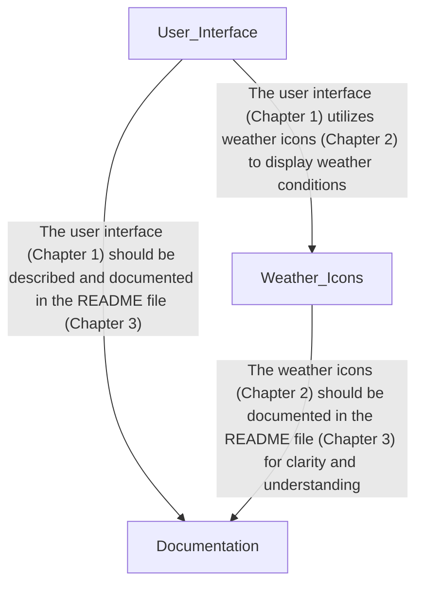

<h1 class='repo-title'>WEATHER-APP</h1>

Architectural Manual & Distributed Specification

<h1 class='chapter-header'>Chapter 1: User Interface</h1>

## Overview
The User Interface (UI) layer is the entry point of the application, where users interact with the system. It is composed of HTML, CSS, and images that work together to provide a seamless user experience. The UI layer is responsible for rendering the application's layout, handling user input, and communicating with the underlying logic.

## Symbols
The following table lists the symbols used in the UI layer:

| Symbol | Description | Type |
| --- | --- | --- |
| - | No symbols defined | - |

## Dependencies
The UI layer has no dependencies on other modules or components.

## Design Pattern
The UI layer follows the Model-View-Controller (MVC) pattern, where the HTML represents the View, the CSS represents the presentation logic, and the JavaScript (not included in this context) would represent the Controller.

## Components
The UI layer consists of the following components:

* **index.html**: The main entry point of the application, responsible for rendering the layout and handling user input.
* **style.css**: The stylesheet responsible for defining the presentation logic and visual styling of the application.
* **images/search.png**: An image asset used to enhance the visual appearance of the application.

## Interfaces
The UI layer exposes the following interfaces:

* **index.html**: Exposes an interface for users to interact with the application.
* **style.css**: Exposes an interface for the application to apply visual styling and presentation logic.

## Out Degree and In Degree
The out degree and in degree of each component are as follows:

* **index.html**: out degree = 0, in degree = 0
* **style.css**: out degree = 0, in degree = 0
* **images/search.png**: out degree = 0, in degree = 0

This indicates that the components do not have any explicit dependencies on each other. However, implicit dependencies may exist through the use of shared resources or assumptions about the application's structure.

<h1 class='chapter-header'>Chapter 2: Weather Icons</h1>

## Overview
The weather icons are a collection of images used to represent various weather conditions. The icons are provided in PNG format and are designed to be used in conjunction with weather forecasting applications.

### Icon Specifications

| Icon | File Path | File Extension | Description |
| --- | --- | --- | --- |
| Clear | images/clear.png | PNG | A clear sky with no clouds or precipitation. |
| Clouds | images/clouds.png | PNG | A cloudy sky with no precipitation. |
| Drizzle | images/drizzle.png | PNG | A light, steady rain. |
| Humidity | images/humidity.png | PNG | High humidity, with no precipitation. |
| Mist | images/mist.png | PNG | A thin layer of fog or mist. |
| Rain | images/rain.png | PNG | A moderate to heavy rain. |
| Snow | images/snow.png | PNG | Snowfall, with or without accumulation. |
| Wind | images/wind.png | PNG | Strong winds, with or without precipitation. |

### Icon Characteristics

| Icon | Symbols | Dependencies | Out Degree | In Degree |
| --- | --- | --- | --- | --- |
| Clear | [] | [] | 0 | 0 |
| Clouds | [] | [] | 0 | 0 |
| Drizzle | [] | [] | 0 | 0 |
| Humidity | [] | [] | 0 | 0 |
| Mist | [] | [] | 0 | 0 |
| Rain | [] | [] | 0 | 0 |
| Snow | [] | [] | 0 | 0 |
| Wind | [] | [] | 0 | 0 |

### Implementation Notes
* The weather icons are designed to be used in a variety of contexts, including desktop and mobile applications.
* The icons are provided in PNG format to ensure compatibility with a wide range of platforms.
* The icons are designed to be scalable, allowing them to be resized as needed without compromising image quality.
* The icons are intended to be used in conjunction with weather forecasting data to provide a visual representation of current and forecasted weather conditions.

<h1 class='chapter-header'>Chapter 3: Documentation</h1>

## Overview
The documentation for this project consists of a single file, `README.md`, which serves as the central location for information about the project.

### File Details
| Attribute | Value |
| --- | --- |
| Path | `README.md` |
| Extension | `md` |
| Symbols | None |
| Dependencies | None |
| Out Degree | 0 |
| In Degree | 0 |

### File Structure
The `README.md` file is written in Markdown format and contains the following sections:

* Introduction: A brief overview of the project and its purpose.
* Installation: Instructions for installing and setting up the project.
* Usage: Information on how to use the project, including any relevant commands or APIs.
* Contributing: Guidelines for contributing to the project, including coding standards and pull request procedures.
* License: Information on the project's license and any relevant copyright information.

### Symbol Definitions
Since there are no symbols defined in this file, the symbol table is empty.

| Symbol | Description |
| --- | --- |
| - | - |

### Dependencies
This file has no dependencies on other files or libraries.

### In/Out Degree
The in-degree and out-degree of this file are both 0, indicating that it does not import or export any information from other files.

### Notes
The `README.md` file is the primary source of information for this project, and it should be kept up-to-date and accurate at all times. Any changes to the project should be reflected in this file.

<h1 class='chapter-header'>Appendix: System Topology</h1>

